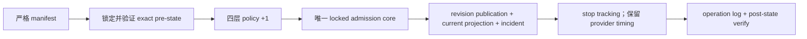

# event 924 暂定赛果单赛事公开灰度设计

## 1. 当前真实基线

### 代码基线

- 干净 worktree：
  `/Users/mentianlu/Code/umanews/.worktrees/event-924-provisional-public-gray`
- 分支：`codex/event-924-provisional-public-gray`
- HEAD / `origin/main`：
  `353464c76c63d1e43043ccbefe0ebc88274b0888`

### 生产运行态只读审计（2026-07-18 17:48Z）

| 项目 | 当前值 |
|---|---|
| production checkout/image revision | `ebab4aa8e4e855d644771584c010fa6b07b9992b` |
| scheduler | `false` |
| live worker runner | `the_racing_api_free` |
| event | `924`, Newbury, 2026 G3, `scheduled`, published, partial |
| owner | `live`, generation `1`, manifest `ee9d0d43…1432` |
| tracking | `provisional_result`, generation `19`, claim empty |
| source | TRA, approved, supplemental, terms approved, automation allowed |
| observation | ID `1`, provisional, parser `the_racing_api_free_v1` |
| observation/revision digest | `4d2fa8c…ccc2` |
| result revision | ID `2`, revision no. `1`, unpublished, conflict none |
| result items | 7 finished, positions 1–7 |
| policies | global/UK/source/event 均为 `shadow v1` |
| allowlist | event `924`, enabled, max `provisional_public`, version `1` |
| official route | `bha_manual_verification / bha-manual-v1` |
| public facts | publication `0`, legacy result `0`, incident `0` |
| public read | hidden，原因 `revision_not_published` |

外部人工交叉核对：

- Racing Post 记录 7 匹顺序为 Symbol Of Honour、Mitbaahy、Soldier's Tree、
  Binhareer、Jasour、Noble Champion、Song Of The Clyde，实际 off 为 15:02:08，
  winning time 1m 9.46s。
- Sporting Life 给出相同 1–7 顺序，标记 `Weighed In`。
- 两者是查漏补缺和人工证据，不是本次自动 adapter；BHA 官方结果页面尚未形成可执行的
  自动化证据链。

### 已验证延迟

- 预计 off：`14:02:00Z`。
- 最后一次明确未找到：`14:11:34Z`。
- 首次 observation：`14:14:42.301344Z`。
- scheduled-off 到本站 first seen：`12m42.301s`。
- 来源首次可用只可保守表达为 `(14:11:34Z, 14:14:42.301344Z]`；没有
  `source_updated_at`，不得伪造更精确的 provider latency。

## 2. 可复用代码与缺口

### 直接复用

| 能力 | 位置 | 本次用法 |
|---|---|---|
| 四层 policy resolver | `resolve_race_live_publication_policy()` | 统一判断有效 mode、许可、digest 和 route |
| publication admission | `admit_race_live_publication()` | 抽取唯一 locked core，供 poll 和 operator 两条入口复用 |
| projection materializer | `_publish_race_result_revision()` | 创建 audit、legacy result、tracking 时间 |
| public read gate | `resolve_race_live_public_read(s)()` | 详情页和日历 fail closed |
| 页面状态组件 | `public_race_detail` / `race_detail.html` | 已支持暂定/正式/更正/冲突/stale |
| 独立 live queue/worker | Compose + Celery | 本次不改配置、不启 scheduler |

### 必须补齐

1. 目前没有经过 manifest/CAS 的 policy mode 变更入口；直接 Django shell 不可审计且难以
   回滚。
2. 现有 runner 可以在再次命中 `/results/today/free` 时重放并晋级，但 event 924 很快会
   离开 “today” endpoint，不能把公开灰度依赖于重复网络命中。
3. poll claim/checkpoint 带 provider attempt/success 语义，不能被无网络 operator promotion
   复用；并且现有 lock 顺序是 control -> tracking -> event，反向预锁会造成死锁风险。
4. provisional materialization 没有把粗粒度 `RaceEvent.status` 推进为 `finished`，会造成
   页面已有赛果但赛事仍显示 scheduled。
5. result endpoint 的 event 924 revision 只含名次、马号和状态；获准 racecard revision
   已有闸位与骑师。当前 projection 没有同 participant 的客观 fallback。
6. official incident 有持久模型和 admission 创建逻辑，但 `bha_manual_verification` 当前
   只有字符串和页面响应 SHA，没有责任人、SLA、evidence receipt 或 close/escalate 入口。
7. initializer 只接受 shared policy 精确 `shadow v1`；若首次灰度把 shared cap 升到 public
   v2，后续 shadow event 会初始化失败。
8. 没有从数据库安全生成 promotion/disable/restore manifest 的工具。

### 2.1 数据模型增量

新增 migration `0046`，只扩充既有两张准实时治理表：

- `RaceLiveEventPublicationAllowlist`：
  `official_verification_contract_digest`、`official_terms_evidence_digest`；
- `RaceLiveOfficialVerificationIncident`：
  `official_route_contract_digest`、`official_terms_evidence_digest`、
  `manual_verification_due_at`。

digest 字段为 64 位小写 SHA-256；为兼容已有 shadow 初始化行，数据库默认空，但任何
`provisional_public` admission/read 都要求非空且格式有效。event 924 promotion 在同一
transaction 内把 allowlist v1 更新为 v2 并写入两个 digest；incident 创建时复制这两个
digest，并把人工责任时限设为 promotion commit + 15 分钟。迁移不回填、不开 policy，也不
创建 publication。

## 3. 组件设计

### 3.1 新服务

新增：

`server/stable/services/race_live_publication_transition.py`

职责：

- 严格加载和规范化 JSON manifest；
- 校验 expected SHA、approved commit、未知字段、重复 scope 和 aware datetime；
- dry-run 读取并核对 exact pre-state；
- apply 时用一个外层 `transaction.atomic()` 锁定：
  - projection control；
  - live tracking；
  - event；
  - source identity；
  - observation/result/racecard revision；
  - participant/participant identity/revision item；
  - 四层 policy；
  - event allowlist；
- 更新 manifest 列出的 policy mode/version；
- 以 CAS 把 allowlist `v1 -> v2`，写入受审 BHA route contract/terms digest；
- 调用从现有 admission 抽取的唯一 `_admit_race_live_publication_locked()`；
- 不创建 provider claim，不调用 provider checkpoint；
- 成功后只把 event `924` 的 `tracking_enabled=false`、`next_poll_at=null`；
- 写一条幂等 operation log；
- verify post-state 和公开 read decision。

现有 poll admission 改为在原 transaction/claim 校验后调用同一 locked core。operator
transition 在 scheduler false、active claim 为空和 expected manifest SHA/approved commit
匹配后调用同一 core。两条路径的锁序固定为
`control -> tracking -> event -> source -> observation -> racecard/result revision ->
revision items -> participants -> participant source identities -> policy -> allowlist ->
incident`，不复制业务判断。

operator promotion 的 tracking 字段语义固定为：

| 字段 | post-state |
|---|---|
| `claim_generation` | 保持 `19` |
| `active_attempt_token` / `claim_expires_at` | 继续为空 |
| `last_attempt_at` | 保持 `14:14:40.843702Z` |
| `last_success_at` | 保持 `14:14:42.301344Z` |
| `last_observation_hash` | 保持 `4d2fa8c…ccc2` |
| `consecutive_failures` / `stale_at` | 保持原值 |
| `tracking_enabled` | `false` |
| `next_poll_at` | `null` |
| `provisional_published_at` | promotion commit time |

因此不会把 operator 时间伪装成 provider latency，也不会在未来启 scheduler 时立即重新投递
已离开 today endpoint 的 event 924。

### 3.2 transition bundle prepare

新增：

- `server/stable/services/race_live_publication_transition.py` 中的 bundle prepare 与严格
  loader；
- `server/stable/management/commands/prepare_race_live_publication_transition.py`。

prepare 只读数据库，在 PostgreSQL `REPEATABLE READ READ ONLY` 一致快照中生成：

- `promotion.manifest.json`；
- `disable.manifest.json`；
- `restore.manifest.json`；
- `report.json`；
- `sha256s.json`。

输出 root 必须是预配置绝对安全目录；拒绝 symlink 和非目录 ancestor，run ID 严格校验，
临时目录独占创建，成功后原子 rename。目录 `0700`、文件 `0600`，已存在 run 绝不覆盖。

promotion 使用当前 shadow pre-state。disable 使用 promotion 的确定 post-state 作为 pre-state，
只把 `event:924` policy 从 public v2 收紧为 shadow v3。restore 使用 disable 的确定
post-state，把 event policy 恢复为 public v4。shared global/region/source 保持 public v2，
allowlist 保持已绑定 route contract 的 v2。
prepare 对三份 manifest 做结构、摘要和 pre/post 链验证；每一步真正执行前仍必须对当时数据库
单独 dry-run。

### 3.3 transition 命令

新增：

`server/stable/management/commands/transition_race_live_publication.py`

接口：

```text
python manage.py transition_race_live_publication \
  --manifest <absolute-path> \
  --expected-manifest-sha256 <sha256> \
  --expected-approved-commit <40-hex> \
  [--apply --confirm-apply | --verify]
```

- 默认 dry-run。
- `--apply` 和 `--verify` 互斥。
- `--confirm-apply` 只能与 `--apply` 同时使用。
- 输出稳定、脱敏 JSON summary。
- manifest 的 transition 可为：
  - `promote_shadow`：四层 policy `shadow -> provisional_public`，并晋级唯一 shadow
    observation；
  - `disable_public_read`：把 manifest 指定 scope 收紧为 `shadow`，不删除已发布事实。
  - `restore_public_read`：只从 disable 的精确 post-state 恢复 event policy。

首个生产 bundle 只绑定 event `924`。它不进入仓库，因为包含当前生产行版本和生成时间；
发布时由 prepare 命令在权限 `0700/0600` 的 runtime 目录生成并审核，仓库只保存
schema/example fixture。

### 3.4 manifest 关键不变量

`promote_shadow` pre-state：

- event/allowlist/tracking 精确全集均为 `[924]`；
- current result revision 是 manifest 指定的未发布 provisional revision；
- observation digest 与 revision content digest 相同；
- current racecard participant 集合与 result participant 集合一致；
- policy 为四条精确 `shadow` 行，version/digest/validity 完全匹配；
- allowlist v1 未绑定新 contract digest，source/terms/automation/route 未过期；
- claim 为空；
- publication/legacy result/incident 均为 0；
- scheduler setting 是 false；
- runner mode 不参与晋级网络，因为 transition 不发请求，但必须记录且不得更改。
- BHA manual route registry digest、terms digest、validity、operator role和 SLA 全部
  匹配；release operator 已人工确认 BHA Results 入口当前可执行，但不要求 official result
  已出现或 receipt 已准备。

post-state：

- 四层 mode 为 `provisional_public`，每条 version 恰好 `+1`；
- revision `2` 获得唯一 `published_at` 和 publication audit；
- current pointer 未变；
- legacy result 7 条；
- incident 1 条；
- allowlist v2 持久绑定 route contract/terms digest；
- incident 保存相同 digest 和 promotion commit + 15 分钟人工责任时限；
- provider claim/timing/hash/failure 字段原样不动；
- tracking disabled 且 next poll 为空；
- public read allowed；
- scheduler/allowlist universe 不变。

### 3.5 shared policy 生命周期与 initializer

- promotion：global/UK region/TRA source/event 924 从 shadow v1 到 public v2。
- disable：只将 event 924 从 public v2 到 shadow v3。
- restore：只将 event 924 从 shadow v3 到 public v4。
- resolver 对任何 public admission/read 强制要求 event policy 存在；missing event policy
  fail closed。
- initializer 对 fresh event 创建 `event:<new-id> shadow v1`；既有 shared policy 只要
  scope、digest、validity、合法 mode 和 version `>=1` 即可复用，不要求回到 shadow v1，
  也不降低其 mode。
- initializer 拆分 `_shared_policy_matches()` 与 `_event_policy_matches()`：前者只用于
  global/region/source；后者要求该新 event 的精确 shadow v1。resolver 的单赛事与批量
  loaded-row 两条实现均把 event policy 设为 mandatory。
- 新 event 即使 allowlist enabled，也因自己的 event policy shadow 而只能 shadow。

`race_live_initialization` 的 verify 输出必须同时报告 shared policy 复用版本和新 event policy，
并新增“event 924 已 promotion/disable 后初始化第二场仍成功”的 PostgreSQL 回归。

### 3.6 projection fallback

对每个 result item，以 participant ID 连接 current racecard item：

1. result revision 非空值优先；
2. 本次精确 allowlist 只允许 racecard fallback：`barrier`、`jockey_name`；
3. `trainer_name`、`carried_weight`、`finish_time`、`margin` 不 fallback；
4. horse number 仍以 result revision 为准；不覆盖名次、状态、时间或 margin；
5. fallback 必须来自 current approved racecard revision、同 event、同 participant；
6. legacy `source_refs.field_provenance` 对每个 fallback 字段保存
   `racecard_revision_id`、`racecard_revision_item_id` 和 source key；`raw_payload` 保持空，
   不保存第三方 raw。

该 fallback 只影响当前 projection，不修改已存在的不可变 result revision `2`。

### 3.7 event 状态与 hero

`_publish_race_result_revision()` 在 provisional/official/corrected 成功物化时：

- `scheduled` 或 `running` -> `finished`；
- 已是 `finished` 保持；
- `cancelled`、`postponed` 或未知状态 fail closed，不静默覆盖；
- provisional 不设置 `result_confirmed_at`；
- official/corrected 延续现有确认时间语义。
- hero 在 `live_result_status.phase=provisional` 时显示“冠军 · 暂定”，不能走无 margin 的
  “赛果已确认” fallback；official/corrected 才可显示确认语义。

## 4. 原子性与幂等

### 首次 apply



整条链位于一个外层事务；任何异常回滚到四层 shadow、未发布 revision、空 legacy/incident。

### replay

- 若 pre-state 完全是 manifest 预期，执行首次 apply。
- 若 post-state 已完整存在且 operation log/hash 相同，返回 `replayed=true`，零新增。
- pre/post 混合、版本超出、publication timestamp 不一致、结果数不符均 fail closed。

## 5. 当前可执行的 BHA 人工复核闭环

event 924 promotion 会按现有 admission 创建：

- route：`bha_manual_verification`
- version：`bha-manual-v1`
- deadline：race off + 2h
- status：open

新增受审 route registry：

`runtime/policies/race_live/official_route_bha_manual_v1.json`

固定内容包括：

- BHA Results 官方入口；
- route/version/contract digest/validity；
- `access_mode=manual_browser_only`；
- `automation_allowed=false`，明确不得调用页面后端 API、screen scrape 或批量下载；
- BHA terms evidence digest 和人工复核结论；
- `responsible_role=release_operator`；
- `sla_minutes=15`；
- marker allowlist 和 receipt schema；
- 公开数据继续来自已获准 TRA observation，BHA receipt 只记录内部 match/conflict marker，
  不投影页面 raw、评级、评论或逐马描述。

新增：

- `prepare_race_live_manual_official_evidence`：从 operator 手工录入的 source URL、
  observed_at、私有截图/打印件 SHA、marker 和客观 participant/position 生成 `0600`
  receipt；不联网、不接受操作者自报 comparison。
- `apply_race_live_manual_official_evidence`：严格校验 route registry/receipt/event/
  incident/revision/participant 集合和 expected SHA/commit。可用结果在事务中创建
  `bha_manual` official source identity（`automation_allowed=false`）、对应的人工
  participant source identity、official observation、approved marker contract/evidence。
  receipt 以本站 participant ID + position 表达人工映射，observation 的 source-local runner
  key 固定为 `manual-participant:<participant_id>`；服务验证 participant 全集并自行比较
  provisional revision。一致则 incident resolved，冲突则 incident escalated，并在相同
  锁序、相同事务内应用预生成 disable manifest。
  暂不可用/尚无结果不创建 observation，只将 receipt SHA 写入脱敏 operation log，
  更新 `last_probe_at/alert_sent_at/next_probe_at` 并保持 overdue/open。

本次 manual official observation/evidence 只完成复核闭环，不直接进入 `official_public`；
后续正式标签仍需独立 reviewed change 解决 manual official source 的 read-policy 许可和
official revision apply。event 924 promotion 的强制前置是：BHA Results 入口已由 release
operator 人工确认可执行、route registry/terms 未过期；它不要求 official result 已出现或
receipt 已准备。promotion 后 15 分钟内必须完成首次 manual probe：

- match：incident resolved，页面继续明确 provisional；
- conflict：立即执行预生成 disable；
- unavailable/尚无结果：一次告警、incident 保持 open，明确标注的 provisional 继续公开，
  安排 T+24h 后续探针。

这遵循仓库已确认决策：官方结果尚未返回不阻止 TRA provisional 首发，迟到也不撤下正确
标注的暂定赛果；只有确认冲突才立即隐藏。Racing Post/Sporting Life 的人工交叉核对不能
替代此 BHA receipt。

## 6. 生产发布与回滚

发布前：

1. 最新代码 review 成功；
3. 备份数据库并验证 SHA 与 `pg_restore -l`；
4. 部署受审 image，保持 scheduler false；
5. 人工打开 BHA Results，确认受审 manual route 当前可执行；
6. 用 prepare 命令一次生成 promotion/disable/restore bundle；
7. 校验 bundle SHA 链并对 promotion dry-run；
8. `--apply --confirm-apply`；
9. 在 15 分钟 SLA 内完成首次 manual probe；match 关闭 incident，conflict 原子 disable，
   unavailable 保持 provisional 并告警；
10. `--verify`；
11. 浏览器验收详情页/日历；
12. 检查 live/news/history queue、health、资源和无其他 event 扩张。

最小回滚：

1. 使用发布前已生成且 hash 已审计的 event 924 disable manifest；
2. dry-run -> apply -> verify；
3. 确认详情页/日历立即隐藏 live 结果；
4. 保留 observation/revision/publication/incident；
5. 若 transition 原子性或数据库结构异常，才恢复发布前备份。

## 7. 不选择的方案

### 直接 Django shell 改四条 policy

缺少严格输入 hash、CAS、dry-run/verify、原子 promotion 和可重复回滚，不采用。

### 重新请求 `/results/today/free` 触发 replay

依赖 event 仍在 today 窗口，增加无必要网络请求，也无法作为已存 shadow 的通用晋级入口，
不采用。

### 直接写 `published_at` 或 `RaceEventResult`

会绕过 participant、terms、allowlist、manual lock、policy snapshot 和 incident 门禁，
不采用。

### 把人工交叉核对当作 official

只读 Racing Post/Sporting Life 不生成 official。BHA manual receipt 会写持久 marker
evidence/incident 结论，但本变更不直接发布 official revision。
