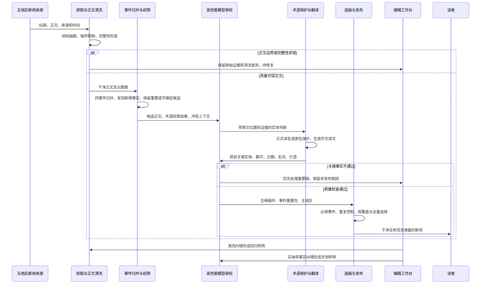
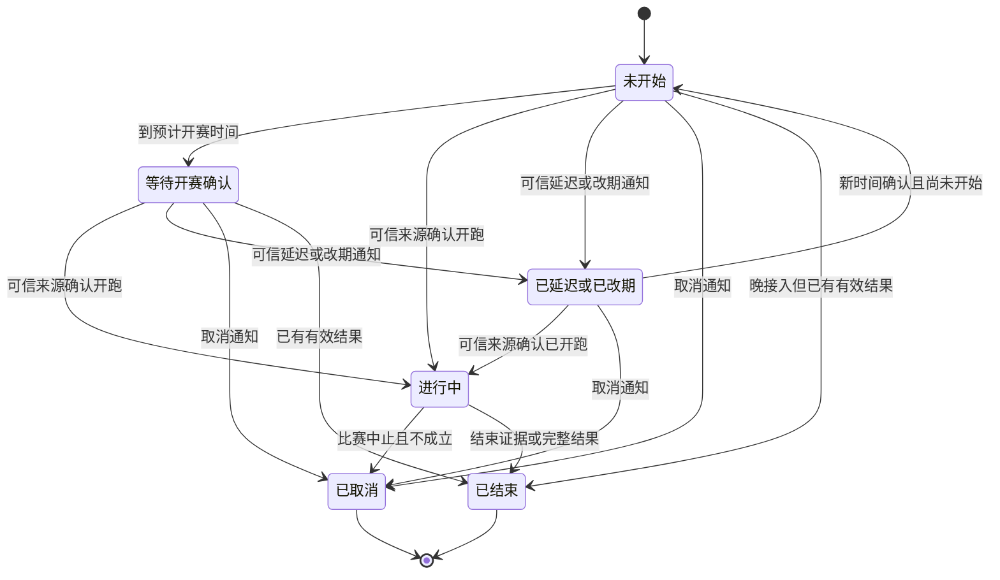
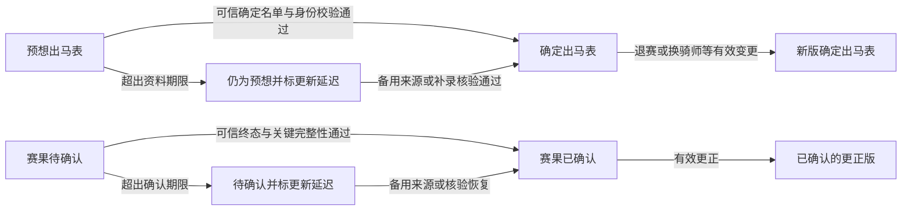
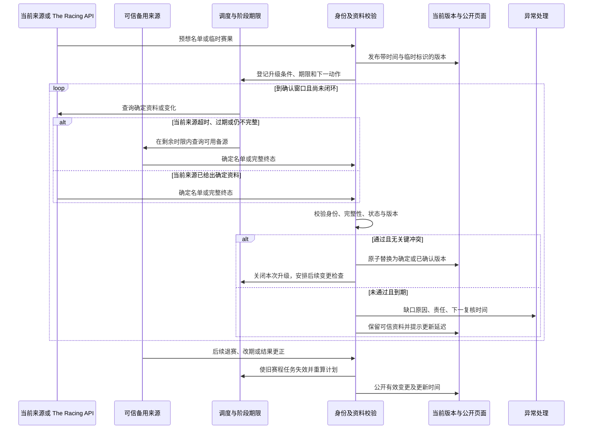
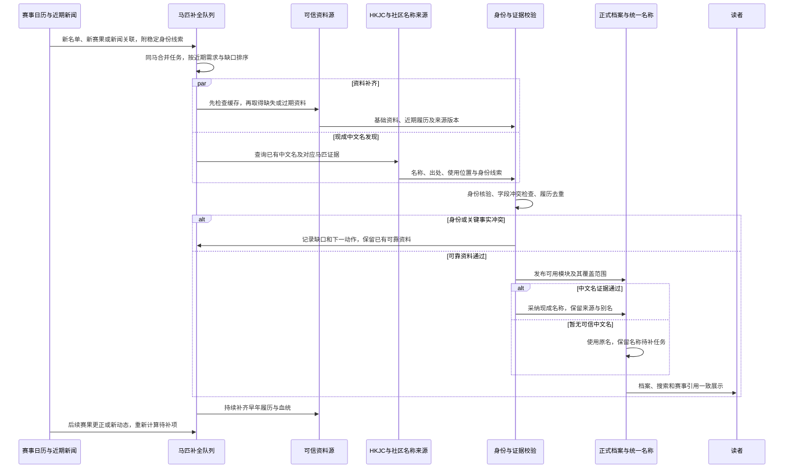
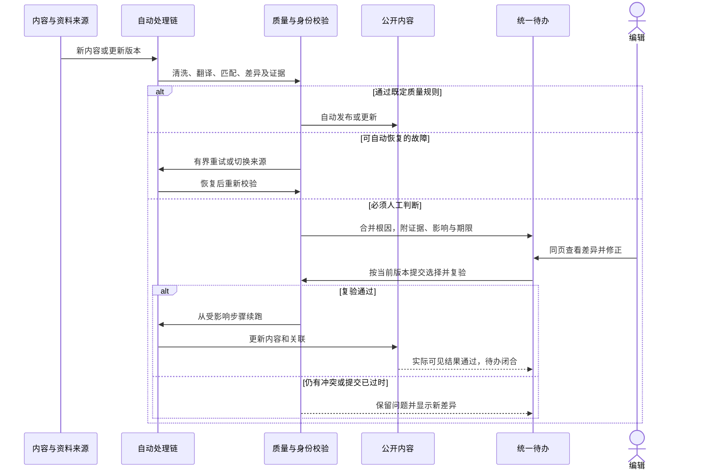
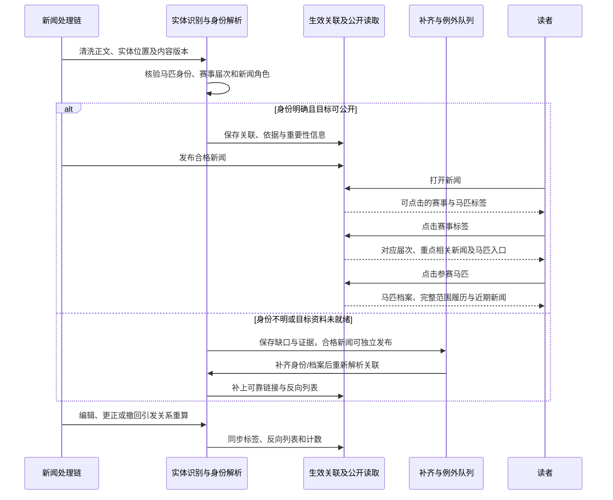
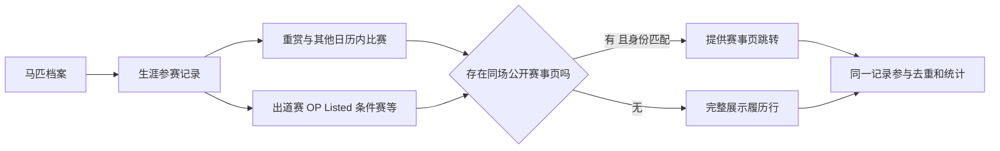
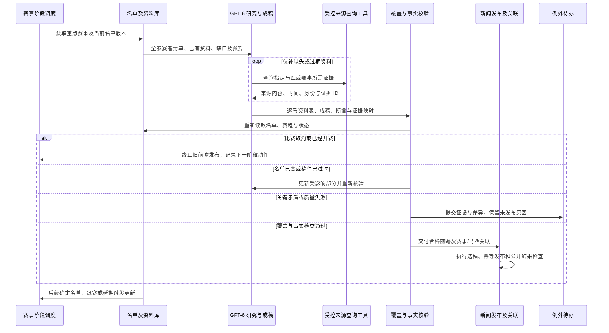

# 下一版本能力设计与差距台账

状态：八模块能力设计与证据基线。2026-10-03 已汇总为 [10 月 30 日整体规划与逐项任务](tasks.md)，用户确认三条开发线并行及独立审核/发布协调；按四个迭代倒排。本文保留理论、实际与期望差距的论证；精确范围、任务、日期及待定参数责任以总规划为准。没有应用代码、生产配置或模型调用变更。

日期：2026-10-02，Asia/Shanghai。

## 1 新闻抓取和翻译

### 1.1 已确认的期望与范围

| 编号 | 用户期望 | 本次明确的含义 |
|---|---|---|
| N-01 | 翻译更加准确，额外接入高性能大模型判断和保护专有名词 | 增加上下文理解能力，降低普通词误认、真实专名漏认及错译；已有术语库和保护机制可继续复用 |
| N-02 | 正文不再被广告、原网站框架等内容污染 | 前期局部修复不能视为整个问题关闭；新文章质量和已有脏文章分别处理 |
| N-03 | 新闻数量可以更少，但重要新闻要保留 | 优先提高有效信息量和重要事件覆盖；不能仅按总条数下降判断成功 |
| N-04 | 各地区新闻源和新闻数量均衡发展 | **先覆盖日、港、英、法、美五地区；按周保障优质新闻覆盖，重大事件允许临时倾斜** |

N-04 的五地区范围、按周衡量和重大事件例外，已由用户在本轮明确选择。每日完全等量、立即扩展到赛事九地区均不作为本模块目标。

面向读者的目标体验：打开统一新闻流，能了解五地区值得关注的变化；同一消息不反复刷屏；进入详情后读到完整、干净的正文，马名、人名、赛事名和关键事实可靠。面向编辑的目标体验：知道重要新闻有没有漏掉、某地区为什么少稿，以及哪些稿件因清洗或翻译问题需要处理。

### 1.2 三层现状与 Gap

代码基线为 `fc1eed938beb8b431e0d4b37953f7599a40a72ce`。完整产品基线见[能力清单](../../reports/2026-10-02-current-capabilities.md)，历史需求见[待修事项对照](../../reports/2026-10-02-backlog-evidence-reconciliation.md)。下面严格区分代码能力、用户反馈和已验证运行结果。

| 能力 | 当前理论状况 | 当前实际状况与证据边界 | 未来期望 | 主要 Gap |
|---|---|---|---|---|
| 专名识别与保护 | 词条/别名检索、按出现位置的上下文规则、英文普通词/不确定/马名分类、日文规则、占位替换与恢复均存在；模型负责翻译，但实体判定主链未见独立高性能模型审校 | 用户反馈硬规则准确率不高；旧线程有普通词被大量误认案例。已有修复与模式开关，但本轮没有当前标注集准确率或生产模式证据。页面保留原文名本身不能判为误译 | 上下文识别发现真实实体，按正式译名或原名保护，译后验证身份和事实一致 | 缺少模型语境裁决、独立漏检发现、证据校验及持续评测闭环 |
| 正文质量 | 按来源选择正文容器，删除 DOM 噪声、推广段落与链接；已有清洗元数据、原始 HTML 和历史重处理工具 | 用户反馈仍有污染。19:03 复访旧样例 9623 未再命中指定污染词，但它只是一个成功样例，不能否定当前反馈。没有全来源近期污染率与误删率 | 广告、导航、弹窗不进入译文；正文段落、引语、表格和图片说明不被误删 | 缺少跨来源持续质量检测、模板变化发现、段落级审查和完整性验收 |
| 少而重要 | 规则评分、门禁、来源榜单、去重、同赛事曝光控制、地区窗口和配额存在 | 用户反馈数量与价值不匹配。当前首页可见多条日常马匹动向；仅凭标题不能确定每条低价值，也没有近期重要事件漏报统计 | 按独立事件及新增事实选稿，压缩重复和低信息量稿，保护重大更新 | 当前更偏单篇和来源信号，缺少完整的重要事件清单、跨来源同事件选择与漏报对账 |
| 五地区均衡 | 已有主地区/相关地区归属、五地区生产窗口、候选账本、配额、来源退避和零产出原因 | 用户反馈日本/JRA 相关新闻长期占优；22:25 重新加载首页仍见多条日本马匹及赛事情节。公开页隐藏来源，无法据此精确统计 JRA 官方源或每地区占比 | 五地区各有稳定有效来源；周维度有优质事件覆盖；重大事件可临时倾斜 | 缺少周维度的供给与曝光调节；其他地区漏采、翻译失败、误归属、待审积压和未选中需分别归因 |

本轮最新首页观察见 [news-design-home-observation.json](../../reports/2026-10-02-capability-evidence/news-design-home-observation.json)，时间为 2026-10-02 22:25:56 北京时间。此样本不等于一周分地区统计，也不能证明生产运行的代码、配置全部与本地一致。

### 1.3 当前代码中与目标直接相关的机制

| 机制 | 已核对的代码事实 | 对目标的影响 |
|---|---|---|
| 专名置信判断 | `classify_english_horse_occurrence` 依据规则、局部上下文和结构化证据返回分类；保护按 occurrence 位置执行 | 已有可复用的实体结构和保护执行层。当前 `confidence` 数值来自规则，不能作为实测准确率 |
| 来源加分 | `score_article_for_automation` 对 `source_site == jra` 给 15 分，其他来源 10 分 | JRA 官方源有固定倾斜；这是代码事实，实际贡献需按生产样本计算 |
| 高价值来源兜底 | 默认 `HIGH_VALUE_SOURCE_RULES` 含 `netkeiba:access,netkeiba:attention`；命中时在硬规则通过后把分数抬到自动审核阈值 | 日本站内榜单热度可能直接获得选稿优势；热度需要与面向本站用户的重要性分开评估 |
| 非日本政策分支 | 非日本新闻还会检查多地区自动发布策略是否允许 | 可能增加其他地区阻断，但是否构成当前主要瓶颈取决于真实配置与候选原因 |
| 低分补量 | `select_publish_candidates` 有地区窗口最少量和 `soft_fill`；默认最低补量分 45、常规自动阈值 75，补量稿禁自动 QQ | 与“宁可少发，也保留重要内容”的目标存在需要重审的策略差异；本轮未核验生产配置值 |
| 同赛事曝光 | 已有赛事身份、重复分类和双槽曝光机制 | 可以复用；不能把它等同于所有新闻事件，包括退役、任命、政策等，均已做跨来源去重 |
| 来源内清洗 | `clean_international_article_body` 使用通用 DOM 规则和 TDN、HRN、Sporting Life、Sponichi 等专用规则；部分适配器允许宽容器回退 | 修复单来源可见噪声有用，但非空正文或 `status=ok` 不代表已验证无污染、无误删 |

代码入口：[terms.py](../../../server/stable/services/terms.py)、[translation.py](../../../server/stable/services/translation.py)、[automation.py](../../../server/stable/services/automation.py)、[publishing_windows.py](../../../server/stable/services/publishing_windows.py)、[settings.py](../../../server/app/settings.py)、[article_content.py](../../../server/stable/services/article_content.py)、[international.py](../../../server/stable/adapters/international.py)、[race_news_exposure.py](../../../server/stable/services/race_news_exposure.py)。

### 1.4 建议的整体链路

这是未来设计，虚拟参与者表示逻辑职责，不要求建立新服务或替换 Django/Celery 主干。初筛只做明确重复和低价值过滤；标题不足、未知实体或重要性不确定时保留候选，避免尚未翻译就漏掉重要新闻。模型审校次数按风险设计，不要求每个节点都进行一次独立模型调用。

### 1.5 专有名词：增加模型判断，复用确定性保护

**建议采用“规则和词库召回 → 模型理解上下文 → 证据校验 → 占位保护 → 译后核验”。**

1. **实体范围**：马匹、骑师、练马师、马主/育马者、赛事、马场、组织等。模型既检查现有召回项，也扫描正文中可能漏掉的实体，不能被旧规则候选集合限制。
2. **输入**：可信正文、标题、原文语言、来源上下文、相关已审术语、可匹配的实体身份候选。来源国只作上下文，不直接决定每个同名实体身份。
3. **输出**：原文片段及段落/位置、实体类型、上下文证据、候选身份或无法确认、建议保护方式与冲突原因。程序检查片段确实存在，拒绝重叠、无效位置和模型生成的虚构词条。
4. **映射**：身份与已采纳译名一致时使用中文名；确定是专名但没有可信译名时保留原文；候选身份冲突时不能强行合并或直接写入正式词库。按模块 3 的明确约束，马名只允许收录可核验来源已经使用的译名，模型不得自行翻译，也不得把自行创造的马名包装成候选；有出处的新发现译名才可进入采纳链路。其他实体的命名政策另行定义。
5. **按出现位置保护**：同一个英文词在一段里是马名、另一段里是普通词时分别处理，避免全局替换。将经过校验的决定交给现有占位保护与恢复执行。
6. **译后核验**：除专名外，检查日期、奖金、距离、名次、数量、否定、计划/已发生、伤情和引语归属。名称拼写正确不能代表整句事实正确。高风险内容或不一致进入重点复核。
7. **失败行为**：模型超时或意见冲突不伪装为通过；重要稿进入优先待审。是否允许某类低风险稿使用已有翻译通道，需先由评测证明该降级路径安全，并保留使用记录。

例子：`Campaign` 出现在“开展宣传活动”中应正常翻译；出现在某马参加某场比赛的语境中才作为实体处理。同名的 `The Jockey Club` 需要结合文章主体与组织证据判别，不能仅靠来源语言或一个全局译名。

高性能模型在这里承担识别和审校职责。翻译 provider 可以先复用，之后通过同一评测集比较“原翻译模型 + 强审校”与“强模型直接翻译 + 核验”。后续模块 8 已明确 GPT-6 API 为复杂任务的目标方向；具体模型 ID、调用参数和任务路由仍需评测，不将接入模型本身视为准确率提升的证据。

复用 `ArticleEntityResolution`、术语与别名、占位恢复、`TranslationRun`；增加的逻辑产物为实体判定和事实核验记录。先验证是否可放入现有运行记录或元数据，实施设计再决定迁移，避免提前承诺新增表。

### 1.6 正文质量：清洗和完整性同时验收

建议采用三层检查：

| 层次 | 做什么 | 避免的问题 |
|---|---|---|
| 来源结构层 | 正文容器、分页、表格、图片说明及嵌入组件分别处理；记录来源模板和解析版本 | 整个 `main` 或推荐区被当成正文，或多页文章只取第一页 |
| 内容区块层 | 将区块分类为正文、导航、广告、推荐、弹窗、版权尾注、未知；明确噪声剔除，疑似区块可用模型复核 | 只查几个关键词而漏掉新样式；误删包含赞助商名的真实新闻 |
| 发布核验层 | 检查开头/结尾、段落连贯性、显著截断、关键数字和引语保留情况；不把“文本非空”当成成功 | 洁净度提高但正文丢失，或者中文稿仍使用旧脏译文 |

模型复核输出区块编号与原因，由程序执行可追溯的剔除；不要求模型自由重写正文来“清理广告”。保留原始 HTML、选取区域、删除区块、抽取文本版本和翻译输入版本，方便指出错误发生在哪一层。模型只能处理文章数据，不执行其中出现的指令。

来源模板变化时，从解析异常、正文长度/区块比例变化、抽样结果发现；降低异常来源进入自动发布的资格，保留重要稿待处理。其他来源按自身状态继续运行。

**已有脏文章另设修复清单**：先识别仍公开的污染稿，区分原文已干净但译文未更新、原文仍污染、人工编辑稿等情况，再决定清洗、重翻译或人工处理。修复文章内容与再次分发分别记录，不把历史清洗视为新新闻发布。现有历史重处理工具可复用，具体生产动作按根 [AGENTS.md](../../../AGENTS.md) 办理。

### 1.7 少发新闻：按事件和新增事实选择

建议把“重要性”“译文质量”“来源可信度”“来源热度”分开记录，避免一个总分掩盖原因。

| 建议层级 | 例子 | 发布行为 |
|---|---|---|
| 必保重要更新 | 重点赛事正式结果或更正；退赛、延期、关键参赛变化；重要马匹退役、重大伤病；对赛马活动有显著影响的规则公告 | 质量合格后优先处理，使用预留容量；暂时不能发时有原因和待处理责任，不静默丢弃 |
| 优选报道 | 有新增事实的赛前分析、重点马匹动向、重要行业报道 | 与同事件稿比较信息增量、可信度和地区覆盖，再进入日常容量 |
| 不单独发布或留候选 | 同源榜单重复、无新增事实的日常动态、重复转载、低信息量花絮 | 不为凑窗口条数发布；有实质新进展时重新评估 |

这套分类是建议，最终“哪些赛事、马匹、政策属于重要”需要以具体正反例校准。不能只用 G1 标签、词条是否已收录、点击榜位置或来源名定义重要性，也不能因为实体缺中文名而自动降为低价值。

同事件处理建议：选一篇最完整、可信、清洗合格的稿件作为主稿；后续出现赛果更正、退赛等新增事实时允许更新报道。赛事之外的退役、任命、伤病、行业公告也需可归并，不能只依赖 `RaceEvent`。优先复用现有赛事曝光与去重；是否需要一般新闻事件对象待实施设计。

本模块的“事件归并与选稿”不要求立即生成多篇综合文章。多篇生成可以留在长线内容能力中，避免将减少重复发布与生成式汇编绑定。

建议取消默认低阈值补量思路：没有合格新闻就少发。抓取候选量、进入强模型的量和最终发布量分别设预算；不能通过全面降低抓取频率来减少发布，否则可能同时降低重要新闻召回。

### 1.8 五地区均衡：同时治理供给和选稿

采用用户确认的周维度政策，建议以滚动 7 天监测缺口，并形成固定周报。五地区使用相同质量门槛，覆盖目标和软上限先用历史样本模拟，再确定数值。

**供给端**：每个地区建立来源清单，分别记录官方公告、综合媒体、赛事/行业媒体的有效覆盖、可用性、新鲜度、污染率和独立事件贡献。一个地区有更多来源 URL 不代表更强覆盖；多个转载同一稿的来源不能充当独立供给。全球综合来源按新闻主体归属到相应地区，不能全部按媒体总部所在地统计。

**处理端**：逐地区查看“发现候选 → 可信正文 → 去重后事件 → 实体/翻译通过 → 可发布 → 选中 → 网页发布”。例如法国少稿可能来自漏采、时间识别、误归属、翻译失败、词条误报或窗口配额，必须在对应环节处理；不能只提高法国配额后仍无稿可选。

**选稿端**：

1. 所有地区的重要事件先获得处理机会，质量门槛不变。
2. 对普通合格稿按价值、周覆盖缺口、重复程度选择；日常高产地区设置软上限，防止占满候选处理和首页曝光。
3. 来源信任度参与核验与排序，但建议移除“某个日本榜单来源就自动抬到发布阈值”的特殊保底，改用可跨地区评测的价值规则。
4. 某地区缺少合格内容时保留缺口及原因，不以低质量稿凑数；空余容量可给其他地区高价值内容，但仍记录未达覆盖的地区。
5. 重大赛事或突发事件允许暂时倾斜，记录事件、有效时间和例外原因；事件结束后恢复普通选择政策，不永久提高某地区权重。

**计数与展示**：同一事件多来源只计一个事件；发布总条数按实际文章去重。每篇有主地区及相关地区，主地区用于分配记账，相关地区另行反映交叉覆盖，避免一篇文章把多地配额同时“填满”。例如日本马赴法国比赛，应按报道主体判断主地区，不能只因出现日本马名就算日本新闻。

公开新闻流继续统一。均衡在来源、处理和选稿环节完成，不以恢复地区 Tab 作为前提。还需分开观察首页实际曝光和发布量，防止后台看似均衡而热门榜/头条长期只展示同一区域；人工指定头条的覆盖与有效期应能解释。

QQ 的数量、时效和通知策略属于后续分发模块；这里保留质量与事件标签作为输入，不自动把网页预算等同于群推送预算。

### 1.9 评测与验收建议

先取近期连续 14 天的五地区生产样本，加入历史故障用例和干净对照，冻结人工标注，再比较当前规则与新方案。自然分布样本用于整体体验，按地区/语言/困难类型的分层样本防止日本大量样本掩盖其他地区问题；调试样本与最终验收集分离。

| 维度 | 指标与分母 | 建议验收方法 |
|---|---|---|
| 专名识别 | 正确实体 / 所有判定实体；正确召回实体 / 人工标注实体；身份和译名对应正确率 | 按地区、语言、实体类型报告；普通词、同名实体、未登录词分别测试；模型自报 confidence 不当准确率 |
| 翻译事实 | 每篇关键事实错误、遗漏、无依据新增；人工实际修改量 | 关键实体、数字、日期、名次、否定与引语归属固定回归零错误；另报告独立样本通过率 |
| 正文清洗 | 污染文章率、噪声区块残留率、有效正文保留率 | 已知广告/框架样例和干净对照同时通过；不能以正文更短作为成功标准 |
| 少而重要 | 每日/每周发布条数、独立事件数、重复率、重要事件召回与处理延迟 | 在明确重要事件清单覆盖不下降前提下减少重复和低增量稿；未通过质量检查的重要稿计为待处理缺口，不能当已覆盖 |
| 地区均衡 | 各区有效候选、独立事件、发布和曝光占比；重要事件覆盖率；缺口持续时间 | 按周对账，重大事件例外单列；看实际覆盖，不只看配置了同样的配额 |
| 运行成本 | 每篇合格稿成本、强模型调用量、P50/P95 延迟、重试与待审积压 | 超时、供应商故障、预算不足有明确结果；有限预算内重要稿优先，不能静默丢弃 |

数值上的发布总量、每区周目标、软上限、重要新闻时效和成本上限目前尚未确定；先形成 14 天基线与几组策略回放结果，再选可达到的门槛，不在没有分母的情况下承诺准确率或每日数量。

### 1.10 差距台账与建议拆分

| Gap ID | 类型 | 需要交付的结果 | 可复用部分 | 依赖 |
|---|---|---|---|---|
| NG-01 | 运行证据缺口 | 五地区近期漏斗、当前开关、来源可用性、发布和曝光基线 | 窗口、候选和运行记录、零产出原因 | 只读运行数据与标注样本 |
| NG-02 | 正文质量能力 | 区块证据、完整性检查、模板变化检测和历史污染分类清单 | 适配器、清洗、原始 HTML、历史重处理 | NG-01 样本；新规则先离线回放 |
| NG-03 | 专名判断能力 | 强模型语境识别、漏检发现、身份/片段校验 | 实体结构、词条/别名、占位保护 | NG-02 的可信输入；困难实体评测集 |
| NG-04 | 翻译质量能力 | 译后事实核验、有限重试、重要稿优先待审 | provider、TranslationRun、翻译恢复 | NG-03；事实标注与故障回放 |
| NG-05 | 选稿政策与实现 | 重要事件保护、跨来源同事件去重与新增事实判断、减少补量 | 现有评分、去重、赛事曝光、配额 | 重要性正反例；NG-01 基线 |
| NG-06 | 地区均衡政策与实现 | 五地区来源覆盖清单、周目标、软上限、重大事件例外、曝光对账 | 归属、生产窗口、候选账本 | NG-05；各地区真实供给与失败原因 |
| NG-07 | 编辑质量反馈 | 清洗差异、实体冲突、事实差异和零产出原因可处理，纠错进入评测集 | 现有后台和日志 | NG-02–NG-06；可与后续手机后台共同设计 |

推进顺序建议：先基线与样本，随后正文质量和专名审校，再接译后验证；事件价值与地区策略可先离线回放，待质量能力稳定后组合验收。模型评测可以使用已确认干净的样本提前开展，不需要等待所有历史正文修复完成。

### 1.11 已确定与待确定

**已确定**：四项用户目标；五地区；按周覆盖；重大事件允许倾斜；新闻可以少而重要。

**设计建议**：强模型负责上下文判定与审校，确定性保护继续执行；质量不足不补量；按事件新增事实选稿；周维度软均衡；区块清洗与正文完整性共同验收。

**后续待确定**：重要事件正反例及必要的重点名单；发布总量和每区周覆盖目标；允许的时效与成本；模型候选及评测结论；历史污染处理范围。它们影响最终工期和成本，尚不阻碍继续收集其他模块期望。

本文仅维护下一版本设计，不把建议改写为已实施能力，也不覆盖全局状态或既有生产决策。

## 2 赛事日历

### 2.1 用户明确的目标

| 编号 | 已确认的期望 | 设计含义 |
|---|---|---|
| R-01 | 赛前、赛中、赛后流转顺畅；信息错误率 <1%，流程卡顿率 <3% | 同时验收正确性和及时性；不能通过一直不发布数据来降低错误率，也不能靠强制改状态掩盖流程停滞 |
| R-02 | 充分利用可信第三方与已采购的 The Racing API，不死等官方 | “可确认的资料”与“官方站点直接提供”分开；按能力验证来源，已有合格第三方结果可以完成确认 |
| R-03 | 出马表区分预想/确定，赛果区分待确认/已确认 | 赛事进程和资料成熟度分别表达；预想与待确认有明确升级责任、期限和超时处置 |
| R-04 | 能识别赛事延迟、取消及马匹退赛 | 异常变化必须影响状态、名单、调度及页面，不能只在新闻里出现 |

范围按现有公开赛事日历的九地区设计：日本、中国香港、英国、爱尔兰、法国、美国、澳大利亚、德国、中东。模块 1 的五地区新闻范围不限制赛事模块。实时指标针对进入跟踪窗口的目标赛事，历史库存另列数据质量与修复指标，不混入大量历史记录稀释当前故障。

用户进一步确认：**信息错误率按场次关键资料计算；可信来源已经提供确定资料后，常规赛事 10 分钟内、重点赛事 5 分钟内完成“预想→确定、待确认→已确认”的公开替换。** 阶段截止时间和卡顿率的详细分母仍在下文作为设计建议。

### 2.2 当前理论、实际、期望与 Gap

| 能力 | 当前理论状况 | 当前实际证据 | 未来期望与 Gap |
|---|---|---|---|
| 进程流转 | `RaceEvent` 已有 scheduled/running/finished/postponed/cancelled；有时钟驱动转态、纳管、owner、租约、版本及公开控制 | 已有真实赛事闭环记录；10-02 的能力审查也看到过期仍待补赛事。覆盖恢复已交付部分成果，但没有可证明全站 <3% 的统计 | 全部目标赛事有责任、阶段期限和下一动作；延迟/取消优先于旧时钟，避免“任务成功但页面没变” |
| 来源利用 | 已支持 `licensed_api / official_operator / trusted_publisher`。默认来源等级为 300/200/100，API 高于官方；多来源绑定按能力存在 | 代码和既有交付已经使用第三方参考资料，不是纯官方系统；各地区能力、身份、路线和可用性仍不一致。本轮没有重新核验付费套餐与各端点实际覆盖 | 合格来源不因不是官方而只能永久停在待确认；来源选择须兼顾成熟度、新鲜度、完整性和健康，避免固定等级阻止及时更新 |
| 赛前资料 | 已有赛前候选、正式名单接管、持续刷新；默认 D−4 至 D−2 每 3 小时、D−1 每小时、当日每 10 分钟 | 京都大赏典样例有 18 行名单，但闸位缺失；兰秀锦标旧样例报名表与结果不一致 | 明确预想/确定两版与更新时间；成熟资料到达后限时原子替换；确定名单也能继续接收退赛和换骑师 |
| 赛后资料 | 已有 provisional/official/corrected 修订、公开版本与更正；T+3 开始尝试，后续退避 | 短途锦标有完整确认结果；女皇杯仍缺自由岛结果行，兰秀冠军摘要与名次待核实并存 | 将“已确认”建立在可信终态与关键完整性之上；页面冠军、名单、结果、统计读取一致版本；待确认不能无限期停留 |
| 异常变更 | 有延期/取消枚举、退赛状态解析、赛程 generation 和旧任务拒绝等基础 | 不能由“有枚举或局部适配器”证明九地区自然异常都已识别；本轮未取得延期/取消全链实测样例 | 来源变更发现、身份匹配、变更确认、重排任务、旧任务失效、公开提示形成完整链路 |
| 质量指标 | 有覆盖检查、候选、阻断原因、运行记录和下一步视图；统一决策方案已存在 | 当前记录能说明个案和某时点缺口，没有按本轮定义计算的错误率、卡顿率 | 建立不漏分母的事件/阶段账本，量化取数、处理和公开时延，按地区分别验收 |

当前代码证据：[生命周期决策](../../../server/stable/services/race_event_lifecycle.py)、[来源仲裁与轮询](../../../server/stable/services/race_data_sync_policy.py)、[结果投影](../../../server/stable/services/race_data_sync_results.py)、[赛前候选](../../../server/stable/services/race_pre_race.py)、[赛前刷新](../../../server/stable/services/race_pre_race_refresh.py)。

实际状况沿用 10-02 18:45–19:03 的浏览器观察与[旧案例复访](../../reports/2026-10-02-backlog-evidence-reconciliation.md)，以及[当前状态文档](../../current_state.md)中带时点的交付记录。本轮没有重跑生产验收，也没有把旧审查中的缺口数字当作现在仍未变化的数量。

### 2.3 来源政策：已确认不等于必须来自官方站点

建议将三个概念独立保存：

- **提供方**：The Racing API、官方运营方、可信媒体/第三方。
- **资料成熟度**：预测或临时信息、已公布的确定名单/最终结果、明确更正。
- **校验情况**：身份、时间、名单、状态、完整性及冲突校验是否通过。

确认规则建议：**一个已验证、具备对应能力的高可信来源给出确定名单或完整终态，且本站校验通过、没有未解决的关键冲突，就可以公开为“确定/已确认”。** 不强制每场等待官网，也不机械要求两个来源到齐。来源证据不足时用独立来源补证；存在关键冲突时主动交叉核对。同一底层数据的两个镜像不算独立佐证。

API 和第三方的“快速前几名”“预测排位”“尚未终结结果”仍只能进入相应临时层。已经付款是使用条件，不能代替对具体端点、地区、资料类型和最终状态含义的核验；应优先补齐这些能力映射，充分使用已有套餐，而不是默认另购或扩大调用。

来源选择改为按能力维护主用和备选：赛程、名单、闸位/骑师、开赛与结束、取消/改期、结果、更正可以来自不同来源。来源空响应、故障、过期或缺能力，不阻止其他合格来源推进；单一写入者与版本校验继续避免多来源争写。

需要特别处理当前固定等级的限制：在 `arbitrate_source_value` 中，低等级来源会先被拒绝，之后才比较时间。新设计应允许受控的“旧高等级资料失效 → 新鲜且已验证的备用来源接管”，并记录原因。不能改成“最后抓到的值永远覆盖”，也不能让新鲜预测稿覆盖有效的确定资料。

“已确认”仍可被以后明确更正；第三方确认后官网到达相同事实只追加佐证，不造成反复降级。确认不依赖赔率、奖金等非核心字段全部填满；关键名单/实际出赛者和名次/非完赛状态必须完整，缺少边缘字段就地显示缺失。

### 2.4 用户看到的状态与资料版本

| 维度 | 建议公开表达 | 关键规则 |
|---|---|---|
| 赛事进程 | 未开始、等待开赛确认、进行中、已结束、已延迟/已改期、已取消 | 进程表达现实发生了什么；到点触发查询，不独自证明已开跑或已结束 |
| 出马资料 | 预想出马表 / 确定出马表 | 预想来自有依据的报名或媒体预计名单；不是模型凭空猜马。确定名单可继续发生有证据的退赛、换骑师等更正 |
| 赛果资料 | 赛果待确认 / 赛果已确认 | 部分赛果必须标注不完整；已确认可由合格 API/第三方支持，不伪称官方直接结果 |
| 单马赛前状态 | 预计参赛、已确认参赛、退赛/取消出走、候补等 | 名单中消失只是疑点，不能单独证明退赛；明确状态或有证据的差异核验才变更 |
| 单马赛后状态 | 名次、并列、竞走中止/未完赛、失格等 | 无名次者仍保留，不把退赛等同完赛，不为占位伪造最后一名 |
| 资料健康 | 更新时间、更新延迟、资料冲突/待核验 | 作为辅助提示与运营责任，不混成赛事进程；超时不能自动升级为已确认 |

页面默认展示当前最可靠的完整版本，历史预想和旧版结果可在变更记录中查看，不需要同时平铺两张相近的大表。新确定资料到达后替换主展示，冠军卡、结果列表与相关统计使用同一生效版本；保留历史证据和纠错记录。

“已结束”和“已取消”结束正常赛程轮询；结束后的赛果确认、更正，以及有明确恢复通知的取消赛事，仍有独立处理入口。不能为了展示完整状态历史而补造未观察到的赛中过程。

超时节点是失败处置，不是正常终点；补齐后仍记入本次超时记录。已确认资料出现争议时保留最后可信版本并标注争议，只有明确撤销/更正证据才能变更，不因来源暂时不可用清空数据。

### 2.5 临时资料的期限与升级责任

必须有两种独立时钟：

1. **资料到达时钟**：可信来源首次提供可用确定资料的时间 → 本站公开新版本的时间。计时包含发现、排队、解析、验证和公开，不能从“任务终于开始”才算，也不能只保证写入数据库。
2. **赛事阶段时钟**：即使来源状态不明，也按赛程给出最晚应完成的阶段期限；到期必须标记缺口、切换来源和升级处理，防止“来源没给”成为无限等待理由。

资料替换的常规 10 分钟/重点 5 分钟已由用户确认；其他阶段分钟值与各地区来源开放窗口仍需校准。任何正式例外必须预先明确依据、范围与新的复核时间，不能在错过期限后追溯改指标。

| 场景 | 建议期限/触发点 | 超时行为 |
|---|---|---|
| 确定名单、赛时、退赛、赛果或更正已被可信来源公布 | 常规赛事 10 分钟内、重点赛事 5 分钟内完成本站公开；资料版本替换已确认，其他关键变更建议沿用此档位 | 在剩余时限内切换合格备用来源；仍未成功则记录超时、责任和下一动作 |
| 仍只有预想出马表 | 按地区/资料类型预设确定名单开放窗口；赛前 T−60 分钟预警，T−30 分钟仍无确定名单进入异常处理（建议） | 不把预测改标签冒充确定；主动补源、优先人工核验并公开更新时间 |
| 到预计赛时但没有开跑/结束信号 | 立即进入开赛核验窗口；超过所选更新时限仍无结论计为阶段缺口（建议） | 排查延迟、改期、取消；不按旧时刻直接认定进行中 |
| 正常赛事结束后仍待确认 | 以可信实际开跑时间为优先锚点，正常场次 T+30 分钟前完成确认（建议） | 主动查备用来源和缺行/身份冲突；仍不满足则保留待确认并标超时 |
| 已知有赛事审议、抗议或不可抗力 | 标明正在审议或其他已证实原因，按预设复核期限追踪 | 不伪造确定结果；正常确认时效中保留超时事实，另列赛事方原因及总体验影响 |
| 只有日期、没有可靠时刻 | 在该地区既定赛卡开放窗口内追踪；当地赛日结束仍缺资料按阶段截止处理 | 不猜造 00:00 或直接宣称完赛；无时刻不使其退出跟踪分母 |

这里的 T 使用可信的当前实际开跑时刻；实际时刻不可得时明确使用最后已确认的计划时刻作为调度锚点，不能宣称已实际开跑。出现可信延迟/改期后用新赛程建立新代次并重算未来期限；单纯任务失败、来源超时不能延后业务期限。

当前 D−1 每小时、当日每 10 分钟的轮询，不能保证从来源发布起算的 5/10 分钟端到端时效。需要在确定名单开放期和赛前赛后关键窗口提高优先级与频率，并给排队、解析及回退留余量。周期、请求配额、并发与 API 套餐须联合测算，不把旧轮询配置当新 SLA 已完成。

如果拿不到来源的精确发布时间，应保存“上次未见/首次发现”的区间，或用独立监测样本核定；计时不确定需显式报告，不能将首次入库时间当成来源真实发布时间以美化延迟。

### 2.6 延迟、取消、退赛的处理规则

| 变化 | 识别与确认 | 必须联动的动作 |
|---|---|---|
| 同日延迟 | API/可信来源明确状态或新的开跑时刻；新闻可提供有出处的变化线索 | 标延迟、保存原/新时间；取消旧代次任务，重排赛时及赛果任务；仍无新时间时进入有期限的复核 |
| 跨日改期 | 同一比赛身份下确认新日期/时间，区分改期和另一届次 | 保留同一赛事历史，更新日历归属与北京时间；重排名单核验、开赛及赛果计划，不能复制成重复赛事 |
| 比赛取消/中止不成立 | 可信来源有明确取消/abandoned 等业务含义，不根据“没有结果”推断 | 显示取消和原因；停止普通开赛/赛果等待，不补造赢家；保留既有名单和取消证据 |
| 某匹马退赛/不出赛 | 明确 scratched/withdrawn/non-runner 或受核验的状态变更 | 确定名单更新为退赛，保留记录；更新实际出赛集合；旧版名单不能把它恢复成参赛 |
| 名单中消失但无明确状态 | 比较版本、来源完整度和身份映射，必要时补证 | 标记差异待核实，不自动删马或断言退赛；作为关键数据疑点优先处理 |
| 换骑师/闸位修订 | 同一马匹/参赛身份的字段变更及版本证据 | 更新对应字段与更新时间，不创建重复 runner，不覆盖更晚的可信变更 |
| 未完赛/失格/并列 | 解析明确赛后状态与真实名次 | 每个实际出赛者都有结果或非完赛状态；并列保留真实名次，无名次者置于正常名次后 |
| 赛后更正 | 明确的更正证据，或冲突经核验得到结论 | 新版本替换当前结果；冠军、名次、履历统计同步使用新版，保留原版及更正说明 |

关键守恒不是“报名人数等于有名次人数”，而是：已核验参赛名单中的每匹马都有赛前状态；实际出赛者都有一个结果/非完赛结局；未出赛者有明确理由；未知者保留为缺口。退赛与未完赛不能混为一类，也不能直接丢行。

模块 1 识别到的退赛/延期新闻可以加速变化发现，但赛事资料仍沿本模块的来源与事实校验处理；单篇 AI 抽取不能凭空改变赛事状态。

### 2.7 多来源替换与异常时序示例

以下为设计示例，不代表已运行或已测得性能。

例如一场原定 14:30 的比赛，14:28 可信来源通知延至 14:45：14:30 的旧任务不能把它改为进行中，15:00 的旧 T+30 任务也不能把它误判结束。若高可信第三方先给出完整终态，本站可以据此确认赛果；无需继续等待官网才能升级。

### 2.8 两个质量目标的建议统计口径

用户给定阈值为严格 **<1% / <3%**。信息错误率按场次关键资料计算已确认；卡顿率详细分母、统计窗口和抽样方法仍为建议。不能引用旧故障计数直接计算。

**信息错误率：按场次关键资料验收，已确认。**

`信息错误率 = 审核范围中出现至少一项关键错误的赛事数 / 审核赛事数`

关键资料包括赛事身份、日期/时区/赛时、进程、名单及退赛、马匹身份、名次/并列/非完赛和冠军。每场按固定阶段快照及公开变更版本审查；错误短暂出现后修正也保留记录。少量错误不能被同场大量正确小字段稀释。赔率等边缘字段另报字段准确率。

有正确标识和来源依据的预想名单，后来因正常确认而变化，不自动算事实错误；无依据猜测、错标确定、已知变更后超时仍显示旧事实，应计入相应错误/过期问题。空缺不能当正确数据填充分母，其覆盖和超时另行计量。

**流程卡顿率：建议按应推进赛事验收。**

`流程卡顿率 = 至少一次错过阶段或更新期限的赛事数 / 在统计期内应完成推进的赛事数`

同场多个卡点在主指标中只计一场，另报阶段级次数与持续时间。分母包含未登记、无来源绑定、阻断、任务未执行、解析失败及已发现但未公开等实际目标；不能只统计成功进入流水线的赛事。外部来源延迟单列原因，仍反映在总体体验超时中，不默认从分母剔除。

建议使用滚动 28 天主指标，并每日观察；九地区分别报告数量与比率，防止日本大样本掩盖其他地区问题。跨期仍未闭环的赛事继续进入超时台账，不能因为比赛日期离开统计窗口而消失。历史资料质量单独抽查，不以大量历史已完成比赛稀释实时卡顿率。

同时报告样本量、覆盖率、数据缺失和误差范围。样本很少时即使 0 错误也不能宣布全站长期达标。上线前离线异常回放、跨来源演练与上线后的真实自然周期都需要证据；一个 200 页面、一条成功任务或某日队列为空均不能替代这两个指标。

### 2.9 必须覆盖的验收场景

1. API 先到、第三方后到；第三方先到、API 后到，均形成一个赛事、一套生效资料。
2. 第三方提供合格最终资料而官方不可用，仍能在期限内确认；前几名摘要不能冒充全场结果。
3. 预想名单已有内容，确定名单到达后仍会接管；此后退赛不删除历史行。
4. 主来源停更，备用来源按能力接管；迟到旧版本不能覆盖新资料。
5. 同日延迟、跨日改期、取消与旧开赛/T+30 任务并发，最终状态和任务代次一致。
6. DNF、失格、并列、未出赛、未知状态与缺行分别处理；自由岛历史案例作为固定回归样例。
7. 已确认后更正，冠军卡、名次、履历统计和页面版本一致；兰秀样例的内部不一致进入回归。
8. 来源冲突只阻断受影响资料的确认；其他独立有效能力仍推进，整场始终有下一动作。
9. 未登记赛事、身份歧义、权限到期、worker 停止、派发失败、队列积压均能发现并记入相应超时。
10. 跨时区、夏令时、日期未知/时间未知、赛日边界和取消后恢复都有明确解释与复核路径。

### 2.10 差距台账与既有方案衔接

| Gap ID | 需要交付的结果 | 当前可复用 | 主要差距 |
|---|---|---|---|
| RG-01 | 全公开目标、阶段期限及两项指标账本 | 覆盖检查、下一步视图、运行日志 | 尚未按本轮分母与期限形成可验收指标 |
| RG-02 | 九地区按资料能力的主备源和实际套餐覆盖 | TRA、可信第三方、官方适配器及多来源 binding | 不同地区验证与运行覆盖不齐；付费端点能力未统一映射 |
| RG-03 | 预想/确定、待确认/已确认统一读模型 | 候选、revision、publication、读门禁 | 公开成熟度与“官方”语义需统一；冠军/结果等必须同版本 |
| RG-04 | 有期限的自动升级、备用切换与恢复 | 轮询、检查点、lease、owner、generation | 无端到端升级 SLA；固定来源等级、慢轮询和退避可能导致卡住 |
| RG-05 | 延迟、改期、取消、退赛全链识别与重调度 | 异常枚举、状态解析、赛程代次及旧任务拒绝 | 局部能力未证明全地区自然场景覆盖，变化未必贯穿页面与统计 |
| RG-06 | 关键名单/结果完整性及更正一致性 | runner/participant、身份映射、结果修订 | 历史缺行、阶段语义混用、旧版本反向覆盖和公开内部不一致 |
| RG-07 | 跨来源与异常回放、自然周期验收 | fixtures、现有测试和覆盖产物 | 缺少对应 <1%/<3% 目标的一致验收集与生产统计 |

已有[统一决策方案](../race-event-unified-decision/spec.md)中“事实与时钟分开、完整跟踪责任、统一下一动作、单一写入者”与本次目标一致，可作为工程基础。新补充的是确认政策、用户可见的资料版本、替换时限、两项量化指标及异常业务验收；不能以旧方案存在就判断已完成，也不另造平行结果同步链。

该旧方案区分完整参考结果和正式结果；后续实施设计需要明确如何兼容到本次“合格第三方也可已确认”的口径，逐项迁移规则而非改标签冒充确认。历史发布记录保持原意，现行生产行为在正式实现与交付前不变。

建议先建立 RG-01 和来源能力基线，再统一 RG-03/04/05 的决策与页面合同，补 RG-06 缺陷并完成 RG-07。来源验证、指标设计和离线异常回放可以在各自边界内并行，最终工期由真实来源缺口与历史修复范围决定。

### 2.11 已确定与待确定

**已确定**：信息错误率 <1%，按场次关键资料计算；流程卡顿率 <3%；可信来源公布确定资料后，常规赛事 10 分钟内、重点赛事 5 分钟内完成临时资料替换；可信第三方与 The Racing API 应充分参与；识别延迟、取消和退赛。

**设计建议**：按应推进赛事统计卡顿；通过单个高可信来源的完整终态与关键校验可以确认，不要求官方站点到达；进程/资料成熟度/健康分离；双时钟、限时主备切换与原子版本替换。

**待确认或校准**：卡顿率详细分母与统计窗口；赛前 T−30 与正常赛后 T+30 等阶段截止时间；重点赛事范围；每地区已购端点能力、调用预算及来源确认规则。后两类先通过证据盘点，能由现有合同确定的内容不重复询问用户。

## 3 赛马信息

### 3.1 用户明确的目标

| 编号 | 已确认的用户期望 | 能力含义 |
|---|---|---|
| H-01 | 近年赛马相关信息优先补足，因为读者更关心最新情况 | 补齐顺序应体现近期使用需求；既补新马，也更新既有马匹的新成绩与变化 |
| H-02 | 尽可能多地获取中文译名；没有 HKJC 官方译名时，可以使用社区公认译名 | 同时建设官方与社区名称的发现、身份核验、采纳和公开展示链路 |
| H-03 | 不能自己翻译马名 | 程序、模型和编辑均不能为填补空缺自行起名；没有可核验的现成译名就保留原文并记录缺口 |

本轮用户进一步确认：**优先近 3 年参赛马，当前赛季、即将登场和近期新闻涉及者优先；没有 HKJC 名时，认可的专业社区来源明确使用即可采用，冲突时复核。** 日期边界建议采用滚动 3 年窗口；近期重新成为新闻焦点的退役马也可进入优先队列，不按出生年份或年龄筛选。

保留历史线程中 **2020 年起全部 G1 参赛马**的中文名缺口目标，包括 Jpn1 和香港本土一级赛，排除日本地方非 Jpn1 及其他地区 Local G1；近期优先调整处理顺序，不把全部参赛马缩成胜马，也不视为取消更早历史资料。马匹范围不自动套用新闻模块的五地区边界；具体地区、目标数量和年度切片在总版本范围冻结时明确。

### 3.2 当前理论、实际、期望与 Gap

| 能力 | 当前理论状况 | 当前实际状况与证据边界 | 未来期望及主要 Gap |
|---|---|---|---|
| 补全优先级 | 已有 P0 参赛马来源、分地区队列、滚动批次；队列使用近 30 天新闻数、履历新鲜度、人工来源、重大赛事来源等信号；参赛候选抽样也使用最近赛事日期 | 尚未取得当前全站“近期应补马匹 → 可见完整资料”的覆盖与耗时账本；历史采集凭证只能说明对应阶段完成，不能证明公开档案完成 | 将即将参赛、刚取得新成绩和近期新闻关联提到业务优先级；补齐对象包含尚未建公开档案的马，不能只在已有 P0 档案内排序 |
| 基础资料、血统与履历 | `HorseProfile` 有基础信息、血统、履历同步日期、来源出赛数、缺口与完整度；有采集、外部暂存、身份绑定、模块候选及公开发布机制 | 拯救者有成绩相关新闻，档案仍显示 0 战且无履历；A Wave Of The Sea 显示 65 战、前三名均为 0，履历却出现 1/2/3。缺数据和统计矛盾均存在 | 先使近期身份、成绩和资料可用，再补完整生涯；空缺不能冒充真实 0；摘要、明细和统计使用一致资料版本 |
| 中文名来源 | `termbase_seed` 支持 HKJC、本地/海外赛事和 WPStud；已有官方优先、民间别名、繁简处理、冲突表与来源证据 | DINOZZO 档案仍显示原名及“中文译名待补”，历史要求补其 HKJC 名；已有种子能力未证明该马从来源到公开名的闭环完成 | 补齐官方来源的身份绑定和展示缺口，扩展有证据的社区译名；本轮所查服务未见 Bilibili 内容进入名称采纳的专门链路 |
| 候选与身份核验 | `TermCandidate` 支持接受、合并与别名；`TermCandidateEvidence` 绑定新闻文章；另有外部马匹、来源身份及名称变体 | 没有当前社区名称覆盖率、同名误合并率及全量名称出处审计结果 | 接入独立网页、视频或字幕定位证据；马名相同只用于找候选，采纳必须确认同一匹马；来源可信度与身份可信度分别判断 |
| 资料与名称联动 | 档案持有中文显示名快照，另有正式词条与多语言别名，新闻实体保护及赛事记录可引用名称 | 美艺力量 45 条履历已能分页展示，但有英文赛事名、等级缺失等；DINOZZO 有履历却缺中文名；各部分完整程度不同 | 名称采纳后贯通档案、搜索、赛卡、赛果及后续新闻；“已采集”“已入正式资料”“已公开”分别核验 |

实际页面证据沿用本日 18:45 起的[能力基线](../../reports/2026-10-02-current-capabilities.md)和 19:02–19:03 的[旧案例复访](../../reports/2026-10-02-backlog-evidence-reconciliation.md)，并非本节重新执行的生产全库审计。上述个案足以证明存在缺口，不能外推全站比例或唯一根因；历史暂停和批次数字也不能当作此刻进程状态。

代码入口：[P0 来源及补全队列](../../../server/stable/services/p0_horse_profiles.py)、[批次选择](../../../server/stable/services/p0_horse_completion_batch.py)、[通用补全](../../../server/stable/services/horse_profile_completion.py)、[名称种子](../../../server/stable/services/termbase_seed.py)、[候选采纳](../../../server/stable/services/term_candidate_review.py)、[档案服务](../../../server/stable/services/horse_profiles.py)、[公开发布](../../../server/stable/services/horse_profile_publish.py)、[模型](../../../server/stable/models.py)。

具体差异：当前 `build_p0_completion_queue` 先按地区、完整度、人工来源和待处理候选排序，再考虑近期新闻、重大赛事来源等；不是完全没有近期信号，但尚不等于近期需求优先。通用 `plan_profile_completion` 则按地区、ID 排序。应在既有机制上收敛统一业务优先级，避免再造一条无法对账的采集链。

### 3.3 近期优先的补齐方式

**建议将“优先补谁”和“每匹马先补什么”分开。**

| 建议层次 | 进入条件 | 优先交付的内容 |
|---|---|---|
| 当前需求 | 即将参赛、刚有确定赛果、近期重要新闻涉及；同一匹马多信号合并 | 稳定身份、可用原名/中文名、基础资料、近期赛绩、与对应赛事和新闻的链接 |
| 近年覆盖 | 在约定的近年窗口内有实际参赛记录，包括未获胜者 | 基础资料、近期履历连续性、可核验血统、中文名缺口及有效的统计范围 |
| 历史补齐 | 既定历史目标、近期马匹的早期生涯及其必要关联资料 | 完整生涯、历史中文名与别名、血统及主胜鞍归一化；保留可见进度和缺口 |

上述是建议优先顺序，不是无限抢占：为历史目标保留持续处理能力，并记录排队年龄，避免永远做不完。跨地区使用相同质量标准，记录地区等待时间和来源阻塞，防止高产地区独占任务；不要求机械等量。已有缓存应先核验复用，失效资料再更新，避免为了换排序重抓全部历史。

每匹马分步交付：

1. **身份与基本可读档案**：来源稳定 ID、原文名、已核验中文名或待补状态、出生/性别/出生地等可得字段；没有中文名不阻止可靠原名档案可用。没有唯一身份时保留候选，不能抢先合并。
2. **近期实用资料**：最近已发生比赛、名次或非完赛状态、距离、场地、级别、骑师等可信字段，关联赛果与新闻；已知退赛不记实际出赛。未取得的完赛时间等字段明确留空。
3. **完整生涯与血统**：继续补早年和跨地区履历、父母及两代血统、主胜鞍和汇总；近期记录先完成，不必等待完整生涯后才让读者使用，但须清楚标记覆盖范围。

“资料新鲜度”和“资料完整度”分别表达，例如“成绩更新至 10 月 2 日；更早履历补全中”。只有出生和血统齐全不能宣称赛绩完整；已完成生涯回填也可能因新比赛变得过时。当前列表默认排序与后台补齐优先级是两个独立决定，本轮不由“近期优先补足”自动推导列表改版。

### 3.4 中文名来源与采纳规则

**复用已有 HKJC 优先的基础，向可核验社区使用扩展。**

| 来源或情况 | 建议处理 |
|---|---|
| HKJC 已明确使用，且对应同一匹马 | 作为主显示名的优先来源；保留官方原始繁体写法与经校验的简体展示写法 |
| 无 HKJC 名，但认可的专业社区来源明确使用 | 按用户确认口径，身份和证据通过即可采纳；标明社区来源，不强制等待第二个独立来源 |
| 多个可信来源使用不同中文名 | 先查是否同名异马、旧名或误配，再比较来源与使用情况；不能仅按搜索数量、多数转载或模型偏好决定 |
| 戏称、简称、临时梗、低可信评论 | 可以留作检索线索；没有稳定使用和明确身份证据时不作主显示名 |
| 只有外文名，或来源无法核验 | 保留原名和待补原因；不通过音译、意译、模型记忆或“看起来合理”补造中文名 |

“认可来源”建议按作者/网站的历史准确性、马匹对应信息、稳定用名和纠错情况校准；平台知名度、播放量不直接等于名称可靠。Bilibili 是可能的证据载体，并不意味着全平台译名一律可信。本轮不凭空指定博主名单，也未执行新增社区抓取。

来源证据至少记录：中文原文、对应外文名、发布者、页面地址或 BVID、发布时间、采集时间、原文位置/视频时间点、支持同一马匹的身份依据及采纳理由。尽可能保存可复核的最小证据。网页标题、简介、字幕和视频画面可作为不同位置，来源之间的转载关系也要保存，不能把同一译名的转载当作独立共识。

模型可检索线索、定位视频中的现成中文写法、整理候选和发现冲突；OCR/语音识别仅帮助定位与提取，必须回查原始证据。仅听到外文读音不能由模型拼出一个中文译名；只有模型输出、却没有可核验中文出处的候选不能采纳。繁简转换属于字形规范化，需保存原文并检查歧义，不得借此改写含义。

**名称证据和身份事实分开。** 社区视频能证明“作者用过这个中文名”，不因此成为该马出生、血统或成绩的权威来源。先依靠来源 ID、出生年份、性别、父母及赛事参与信息确认身份；名称相似只用于召回。一个马号只在当场有意义，不能当全局马匹 ID。

同一匹马保留一个当前主显示名及多个有出处的别名。以后找到 HKJC 名时，建议在身份一致且无未决冲突的前提下更新主名，旧社区名继续可搜索；保留名称变更记录。不能在存在身份冲突时把另一个中文名直接塞进别名，导致两个实体被静默合并。

### 3.5 从近期需求到公开档案的时序

这是未来设计，不表示来源调用或自动发布已经启用。任务沿用既有身份、采集和模块发布机制；分别记录“发现、取得证据、身份通过、正式资料更新、公开可见”的结果。名称未补不能阻断已核验近期赛绩，完整生涯未齐也不能把可用近期资料全部扣住。

### 3.6 与新闻、赛事及既有缺陷的衔接

- **新闻模块**：识别出可信马匹身份后触发资料缺口任务；翻译使用已采纳名称，没有中文名时保护原文。不得为了减少未知词条而自行创造马名。已有新闻的批量改名或事实回写单独界定范围，不能全库字符串替换。
- **赛事模块**：确定名单带来赛前补全任务，已确认赛果及更正更新马匹近期履历。待确认结果与正式生涯统计区分；取消、未出赛和非完赛遵循模块 2 的状态语义，重复到达不得重复增加出赛次数。
- **统一展示**：名称采纳后检查词条、档案中文快照、别名搜索、赛卡和赛果引用；防止词库已更新但档案仍用旧快照。已有手工锁和冲突需可见处理，不能静默覆盖。
- **统计一致性**：同一确定结果版本应驱动相关汇总；不完整履历只能标为“已收录 N 场”，有可信总出赛数时分别显示总数与已收录数。空缺不是 0 胜，缺历史时不计算伪完整的胜率。
- **历史问题**：DINOZZO 名称、拯救者履历、A Wave Of The Sea 统计矛盾和美艺力量主胜鞍等级作为回归样例。美艺力量 45 条分页已显示，不再把旧“只有 17 条”的具体问题当成当前缺陷。

赛事的 5/10 分钟资料替换时限是已确认的模块 2 目标；本轮尚未把同样 SLA 承诺到整匹马的完整生涯补齐。应分别定义近期结果投影、新档案可用、中文名发现和历史回填时效，避免一次缓慢的名称搜索拖住赛事公开结果。

### 3.7 验收与差距台账

建议先建立目标账本，再用相同分母观察以下指标。目标来自约定的赛事/参赛名单与近期新闻实体，不能只数数据库里已经存在的公开档案；同一匹马跨地区参赛要去重，身份待定项另列且不得从缺口中消失。

| 指标 | 建议口径 |
|---|---|
| 近期可用档案覆盖 | 目标马匹中，身份已核验、最低可用资料达到约定且公开可见的比例；同时报告尚无档案、身份待定和关键字段缺失 |
| 最新赛绩同步 | 可信已确认赛果中，应关联马匹履历的记录是否已公开；测量从结果可用到档案可见的时延与超时数 |
| 中文名覆盖 | 目标去重马匹中，已有可信中文名且公开展示的比例；分 HKJC、社区、无现成名称、待核验、冲突统计 |
| 名称出处完整性 | 新采纳马名均能回到现成中文出处和唯一马匹身份；这是硬性验收，不用“有中文字符”替代 |
| 有名未用的处理率 | 已找到可信译名的目标中，完成采纳及各页面同步的比例；与“来源本来就没有译名”分开 |
| 生涯完整与统计一致 | 按马核对来源总出赛、已收录、去重、非完赛状态、缺口和统计；抽查近期与跨地区样本 |

中文名总覆盖率不能预先承诺 100%，因为外部可能不存在现成译名；不自行翻译是明确约束，不能为达覆盖数字降低证据标准。具体近期覆盖目标、日处理量和时限需在目标 census 与来源盘点后定值。

| Gap ID | 需要交付的结果 | 当前可复用 | 主要差距 |
|---|---|---|---|
| HG-01 | 近期马匹目标、缺口与优先级账本 | P0 参赛来源、新闻关联、队列及批次 | 明确近年窗口、纳入未建档对象；近期任务不再被旧空档案长期挤压 |
| HG-02 | 基础资料和近期履历分步可用 | 外部资料、身份绑定、模块候选、发布服务 | 从已有缓存到正式公开的链路闭合；近期覆盖与完整生涯分开表达 |
| HG-03 | HKJC 名称补齐与档案同步 | HKJC 种子、繁简规则、词条及别名 | 找到名称后身份绑定、采纳、快照和页面引用仍有缺口 |
| HG-04 | 有出处的社区译名发现与采纳 | WPStud、候选及来源证据 | 扩展社区来源和视频定位证据，确定采纳标准、冲突与无名处理 |
| HG-05 | 统一名称、身份与更名追踪 | 正式词条、多语言别名、外部稳定 ID | 所有入口显示/搜索一致，阻止同名异马及无出处自造名 |
| HG-06 | 新赛果持续更新及统计纠错 | 赛事版本、履历去重、完整性评估 | 更正向档案传播，未知与 0 分开；收敛主胜鞍和汇总矛盾 |
| HG-07 | 分地区覆盖报表与固定回归集 | 现有运行产物、页面样例 | 用公开可见结果衡量进度，不把已抓取、暂存或处理完成当交付 |

建议实施依赖：先完成 HG-01 的目标账本和身份缺口盘点，再打通 HG-02/03 的近期资料及官方名称；HG-04/05 复用同一身份底座，HG-06 与赛事版本链衔接，最后用 HG-07 验收。排序方案与名称政策可先设计，不必等待全部历史采集完成。

### 3.8 已确定与待确定

**已确定**：优先近 3 年参赛马，当前赛季、即将登场和近期新闻涉及者优先；尽可能使用 HKJC 官方或社区已有中文名；认可专业来源明确使用且身份可核验时可采纳，冲突时复核；不自行翻译马名；历史“2020 年起 G1 全部参赛马”缺口目标继续保留。

**设计建议**：时间边界采用滚动 3 年；近期最低可用资料先交付，完整生涯持续补齐；资料新鲜度、完整度和中文名可用性分别表达；名称变更保留旧别名，各入口引用同一实体和名称决定。

**后续需要证据盘点**：认可社区作者/网站及其样本、各地区目标数量、现有缓存可复用比例、公开名称和履历覆盖率、处理能力与时限。具体名单、批量范围、来源访问方式和排期尚未冻结；没有恢复历史采集、调用付费接口或修改生产数据。

## 4 QQ 推送与长期 API 服务

### 4.1 已确认目标与当前差距

用户明确短期可以下线 QQ 推送，因为没有用户使用；长期待内容稳定后，可以通过 API 对外提供服务。当前讨论属于版本规划，未执行 QQ 停服或生产配置修改。“没人用”为用户提供的业务判断，本轮没有独立核验群活跃或投递统计。

| 能力 | 当前理论状况 | 当前实际状况与边界 | 未来期望及 Gap |
|---|---|---|---|
| QQ 分发 | 有自动发布后推送、地区窗口、人工后台/API 推送、独立投递记录和重试，使用 OneBot | 本轮未进行外发测试，也未查生产开关；用户已明确该渠道近期价值低 | 短期退出产品流程和运维依赖；需覆盖全部发送路径，而不只隐藏按钮或关闭自动入口 |
| QQ 与网页解耦 | 已有网页发布状态与 QQ 投递记录；旧人工发送还会更新文章 `status` | 停 QQ 后网页、后台状态与监控是否完全不受影响尚未验收 | 网页发布成功以网页可见为准；停用渠道不应制造内容失败、永久待办或异常重试 |
| 对外 API | `/api/` 有文章、任务与术语读写接口，要求后台登录和 staff 权限 | 这些是后台接口，没有已开放开发者服务的证据 | 长期建立独立的内容读取合同；不能直接取消现有管理接口鉴权来开放服务 |

代码证据：[手动发送](../../../server/stable/services/pushing.py)、[自动投递](../../../server/stable/services/qq_auto_push.py)、[窗口调度](../../../server/stable/services/qq_windows.py)、[任务](../../../server/stable/tasks.py)、[管理 API](../../../server/stable/api_urls.py)、[后台视图](../../../server/stable/views.py)。

当前 `enqueue_qq_auto_push_for_article` 与自动文章任务会检查 `QQ_PUSH_ENABLED`；`article_push_api → enqueue_push_for_article → push_article_task → push_article_to_targets` 是独立手动链路，所查入口未统一检查该开关。已有投递任务又会按节流和失败状态自行重排，因此单关入队开关不能作为“已下线”的充分证据。

### 4.2 短期下线的建议交付边界

1. **停止产生和执行发送**：覆盖自动发布后触发、地区窗口、后台/API、Django Admin、旧排队及重试任务；发送执行端也检查渠道停用状态，防止陈旧任务绕过入口。执行停用时记录生效切点和在途任务结果，不把此前已发生发送算作停用后新发送。
2. **退出日常产品流程**：移除或明确禁用推送入口、目标配置快捷入口和 QQ 配额待办；旧接口返回清楚的停用结果，不返回“排队成功”后静默不送。历史记录保持可查询，不为停用渠道删除新闻或整批清空共享 Celery 队列。
3. **清理独占依赖**：停止 QQ 专属周期任务与健康探测；确认 OneBot 服务及配置没有其他使用方后再退出相应运行依赖。新闻、赛事、资料更新和必要的运营告警继续按各自链路工作。
4. **保留可解释状态**：遗留待投递任务按停用原因结束或封存，不伪装成发送成功；后台从内容质量和网页可见性判断完成。短期无需为保留旧推送代码开展大规模删表或历史迁移。

下线验收包括：手动、自动、重试和重启后的旧任务均不能新发 QQ；文章正常发布；后台不再提示必须推送；停用渠道不会形成无意义告警或积压。本轮没有执行这些生产动作。

### 4.3 长期 API 的建议形态

建议先提供**已公开内容的只读 API**，让其他网站、客户端或机器人按需消费新闻、赛事、马匹与它们之间的关系。QQ 可以由未来消费者自行接入，不要求 Umanews 同时恢复群发送服务。

初期合同应包括稳定实体 ID、可用字段、更新时间、资料确认状态、关联 ID、分页/增量游标、错误语义，以及更正和撤回的传播方式。增量消费者必须能得知内容已撤回或被更正，不能只取得新增记录后永远保留错误旧版。面向消费者的凭证、读取范围、限流与调用记录和现有后台管理权限分开。

对外字段范围、图片/全文/结构化资料的可提供范围、首批消费者需求、容量与服务时效需要在立项时确定。本轮不锁定收费模式、Webhook、SDK 或写入 API。网站内部可先复用一致的公开读取规则与稳定身份，不必为未来 API 提前建设完整开发者平台。

“内容稳定后”的进入条件建议使用前面模块的质量、时效和更正能力实测，而不是只看接口能否返回 200：新闻质量可持续验收，赛事达到已确认的 <1%/<3% 目标，马匹资料范围可解释，跨模块身份与链接可靠；统计窗口及长期 API 的正式范围另行确定。

| Gap ID | 交付结果 | 时间定位 |
|---|---|---|
| QG-01 | QQ 全路径停用、遗留任务终止和网页链路解耦 | 下一版本短期候选 |
| QG-02 | QQ 后台入口、专属运行依赖和监控退出验收 | 与 QG-01 同批交付 |
| QG-03 | 稳定公开内容 API 合同、消费者与服务验收 | 内容稳定后的长期方向，不作为下一版发布前置 |

## 5 编辑后台

### 5.1 已确认目标与当前差距

用户希望重构后台，同时达到两点：人类使用更友好、减少不必要流程；弱化后台在全流程中的重要性，大部分内容更新走自动链路，仅必要时人工审核。

| 能力 | 当前理论状况 | 当前实际状况与边界 | 未来期望及 Gap |
|---|---|---|---|
| 编辑效率 | 已有保存/自动保存、预览、快速术语、审核并发布、驳回与撤回；不是所有稿件必须逐步提交后再单独发布 | 本日只实访后台登录入口，未完成真实编辑任务计时；交互不友好是用户提出的改进目标 | 按人的任务组织界面，减少跨页面找上下文、重复填写和无意义确认；需用真实任务验证 |
| 自动处理 | 新闻评分、审核模式、自动发布、失败重试、赛事和马匹更新均有底座 | 代码有自动通道不等于大部分生产更新已无需人工；没有当前自动完成率、人工介入率与耗时基线 | 正常且通过质量校验的更新自动完成，后台处理例外与纠错 |
| 异常工作台 | 存在新闻池、术语候选、赛事候选、马匹审核、地区生产和覆盖看板，部分在 Django Admin | 导航与入口按对象/技术环节分散；尚未形成统一、按业务影响排序的人工待办 | 聚合同一根因，给出证据、影响、建议动作和下一期限；减少编辑自行查日志 |
| 人工保护 | 有人工字段标记、手工关联保护、候选与操作日志 | 新闻表单保存会标记一组编辑字段为人工维护；是否仅必要字段受保护、长期是否阻塞自动更新需要专项核验 | 精确保护实际修改字段，保留版本与撤销方式，让后续无冲突更新继续推进 |
| 移动操作 | 有折叠菜单和响应式样式，历史需求明确手机快速处理 | 尚未验证手机上的完整运营路径 | 手机能完成异常处理、名称采纳、修稿发布及撤回；桌面支持高效对照与批量处理 |

代码证据：[后台导航](../../../server/stable/templates/stable/console/base.html)、[文章编辑器](../../../server/stable/templates/stable/console/article_editor.html)、[后台路由](../../../server/stable/urls.py)、[视图与表单处理](../../../server/stable/views.py)、[自动化决策](../../../server/stable/services/automation.py)。

本次重构建议主要改变交互和任务编排，复用现有 Django/Celery、身份、证据及更新机制。没有证据要求更换前端框架或业务服务架构；具体 UI 原型与工程方案在版本范围明确后制作。

### 5.2 后台围绕人的任务重新组织

建议保留四个日常工作入口，底层日志和管理工具作为展开项：

| 入口 | 人主要做什么 | 默认呈现 |
|---|---|---|
| 待处理 | 解决确实需要判断的异常 | 业务影响、超期程度、受影响对象、证据、建议动作；同一根因合并 |
| 内容 | 找到新闻并编辑、预览、发布或撤回 | 公开效果、原文/译文差异、实体标签和关键检查结果；常规自动稿可抽查 |
| 资料 | 处理赛事、马匹、译名和身份冲突 | 当前资料、候选差异、来源及关联影响；在同页完成核验 |
| 自动化 | 看系统是否正常及调整既定策略 | 分地区覆盖、质量、最新成功、下一动作、积压；内部任务与日志按需展开 |

首页首先回答“现在需不需要我处理、哪件最重要”，无需编辑打开多个列表汇总。系统暂时等待来源、正在正常重试和需要人判断应有不同状态；不是每条技术失败都变成审核任务，也不能用空待办列表掩盖自动链路停摆。

单个待办在一页内呈现“问题 → 证据/差异 → 建议选择 → 影响 → 执行结果”。支持在原位补术语、修改错误关联、查看预览和继续下一项；技术 ID、调度代次等默认收起。批量操作只聚合同类型、同处置意图的对象，执行前显示范围，结果逐项可见，不用一键全部通过处理混杂身份冲突。

### 5.3 自动处理与人工介入的分工

以下是建议规则，实施时与模块 1–3 的质量合同一起落地，而不是单纯降低审核阈值。

| 场景 | 默认处理 | 需要人时提供的内容 |
|---|---|---|
| 来源和正文可靠、翻译及事实校验通过的入选新闻 | 自动发布并更新关联 | 可抽查结果；不要求例行点击批准 |
| 身份明确、可信确定资料到达的赛事/马匹更新 | 按既定来源和版本规则自动更新 | 正常变化不逐条人工审核；异常变化才显示差异 |
| 已认可来源的现成中文名，身份一致且无冲突 | 按模块 3 采纳规则自动处理 | 新来源可信度或身份有歧义时进入例外处理 |
| 超时、短暂网络错误、任务中断 | 有界重试、备用来源和幂等恢复 | 多次恢复失败或临近业务截止时显示影响与可执行下一步 |
| 同名异马、赛事届次不明、关键事实矛盾、正文质量失败 | 阻断受影响内容或字段，保留已有可靠版本 | 原始证据、冲突字段、候选方案；不能以人工按钮掩盖质量校验失败 |
| 来源尚未公布确定资料 | 自动跟踪下一次检查与阶段期限 | 到期仍缺资料时说明来源等待与恢复路径；不得自动制造确定结果 |

业务上的人工审核与工程发布授权是不同事项，工程交付仍引用根 `AGENTS.md`；本设计没有启用自动发布或扩大现行生产自动化范围。

### 5.4 人工解决例外后自动续跑

常规路径不能依赖有人打开后台页面才触发。一次人工修复应触发相关内容的有界重处理，不要求人再手动寻找所有受影响稿件；词条修复、实体合并等大影响动作要明确范围与结果。

编辑与自动任务并发时校验版本，过时表单不能覆盖刚到达的新赛果；保留修改差异、字段保护和操作记录。优先保护实际改过的字段，而不是一次保存后整篇长期停止更新。撤回、解除保护和关联更正应有明确操作语义；不承诺所有动作都可以无损一键撤销。

### 5.5 验收与交付拆分

先测量当前基线，再定具体改善幅度。人工操作基线覆盖修正译名、处理错误赛事关联、修稿发布、处理赛事冲突及撤回五类任务，手机和电脑分别测量完成时间、页面切换、重复输入及失败恢复。当前没有足够证据填写“降低 50%”等数值。

自动完成率按合格业务对象/更新版本计算，不按轮询次数放大：无需人工决策且完成公开更新的数量，与全部应处理目标对账。另列无需发布、自动恢复中、来源等待、人工介入、失败和超期；不能通过排除失败对象或降低选稿质量提高自动化比例。人工介入率、队列年龄、反复打开次数、已发布质量与每日人工耗时一起验收。

| Gap ID | 交付结果 | 依赖 |
|---|---|---|
| EG-01 | 高频任务基线、信息架构和交互原型 | 真实后台任务观察；现有权限与入口盘点 |
| EG-02 | 自动/恢复/人工三类决策及统一异常原因 | 新闻、赛事、马匹质量规则 |
| EG-03 | 统一待办、影响优先级与根因聚合 | EG-02、覆盖账本与业务截止时间 |
| EG-04 | 原位编辑、差异核验、预览和移动端关键路径 | EG-01、EG-03 |
| EG-05 | 人工修复后续跑、字段保护、并发版本与审计 | 现有任务链、版本与写入规则 |
| EG-06 | 自动完成率、人工耗时和公开质量的联合验收 | 全流程真实样本及自然运行周期 |

界面原型可先推进；降低人工介入依赖上游质量和自动恢复能力，不能只靠重新布局按钮实现。自动化比例、操作时长目标、具体导航与批量处理边界仍是待基线校准的设计项。

## 6 模块间关系

### 6.1 已确认的用户目标

新闻自动识别赛事与马匹，提供可点击的实体标签/Tab；赛事聚合相关新闻，对赛果报告等重点新闻优先展示并可跳转；赛事中的马匹可进入对应档案；马匹档案展示生涯比赛和近期新闻，分别链接已有赛事页和新闻页。

**马匹生涯比赛范围大于赛事日历范围。** 出道赛、OP、Listed、条件赛等即使不在日历收录范围，也可以出现在履历中。用户要求的是“有对应赛事时可跳转”，没有要求为每条普通赛履历新建公开赛事页或扩大日历范围。

### 6.2 当前理论、实际、期望与 Gap

| 关系 | 当前理论状况 | 当前实际状况与边界 | 未来期望及 Gap |
|---|---|---|---|
| 新闻 → 赛事/马匹 | 有 `ArticleRaceLink`、`ArticleHorseLink`，区分自动、人工、候选与移除；公开页已有标签 | 本日实访新闻 → 拯救者可用；不是每篇应有关联的新闻都已有标签。赛事匹配主要依赖名称、日期窗口等规则 | 复用模块 1 的实体识别，确认具体身份与赛事届次，可靠自动挂接；不能只抽出普通字符串 |
| 赛事 → 新闻 | 已有赛前、赛后、相关分类与新闻卡片；只读已发布文章 | 本日抽查赛事未见分组；代码没有本轮要求的重点报道优先合同，不能以分组能力证明聚合已完整 | 自动持续聚合、明确总数和排序，赛果报告及重要变化优先，点击新闻详情 |
| 赛事 → 马匹 | 有 `HorseRaceLink`、参赛身份与来源信息；Runner/Result 保留马名 | 公开模板的名单、赛果、冠军和历年冠军马名主要为纯文本 | 按参赛身份解析到公开马匹档案，覆盖预想/确定名单、赛果等；不能靠显示名字临时拼链接 |
| 马匹 → 新闻 | 已聚合本马及最多两代后代的公开新闻，有限量与排序 | 拯救者档案回到相关新闻已实测 | 本马近期新闻作为明确主入口；后代新闻保留区别，去重并避免挤占本马信息 |
| 马匹 → 生涯比赛 | `HorseRaceRecord.event/result` 可为空，有独立赛事名、日期、等级、来源和身份键；枚举含新马、未胜利、OP、Listed 等 | 分页与部分履历跳转已实测；全生涯覆盖仍不完整，缺字段与统计矛盾见模块 3 | 普通赛也可收录，无赛事页保留完整履历行；后来建立关联不重复计数 |

代码证据：[关系与履历模型](../../../server/stable/models.py)、[赛事新闻匹配](../../../server/stable/services/race_events.py)、[马匹新闻匹配](../../../server/stable/services/horse_profiles.py)、[公开视图](../../../server/stable/views.py)、[新闻模板](../../../server/stable/templates/stable/public/detail.html)、[赛事模板](../../../server/stable/templates/stable/public/race_detail.html)、[马匹模板](../../../server/stable/templates/stable/public/horse_detail.html)。实际证据沿用本日[能力基线](../../reports/2026-10-02-current-capabilities.md)和[旧案例复访](../../reports/2026-10-02-backlog-evidence-reconciliation.md)，本节没有重新登录后台或核验全站覆盖率。

赛事规则匹配目前可将标题/摘要命中直接标记为 `AUTO`，正文命中多留候选；默认扫描在赛事前后 14 天且最多 500 篇。马匹按文章扫描复用实体解析，部分正文命中仍为候选；从档案扫描也有名称规则路径。日期范围、候选上限和多条入口意味着需要显式补历史与补漏，不能仅提高阈值就宣称全量自动关联。

### 6.3 关联基于实体和发生事实

建议统一复用已核验实体身份及来源证据，三类关联分别记录依据、角色、版本和人工修正，不要求合成一张万能关系表，也不引入新的图数据库。

1. **新闻—赛事**：区分每年复用的赛事系列和某年某日实际举办的一场比赛。结合年份、日期、马场、参赛者和原文语境匹配；提到去年冠军不能无条件挂到今年比赛。仅谈系列历史、无法定位届次时保留系列语义及待解析信息，不能任意选择最近一场。
2. **新闻—马匹**：识别原文中的真实马匹实体，再匹配稳定身份和多语言别名；一篇文章可关联多匹马、多个赛事。一般词不因恰好与马名相同就成为标签；主角与背景提及可以有不同排序权重。
3. **赛事—马匹**：以当场 runner/result/participant 身份为依据，名称只作展示。比赛名单里的每匹马独立解析；无中文名仍可链接原名档案。身份明确而尚无档案时进入模块 3 的优先最小档案流程，身份不明时保留文字并记录缺口，不生成错误跳转。
4. **生涯记录—赛事**：优先来源稳定比赛 ID 或经核验的比赛实例键；跨来源不能只用赛事名称和年份合并。同一普通赛以后取得 `RaceEvent` 关联时更新原记录，不另加一次出赛。

手工确认或移除的关联保留明确保护与原因。文章修改、改名、更正、撤回、实体合并和新档案公开都要触发受影响关联重算；已移除的错误关系不能下一次扫描又自动长回来。陈旧任务检查内容/关系版本，避免重新挂回旧关联。

### 6.4 三种页面的建议交互

**新闻页**：展示“相关赛事”“相关马匹”实体标签，名称适当简洁，赛事补年份或日期消歧。标签直接跳到对应公开页，手机能横向浏览或展开；同一实体去重。只有可靠且可公开的目标才提供链接，未知实体计入补齐队列。这里的标签承担导航，不等同于手工自由文本标签。

**赛事页**：相关新闻显示去重后的可见总数，可继续查看更多。建议按当前比赛阶段与业务影响排序：已完赛时优先结果报告及结果更正，赛前优先确定名单和重要退赛/延期/取消，普通前瞻、采访和背景信息随后。重大变更不能被旧结果报告永久压住；同等级内综合相关性、质量和新鲜度。人工可纠正重点选择，但常规排序应自动完成。

新闻分组与重要性是两个维度：赛后采访不自动等于赛果报告，标题含“赛果”也不必然是该届正式报告。优先卡片不能把新闻中的暂定结果包装成已确认赛果。新闻关联和排序复用模块 1 的内容理解与去重结果，不必重复进行多轮模型判断。

**马匹页**：主展示本马近期新闻和按日期排序的生涯比赛；后代新闻明确标注或分组，不混同本马。已有公开赛事页时履历名称可点击，无对应页时展示日期、名称、马场、等级、距离、名次和可得其他字段；不能因没有赛事链接就隐藏整行。分页、筛选和统计均不得隐式限制为日历里的重赏赛。

“相关新闻数”按当前合格公开文章的不同 ID 统计，与分页总数一致；撤回、隐藏、候选和被移除关联不计入。同一篇报道关联多匹马或多个赛事，在各目标页各显示一次。所有反向列表由相同生效关系读取，避免新闻页有标签、赛事页却找不到该新闻。

### 6.5 内容更新到双向导航的时序

关联任务允许独立重试，但需要监控从内容公开到关联可用的时延。不能为了等一个不确定标签无限阻塞本来合格的新闻，也不能把发布后一直缺标签视为正常完成。具体关联时限随范围与容量基线确定。

### 6.6 生涯履历与日历范围的关系

建议复用 `HorseRaceRecord` 的独立存储和可空赛事关联。新增履历不会自动扩展赛事日历，也不会让每场普通赛取得实时抓取任务。后来为某场建立页面，只补关联；如未来需要普通赛详情产品，再单独设计，当前不预建空赛事页。

### 6.7 验收、差距与范围衔接

| Gap ID | 交付结果 | 核心验收 |
|---|---|---|
| LG-01 | 新闻实体识别与赛事届次/马匹身份解析 | 同名异马、跨年赛事、正文多实体、背景提及、无中文名均正确处理 |
| LG-02 | 自动双向关联、变更传播与补漏 | 自动/人工发布、编辑、撤回、目标后来建档均能更新双向列表；旧错误不复活 |
| LG-03 | 新闻页实体标签/Tab | 可靠目标可点击、正确页、去重和移动端可用；未知目标明确留缺口 |
| LG-04 | 赛事相关新闻总数、重点排序与分页 | 本届赛果报告高优、重要更正/取消及时提升；总数与可见集合一致 |
| LG-05 | 名单、赛果及冠军区域的马匹跳转 | 以参赛身份链接，改名和退赛不串马，目标档案缺失进入近期补齐 |
| LG-06 | 全生涯履历与日历范围解耦 | 出道、OP、Listed 等保留；无赛事页仍可见；后续关联不重复计数 |
| LG-07 | 马匹近期新闻与跨页关系质量验收 | 本马和后代区分，去重、隐藏与撤回一致；公开链路全程可走通 |

固定回归流程至少包括：新闻 → 2026 年某场赛事 → 某匹参赛马 → 另一条已关联赛事履历 → 赛事新闻 → 新闻详情；再覆盖一条没有日历页的出道赛履历，证明该记录仍展示且计数正确。测试数据还需包含同名跨年赛事、同名不同马、取消/退赛、待确认赛果、中文改名、文章撤回和实体合并。

关联质量同时看准确率和召回率：不能通过不创建任何链接取得“零错误”。分别统计可识别实体的正确挂接、误挂、漏挂、无档案目标和发布后关联延迟；点通链接只证明导航可用，不证明目标身份正确。

本模块本轮确认的是导航与聚合。历史用户还要求新闻事实更新赛事详情，该要求继续保留在模块 2 的来源校验与版本更新链路；不能因一个新闻标签关联成功，就直接拿文章中的闸位、退赛或名次覆盖正式资料。

## 7 补充体验与尚未落地事项

### 7.1 证据和建议分开记录

用户允许补充线上表现偏差、已规划未落地及其他影响体验的事项。本节以本日[能力基线](../../reports/2026-10-02-current-capabilities.md)、[历史待办对照](../../reports/2026-10-02-backlog-evidence-reconciliation.md)、当前本地代码及已保存方案为依据；公开页面观察有明确采样时间，不宣称重新完成了全站生产审计。

将事项分成“实访发现偏差”“历史要求尚未落实”“设计存在但未交付”“新增体验建议”。已被模块 1–6 覆盖的缺陷只补证据和验收，不再作为另一份重复工程任务。下表优先级均为建议，尚未形成排期承诺。

| 事项 | 当前理论/设计与实际差距 | 建议处理及归属 |
|---|---|---|
| 访问域名不清楚 | 用户给出的 `umanews.run`/www 本日访问被关闭，`umafans.run` 可读；单次失败不能归因 DNS、证书或服务故障 | UG-01：发布前明确正式入口及别名访问合同，再复验跳转和关键链接；诊断优先，不凭旧现象直接改域名 |
| 同一比赛出现两个公开入口 | 现有 canonical 去重底座已有，凯旋门 2026 实访仍见两个同日同场地条目，时间和距离分散 | UG-02：核验比赛身份、选定唯一公开入口并整合资料，旧地址可追踪跳转；关联新闻和履历随之一致 |
| 等级筛选与标签不一致 | 德国 2025 全部列表有 G1 卡片，加 G1 筛选后为空；筛选读取规范等级，页面可使用其他展示字段 | UG-02：规范等级、查询与展示口径统一，补未知值处理；不能只修一个筛选 URL |
| 首页近期赛事仍未按旧要求落地 | 历史目标为今天起一周、最多 4 场、缺时刻留空；当前 `_public_today_races` 仍取今天/明天并回退更远重点赛，页面仍叫今日赛事 | UG-03：落实范围、标题、数量及首页空值表达，补跨月、跨年和无赛日回归 |
| 详情届次切换和档案排序 | 历史要求移除赛事详情右上年份切换、完整档案靠前；代码仍有条件展示届次切换，马匹列表未按完整度排序 | UG-03：按原需求收敛。详情控件不与日历年份筛选混淆；先修正完整度可信性，再用于排序。近期补全顺序仍独立 |
| 公开资料内部矛盾 | 兰秀锦标冠军摘要与赛果名次不一致；A Wave Of The Sea 汇总与履历矛盾；美艺力量主胜鞍混入较低等级 | RG-03/06、HG-06：相同事实版本驱动卡片、明细和统计；作为固定回归样本，不重复立项 |
| 完整度与缺失字段表达 | DINOZZO 标完整档案却缺中文名并有 `HKJC local result` 占位；部分资料为未知但统计看似 0 | UG-04 联动 HG-02/06：资料范围、名称可用性、新鲜度分开表达；内部占位文本应有清楚的公开降级呈现 |
| 实际赛果遗漏和赛前赛后混用 | 女皇杯样例仍缺自由岛赛果行，兰秀的名单/结果和新闻分类有不一致 | RG-05/06、LG-04：纳入异常状态与关系分类验收；不把未出赛、未完赛和缺行混为一类 |
| 统一赛事决策只完成设计 | `race-event-unified-decision/spec.md` 明确设计完成、未实施；此前七场恢复与全公开赛事覆盖检查已交付 | 复用到 RG-03/04/05 和 EG-02，保持事实、时间提示、资料成熟度及执行健康分离；不重新建设平行状态机 |
| 马匹批次处理不等于公开档案 | 当前文档有缓存、候选和暂存阶段，以及带时间的暂停记录；不能推断此刻进程或正式公开覆盖 | HG-01/02/07：先盘点可复用产物和公开缺口，再安排增量补齐；本轮不恢复旧批次 |
| 多篇汇总、模型评测尚未形成产品闭环 | 单篇翻译/改写已有；旧路线图已有黄金集、多文章来源追溯和模型路由方向，未取得多篇前瞻完整交付证据 | 统一纳入模块 8，避免另开重复的 AI 项目 |
| 用户路径和恢复能力缺少统一验收 | 已有若干日志和自然周期样本，但未取得全站前台路径、后台任务耗时及完整灾备验收；当前状态还记录备份恢复约束问题 | UG-05/06：补用户路径与公开结果探针；备份/恢复问题单独闭合，不能以存在备份文件推断可恢复 |

以下旧问题不再作为“仍坏”重复安排：美艺力量 45 条履历本日已能完整分页显示；DINOZZO 的数字名次前导零问题未复现；新闻 9623 未复现指定的七项污染词。它们保留回归价值，不代表全站对应类别全部解决。

### 7.2 新增体验建议

**可理解的数据状态。** 在读者需要判断的地方显示更新时间、暂定/确定及覆盖范围；取消、延期、等待资料和系统更新失败分别表达。首页时间缺失遵循旧要求，详情若只有当地赛日则明确日期口径，不能伪造北京时间。技术故障原因放后台，前台只解释对读者有什么影响。

**连续的浏览体验。** 手机长马名、宽赛果表、标签点击区、分页和返回保留筛选纳入同一套验收；加载失败可以重试，空结果应区分“当前筛选无匹配”和“资料尚未补齐”。这些是新增验收建议，不把尚未测试的场景宣称为已发现缺陷。公开页若提供“收到最新新闻”之类文案，应与当前站内聚合能力一致；跨设备账号和主动通知不自动扩为本版功能。

**使用结果能被检查。** 把“首页找到近期比赛 → 赛事看到正确资料 → 点击马匹 → 返回相关新闻”作为读路径；把“来源更新 → 公开更新 → 自动关联 → 异常恢复”作为生产路径。探针需要检查内容、版本和时效，不能只检查 HTTP 200。无人打开后台时，任务照常推进，停摆能被独立于失活执行器的信号发现。

**交付状态有证据。** 每个版本条目关联需求、代码、部署范围、当前开关和实际验收结果，清楚区分设计、实现、部署和可见验收。只记录实际状态，不再引入一套新的开发工作流或人工门禁。旧路线图中的日期、批次数及胜马口径不能直接覆盖本轮确认范围。

### 7.3 补充差距台账

| Gap ID | 补充交付 | 优先建议与验收 |
|---|---|---|
| UG-01 | 正式入口、别名访问和公开链接一致性 | 发布前核对；确认目标域名后跨入口复验，不把一次连接失败当根因 |
| UG-02 | 赛事唯一入口与筛选/标签一致性 | 高优；凯旋门重复及德国 G1 样例通过，关联和旧链接保持正确 |
| UG-03 | 尚未落地的首页及导航要求 | 本版候选；一周 4 场、详情控件与完整档案排序逐项验收 |
| UG-04 | 公开资料的缺失、完整度、新鲜度和更正表达 | 与 RG/HG 同批；未知不冒充 0，部分不冒充全量，卡片和详情同版本 |
| UG-05 | 手机与跨页关键路径、失败/空态和性能基线 | 以真实页面操作验收；先测量，不虚构加载速度或改善百分比 |
| UG-06 | 公开结果监测、恢复验证与交付证据对账 | 自动化扩大前闭合关键缺口；与既有覆盖/心跳设计复用，恢复问题独立验收 |

正确性和自动链路问题优先，导航和旧要求可分小批修复，纯视觉微调随后。UG 项与已存在的 RG/HG/LG/EG 共享实现时只估算一次工作量。

## 8 GPT-6 复杂任务自动化

### 8.1 已确认方向与能力基线

用户希望用 GPT-6 API 自动处理硬规则难以覆盖的复杂任务，明确包括专有名词判断与保护、多源赛前/赛后资料获取及汇总，以及覆盖全部参赛者的多源赛前前瞻。用户已在 ChatGPT 定时任务中尝试前瞻并反馈效果好；本轮未读取其提示词和成稿，不把该经验当作项目 API 接入或生产稳定性的证明。

本轮进一步确认：**自动前瞻先覆盖重点赛事，验证质量和成本后再扩展。每场核对完整参赛名单，逐匹收集信息，缺资料明确说明。** 重点赛事具体集合、首次出稿时间和更新频率尚待统一定义。

| 能力 | 当前理论状况 | 当前实际证据与 Gap |
|---|---|---|
| 模型翻译和改写 | 已有 OpenAI-compatible/SiliconFlow provider、模型配置、占位保护、单篇改写及运行记录 | 本轮代码中两类 provider 均使用 `client.chat.completions.create` 与 JSON object 模式；未见本轮目标的多源自主查询、严格结构输出及全参赛者前瞻链 |
| 来源与数据获取 | 已有抓取适配器、赛事来源、TRA、马匹资料及内部身份库 | 可包装为查询工具复用，但模型任务如何选择下一来源、保留证据、处理冲突和停止尚需实现 |
| 自动内容发布 | 已有校验、选稿、发布窗口和人工兜底 | 需要新增综合稿类型、来源到断言映射、名单版本与更正联动；不是把模型输出直接当作可发布稿 |
| 质量与运行治理 | 已有日志、重试和部分规则回归 | 缺少针对模型判断的黄金样例、事实/覆盖评测、任务预算、时延和失败降级证据 |

代码入口：[翻译](../../../server/stable/services/translation.py)、[单篇改写](../../../server/stable/services/rewriting.py)、[实体解析](../../../server/stable/services/terms.py)、[资料来源](../../../server/stable/services/race_data_sync_providers.py)、[发布决策](../../../server/stable/services/automation.py)。

### 8.2 官方 API 能力核对与模型选择边界

2026-10-02 查阅并打开官方文档后，已核实 `gpt-6-astra` 支持函数调用、结构化输出，以及 Responses API 下的 Web Search 等工具；可作为用户指定 GPT-6 方向的首轮复杂任务评测候选。具体账号可用性、预算和最终参数尚未实测，不把当前聊天环境中的模型可用性当作项目 API 账号权限。[GPT-6 Astra 官方模型页](https://developers.openai.com/api/docs/models/gpt-6-astra)

官方 Function Calling 文档明确 GPT-6 Astra 的工具调用使用 Responses API。因此建议为复杂任务新增 Responses 调用适配，保留现有翻译通道进行对照；仅替换旧 `TRANSLATION_MODEL` 配置不足以实现自动多源研究。[官方工具调用说明](https://developers.openai.com/api/docs/guides/function-calling)

Structured Outputs 可约束输出结构，但仍可能产生内容错误。所有事实、实体、名单覆盖与公开变更仍需业务校验；模型自报置信度不能替代实测正确率。[官方结构化输出说明](https://developers.openai.com/api/docs/guides/structured-outputs)

默认先将既有来源适配器和内部查询包装为受控工具。内置 Web Search 可作为单独评测的补充来源发现方式；其官方文档要求对终端用户展示搜索结果或其中信息时提供可点击引用，与现有普通新闻隐藏来源的口径需要专门协调。因此不默认把内置搜索输出直接接入隐藏引用的公开自动成稿路径；若采用该路径，应先明确综合稿的引用展示合同。[官方 Web Search 说明](https://developers.openai.com/api/docs/guides/tools-web-search)

### 8.3 适合模型判断的任务清单

下表是任务候选及建议顺序；模型的判断输出经证据与业务规则验证后可自动执行，只有异常进入人工队列，并非每次模型调用都等待人批准。

| 任务 | 模型负责的复杂判断 | 程序负责的执行和验证 | 建议顺序 |
|---|---|---|---|
| 专名识别与锁定 | 判断上下文中的词是马名、人名、赛事还是普通词，发现漏识别实体 | 校验原文片段、身份和现成译名，执行占位保护及恢复；不得自译马名 | 首批，与 NG-03 共用 |
| 多源资料研究 | 根据赛事阶段和已有缺口决定查什么来源，读懂非标准页面中的资料 | 提供有权限且有预算的读取工具，保存原始证据；结构化 API 已明确的字段直接解析 | 首批，先只读证据整理 |
| 冲突与变化解释 | 区分旧报道、最新更正、预测、确定消息和真正冲突，解释差异 | 按来源能力、版本、名单完整性和生效规则决定是否更新；转载不算独立证据 | 首批，与 RG-02/04 共用 |
| 全参赛者赛前前瞻 | 跨语言汇总每匹马的近况、赛绩、适性、采访与不确定点，形成有层次的文章 | 冻结名单版本，逐匹对账、断言溯源、时效检查及赛前再校验 | 首批重点产品能力 |
| 赛后综合报道 | 把完整赛果、可信赛程报道及采访组织成赛果报告和后续影响 | 校验名次、非完赛、退赛和更正；只有结果表时不得虚构比赛过程或引语 | 前瞻基础稳定后 |
| 新闻重要性与新增事实 | 判断是否值得单独发、与已有稿件是否同一事件、有什么真正增量 | 执行五地区周覆盖、预算、去重及发布窗口；保留重要事件漏报检查 | 与 NG-05 共用评测 |
| 正文污染和完整性判断 | 分辨广告、导航、相关推荐与正文，识别错误截断或重要段落误删 | 按来源 DOM 和模型给出的区块 ID 清洗，检查原文完整性，保留差异 | 与 NG-02 共用 |
| 翻译事实审校 | 检查否定、计划/已发生、引语归属及复杂句意，定位事实漂移 | 对姓名、日期、距离、奖金、名次执行确定性校验，有限重试或保留原文 | 与 NG-04 共用 |
| 现成中文名搜集 | 在认可来源中找已有中文名，匹配外文名和使用语境，发现冲突 | 核验同马身份、来源原文和位置；字形规范化；没有出处保留原名 | 与 HG-04/05 共用 |
| 新闻关联与重点分类 | 区分赛事届次、主角/背景提及、前瞻/结果报告/采访，建立候选关系 | 写入既有关系模型、检查公开权限与双向一致性，保留移除和更正 | 与 LG-01/04 共用 |
| 新闻事实触发资料变化 | 从报道中识别“计划参赛”“确定退赛”“比赛取消”等事实及时间语义 | 形成带出处的资料候选，交给模块 2/3 的统一更新规则；计划不能变成确定 | 资料更新合同稳定后 |
| 后台异常归因与建议 | 汇总运行证据，判断可能是正文模板变化、身份歧义、来源停更或重复问题 | 自动执行已有且适用的恢复动作；新规则或高影响操作不由模型自由执行 | 后续增强，先给建议 |

Model 输出需支持“证据不足”“存在冲突”“需要再查询”，不能强迫每项给肯定答案。置信阈值依据各地区与语言的标注样例校准，不采用模型自报 95 分就等于 95% 正确的口径。

### 8.4 共用的自动任务执行方式

建议沿用 Celery 定时/事件触发，由应用构造任务上下文：任务类型、赛事/马匹/文章 ID、截止时间、当前资料版本、来源范围和预算。模型可在限定范围内调用读取工具，自主补充证据和调整查询；多轮调用由任务执行器持久化和恢复。

建议的工具职责包括：读取本场最新名单与状态、查询马匹身份和现成名称、检索已收录相关新闻、读取可信来源的证据、查询缺口以及返回带证据的候选结果。API 凭证由服务器持有，工具按对象和来源校验参数，不把数据库任意写入、直接公开发布或修改来源权限暴露为自由工具。模型可以提出结果和下一步，程序按既定规则自动落地合格内容。

优先读取已取得且仍有效的资料，再获取真实缺失信息。来源页面和文章仅作为数据，不执行其中夹带的操作指令；URL、实体 ID 和事实引用必须对应真实取得的证据，不能接收模型虚构的链接或不存在的工具结果。

输出至少包含：目标身份、输入版本、事实/实体候选、逐条证据引用、来源时间和读取时间、冲突/缺失、建议动作及退出原因。程序验证结构、证据存在、实体一致、数值和时间关系、是否晚于输入版本，以及任务完成条件。合格候选自动进入原有发布或资料更新链，失败只阻断受影响对象。

每次运行记录模型 ID、提示词/Schema 版本、输入摘要、工具调用、证据集合、耗时、用量、重试和公开结果关联。按同一任务目标与输入版本去重，网络重试不能重复发布文章或累加赛绩。多个前瞻生成请求共用版本锁，临近开赛的陈旧生成结果不得覆盖更新稿。

### 8.5 重点赛事前瞻的完整产品流程

**输入与覆盖。** 以具体赛事实例和当前可信参赛名单为锚点，记录这是预想名单还是确定名单及其版本。按每匹马建立资料格：现成中文/原名、近期赛绩、距离/场地经验、近期训练或采访、骑师/练马师变化、退赛信息、证据时间与缺口。已有统计直接读取并核验，不让模型重新猜算。

“覆盖全部参赛者”首先意味着每个当前名单中的身份都有一项处理结果，且发布前没有漏掉或多写参赛者；资料不足可明确写暂无可靠近况，不能为了每匹马篇幅相同而编造。确定名单尚未公布时只产出明确标注的预想版，正式名单到达后更新；退赛马可转入变更说明，不继续作为确定参赛者分析。

**成稿结构建议。** 比赛基本信息与版本时间 → 本届主要看点 → 全部参赛者逐匹情况 → 有依据的对比与不确定因素 → 名单/信息变更说明。事实、引用和分析判断分开；没有来源支撑的训练、伤情、战术和采访不得生成。是否需要具体赛况预测及其表达风格可沿用用户满意的样稿再定，不自动扩成投注推荐产品。

**质量校验。** 发布前按最新名单重新核对马匹 ID、人数、退赛、比赛时间与状态；赛事已取消、开赛或输入关键版本过时时停止发布旧前瞻并重新决定下一动作。句段中的关键断言映射到证据，模型审校与程序不变量共同检查；另一轮模型说“通过”不等于独立事实证明。

**发布与更新。** 建议同场维持一篇可更新主前瞻，关联该场及其中各马，进入模块 1 的选稿/重复控制和模块 6 的重点新闻排序；确认名单、重要退赛、延期等触发有界增量更新并显示更新时间。同类变化不每次都新发一篇文章，赛后另产明确的赛果报告，不悄悄把旧前瞻改写成赛后文章。

**时间设计。** 采用先研究、后补差、发布前轻量复验的方式，避免所有查询都挤到开赛前。初稿和更新的精确时间、重点赛事集合、信息观察窗口及单场预算仍需结合样例与测量确定；不从 ChatGPT 定时任务的成功经验直接推导 API 的固定耗时和成本。

### 8.6 时效、成本与失败行为

常规 10 分钟、重点 5 分钟的确定资料替换目标继续有效。已经有可靠结构化资料且规则足够的更新直接执行，不能为了等待长篇研究而错过公开更新期限；模型用于尚需理解或补证的部分，前瞻写作和即时结果更新分开排队与预算。

设置单任务最长时间、工具调用与 token 预算、来源请求上限和有界重试，临近业务截止优先完成关键资料；耗尽预算时输出已证实内容、缺口和状态，不猜测成功。缓存键包含实体身份、源内容版本和时效，退赛/更正到达时使相关旧结论失效；缓存不是永久事实。

先比较规则基线、现有翻译链和 GPT-6 增强链的质量、延迟与单位合格产出成本，再决定哪些稿件全量调用、哪些只在歧义或冲突时升级。相同的实体与证据判断在清洗、翻译、关联、前瞻之间复用，避免一篇新闻重复研究多次。模型不可用时，已有可靠结构化链路继续，依赖模型才能确定的内容进入有界等待或例外处理。

### 8.7 评测和交付拆分

把用户满意的 ChatGPT 前瞻提示词与成稿作为后续样式/质量样例，再加入相同赛事的完整名单和来源快照用于客观评测；本轮尚未取得这些材料。测试集覆盖日/港/英/法/美及计划采用的其他赛事地区，包含普通词马名、同名异马、跨年赛事、无中文名、转载、过期消息、来源冲突、临时退赛、取消、并列、非完赛和查询失败。

| 评测维度 | 验收内容 |
|---|---|
| 实体判断 | 精确率与召回率、普通词误识别、身份错配、现成名来源及占位恢复 |
| 多源事实 | 关键断言证据覆盖、冲突漏检、过期信息采纳、引用是否实际支持结论 |
| 前瞻覆盖 | 当前名单逐匹处理、遗漏/额外马匹、未知明确表达、发布前名单版本一致 |
| 内容质量 | 事实与分析分离、关键信息遗漏、重复冗余、阅读结构；与用户认可样例对照 |
| 运行与成本 | 任务成功/退出原因、端到端耗时分布、工具和 token 用量、每篇合格稿及每场研究成本 |
| 系统效果 | 是否减少人工介入、提高近期资料/关联覆盖，同时保持模块 1–3 的质量与时效 |

首批评测采用固定输入的离线回放与只产候选的运行对照，再按既定项目流程启用具体自动化范围。无需让每条正常结果永远人工批准，也不能只凭一篇好稿便把所有复杂任务同时切换。

| Gap ID | 需要交付的结果 | 与既有模块的关系 |
|---|---|---|
| AG-01 | GPT-6 Responses 适配、结构输出与任务运行记录 | 共用执行基础；实际模型和账号能力核验 |
| AG-02 | 内部资料和来源的受控查询工具、证据账本 | 复用 RG/HG 资料链，不重建来源体系 |
| AG-03 | 专名、正文、翻译、重要性与关联判断评测接入 | 对应 NG-02–05、HG-04/05、LG-01/04，只估一次业务工作量 |
| AG-04 | 多源赛前/赛后研究与冲突候选 | 对应 RG-02/04/06；时效与成熟度仍按模块 2 |
| AG-05 | 重点赛事全参赛者前瞻、发布前复验及增量更新 | 本轮明确的新综合稿产品能力 |
| AG-06 | 赛后综合报道与新闻事实变更候选 | 复用前瞻证据、赛事版本与资料更新合同 |
| AG-07 | 黄金样例、对照评测及质量/成本/时延观测 | 与 NG-07、RG-07、EG-06 共用证据 |
| AG-08 | 预算、缓存、幂等、版本失效、恢复与降级 | 与统一任务/后台例外链路集成 |

### 8.8 已确定与待细化

**已确定**：GPT-6 API 可作为复杂自动任务的目标方向；专名判断和保护、多源赛前/赛后信息研究及全参赛者前瞻进入设计；前瞻先覆盖重点赛事，再按质量和成本扩展。模型仍不得自行翻译马名。

**设计建议**：优先评测 `gpt-6-astra` 和 Responses 工具调用；模型负责语义理解、研究、组织与候选，程序负责证据校验和符合既定规则的自动执行；保留现有 Django/Celery 主干。

**待细化**：重点赛事集合、前瞻出稿时间和风格样例、模型账号及预算、每任务调用边界、综合稿引用展示及最终评测阈值。本轮只核对文档和代码，没有调用付费模型、创建定时任务、部署代理或开启新的自动发布。

## 9 八部分的规划依赖

八部分期望已于 2026-10-03 汇总为四轮倒排计划，目标 10/30 完全上线；开发资源按用户确认的三线并行、独立审核与发布协调编排。具体任务、逐项 DDL、容量假设及验收线见 [总规划](tasks.md)。下面保留跨模块依赖说明，不能独立于总规划推断实际完成状态：

- QQ 下线可形成较独立的小交付，避免继续为低使用渠道投入新增产品能力；长期 API 暂不占下一版发布前置范围。
- 新闻实体识别、马匹身份与现成译名共同支撑关联；这些规则应共用，避免三个模块各自识别同一匹马。
- 赛事可信版本驱动马匹新履历和统计；新闻提供关联与补齐线索，结构化事实更新仍要按资料规则核验。
- 后台交互原型和高频任务基线可先做；统一异常工作台与自动续跑依赖前面模块给出可解释的失败、影响和下一动作。
- 稳定的公开读取、实体 ID、关系与更正机制为长期 API 复用；本轮不因这个方向提前重写整个系统。
- GPT-6 任务执行与评测基础为各模块共用；专名判断、去重和关联不拆成多个重复 AI 系统。先开展固定样本评测与受控多源候选研究，重点赛事前瞻依赖可信名单、马匹身份和来源证据，赛后报道依赖可解释赛果版本。
- 公开唯一入口、筛选一致性和旧交互要求可按小切片修复；资料一致性、恢复与公开路径验收随对应自动链路一起交付，不能只在最后补截图验证。

总规划已将这些依赖拆成细粒度任务，并将 10/06 定为真实目标数量、来源额度与吞吐校准的截止点。长期 API 服务等边界、数据批次和自然观察均有明确去向。已确认目标不会因分批实施或计划落盘而被改写成“已经完成”。
