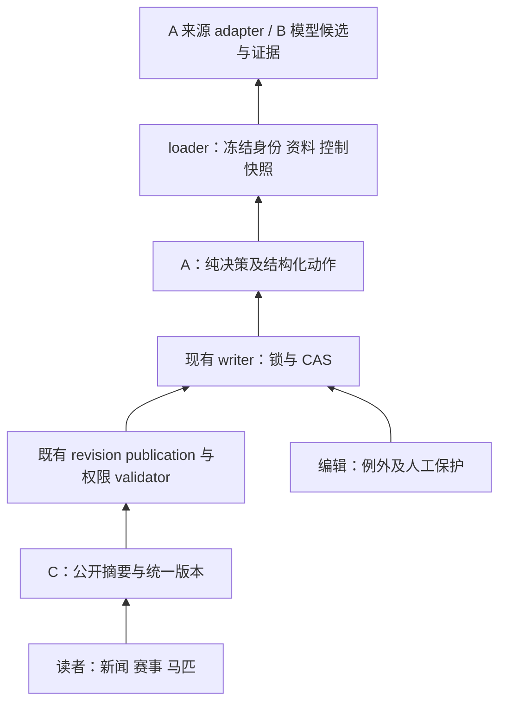

# A-001 / F01 共享合同方案 v0.1

状态：方案可审，未定版、未实现。DDL：2026-10-04 18:00 Asia/Shanghai。
本轮派单只交付方案与样例；独立 R 审核及协调者定值后才能成为下游冻结合同。

## 范围与证据

本线工作树 `/Users/mentianlu/.codex/worktrees/5482/umanews`；分支 `codex/next-version-race-data-20261003`。
代码 base `907f8de699b31a6fcc80acc78e9ba070aadc4f28`；继承文档源提交
`d0cec076019f35b6f7db56b09ebee291e57fd9f9`，本线等价提交 `63b5781e`。
创建合同要求开发模型为 `gpt-6.1-sol / medium`；产品 API 模型是另一配置。本轮未启动子代理。
只读检查代码与继承规格，不以旧生产快照证明当前生产。只新增本线目录文件；总任务和共享状态由协调者维护。
人工确认仅引用根 [AGENTS.md](../../../../../AGENTS.md)。当前方案派单已覆盖本轮文档范围，不执行共享主线、生产、抓取、付费或外部业务发送。

| 已核实的代码入口 | 已有合同 | F01 适配/缺口 |
|---|---|---|
| `server/stable/models.py:1833` RaceEventIdentityKey；`services/race_source_identity.py:identity_key/IdentityMatch` | occurrence 强锚点、namespace/hash 唯一；名称只召回 | 统一 entity_ref 与 match 状态；不另造姓名主键 |
| `models.py:4953/5043` HorseExternalIdentity/HorseNameVariant；`services/p0_horse_profiles.py:_identity_index` | 马匹外部身份与名字变体已有独立表 | 未建档源对象可保留引用；普通词只在支持该实体的上下文中使用 |
| `models.py:1846` RaceDataSyncSourceBinding；`services/race_data_sync_admission.py:validate_multisource_publication` | 按能力绑定、route/contract/proof 摘要、有效期；公开授权独立验证 | 来源类和成熟度不能合并；新 DTO 不授予权限 |
| `models.py:2330/2378/2531` observation/revision/publication | source_updated_at、来源摘要、phase、supersedes、发布证据 | 统一资料成熟度/完整度/校验状态；第三方确认要经过后续受审策略，不能改旧 phase 冒充 official |
| `models.py:1643/6040` projection/lifecycle control | owner_generation、schedule_generation、claim、人工暂停 | input_version 包装已有版本与内容摘要，不能替代 CAS |
| `models.py:6223` FieldAuthority；HorseProfile.manual_lock_flags；NewsArticle.manually_edited_fields | 字段/模块人工锁与编辑字段列表 | 用字段路径归一表达，保留模块/整对象锁语义，不在 DTO 层静默缩小旧锁 |
| `services/race_data_sync_lifecycle.py:decide_data_sync_lifecycle` | 仍按时钟写 running/finished | 新事实/时钟分离属于 R02 后续实现；本轮不声称修复 |
| `services/race_public_coverage.py:build_public_race_coverage` | 全公开 canonical 分母、分类和文本 next_action | 结构化下一动作/异常需要后续接入，不把估计时间当持久排程 |
| `models.py:3617` HorseProfile | 基础完整度、生涯状态、逐场权威性、nullable 来源出赛数分别存在 | 不把资料齐全等同生涯齐全；未知总数不能当 0 |

文件路径在表中相对仓库根；函数为优先锚点，行号对应上述代码 base。
`services/race_event_decision.py` 和通用 `input_version` 尚不存在；统一决策设计在
[race-event-unified-decision/design.md](../../../race-event-unified-decision/design.md)，仍未实施。

## 处理与读取顺序

来源 adapter → 带证据的资料候选 → loader 冻结实体/内容/控制快照 → 纯决策 →
现有 writer 末端重验权限、版本、锁 → 原子 revision/publication → 同一公开读模型 → C 页面与后台。
B 的模型只输出候选与证据引用，不能改 source class、确定性、授权或人工保护状态。

图为从读者向上追踪；执行从底层输入到公开摘要。公开 DTO 不暴露 raw artifact、内部锁、后台证据或任务错误详情。

## 共享类型草案

以下为拟实现的 JSON/冻结 DTO 类型，不是现有 import 路径。候选实现统一放
`server/stable/services/content_contracts.py`（无 ORM、网络、当前时间副作用）；赛事 decision 文件沿用原设计。
先由 A 提供类型及 serializer，B/C 经固定合同 SHA 消费；不分线复制 enum。
JSON 只接受有限值；未知 enum/schema 必须拒绝，字段形状错误不得降级为“无资料”。

| 类型/字段 | 精确值域及约束 |
|---|---|
| Envelope | `schema_version="f01.v1"`、`entity`、`input_version`、`evaluated_at`（显式 UTC RFC3339）、`policy_ref` |
| EntityRef | `kind=article/race_event/horse`；`canonical_id` 为字符串或 null；`source_refs[]={source,namespace,external_id}`；`identity_state=verified/ambiguous/unresolved/revoked`；`candidate_ids[]`；`evidence_refs[]` |
| 身份约束 | verified 必须唯一 canonical 或唯一经核验源身份；尚未建档不伪造 DB ID。ambiguous 不输出单一 canonical。source+namespace+external_id 是作用域键，马号只属于 event-local participant；跨地区同马经已核验映射去重。赛事届次属于实体身份 |
| EvidenceRef | `evidence_id,provider_key,source_class=licensed_api/official_operator/trusted_publisher/community/manual_supplement,independence_key,capability,artifact_sha256,locator,observed_at,source_time,contract_ref`；locator 为 artifact 内位置/事实位置；URL 单独保留在后台证据 |
| source_time | `{precision=exact/interval/unknown,published_at,last_absent_at,first_seen_at}`；exact 只接受真实源发布时间；interval 为上次未见到首次见到，不能用抓取时间替代首发时间；未知时四个时间允许 null |
| contract_ref | `{route_digest,contract_digest,proof_digest,valid_until,revoked}`；来自现有 registry/绑定，未准入能力不可形成网络动作。社区名字证明不自动授赛事抓取能力 |
| Material | `capability=identity/schedule/roster/withdrawal/result/correction/profile/career/name/relationship`；`maturity=unknown/predicted/provisional/confirmed/corrected`；`completeness=unknown/partial/complete`；`validation=pending/passed/conflict/rejected`；`revision_ref`、`supersedes_ref`、`evidence_refs[]`、`data` |
| 成熟度约束 | provider 类别永不直接映射 confirmed；单个准入第三方的确定完整资料、身份/关键校验及策略通过可 confirmed。官方预测也仍 predicted。corrected 必须有明确更正证据及 supersedes，不由 hash 变化推断。部分名单/前三名不得 confirmed-complete |
| 事实与时钟 | `fact_phase=unknown/scheduled/running/finished/postponed/cancelled`，须 evidence_refs；`clock_hint=unknown/before_start/start_time_reached/result_deadline_reached/local_day_elapsed` 只是时间提示；旧时钟写入 status 不自动成为 fact_phase |
| execution_state | `unobserved/planned/queued/running/succeeded/failed/stale`；来自收据，succeeded 不代表公开可见或资料完整；无收据为 unobserved |
| Action | `action_id,kind,capability,source_binding_ref,not_before,deadline,reason_code,expected_input_version,expected_generations`；kind 沿用统一设计的 wait/discover_identity/refresh_schedule/refresh_roster/fetch_result/check_correction/reconcile_publication/operator_review；马匹/新闻扩展只在所属后续任务明确后加入 enum |
| 下一动作 | `actions[]` 是完整列表；`next_action_id` 指向最早合法动作，或 null；`next_due_at` 必须为其 not_before，或 null；`next_review_at/reason` 为内部复核，不能假称 source poll 已排队 |
| Exception | `code,capability,field_paths[],severity=info/warning/blocking,root_cause_key,evidence_refs[],retryability=retryable/operator_required/not_retryable,next_review_at`；不含自由执行脚本；只阻断受影响能力，全对象身份/owner/撤销冲突除外 |
| Protection | `paused,fields[],modules[],reason,actor_ref,changed_at,protection_sha256`；字段为 `entity.field` 或 `entity.participants.<stable_key>.field`；锁范围取现有各层保护的并集，单纯 adapter 不能解锁；撤销/恢复有审计 |
| PublicSummary | `entity_ref,public_version,material_state,fact_phase,clock_hint,updated_at,completeness,gaps[]`；只经过原公开 validator 后产生。article/horse/race 分别保留原路由/ID，未来 API 只定义合同、不开放端点 |

`data` 按 capability 定义窄白名单；模型未知字段不可直接透传写库。姓名必须包括原文、name_kind、证据；
赛事名单必须包括稳定 participant 引用、顺序及 runner 状态；统计数量用 `int|null`，0 仅表示已知零。
赔率/奖金等边缘字段缺失不妨碍关键名单完整，但 `gaps` 要明确；结果须覆盖已核验全体实际出赛者与非完赛状态。

## input_version 与并发合同

`input_version={schema_version:"f01.input.v1",scope,content_sha256,generations}`。
`scope` 是排序后的依赖字段路径列表，writer 检查它满足该动作的强制依赖闭集，不能由调用者缩小。
content 摘要包含实体与映射状态、该动作依赖资料及 evidence 摘要、revision/生效名单、事实/赛程、
人工保护、策略版本及来源绑定摘要；排除无关 worker 心跳/轮询 last_attempt，避免长研究反复无效。
`generations` 显式包括 event owner/schedule/enrollment/source-set，或文章/马匹的受影响内容版本；
缺少某种现有 generation 不能伪造为 0，使用 null 并由内容哈希在锁内比较。

canonical JSON：UTF-8、键排序、紧凑分隔符、禁止 NaN/Infinity、日期/时刻预先正规化；证据、源引用、
依赖字段路径按稳定键排序，名单保留业务顺序，字符串不做会改变名字语义的额外转换。
同一快照同一规则/now 输出相同；`decision_version` 标规则，`input_fingerprint` 另绑定完整执行快照
（含预算、source permissions、claim、健康），两者不能混用。样例哈希均由规范化输入计算。

执行前短事务锁定目标和现有 control，按已有固定锁序比较 expected_input_version 与 CAS generations，
再实时重验人工锁、binding/route/terms/revocation、预算与发布控制。任一漂移拒绝 `stale_input`/对应 blocker，
新计划重新读取；旧响应只能保留 observation。运行/公开时各自检查许可，input_version 永不等于授权。
前瞻成稿前若名单、取消/改期、开赛或关键版本变化，停止旧稿发布并重新决定；普通来源更高权威但同内容只追加佐证。

## 兼容与增量迁移/索引草图

1. F01 首次类型/loader 影子交付无 migration；旧 writer、status、phase、公开 validator 和字段锁不修改。
   旧 `phase=official` 只有证据/validator 通过才映射 confirmed；`provisional` 默认 provisional，
   不因官方 provider 升级。第三方 confirmed 的新政策在 R03 审核实现后接入，不能绕过旧正式公开授权。
2. R01 时效账本先用 `(event,capability,schedule_generation,source_revision)` 唯一观察键，来源首发区间、
   discovered/validated/published/probed 时刻分别存；index `(capability,deadline)` 与 `(event,-observed_at)`。
   记录历史超时，不因补齐删除；public probe 无证据时标未验证。
3. R02/R03 先复用 revision/current/last-known-good FK，以新 read adapter 影子比较。若确认策略需新增
   资料成熟度列，追加 nullable+unknown 默认，按证据 manifest 分批填充；先 dual-read 再切消费者。
   不批量把旧 official/provisional 枚举改写。projection 指针原子切换，冠军/结果/统计同版本。
4. 原统一设计的 `RacePublicationAuthorityProof` 仅追加、PROTECT、`(publication,generation)` 唯一及数据库不可修改；
   新 proof 失效不得回退旧 generation。此项由对应任务单独排 migration，不把 F01 当实现批准。
5. dispatch/outbox 沿原 `RaceDecisionDispatch` 草图，用 event+capability+claim 身份唯一，index
   `(dispatch_state,not_before)`；不能建立第二 owner/lease。待 R 后续任务确定是否纳入本版最小 schema。
6. B 提交模型任务 `input_version`/budget/evidence 需求，C 提交异常聚合与人工修改 CAS 需求，A 汇总
   schema DAG。文章/马匹精确版本可选新增 bigint 内容版本，但须覆盖所有写入口；只给后台表单加版本不够。
   新异常表建议 `(root_cause_key,entity,capability,active)` 约束，保留 resolution/audit；字段最终由 E01 方案定。
7. migration 号码在当前 leaf 后由 A 统一分配，不预抢 0080；每项独立 schema/catalog/恢复合同，
   新索引先测真实形状数据与锁时长。上线先 schema 再兼容应用、最后消费者；回滚应用保留新列/证据，
   不以删新表撤销已公开依据。G2 精确发布包由协调者组织。

## 首版参数与定值责任

| 参数 | 来源/状态 | 推荐值与处理 |
|---|---|---|
| 赛事范围/新闻范围 | 用户明确，继承 spec §1.1 | 赛事既有九地区；新闻日/港/英/法/美。不扩大实网权限 |
| 错误/卡顿/确定资料公开时限 | 用户明确 | 按场严格 <1% / <3%；常规 10 分钟、重点 5 分钟；包含排队到公开，缺资料另报覆盖率 |
| 近期马/名称 | 用户明确方向、精确窗口为建议 | 近三年优先、2020 起 G1 全名单名称（含 Jpn1/港本土 G1）；窗口建议 2023-10-03..2026-10-03 含边界，按赛地 local_date；H01 冻结 as_of/增量去向 |
| 重点赛事规则 | 待协调者定值，10/04 | 推荐现有 `priority=P0` ∪ G1/Jpn1/香港本土 G1；P0 为工程近似，不能假定所有旧人工重点等于 P0。H01/F03 导出逐场 inclusion_reason 与疑义，不以赛名字符串猜等级 |
| 存量新闻关系/近期新闻优先 | 待协调者定值 | 关系建议近 90 天；优先队列 future 30 天、current season、近期新闻；近期新闻 lookback 建议复用 90 天，季节按地区日历；不得默认为已授权数字 |
| 出马阶段/赛果/前瞻 | 待协调者定值，地区窗口 F03 校准 | T−60 预警、T−30 异常、实际开跑优先否则已确认计划 T+30；前瞻 T−24h/T−60m；date-only 使用当地赛日结束、不造 T/00:00；审议保留超时原因 |
| 社区名称来源清单 | 未核验，B H04/H05 + 协调者，10/04 标清单/10/06 可行性 | HKJC 优先；一个认可专业社区有明确名称使用和强身份即可，冲突待核。现无可确认的社区准入名单，建议候选隔离、不默许全网；协调者提供认可来源或先记录未定 |
| 工具/金额预算入口 | M02/B 实现，F06/协调者 10/06 定额 | 配置对象按 task_type 定 max_input/output_tokens、tool_reads、wall_seconds、review_rounds、daily_amount、currency、price_version、effective_at；建议前瞻 60 reads/1200s、3 轮审校；金额未知为 null，真实付费任务不启动，绝非 unlimited |
| 引用路径 | 首版工程建议，B/C 消费 | 默认受控自有查询工具；内置搜索公开成稿路径保持待单独核验引用展示合同，本轮不启用/不扩大来源 |
| 验收样例阈值 | 计划建议，F06 定值 | 300 场九地区各20、100篇五地区、20场完整前瞻；禁止把建议数声称用户已确认。源码基线与自然结果分开 |

协调者需要判断的两类：可在现有范围内采纳的参数建议；需老板明确的社区认可/预算/范围选择。
推荐先固定配置键、未知值与责任，不用编造额度阻塞 B 的 mock 开发；F01 最终定版必须附协调者决定和固定 SHA。

## 四组样例与验收

[四组输入输出](F01-contract-examples.json) 都是离线合成 fixture，ID、来源与哈希不是生产证据。

| 组 | 必须表达/验证 | 后续实施 RED 位置 |
|---|---|---|
| 普通词马名 | Love 可是有强身份上下文的马，也可是普通正文词；前者引用实体，后者 unresolved、不产生马匹链接或中文新名 | L01/N02 解析候选不能只按词相等 |
| 同名异马 | Echo 两个受检源身份不并为一个；ambiguous 保留两候选、operator_review，不伪造 canonical | H02/L01 身份冲突与待建档输入 |
| 确定与预想冲突 | 官方预测晚到不降级第三方已核验完整确定名单；有事实冲突则保留 last-known-good 并复核；旧 input_version 拒绝 | R03/R07/M07 版本与来源成熟度 |
| 未知值与人工保护 | date-only 不自动 running/finished；unknown starts 与已知0分别显示；锁字段不写且其他独立能力能推进 | R02/H07/E04 stale/lock/null 回归 |

文档校验：JSON 可解析、四组覆盖、输入摘要可复算、输出引用合法、源码锚点和链接存在、工作流契约与 diff 检查。
本轮不人为制造 RED；后续行为实现才运行上述真实反例，测试按 `907f8de6` 影响范围流程交付。

## 审核请求与下游合同

A：F03 以 source_class/capability/terms/成熟度/完整度分别出矩阵；H01 以已核验身份或 unresolved source key 出分母。
B：候选携带 entity/evidence/input_version；预算缺省不可调用真实付费；名称不能由模型创造。
C：公开读模型显示成熟度/完整度/更新时间；后台按 root cause 聚合例外并保持保护/CAS；不取内部 evidence 当公开 API。

请 R 重点检查：第三方确认兼容边界、hash 依赖闭集与末端权限、旧锁不被缩小、未知与0、迁移与回滚顺序。
待协调者：参数定值、社区名单/预算负责人，以及 R 审核派发。F01 为“方案可审”，F03/H01 未开始实施、未完成。
