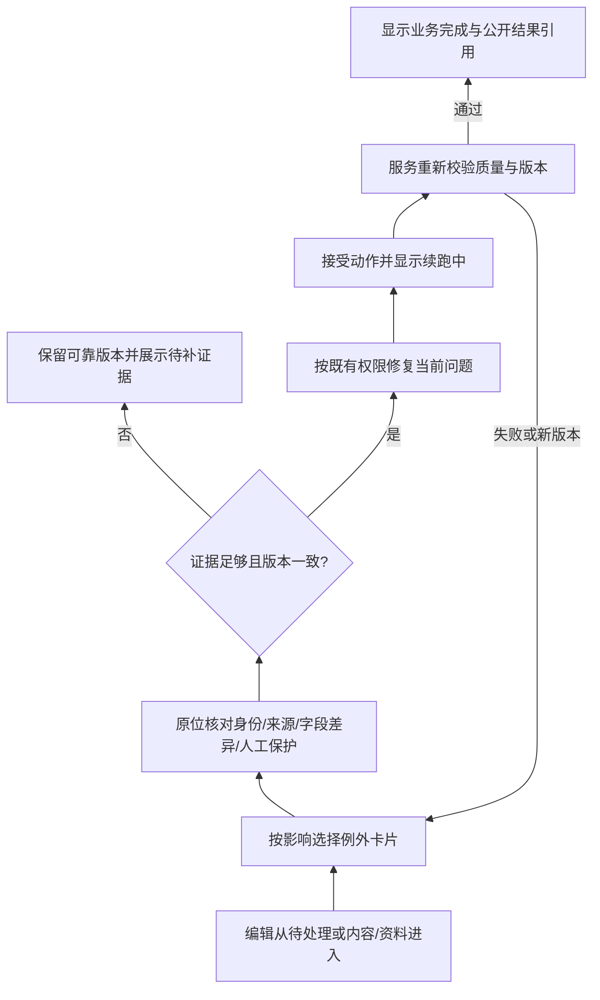

# F04 编辑后台旧路径与交互方案（待 R 审核）

任务 C-001 / F04；DDL 2026-10-04 18:00 Asia/Shanghai。记录日期 2026-10-03。
工作树 `/Users/mentianlu/.codex/worktrees/bc9b/umanews`；分支 `codex/next-version-product-ui-20261003`。
代码 base `907f8de699b31a6fcc80acc78e9ba070aadc4f28`；继承文档 head `dbcc87a4`（完整 OID 见交付报告）。
开发模型按协调派单为 gpt-6.1-sol / medium；不能以本报告作为运行参数的独立证明。

## 状态与边界

已完成六条当前代码路径追踪、前后路径对照、四入口与手机交互草案、组件及合同清单。当前只提交文档和离线演示，不修改业务行为、不迁移数据库。方案尚未独立审核，不能标记 F04 已冻结或 E 系列已实现。

2026-10-03 本次 IAB 只读打开 `https://umafans.run/admin/login/?next=/admin/`，可见“赛马新闻后台”、用户名/邮箱、密码和登录按钮；无可用登录态。六条路径的真实操作、耗时、移动运营验证均待测，下面的步骤是代码推导，不能当作生产实测。首页 GET `console_dashboard` 调用 `sync_builtin_sources()`，为保持只读未进入后台首页；未输入凭据、保存、发布或发送。

派单已覆盖 F04/F05 调研和设计范围；人工门禁统一引用根 AGENTS.md。行为实施等待协调者安排 R 审核，主线与生产交付由协调者组织。A/B 提供服务合同，C 不自定数据来源优先级、自动发布阈值或恢复授权。

## 六条旧路径及前后操作对照

以下从已登录后台开始，导航计数为到达关键页面所需的最少页面打开次数，不含来源页、分页和提交后的 redirect；不作节省时间承诺。

| 任务 | 当前可追踪路径与证据 | 已有能力、缺口及风险 | 原型路径（建议） | 实测时间 |
|---|---|---|---|---|
| 1 找待办 | `/admin/` → 候选池 `/admin/candidates/?workflow_status=pending_review`；术语另在 `/admin/term-candidates/`，赛事 `/admin/race-events/`，马匹 `/admin/horse-profiles/`。`views.py:1160 console_dashboard`、`_console_context:272`、`base.html:41–90`、`dashboard.html:9–32` | 已有新闻计数和分对象入口；没有统一根因、影响和到期排序。至少一个列表打开，跨模块比较需分别打开；正常重试不能被误当需人工 | 待处理 → 影响排序卡片 → 同页展开；人工/自动恢复/等来源分组，非零停摆显式显示 | 待测 |
| 2 核对差异 | 候选池 → `/admin/candidates/{article_id}/` → `/admin/articles/{article_id}/edit/`；`candidate_detail:1954`、`article_editor:2269`、`article_editor.html:25–30,142–186` | 已有原文、译文参考、状态、图片；编辑器三栏不等于结构化变更差异，公开效果在独立预览页 | 待处理或内容 → 同页“当前/候选”字段差异、来源、预览抽屉；保留全文展开 | 待测 |
| 3 改正文 | 候选池/已发布列表 → 编辑器改标题/正文 → 保存草稿或审核并发布；预览 `/admin/articles/{id}/preview/`。`article_editor:2288–2345`、模板 `:122–128,260–290` | 已有保存与发布合一，20秒自动保存；无需先提交审核再发布。保存会标记一组人工字段。发布会调用 QQ enqueue 与关联扫描，故本次不能用生产计时。自动保存 JS 未核验响应成功就清 dirty，列后续技术核验点 | 内容 → 编辑/原文/预览切换，窄屏单列；明确“已保存/保存失败”；同页结果反馈和下一项，保留无封面业务确认 | 待测 |
| 4 改名称 | 编辑器选词 → 快速术语表单 → 创建后返回原编辑器 → 应用该术语；或术语候选列表 → 详情采纳/合并。`article_quick_term_create:2090`、`article_apply_created_term:2126`、`term_candidate_detail:1770`、`_quick_term_form.html` | 原位创建与应用已经存在；保护人工字段并显示跳过项。现成马名仍需身份/出处证明，不能把自由输入当自动造名；未保存正文可能因 redirect 丢上下文，需隔离验证 | 资料/待处理名称卡 → 身份、现成名来源、受影响内容 → 采纳/保留原名/提交冲突 → 显示跳过字段及续跑结果 | 待测 |
| 5 处理赛事冲突 | 赛事列表 → `/admin/race-events/{event_id}/` → 候选区 → 应用；`race_event_edit:575`、`race_event_apply_candidate:636`、`race_event_form.html:78–125`；Django Admin 有 observation/conflict 列表 | 当前展示 candidate.diff_payload 截断120字符并有来源链接、人工锁定保护说明；并非没有差异。不能据来源名字或百分比直接覆盖冲突；console 候选与观测冲突不是同一模型 | 资料赛事/待处理 → 逐字段差异、资料成熟度、来源、保护字段 → 只处置当前冲突 → 原位结果，不在手机依赖横向宽表 | 待测 |
| 6 修复后续跑 | 文章候选详情 → 修改正文或补术语 → 回候选详情“运行自动化”；或重译，失败翻译 Django Admin 手动重试。`candidate_run_automation:2251`、`candidate_retranslate:2160`、`admin.py:808–817`、`services/translation_recovery.py request_manual_translation_retry` | 有手工 dispatch 和恢复服务；“已触发”只证明提交任务，不证明公开完成。赛事/马匹续跑须消费 A 合同，不能假定任意保存都自动重试 | 同一待办修复 → 版本校验 → 续跑中 → 重新校验 → 已完成或新原因；明确完成目标、任务状态、公开结果；重复点击不重投 | 待测 |

代码行号绑定上述 base，后续改动时按函数定位复核。六条任务都保留失败/返回路径，不以操作次数代替质量结果。

## 四入口及手机方案

[离线原型](F04-prototype.html) 使用明确标注的合成演示内容；无网络请求、无业务提交，无真实生产对象和统计。四入口均可切换，演示问题展开、证据/差异、正文编辑、预览、名称选择和修复续跑状态；演示状态不写入数据库。

| 入口 | 默认信息 | 动作与手机呈现 |
|---|---|---|
| 待处理 | 人工判断、自动恢复、等待来源分离；根因/影响对象/期限/最新状态 | 卡片列表同页展开；手机底部四入口，44px以上目标；长差异纵向“当前/候选”；恢复处理中按钮不可重复触发 |
| 内容 | 候选/已发布/撤回筛选，标题、公开状态、关键质量检查 | 原文/编辑/预览分区；窄屏按需切换并保留本地草稿；保存、发布各自结果明确，离开未保存草稿提示 |
| 资料 | 赛事/马匹/名称/身份冲突；原始值和确定程度分开 | 每字段来源与取用范围；名称不可凭空生成；仅相关字段处置，旧可靠版本保留 |
| 自动化 | 地区质量与覆盖、上次成功、下一动作、积压和停摆 | 卡片摘要；技术日志折叠；待办为空但链路故障时仍显示异常；调整策略沿既有权限与服务合同 |

桌面使用列表+详情对照，手机 390×844 单列，320px 仍不出现整页横向溢出；导航和底部动作留出安全区，证据链接可复制/打开。高密度资料允许“展开全部”，主要动作不依赖表格横向滚动。键盘焦点可见、tab/按钮有可读名称、状态使用 aria-live，不只靠颜色。手机正文键盘遮挡、真实长文和辅助技术需后续隔离 UI 验证。

## 组件及受影响文件（后续 E 系列，不在 F04 实施）

| 组件 | 拟涉及文件/函数 | 复用与约束 |
|---|---|---|
| 四入口导航 | `templates/stable/console/base.html`、`static/stable/console.css`、`views.py _console_context` | 保留旧 URL 可达；内部工具折叠；不更换前端框架 |
| 统一异常摘要/详情 | `views.py console_dashboard`、`templates/.../dashboard.html`；建议新增 `_exception_card.html`、`_exception_detail.html` | A/B 输出稳定读模型，C 不直接凭 error text 推断恢复动作 |
| 字段差异与证据 | `race_event_form.html`、`horse_profile_detail.html`、`term_candidate_detail.html`、`candidate_detail.html` | 复用来源、候选、人工锁、日志；完整差异按需展开，无截断关键确认字段 |
| 内容编辑/预览 | `views.py article_editor/article_preview`、`article_editor.html`、`article_preview.html`、`_quick_term_form.html` | 保留保存发布合一；未保存预览需明确草稿来源；只保护真实修改字段的行为由后续合同实现 |
| 恢复状态/版本与并发 | `views.py`对应 POST 适配、`forms.py`；A/B 服务、models/migrations 由 A | stale input 返回冲突和刷新差异；修复成功与公开完成分开；恢复能力不能超出既有边界 |
| 自动化摘要 | `region_production.html`、`production_window_detail.html`、来源健康与地区服务 | 正常自动任务不强制人工审；等待来源和故障分开；不改变生产开关 |

## 下游合同建议（等待 F01 定版，不新增持久字段）

C 消费的异常卡最小结构：`object_ref {kind,id,public_url}`、`reason_code`、`root_cause_key`、`state`（needs_human/auto_recovering/waiting_source/resolved）、`impact`、`due_at`、`evidence_refs`、`field_diffs`、`input_version`、`manual_protected_fields`、`allowed_actions`、`next_action_at`。根因不能只以同一个错误文本聚合，至少隔离对象身份、来源及输入版本；摘要显示对象数，处置时显示精确集合。

动作返回建议：`accepted`、`operation_ref`、`current_version`、`state`、`validation_issues`、`protected_fields_skipped`、`public_result_ref`。只有 accepted 不能显示“已完成”；陈旧版本重新展示差异，不静默覆盖；permission 为服务端权限而非前端按钮判断。中文名来源与身份、赛事资料成熟度与官方来源标记分开。

## 验证与冻结条件

1. R 只读审核六路径证据、合同边界、组件拆分和原型；协调者收敛选项后绑定方案 SHA。
2. 有可用隔离登录环境时，用同一任务 fixture（文章、已有现名冲突、赛事候选、可恢复失败）复演旧新界面。禁止为计时在生产保存、发布或发送。每条任务桌面/手机至少重复三次，记录任务成功/失败、跳转、主动操作秒数、等待秒数；失败任务保留，不混成效率改善。
3. 中位耗时下降≥30%、正常合格任务自动完成≥90%沿原 spec 为建议验收值；本次无计时和分母，不能宣称达标。提交前需协调者确认指标冻结口径，质量失败不得因更快而过关。
4. 后续行为实现按 TC-E01/E02（版本、幂等、权限、保存失败、窄屏长文）取得真实 RED/GREEN；F04 文档/只读产物不人为造 RED。
5. 当前待证：真实六任务耗时、手机运营路径、跨模块待办实际分母、F01字段/版本/权限/恢复动作合同。推荐本次冻结信息架构与交互状态，计时作为 E03/E06 的必补输入，不伪造历史数值。

## 交互流程

## 本轮原型验证

2026-10-03 02:09–02:12 Asia/Shanghai 使用本地只读静态服务器与 IAB 检查：四入口切换、正文同页预览、演示保存、资料处置、恢复接受/处理中/完成状态均可见；恢复接受后主按钮禁用。最终原型页面在390×844、320×844上 document.scrollWidth 分别390/320，390视口底部四按钮高度均44px。初次截屏发现长动作按钮三列易碎行，已改为手机动作纵向排列并复核宽度。中间一次 viewport 施加在其他活动页返回1280，未作为手机通过证据；重新创建当前原型页后取得320/390有效宽度。真实手机键盘、真实登录和业务行为均未测试。
