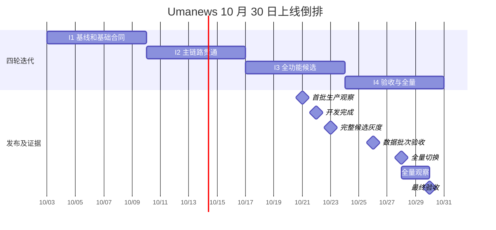
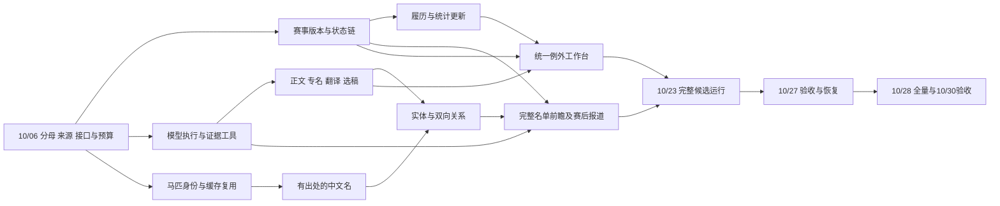

# Umanews 10 月 30 日版本整体规划

编制日期：2026-10-03。全部日期、时刻按 Asia/Shanghai。目标：2026-10-30 18:00 前，本版约定能力完成全量上线和验收；20:00 前完成文档交接。本文是开发与交付计划，不是已经完成的实施记录。

完整的一份式阅读入口为 [整体规划与逐项开发任务](tasks.md)：包含本文件的整体目标、四轮倒排、全部任务卡和原始差距映射。详细能力论证与时序保留在 [design.md](design.md)，专项验收在 [test_cases.md](test_cases.md)，上线步骤在 [rollout.md](rollout.md)。

## 1 本版要达到的整体效果

读者能够看到干净、准确、重要且地区覆盖更均衡的中文新闻；赛事资料从赛前到赛后自动更新，预测资料限时替换为可信确定资料；近期马匹资料和有出处的中文名优先补齐；新闻、赛事与马匹互相可达。编辑后台主要用于解决例外，正常更新自动完成。QQ 停用；重点赛事增加覆盖全部参赛者的自动前瞻，并复用能力生成有事实依据的赛后报道。

工程上保留 Django、PostgreSQL、Celery 和现有身份、来源、revision、发布证据。新增共用的模型任务、证据查询和异常处理能力，渐进统一赛事决策，不重写全站主干。

| 模块 | 当前理论与实际差距 | 本版改造 | 改造目的及最终可见结果 |
|---|---|---|---|
| 新闻抓取与翻译 | 已有清洗、术语保护、评分和配额；用户仍反馈污染、误判和日本占比过高，缺统一质量基线 | 正文区块与完整性检查、模型专名判断、译后事实核验、按事件选稿、五地区周覆盖、历史影响清单修复 | 少发重复低价值内容，保住重要新闻，姓名/事实准确，五地区持续有优质覆盖 |
| 赛事日历 | 已有状态、来源、版本与覆盖机制；来源能力及自然运行不齐，存在缺行/卡住/显示矛盾 | 九地区主备源、统一决策、预想/确定与待确认/已确认读模型、阶段期限、延期取消退赛、更正与时效账本 | 关键资料按场错误率 <1%，应推进场次卡顿率 <3%；来源给出确定资料后常规 10 分钟/重点 5 分钟内公开 |
| 赛马信息 | 已有采集与暂存；公开覆盖、译名、履历和统计不一致 | 近三年目标优先队列、缓存到公开链、HKJC/认可社区名称、身份/别名统一、全生涯记录、新赛果持续更新 | 近期马匹先可读，现成中文名尽量齐全；未知与 0 区分；生涯不受日历收录范围限制 |
| QQ 和长期 API | QQ 链路完整但用户明确无人使用；现有管理 API 不是外部服务 | 停全部 QQ 发送、重试、按钮和专属依赖；保存长期只读内容 API 合同 | 网站不依赖 QQ 继续运行；未来外部服务可复用稳定 ID、版本和关联 |
| 编辑后台 | 已有编辑、审核和部分组合操作，异常处理仍分散 | 四入口、统一待办、原因聚合、原位证据/差异/预览、手机关键路径、人工修复后自动续跑、并发保护 | 人只处理必要例外，少跳转、少重复输入，修一次后系统继续推进 |
| 模块关联 | 关系表和部分展示已有，自动覆盖及参赛马跳转不足 | 共享实体解析、新闻双向关系、赛事新闻统计/重点排序、名单/赛果马匹跳转、马匹履历与近期新闻 | 新闻→赛事→马匹→生涯/新闻路径可走通，届次和身份不串联 |
| 体验与落地缺口 | 有重复赛事、筛选/标签矛盾、旧首页要求未落实，恢复和用户路径缺统一验收 | 唯一入口、等级一致、近期首页、完整度/空态/更新时间、手机复验、公开内容探针及恢复验证 | 读者得到一致、可解释的资料；设计、部署、实际可用不再混称完成 |
| GPT-6 复杂任务 | 已有单篇翻译/改写，未形成多源自主查询与全名单前瞻 | Responses 适配、受控工具、证据与预算、12 类判断任务、重点赛事前瞻、赛后报道、评测及降级 | 模型能自行补查和汇总；合格结果自动进入业务链；事实有来源、过程可恢复、成本可控制 |

### 1.1 本版必须保留的用户决定

- 新闻先做好日本、中国香港、英国、法国、美国；按周保障优质覆盖，重大事件允许倾斜，不能机械等量或低质凑数。
- 赛事沿用现有公开日历九地区：日本、中国香港、英国、爱尔兰、法国、美国、澳大利亚、德国、中东。充分使用可信第三方和现有 The Racing API，不把官方站点作为唯一确认条件。
- 信息错误率严格 <1%，以一场关键资料有任何错误就算一场错误；流程卡顿率严格 <3%。确定资料到达后的常规 10 分钟、重点 5 分钟是端到端公开时限。
- 近三年参赛马优先，当前赛季、即将登场和近期新闻涉及者优先；2020 年起 G1 全参赛马的名称目标保留，不缩成胜马。
- HKJC 名优先；没有时，一个认可专业社区来源明确使用且身份可核验即可采用，冲突复核。模型、程序、编辑都不得自行翻译或发明马名。
- 自动前瞻先覆盖重点赛事，逐匹核对全部参赛者，缺资料明确说明；质量和成本合格后再扩展。
- QQ 短期停用，外部 API 是内容稳定后的长期服务方向；本版完成 API 合同，不声称服务已开放。

## 2 范围和完全上线的定义

“完全上线”同时满足：代码合入并部署、所列功能在本版目标范围实际启用、自然自动链路产生公开结果、验收通过、恢复交接完整。仅合入代码、仅部署关闭开关、仅完成一次手动补数据均不算。

**功能范围**：八模块表中所有本版改造都进入四轮计划。12 类模型任务全部有明确去向：专名/清洗/翻译/重要性由 N02–N06；现成名由 H04/H05；关联由 L01；研究/冲突由 M04；新闻事实变更由 M09；异常归因由 M10；前瞻由 M05–M07；赛后报道由 M08。异常归因首版仅给有证据的建议并复用已允许恢复动作，不包含任意修改程序或权限。

**数据范围**：不能用“后台程序可运行”冒充资料补齐，也不能承诺无法取得的资料已完整。H01 在 10/06 前固定分母，F06 同日核定吞吐。

| 目标集 | 冻结和动态更新规则 | 10/30 验收内容 |
|---|---|---|
| 近期马匹 | 首次基线为 2023-10-03 至 2026-10-03 参赛的目标；来源为现有九地区已收录赛事及已准入来源可枚举参与者，含未建档对象。上线后按最近三年滚动；截至上线的新参赛/新闻对象增量入队 | 冻结目标逐匹有处理结果；可取得且身份明确的基础资料/近期履历正式公开；当前赛季、即将登场、近期新闻优先。完整早年生涯可持续补齐，但不能标为完整而仅有近期片段 |
| 历史 G1 参赛马名称 | 2020 年起到冻结时点的全部参赛马，含 Jpn1、香港本土一级赛；不含其他 Local G1，保留增量 | 全名单逐一检索有凭据；找到且身份明确的现名完成采纳；无可信名称保留原名并公开覆盖报告，不承诺创造 100% 中文名 |
| 当前赛事 | 所有公开 canonical 赛事进入覆盖账本；实时质量分母为进入跟踪/应推进窗口的场次 | 九地区按能力可持续更新；没有来源身份/未登记也不得从分母消失；缺数据/失败不能排除后算达标 |
| 历史缺陷修复 | F05 复验的固定样例、旧合法公开阻断、明确重复赛事和 N07 影响清单；范围/数量冻结成各自输入包 | 已确认缺陷修复并公开复验；发现范围扩大则列新任务与工期影响，不静默全库重写 |
| 存量新闻关系 | 优先近 90 天、当前重点赛事和本轮修复/重处理文章；全部新发布新闻持续建立关系 | 冻结存量范围完成可靠链接或明确歧义；全部新内容自动关联。更早全历史扫库不作为本版隐含工作 |
| 重点赛事前瞻 | 首版建议现有明确重点标记 ∪ 日历 G1/Jpn1/香港本土一级赛；F01 固定实际名单和标记规则 | 对上线范围内有发布窗口的目标逐场自动研究，名单覆盖 100%；没有真实比赛窗口的地区用回放验证并说明自然证据缺口 |

上表滚动窗口、存量新闻 90 天、首批重点赛事规则是为排期给出的**建议默认值**，不是伪装成用户早先已确认的数字。F01/H01 在各自 DDL 输出最终配置和分母，若显著改变结果按根 [AGENTS.md](../../../AGENTS.md) 处理；本轮不因此暂停规划。

保留的长期事项仅有公开 API 服务、前瞻扩展到非重点赛事、无界的全世界马匹/全历史新闻补齐和任意自动改代码代理。它们不占用本版工期，也不被写成 10/30 已完成。若 F06 证明冻结数据规模无法在额度内处理，须在 10/06 报告容量缺口并调整资源；不能到 10/30 将目标改名为“能力上线”来掩盖原定批次未完成。

## 3 四个迭代与倒排日期

排期资源已由用户确认：**3 条开发工作线并行，独立审核与发布协调另行保障**。A 负责赛事/资料管线，B 负责新闻/模型/名称来源，C 负责页面/关联/后台，R 表示独立审核与发布协调，不计为第四条功能开发线。R 中的运维与测试可由不同负责人并行承担，但同一生产窗口只由一个发布协调人操作。

估算单位是“工程专注小时”，包括读代码、相关 RED/GREEN、实现、局部复验和常规返修，不是模型调用耗时，也不是已测得的人天。排期假设 10/03–10/30 各日均可安排模型开发，每条线每天可用 8 小时、计划最多安排 6 小时，其余用于集成/等待/不可预测返修；人工审核窗口需另行保障。若只按工作日或只单线开发，本排期不可直接套用。F06 必须用首批实绩校准。

| 迭代 | 日期 | 目标 | 退出条件 |
|---|---|---|---|
| I1 基线和基础合同 | 10/03–10/09 | 冻结分母、来源与接口；搭模型/证据基础；完成 QQ 停用代码、独立页面修复和恢复缺陷修复 | 10/09 18:00：接口可并行使用，外部能力风险有结论；独立样例/恢复测试通过；不宣称生产已改 |
| I2 主链路贯通 | 10/10–10/16 | 赛事时效和异常、新闻清洗/翻译、正式马匹资料、中文名、双向关系及后台待办 | 10/16 18:00：隔离环境从输入到公开候选贯通，幂等/冲突/更正与权限合同通过 |
| I3 全功能候选 | 10/17–10/23 | 选稿周覆盖、完整前瞻/赛后稿、资料批次、全部页面和后台续跑；首批生产运行 | 10/22 18:00 功能开发完成；10/23 12:00 完成候选审核；10/23 18:00 完整候选灰度上线，进入七天观察 |
| I4 验收和全量上线 | 10/24–10/30 | 执行已冻结数据批次，修复观察问题，压测/恢复/用户验收，全量切换 | 10/27 RC 通过；10/28 18:00 全量；10/30 18:00 完成 48 小时全量观察与最终验收 |

**从 DDL 倒推的硬约束**：10/30 的有效观察要求 10/28 已全量；全量要求 10/27 已有固定候选和恢复证据；七天/地区周覆盖观察要求 10/23 完整候选已运行、10/21 新闻主链先开始；这要求 10/22 完成开发、10/16 主链联调通过、10/06 明确来源与数据吞吐。日期不是额外人工门禁，授权统一按根 AGENTS.md。

10/23 以后只进行必要缺陷修复、参数收敛、批准批次与验收，不再接入新的产品范围。若关键修复需要 10/28 后重新发布并重启稳定观察，不能继续宣称已满足原 10/30 完全上线目标。提出具体影响和调整，不隐瞒风险。

## 4 工作线和关键依赖

共享文件管理：`models.py` 和 migrations 的结构变更由 A 线汇总顺序；`tasks.py`/`settings.py` 按独立函数/配置块拆最小补丁，由集成人按依赖顺序合入；`views.py`/公开和后台模板由 C 线统一写入，A/B 输出服务合同与字段。任何接手模型都不覆盖其他线改动；任务引用同一文件不代表可以无锁同时重写。每个代码任务一个小 PR 或可单独审阅的提交，不机械要求一个任务一个大 PR。

无需让正常内容逐条人工审批。业务校验通过即可在已启用范围自动推进；身份/来源冲突、事实不确定和不可恢复错误进入统一待办。人工修复后续跑仍走同一版本/幂等机制。扩大来源、真实付费或生产操作按根 AGENTS.md，排期文档本身不等于已获具体发布授权。

## 5 验收口径与发布判定

详细可执行场景见 [test_cases.md](test_cases.md)。下面数字除用户已确认的 <1%/<3%/5/10 分钟外，是**本计划建议的首版验收线**，F01/F06 应结合固定样例明确，不以随意降低门槛吸收延期。

| 能力 | 建议验收线 | 证据和时间 |
|---|---|---|
| 赛事正确性 | 按场关键资料错误率严格 <1%；伪造确定、同马错配、漏报已确认取消等重大错误为 0 | 至少 300 场独立回放，九地区各至少 20；自然观察全部应推进场次另报，不能混入历史成功样本稀释 |
| 赛事流转 | 应推进场次至少一次错过期限的比例严格 <3%；资料替换常规 ≤10 分钟、重点 ≤5 分钟 | 阶段与来源两种时钟；记录来源首发时间或区间。自然窗口从 10/23 开始、全量窗口 10/28–30；长期滚动 28 天仍持续观察 |
| 正文与翻译 | 保留集关键事实错误/错马/自造名 0；正文污染文章比例 <1%、关键段落误删 0；实体精确率建议 ≥99%、召回率 ≥97% | 五地区至少 100 篇固定样例，包含未发布/失败稿；人工标注与程序校验联合，阈值不等于模型置信分 |
| 新闻价值与均衡 | 预先标记的重大事件漏报 0；各地区当周合格重要事件覆盖建议 ≥90%，无合格新闻如实说明 | 周目标建议每地区至少 3 个独立合格事件，有重大事件则倾斜；不能凑数；分开报告候选、公开和曝光 |
| 赛马资料与译名 | 冻结目标处理去向 100% 可解释；可取得且身份明确的资料完成公开；所有采用中文名有出处，自造名 0 | H10/H11 对账原始目标与公开页面；未知、冲突、暂存、运行失败单列，不能把其中任何一种记为公开完成 |
| 前瞻与赛后稿 | 前瞻当前名单逐马处理 100%，额外/漏掉马匹 0；关键事实有真实证据，发布时名单/赛事状态一致 | 至少 20 场固定重点赛事样例，并逐篇核验灰度真实稿；赛后不凭名次虚构赛况 |
| 关联 | 固定样例错实体/错届次/撤回后残留链接 0；公开导航全路径通过 | 三类页面、分页、后台修复、新对象补链、非日历履历各有样例 |
| 后台 | 六条高频任务可完成且关键例外可自动续跑；建议中位操作时间下降 ≥30%，正常合格任务自动完成率 ≥90% | 与 F04 相同任务比较；若业务质量未过，不能用效率改善抵消；缺基线必须补测 |
| 运维与 QQ | 恢复演练、旧版本兼容、探针停摆检测通过；QQ 自动/手动/重试发送均为 0 | 隔离测试与生产运行证据分开；实际 QQ 零发送用运行账本证明，不发测试消息 |

少样本零错误不代表长期 <1%。例如 30 场零错误只报告 0/30 及观察窗口；不得宣称统计上已证明长期达标。上线判定结合固定异常回放、所有实际目标的自然观察、缺失率和未解决重大问题；任何不足需在最终报告显式说明。28 天目标从启动后继续滚动，不在 10/30 伪造 28 天证据。

## 6 默认业务参数与首轮定值任务

| 参数 | 排期用默认值或处理方式 | 定值责任和 DDL |
|---|---|---|
| 出马表阶段期限 | T−60 分钟预警，T−30 分钟仍无确定资料进入异常；地区来源窗口单独配置 | F01/F03，10/05；本地赛日无精确时刻不造 00:00 |
| 正常赛果阶段期限 | 可信实际开跑优先，缺实际时刻用已确认计划时刻作调度锚点；T+30 分钟仍待确认进入超时，审议原因另记 | F01，10/04；不得假称计划时刻等于实际发车 |
| 前瞻出稿与更新 | 建议 T−24 小时研究/预想稿、确定名单到达后更新、T−60 分钟最终复验；不足窗口只发已核验稿，开赛后禁补发旧前瞻 | F01/M05，10/04 锁定配置合同，10/20 验证 |
| 模型和工具预算 | 逐任务 token、请求次数、墙钟时间、每日金额上限必须配置；前瞻建议最多 60 次工具读取/20 分钟，单篇审校最多 3 轮；额度不足退出并记录缺口 | M02 实现 10/07；F06 在 10/06 用账号与单价锁定金额，不在文档猜测费用 |
| 历史数据批次 | 固定 SHA/对象清单，单批大小按锁时长、恢复与来源预算测量，禁止大事务整库写入 | H09，10/21；F06 已在 10/06 证明总吞吐可行 |
| 独立探针 | 建议 1 分钟心跳、连续 3 次缺失产生异常；公开关键版本探针频率要满足重点 5 分钟目标 | O03/R05，10/12；以真实负载验证，不能让探针自身积压 |

## 7 工期风险与处理日期

| 风险 | 最早检查点 | 处理要求 |
|---|---|---|
| 三条线实际不可持续或审核缺人 | F06，10/06 | 用已完成切片速度重估剩余工时；优先增加执行/审核容量或削减纯视觉修饰，不暗中删核心功能 |
| 九地区可信源能力不齐/额度不足 | F03/F06，10/05–06 | 明确哪格缺证、可用备用和适配工作量；按地区拆额外切片；若无法覆盖需报告 10/30 风险，不能仅关闭该地区后称全量 |
| 近期/历史名称数据量过大 | H01/F06，10/06 | 先复用缓存，测量保守吞吐，保留近期优先和历史处理配额；不能缩成胜马或只算 staging |
| 模型效果/费用不合格 | F02/M01 早期评测，M11 最迟 10/26 | 对困难任务分流、共享证据、限制重复查询；不以更高置信分代替事实准确性 |
| 旧数据恢复或 schema 不兼容 | O02，10/09；O04，10/15 | 在副本闭合后才进入对应生产包；禁止把灾备缺陷留到 10/28 首次验证 |
| 合成稿引用展示与旧新闻隐藏来源冲突 | F01，10/04 | 首版默认受控自有查询工具；如果采用内置 Web Search 的信息用于公开稿，落实官方要求的可点击引用展示，再进入该路径 |
| 自然比赛样本不足 | O05，10/21 起 | 全量记录自然样本，并用九地区保留回放补故障覆盖；分别报告，不编造自然比赛或 28 天达标证据 |
| 最后两天发生关键回退 | V06，10/28–30 | 重新计算有效观察时长并报告 DDL 影响；不得压缩必要观察后伪报完全上线 |

以上属于计划风险和技术检查。人工确认规则只引用根 AGENTS.md；本文件不复制或增设 G1/G2/G3。

## 8 证据基线与接手要求

本规划依据 2026-10-02 的 [代码与实访基线](../../reports/2026-10-02-current-capabilities.md)、[历史待办对照](../../reports/2026-10-02-backlog-evidence-reconciliation.md)、本地代码及 [八模块设计](design.md)。基线代码为 `fc1eed938beb8b431e0d4b37953f7599a40a72ce`，本规划未重新宣称生产与该 SHA 一致。开发开始必须对当前主线和实际运行重新核对；不得重做其他线程已经交付的修复。

每个任务的“完成”要附对应证据；代码任务交付必要的测试、最小实现和验证，数据任务交付固定输入、前后差异与公开结果，运维任务交付真实执行和恢复证据。任务状态当前全部为未开始；已存在的基础能力只用于复用，不把规划落盘当工程完成。
