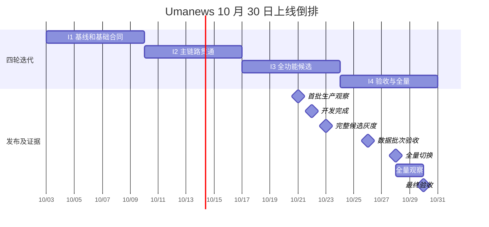
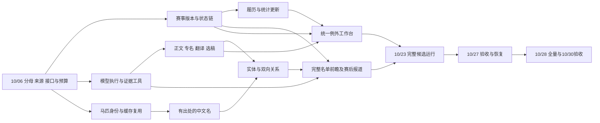

# Umanews 10 月 30 日整体规划与逐项开发任务

> 2026-10-03 已接管执行：派单、会话和实时阶段见 [开发调度](coordination.md) 与 [执行台账](dispatch_state.json)。下文“未开始”为原始计划快照；实际完成以执行台账及相应 SHA、审核和验收证据为准。

编制日期：2026-10-03。全部日期、时刻按 Asia/Shanghai。目标：2026-10-30 18:00 前，本版约定能力完成全量上线和验收；20:00 前完成文档交接。本文是开发与交付计划，不是已经完成的实施记录。

本文是一份式总规划，前半部分说明整体改造目的、范围和排期，后半部分给出全部任务卡与原始差距映射。接手模型先读通用接单合同，再只读指定任务、直接依赖和对应验收用例。产品规格另存 [spec.md](spec.md)，详细能力论证与时序见 [design.md](design.md)，专项验收见 [test_cases.md](test_cases.md)，上线步骤见 [rollout.md](rollout.md)。

## 1 本版要达到的整体效果

读者能够看到干净、准确、重要且地区覆盖更均衡的中文新闻；赛事资料从赛前到赛后自动更新，预测资料限时替换为可信确定资料；近期马匹资料和有出处的中文名优先补齐；新闻、赛事与马匹互相可达。编辑后台主要用于解决例外，正常更新自动完成。QQ 停用；重点赛事增加覆盖全部参赛者的自动前瞻，并复用能力生成有事实依据的赛后报道。

工程上保留 Django、PostgreSQL、Celery 和现有身份、来源、revision、发布证据。新增共用的模型任务、证据查询和异常处理能力，渐进统一赛事决策，不重写全站主干。

| 模块 | 当前理论与实际差距 | 本版改造 | 改造目的及最终可见结果 |
|---|---|---|---|
| 新闻抓取与翻译 | 已有清洗、术语保护、评分和配额；用户仍反馈污染、误判和日本占比过高，缺统一质量基线 | 正文区块与完整性检查、模型专名判断、译后事实核验、按事件选稿、五地区周覆盖、历史影响清单修复 | 少发重复低价值内容，保住重要新闻，姓名/事实准确，五地区持续有优质覆盖 |
| 赛事日历 | 已有状态、来源、版本与覆盖机制；来源能力及自然运行不齐，存在缺行/卡住/显示矛盾 | 九地区主备源、统一决策、预想/确定与待确认/已确认读模型、阶段期限、延期取消退赛、更正与时效账本 | 关键资料按场错误率 <1%，应推进场次卡顿率 <3%；来源给出确定资料后常规 10 分钟/重点 5 分钟内公开 |
| 赛马信息 | 已有采集与暂存；公开覆盖、译名、履历和统计不一致 | 近三年目标优先队列、缓存到公开链、HKJC/认可社区名称、身份/别名统一、全生涯记录、新赛果持续更新 | 近期马匹先可读，现成中文名尽量齐全；未知与 0 区分；生涯不受日历收录范围限制 |
| QQ 和长期 API | QQ 链路完整但用户明确无人使用；现有管理 API 不是外部服务 | 停全部 QQ 发送、重试、按钮和专属依赖；保存长期只读内容 API 合同 | 网站不依赖 QQ 继续运行；未来外部服务可复用稳定 ID、版本和关联 |
| 编辑后台 | 已有编辑、审核和部分组合操作，异常处理仍分散 | 四入口、统一待办、原因聚合、原位证据/差异/预览、手机关键路径、人工修复后自动续跑、并发保护 | 人只处理必要例外，少跳转、少重复输入，修一次后系统继续推进 |
| 模块关联 | 关系表和部分展示已有，自动覆盖及参赛马跳转不足 | 共享实体解析、新闻双向关系、赛事新闻统计/重点排序、名单/赛果马匹跳转、马匹履历与近期新闻 | 新闻→赛事→马匹→生涯/新闻路径可走通，届次和身份不串联 |
| 体验与落地缺口 | 有重复赛事、筛选/标签矛盾、旧首页要求未落实，恢复和用户路径缺统一验收 | 唯一入口、等级一致、近期首页、完整度/空态/更新时间、手机复验、公开内容探针及恢复验证 | 读者得到一致、可解释的资料；设计、部署、实际可用不再混称完成 |
| GPT-6 复杂任务 | 已有单篇翻译/改写，未形成多源自主查询与全名单前瞻 | Responses 适配、受控工具、证据与预算、12 类判断任务、重点赛事前瞻、赛后报道、评测及降级 | 模型能自行补查和汇总；合格结果自动进入业务链；事实有来源、过程可恢复、成本可控制 |

### 1.1 本版必须保留的用户决定

- 新闻先做好日本、中国香港、英国、法国、美国；按周保障优质覆盖，重大事件允许倾斜，不能机械等量或低质凑数。
- 赛事沿用现有公开日历九地区：日本、中国香港、英国、爱尔兰、法国、美国、澳大利亚、德国、中东。充分使用可信第三方和现有 The Racing API，不把官方站点作为唯一确认条件。
- 信息错误率严格 <1%，以一场关键资料有任何错误就算一场错误；流程卡顿率严格 <3%。确定资料到达后的常规 10 分钟、重点 5 分钟是端到端公开时限。
- 近三年参赛马优先，当前赛季、即将登场和近期新闻涉及者优先；2020 年起 G1 全参赛马的名称目标保留，不缩成胜马。
- HKJC 名优先；没有时，一个认可专业社区来源明确使用且身份可核验即可采用，冲突复核。模型、程序、编辑都不得自行翻译或发明马名。
- 自动前瞻先覆盖重点赛事，逐匹核对全部参赛者，缺资料明确说明；质量和成本合格后再扩展。
- QQ 短期停用，外部 API 是内容稳定后的长期服务方向；本版完成 API 合同，不声称服务已开放。

## 2 范围和完全上线的定义

“完全上线”同时满足：代码合入并部署、所列功能在本版目标范围实际启用、自然自动链路产生公开结果、验收通过、恢复交接完整。仅合入代码、仅部署关闭开关、仅完成一次手动补数据均不算。

**功能范围**：八模块表中所有本版改造都进入四轮计划。12 类模型任务全部有明确去向：专名/清洗/翻译/重要性由 N02–N06；现成名由 H04/H05；关联由 L01；研究/冲突由 M04；新闻事实变更由 M09；异常归因由 M10；前瞻由 M05–M07；赛后报道由 M08。异常归因首版仅给有证据的建议并复用已允许恢复动作，不包含任意修改程序或权限。

**数据范围**：不能用“后台程序可运行”冒充资料补齐，也不能承诺无法取得的资料已完整。H01 在 10/06 前固定分母，F06 同日核定吞吐。

| 目标集 | 冻结和动态更新规则 | 10/30 验收内容 |
|---|---|---|
| 近期马匹 | 首次基线为 2023-10-03 至 2026-10-03 参赛的目标；来源为现有九地区已收录赛事及已准入来源可枚举参与者，含未建档对象。上线后按最近三年滚动；截至上线的新参赛/新闻对象增量入队 | 冻结目标逐匹有处理结果；可取得且身份明确的基础资料/近期履历正式公开；当前赛季、即将登场、近期新闻优先。完整早年生涯可持续补齐，但不能标为完整而仅有近期片段 |
| 历史 G1 参赛马名称 | 2020 年起到冻结时点的全部参赛马，含 Jpn1、香港本土一级赛；不含其他 Local G1，保留增量 | 全名单逐一检索有凭据；找到且身份明确的现名完成采纳；无可信名称保留原名并公开覆盖报告，不承诺创造 100% 中文名 |
| 当前赛事 | 所有公开 canonical 赛事进入覆盖账本；实时质量分母为进入跟踪/应推进窗口的场次 | 九地区按能力可持续更新；没有来源身份/未登记也不得从分母消失；缺数据/失败不能排除后算达标 |
| 历史缺陷修复 | F05 复验的固定样例、旧合法公开阻断、明确重复赛事和 N07 影响清单；范围/数量冻结成各自输入包 | 已确认缺陷修复并公开复验；发现范围扩大则列新任务与工期影响，不静默全库重写 |
| 存量新闻关系 | 优先近 90 天、当前重点赛事和本轮修复/重处理文章；全部新发布新闻持续建立关系 | 冻结存量范围完成可靠链接或明确歧义；全部新内容自动关联。更早全历史扫库不作为本版隐含工作 |
| 重点赛事前瞻 | 首版建议现有明确重点标记 ∪ 日历 G1/Jpn1/香港本土一级赛；F01 固定实际名单和标记规则 | 对上线范围内有发布窗口的目标逐场自动研究，名单覆盖 100%；没有真实比赛窗口的地区用回放验证并说明自然证据缺口 |

上表滚动窗口、存量新闻 90 天、首批重点赛事规则是为排期给出的**建议默认值**，不是伪装成用户早先已确认的数字。F01/H01 在各自 DDL 输出最终配置和分母，若显著改变结果按根 [AGENTS.md](../../../AGENTS.md) 处理；本轮不因此暂停规划。

保留的长期事项仅有公开 API 服务、前瞻扩展到非重点赛事、无界的全世界马匹/全历史新闻补齐和任意自动改代码代理。它们不占用本版工期，也不被写成 10/30 已完成。若 F06 证明冻结数据规模无法在额度内处理，须在 10/06 报告容量缺口并调整资源；不能到 10/30 将目标改名为“能力上线”来掩盖原定批次未完成。

## 3 四个迭代与倒排日期

排期资源已由用户确认：**3 条开发工作线并行，独立审核与发布协调另行保障**。A 负责赛事/资料管线，B 负责新闻/模型/名称来源，C 负责页面/关联/后台，R 表示独立审核与发布协调，不计为第四条功能开发线。R 中的运维与测试可由不同负责人并行承担，但同一生产窗口只由一个发布协调人操作。

估算单位是“工程专注小时”，包括读代码、相关 RED/GREEN、实现、局部复验和常规返修，不是模型调用耗时，也不是已测得的人天。排期假设 10/03–10/30 各日均可安排模型开发，每条线每天可用 8 小时、计划最多安排 6 小时，其余用于集成/等待/不可预测返修；人工审核窗口需另行保障。若只按工作日或只单线开发，本排期不可直接套用。F06 必须用首批实绩校准。

| 迭代 | 日期 | 目标 | 退出条件 |
|---|---|---|---|
| I1 基线和基础合同 | 10/03–10/09 | 冻结分母、来源与接口；搭模型/证据基础；完成 QQ 停用代码、独立页面修复和恢复缺陷修复 | 10/09 18:00：接口可并行使用，外部能力风险有结论；独立样例/恢复测试通过；不宣称生产已改 |
| I2 主链路贯通 | 10/10–10/16 | 赛事时效和异常、新闻清洗/翻译、正式马匹资料、中文名、双向关系及后台待办 | 10/16 18:00：隔离环境从输入到公开候选贯通，幂等/冲突/更正与权限合同通过 |
| I3 全功能候选 | 10/17–10/23 | 选稿周覆盖、完整前瞻/赛后稿、资料批次、全部页面和后台续跑；首批生产运行 | 10/22 18:00 功能开发完成；10/23 12:00 完成候选审核；10/23 18:00 完整候选灰度上线，进入七天观察 |
| I4 验收和全量上线 | 10/24–10/30 | 执行已冻结数据批次，修复观察问题，压测/恢复/用户验收，全量切换 | 10/27 RC 通过；10/28 18:00 全量；10/30 18:00 完成 48 小时全量观察与最终验收 |



**从 DDL 倒推的硬约束**：10/30 的有效观察要求 10/28 已全量；全量要求 10/27 已有固定候选和恢复证据；七天/地区周覆盖观察要求 10/23 完整候选已运行、10/21 新闻主链先开始；这要求 10/22 完成开发、10/16 主链联调通过、10/06 明确来源与数据吞吐。日期不是额外人工门禁，授权统一按根 AGENTS.md。

10/23 以后只进行必要缺陷修复、参数收敛、批准批次与验收，不再接入新的产品范围。若关键修复需要 10/28 后重新发布并重启稳定观察，不能继续宣称已满足原 10/30 完全上线目标。提出具体影响和调整，不隐瞒风险。

## 4 工作线和关键依赖



共享文件管理：`models.py` 和 migrations 的结构变更由 A 线汇总顺序；`tasks.py`/`settings.py` 按独立函数/配置块拆最小补丁，由集成人按依赖顺序合入；`views.py`/公开和后台模板由 C 线统一写入，A/B 输出服务合同与字段。任何接手模型都不覆盖其他线改动；任务引用同一文件不代表可以无锁同时重写。每个代码任务一个小 PR 或可单独审阅的提交，不机械要求一个任务一个大 PR。

无需让正常内容逐条人工审批。业务校验通过即可在已启用范围自动推进；身份/来源冲突、事实不确定和不可恢复错误进入统一待办。人工修复后续跑仍走同一版本/幂等机制。扩大来源、真实付费或生产操作按根 AGENTS.md，排期文档本身不等于已获具体发布授权。

## 5 验收口径与发布判定

详细可执行场景见 [test_cases.md](test_cases.md)。下面数字除用户已确认的 <1%/<3%/5/10 分钟外，是**本计划建议的首版验收线**，F01/F06 应结合固定样例明确，不以随意降低门槛吸收延期。

| 能力 | 建议验收线 | 证据和时间 |
|---|---|---|
| 赛事正确性 | 按场关键资料错误率严格 <1%；伪造确定、同马错配、漏报已确认取消等重大错误为 0 | 至少 300 场独立回放，九地区各至少 20；自然观察全部应推进场次另报，不能混入历史成功样本稀释 |
| 赛事流转 | 应推进场次至少一次错过期限的比例严格 <3%；资料替换常规 ≤10 分钟、重点 ≤5 分钟 | 阶段与来源两种时钟；记录来源首发时间或区间。自然窗口从 10/23 开始、全量窗口 10/28–30；长期滚动 28 天仍持续观察 |
| 正文与翻译 | 保留集关键事实错误/错马/自造名 0；正文污染文章比例 <1%、关键段落误删 0；实体精确率建议 ≥99%、召回率 ≥97% | 五地区至少 100 篇固定样例，包含未发布/失败稿；人工标注与程序校验联合，阈值不等于模型置信分 |
| 新闻价值与均衡 | 预先标记的重大事件漏报 0；各地区当周合格重要事件覆盖建议 ≥90%，无合格新闻如实说明 | 周目标建议每地区至少 3 个独立合格事件，有重大事件则倾斜；不能凑数；分开报告候选、公开和曝光 |
| 赛马资料与译名 | 冻结目标处理去向 100% 可解释；可取得且身份明确的资料完成公开；所有采用中文名有出处，自造名 0 | H10/H11 对账原始目标与公开页面；未知、冲突、暂存、运行失败单列，不能把其中任何一种记为公开完成 |
| 前瞻与赛后稿 | 前瞻当前名单逐马处理 100%，额外/漏掉马匹 0；关键事实有真实证据，发布时名单/赛事状态一致 | 至少 20 场固定重点赛事样例，并逐篇核验灰度真实稿；赛后不凭名次虚构赛况 |
| 关联 | 固定样例错实体/错届次/撤回后残留链接 0；公开导航全路径通过 | 三类页面、分页、后台修复、新对象补链、非日历履历各有样例 |
| 后台 | 六条高频任务可完成且关键例外可自动续跑；建议中位操作时间下降 ≥30%，正常合格任务自动完成率 ≥90% | 与 F04 相同任务比较；若业务质量未过，不能用效率改善抵消；缺基线必须补测 |
| 运维与 QQ | 恢复演练、旧版本兼容、探针停摆检测通过；QQ 自动/手动/重试发送均为 0 | 隔离测试与生产运行证据分开；实际 QQ 零发送用运行账本证明，不发测试消息 |

少样本零错误不代表长期 <1%。例如 30 场零错误只报告 0/30 及观察窗口；不得宣称统计上已证明长期达标。上线判定结合固定异常回放、所有实际目标的自然观察、缺失率和未解决重大问题；任何不足需在最终报告显式说明。28 天目标从启动后继续滚动，不在 10/30 伪造 28 天证据。

## 6 默认业务参数与首轮定值任务

| 参数 | 排期用默认值或处理方式 | 定值责任和 DDL |
|---|---|---|
| 出马表阶段期限 | T−60 分钟预警，T−30 分钟仍无确定资料进入异常；地区来源窗口单独配置 | F01/F03，10/05；本地赛日无精确时刻不造 00:00 |
| 正常赛果阶段期限 | 可信实际开跑优先，缺实际时刻用已确认计划时刻作调度锚点；T+30 分钟仍待确认进入超时，审议原因另记 | F01，10/04；不得假称计划时刻等于实际发车 |
| 前瞻出稿与更新 | 建议 T−24 小时研究/预想稿、确定名单到达后更新、T−60 分钟最终复验；不足窗口只发已核验稿，开赛后禁补发旧前瞻 | F01/M05，10/04 锁定配置合同，10/20 验证 |
| 模型和工具预算 | 逐任务 token、请求次数、墙钟时间、每日金额上限必须配置；前瞻建议最多 60 次工具读取/20 分钟，单篇审校最多 3 轮；额度不足退出并记录缺口 | M02 实现 10/07；F06 在 10/06 用账号与单价锁定金额，不在文档猜测费用 |
| 历史数据批次 | 固定 SHA/对象清单，单批大小按锁时长、恢复与来源预算测量，禁止大事务整库写入 | H09，10/21；F06 已在 10/06 证明总吞吐可行 |
| 独立探针 | 建议 1 分钟心跳、连续 3 次缺失产生异常；公开关键版本探针频率要满足重点 5 分钟目标 | O03/R05，10/12；以真实负载验证，不能让探针自身积压 |

## 7 工期风险与处理日期

| 风险 | 最早检查点 | 处理要求 |
|---|---|---|
| 三条线实际不可持续或审核缺人 | F06，10/06 | 用已完成切片速度重估剩余工时；优先增加执行/审核容量或削减纯视觉修饰，不暗中删核心功能 |
| 九地区可信源能力不齐/额度不足 | F03/F06，10/05–06 | 明确哪格缺证、可用备用和适配工作量；按地区拆额外切片；若无法覆盖需报告 10/30 风险，不能仅关闭该地区后称全量 |
| 近期/历史名称数据量过大 | H01/F06，10/06 | 先复用缓存，测量保守吞吐，保留近期优先和历史处理配额；不能缩成胜马或只算 staging |
| 模型效果/费用不合格 | F02/M01 早期评测，M11 最迟 10/26 | 对困难任务分流、共享证据、限制重复查询；不以更高置信分代替事实准确性 |
| 旧数据恢复或 schema 不兼容 | O02，10/09；O04，10/15 | 在副本闭合后才进入对应生产包；禁止把灾备缺陷留到 10/28 首次验证 |
| 合成稿引用展示与旧新闻隐藏来源冲突 | F01，10/04 | 首版默认受控自有查询工具；如果采用内置 Web Search 的信息用于公开稿，落实官方要求的可点击引用展示，再进入该路径 |
| 自然比赛样本不足 | O05，10/21 起 | 全量记录自然样本，并用九地区保留回放补故障覆盖；分别报告，不编造自然比赛或 28 天达标证据 |
| 最后两天发生关键回退 | V06，10/28–30 | 重新计算有效观察时长并报告 DDL 影响；不得压缩必要观察后伪报完全上线 |

以上属于计划风险和技术检查。人工确认规则只引用根 AGENTS.md；本文件不复制或增设 G1/G2/G3。

## 8 证据基线与接手要求

本规划依据 2026-10-02 的 [代码与实访基线](../../reports/2026-10-02-current-capabilities.md)、[历史待办对照](../../reports/2026-10-02-backlog-evidence-reconciliation.md)、本地代码及 [八模块设计](design.md)。基线代码为 `fc1eed938beb8b431e0d4b37953f7599a40a72ce`，本规划未重新宣称生产与该 SHA 一致。开发开始必须对当前主线和实际运行重新核对；不得重做其他线程已经交付的修复。

每个任务的“完成”要附对应证据；代码任务交付必要的测试、最小实现和验证，数据任务交付固定输入、前后差异与公开结果，运维任务交付真实执行和恢复证据。任务状态当前全部为未开始；已存在的基础能力只用于复用，不把规划落盘当工程完成。

## 9 工作量与容量核对

共 **100 张任务卡**，全部有依赖、责任、估算、DDL 和完成条件。以下是初步工程估算，尚未由开发实绩验证。A/B/C 每轮 7 个日历日，计划容量各 42 小时，可用上限各 56 小时；剩余空间用于审核返修和不确定性。R 为独立审核/发布协作，不可挤占为额外功能开发容量。

| 迭代 | 任务数 | A 赛事资料 | B 新闻模型 | C 页面后台 | R 审核发布 | 三线计划余量合计 |
|---|---:|---:|---:|---:|---:|---:|
| I1 | 22 | 31h | 23h | 23h | 11h | 49h |
| I2 | 29 | 42h | 27h | 33h | 8h | 24h |
| I3 | 29 | 31h | 35h | 27h | 14h | 33h |
| I4 | 20 | 22h | 19h | 15h | 27h | 70h |

三条开发线合计 **328 小时**，独立审核/发布合计 **60 小时**。这些数字不是“保证这么多小时完成”；尤其九地区来源缺口、数据规模和模型质量存在外部变量，F06 在 10/06 必须校准。修复预留任务 R14/E06 等只有发现问题才产生代码，否则交观察证据。

数据抓取/模型运行的墙钟等待不等于工程工时：F06 单独估算剩余请求、配额和吞吐；H10/H11 的 5 小时指批次操作与核验投入，不代表无论多少马都能在 5 小时抓完。各卡起始日允许做不依赖前项的准备，依赖结果就绪前不能完成相应集成。相同日期有依赖时按上游→下游顺序执行，并在派单时落实半日时段；硬时刻已特别标注。

共享任务不重复估算：AG-03 的业务接入计入 N/H/L；AG-04 的资料规则计入 R；UG-04 的资料一致性计入 R/H。51 项 Gap 不等于 51 个独立工程。

## 10 次级模型接单合同

每张任务卡是一项可审阅交付。默认沿用当前仓库原生流程；任务中的新服务/字段是待实现建议，不能假设已存在。先核对最新主线和其他线程已交付范围，若本卡部分已完成，复验证据后只补差距。

1. 读取根 AGENTS.md、session_bootstrap、本规划的范围/接口/验收、指定任务和直接依赖。以实际代码定位，入口是阅读起点，不是让模型重写整份文件。
2. 输出本卡责任、将改的文件/函数、数据与接口影响；共享文件遵循第 4 节归属。模型不是独自在仓库工作，不得撤销、覆盖或清理其他工作线的内容。
3. 按卡片顺序取得必要 RED，完成最小实现与 GREEN/重构，再做影响回归。文档/只读验收任务用对应解析、查询或证据核对，不人为制造失败测试。
4. 本卡交付 commit/PR 或运行产物、测试结果、相关基线失败说明及下游可消费合同；独立审核通过后由集成人处理共享主线。实际交付和生产动作统一按根 AGENTS.md。
5. 进度不能只报百分比：报已完成什么、还缺什么证据、阻断是否影响 DDL。发现超过一个工作日的新切片，及时拆分并更新依赖及容量，不把额外范围塞入“顺手修复”。

复制给执行模型的模板：

```text
接手 Umanews 10 月 30 日版本任务 <ID>。
先读根 AGENTS.md 和 docs/session_bootstrap.md，再读
docs/changes/next-version-capabilities/tasks.md 的总范围、通用接单合同、<ID> 及直接依赖；
读该卡指向的 test_cases.md 用例与代码入口。
你只负责该卡行为、必要测试和相关文件；仓库中还有其他开发线，禁止覆盖或撤销他们的修改。
先核对当前主线/工作树及依赖的实际完成证据，不把文档计划当已实现。
按卡片的测试→实现→验证执行；必要行为测试先 RED 再 GREEN。
在卡片 DDL 前交付可独立审核的最小变更、测试证据、兼容/迁移说明和下游接口。
生产、付费、合并及发布的授权只按根 AGENTS.md；本次派单的实际范围由发送者说明。
若依赖缺失，先做独立准备并明确影响，不通过伪造数据或放宽阈值绕过。
```

## 11 全部任务与逐项 DDL

状态初始全部为“未开始”。这里的截止日期是计划目标；任务完成必须满足卡片的结果与证据要求。表中的 R 工作线包含独立审核和发布协调两种职责，生产操作同一时刻只有一个协调人。

### 迭代 1 任务索引

| ID | 工作线 | 交付 | 估算小时 | DDL 北京时间 | 前置任务 |
|---|---|---|---:|---|---|
| [F01](#f01) | A | 冻结跨模块字段及首版产品参数 | 4 | 2026-10-04 18:00 | — |
| [F04](#f04) | C | 冻结编辑后台关键任务与交互原型 | 4 | 2026-10-04 18:00 | — |
| [F03](#f03) | A | 盘点九地区主备来源与现有 TRA 套餐 | 5 | 2026-10-05 18:00 | F01 |
| [F02](#f02) | B | 建立新闻漏斗与模型黄金样例 | 5 | 2026-10-05 18:00 | — |
| [F05](#f05) | C | 复验域名与公开缺陷并固定回归样例 | 3 | 2026-10-05 18:00 | — |
| [H01](#h01) | A | 生成近三年与历史 G1 全参赛马目标集 | 5 | 2026-10-06 18:00 | F01 |
| [M01](#m01) | B | 增加 GPT-6 Responses 适配及结构输出 | 5 | 2026-10-06 18:00 | F01, F02 |
| [Q01](#q01) | C | 关闭 QQ 全发送路径并解耦网页发布 | 3 | 2026-10-06 18:00 | F01 |
| [F06](#f06) | R | 核定数据量、预算和迭代可行性 | 4 | 2026-10-06 18:00 | F01, F02, F03, H01 |
| [O01](#o01) | R | 冻结集成与发布资源安排 | 3 | 2026-10-06 18:00 | F01 |
| [R01](#r01) | A | 实现阶段与端到端时效账本 | 4 | 2026-10-07 18:00 | F01, F03 |
| [M02](#m02) | B | 实现有界多轮任务执行与恢复 | 5 | 2026-10-07 18:00 | M01 |
| [Q02](#q02) | C | 移除 QQ 使用入口及专属运行依赖 | 2 | 2026-10-07 18:00 | Q01 |
| [R02](#r02) | A | 提取统一纯决策并接入影子比较 | 4 | 2026-10-08 18:00 | R01 |
| [M03](#m03) | B | 封装内部查询与证据读取工具 | 4 | 2026-10-08 18:00 | M02, F03 |
| [U01](#u01) | C | 统一赛事等级筛选与卡片标签 | 3 | 2026-10-08 18:00 | F05 |
| [H02](#h02) | A | 复用缓存与强身份建立补全输入包 | 4 | 2026-10-09 18:00 | H01, F03 |
| [R03](#r03) | A | 实现赛前赛后成熟度统一读模型 | 5 | 2026-10-09 18:00 | R02 |
| [N01](#n01) | B | 保存正文区块与清洗差异 | 4 | 2026-10-09 18:00 | F02 |
| [O02](#o02) | C | 修复已知备份恢复约束问题 | 5 | 2026-10-09 18:00 | O01 |
| [U02](#u02) | C | 补齐近期赛事首页与详情旧交互要求 | 3 | 2026-10-09 18:00 | F05 |
| [V01](#v01) | R | 迭代一接口与失败路径验收 | 4 | 2026-10-09 18:00 | F06, H02, R03, M03, N01, Q02, U01, U02, O02 |

### 迭代 2 任务索引

| ID | 工作线 | 交付 | 估算小时 | DDL 北京时间 | 前置任务 |
|---|---|---|---:|---|---|
| [R04](#r04) | A | 按成熟度与新鲜度实现主备源仲裁 | 5 | 2026-10-11 18:00 | V01 |
| [N02](#n02) | B | 接入正文污染审查与模板变化检测 | 4 | 2026-10-11 18:00 | N01, M03 |
| [E01](#e01) | C | 统一自动处理恢复与人工例外分类 | 4 | 2026-10-11 18:00 | F04, R02 |
| [H06](#h06) | C | 统一名称展示搜索与更名追踪 | 4 | 2026-10-11 18:00 | F01, H02 |
| [R05](#r05) | A | 调度明确资料替换期限与容量预留 | 5 | 2026-10-12 18:00 | R04, R01 |
| [R11-HK](#r11-hk) | A | 中国香港来源合同与解析缺口切片 | 2 | 2026-10-12 18:00 | R04, F03 |
| [R11-JP](#r11-jp) | A | 日本来源合同与解析缺口切片 | 2 | 2026-10-12 18:00 | R04, F03 |
| [N03](#n03) | B | 接入上下文实体识别和专名保护 | 5 | 2026-10-12 18:00 | N02, M03 |
| [E02](#e02) | C | 实现统一待办列表与原因详情 | 4 | 2026-10-12 18:00 | E01 |
| [O03](#o03) | C | 建设队列外公开结果与执行健康探针 | 4 | 2026-10-12 18:00 | R01, O01 |
| [R06](#r06) | A | 贯通延迟改期取消及旧任务失效 | 4 | 2026-10-13 18:00 | R05 |
| [N04](#n04) | B | 加入译后事实审校与有界修复 | 4 | 2026-10-13 18:00 | N03 |
| [L01](#l01) | C | 实现共享实体及赛事届次解析 | 4 | 2026-10-13 18:00 | N03, F01 |
| [R07](#r07) | A | 统一退赛非完赛并列与完整名单核验 | 4 | 2026-10-14 18:00 | R04, R03 |
| [H04](#h04) | B | 补齐 HKJC 现成译名和名称证据 | 4 | 2026-10-14 18:00 | N03, H02 |
| [L02](#l02) | C | 建立双向关系更新与更正传播 | 4 | 2026-10-14 18:00 | L01 |
| [R08](#r08) | A | 原子发布资料更正与统一缓存失效 | 5 | 2026-10-15 18:00 | R06, R07 |
| [R11-GB](#r11-gb) | A | 英国来源合同与解析缺口切片 | 2 | 2026-10-15 18:00 | R07, F03 |
| [R11-IE](#r11-ie) | A | 爱尔兰来源合同与解析缺口切片 | 2 | 2026-10-15 18:00 | R07, F03 |
| [H05](#h05) | B | 接入认可社区名称提取与冲突处理 | 5 | 2026-10-15 18:00 | H04, M03 |
| [U03](#u03) | C | 修复重复赛事身份和旧链接去向 | 4 | 2026-10-15 18:00 | F05, L02 |
| [O04](#o04) | R | 验证备份恢复与队列容量边界 | 4 | 2026-10-15 18:00 | O02, R05, M02 |
| [H03](#h03) | A | 打通基础档案及可独立存在的生涯记录 | 5 | 2026-10-16 18:00 | H02 |
| [R09](#r09) | A | 审计历史结果公开依据与兼容修复 | 4 | 2026-10-16 18:00 | R08 |
| [R11-FR](#r11-fr) | A | 法国来源合同与解析缺口切片 | 2 | 2026-10-16 18:00 | R07, F03 |
| [M04](#m04) | B | 实现多源研究与冲突候选输出 | 5 | 2026-10-16 18:00 | M03, R04 |
| [L03](#l03) | C | 增加新闻标签及赛事马匹跳转 | 3 | 2026-10-16 18:00 | L02, H06 |
| [Q03](#q03) | C | 形成长期只读内容 API 合同 | 2 | 2026-10-16 18:00 | F01, L02 |
| [V02](#v02) | R | 迭代二端到端候选验收 | 4 | 2026-10-16 18:00 | R09, H03, H05, M04, L03, Q03, E02, O04, R11-JP, R11-HK, R11-GB, R11-IE, R11-FR |

### 迭代 3 任务索引

| ID | 工作线 | 交付 | 估算小时 | DDL 北京时间 | 前置任务 |
|---|---|---|---:|---|---|
| [R10](#r10) | A | 完成策略换代与持续跟踪恢复 | 4 | 2026-10-18 18:00 | V02 |
| [N05](#n05) | B | 按事件重要性和新增事实选择新闻 | 4 | 2026-10-18 18:00 | V02 |
| [L04](#l04) | C | 实现赛事相关新闻统计与重点排序 | 4 | 2026-10-18 18:00 | V02, L02 |
| [R11](#r11) | A | 汇总九地区适配与能力验收矩阵 | 2 | 2026-10-19 18:00 | R10, F03, R11-JP, R11-HK, R11-GB, R11-IE, R11-FR, R11-US, R11-AU, R11-DE, R11-ME |
| [R11-AU](#r11-au) | A | 澳大利亚来源合同与解析缺口切片 | 2 | 2026-10-19 18:00 | V02, F03 |
| [R11-DE](#r11-de) | A | 德国来源合同与解析缺口切片 | 2 | 2026-10-19 18:00 | V02, F03 |
| [R11-ME](#r11-me) | A | 中东来源合同与解析缺口切片 | 2 | 2026-10-19 18:00 | V02, F03 |
| [R11-US](#r11-us) | A | 美国来源合同与解析缺口切片 | 2 | 2026-10-19 18:00 | V02, F03 |
| [M09](#m09) | B | 将新闻事实转为资料变更候选 | 4 | 2026-10-19 18:00 | M04, R08, L01 |
| [N06](#n06) | B | 实施五地区周覆盖与来源健康调节 | 4 | 2026-10-19 18:00 | N05, F02 |
| [L05](#l05) | C | 完善马匹全生涯与近期新闻导航 | 4 | 2026-10-19 18:00 | L04, H03 |
| [H08](#h08) | A | 将新赛果和更正持续同步到履历统计 | 5 | 2026-10-20 18:00 | R08, H03, V02 |
| [M05](#m05) | B | 建立全参赛者前瞻资料表 | 4 | 2026-10-20 18:00 | M04, N06, H05 |
| [H07](#h07) | C | 修正完整度主胜鞍与统计展示 | 4 | 2026-10-20 18:00 | H03, H06 |
| [H09](#h09) | A | 准备可恢复的数据修复与补齐批次 | 4 | 2026-10-21 18:00 | H08, H05, U03, R09 |
| [M06](#m06) | B | 生成带事实出处的重点赛事前瞻 | 5 | 2026-10-21 18:00 | M05 |
| [E03](#e03) | C | 完成原位编辑证据差异与预览 | 5 | 2026-10-21 18:00 | E02, N04, H05, R03 |
| [O05](#o05) | R | 首批核心链路生产灰度及自然观察 | 4 | 2026-10-21 18:00 | V02, R11, H05, N06, L05, O03, O04 |
| [R12](#r12) | A | 完成跨来源与异常回放验收集 | 4 | 2026-10-22 18:00 | R11, H08 |
| [R13](#r13) | A | 接通真实公开时延与阶段质量面板 | 4 | 2026-10-22 18:00 | R12, O03 |
| [M07](#m07) | B | 实现前瞻发布前复验与增量更正 | 4 | 2026-10-22 18:00 | M06, R06, L02 |
| [M08](#m08) | B | 实现赛后综合报道 | 4 | 2026-10-22 18:00 | M06, R08 |
| [M10](#m10) | B | 提供异常证据归因与恢复建议 | 4 | 2026-10-22 18:00 | M04, E02 |
| [N07](#n07) | B | 生成历史污染与误译重处理候选 | 2 | 2026-10-22 18:00 | N02, N04 |
| [E04](#e04) | C | 实现人工修复后自动续跑与字段保护 | 4 | 2026-10-22 18:00 | E03, L02 |
| [E05](#e05) | C | 打通自动完成与技术恢复的后台闭环 | 4 | 2026-10-22 18:00 | E04, R10, N06 |
| [U04](#u04) | C | 统一缺失失败新鲜度及订阅文案 | 2 | 2026-10-22 18:00 | H07, L05, R03 |
| [O06](#o06) | R | 发布完整候选并开始七天验收窗口 | 4 | 2026-10-23 18:00 | V03, O05, Q02, H09 |
| [V03](#v03) | R | 功能冻结与独立集成审核 | 6 | 2026-10-23 12:00 | R13, M07, M08, M09, M10, N07, H09, L05, H07, E05, U04 |

### 迭代 4 任务索引

| ID | 工作线 | 交付 | 估算小时 | DDL 北京时间 | 前置任务 |
|---|---|---|---:|---|---|
| [H10](#h10) | A | 完成近期优先目标的正式公开批次 | 5 | 2026-10-25 18:00 | O06, H09 |
| [R14](#r14) | A | 修复自然观察暴露的资料时效问题 | 4 | 2026-10-25 18:00 | O06, R13 |
| [E06](#e06) | C | 验证后台六条高频路径并修复交互阻碍 | 4 | 2026-10-25 18:00 | O06, E05 |
| [L06](#l06) | C | 补齐存量关系并验收跨页导航 | 4 | 2026-10-25 18:00 | O06, L05, H09 |
| [O07](#o07) | R | 验证完整候选回滚与恢复交接 | 4 | 2026-10-25 18:00 | O06, O04 |
| [H11](#h11) | A | 完成历史 G1 全参赛马名称检索与采纳批次 | 5 | 2026-10-26 18:00 | H10, H05 |
| [M11](#m11) | B | 完成模型质量时延成本对照与参数收敛 | 6 | 2026-10-26 18:00 | O06, F02, M08, M10 |
| [N08](#n08) | B | 完成污染和误译清单的受控重处理 | 6 | 2026-10-26 18:00 | O06, N07 |
| [V04](#v04) | R | 执行真实用户旅程和保留样例验收 | 4 | 2026-10-26 18:00 | O06 |
| [R15](#r15) | A | 执行断源与积压恢复演练 | 4 | 2026-10-27 18:00 | R14, H11 |
| [N09](#n09) | B | 验收五地区周覆盖与重要事件保留 | 4 | 2026-10-27 18:00 | N08, N06, O05 |
| [U05](#u05) | C | 完成域名手机空态与性能复验 | 4 | 2026-10-27 18:00 | L06, E06, U04 |
| [V05](#v05) | R | 固定全量发布候选并独立复审 | 4 | 2026-10-27 18:00 | H11, R15, N09, M11, L06, E06, U05, O07, V04 |
| [M12](#m12) | B | 验证模型降级与最终发布配置 | 3 | 2026-10-28 12:00 | M11, N09 |
| [E07](#e07) | C | 验收自动完成率与人工干预收益 | 3 | 2026-10-28 12:00 | E06, U05, R15 |
| [O08](#o08) | R | 执行全量上线与公开范围核验 | 4 | 2026-10-28 18:00 | V05, M12, E07 |
| [R16](#r16) | A | 复核全量赛事质量与剩余数据缺口 | 4 | 2026-10-30 12:00 | O08, R15 |
| [O09](#o09) | R | 完成维护交接与长期事项归档 | 2 | 2026-10-30 20:00 | V07 |
| [V06](#v06) | R | 完成全量运行的 48 小时观察 | 6 | 2026-10-30 18:00 | O08 |
| [V07](#v07) | R | 汇总最终验收及逐任务完成证据 | 3 | 2026-10-30 18:00 | V06, R16 |

## 迭代 1 任务卡

<a id="f01"></a>

### F01 (integration) 冻结跨模块字段及首版产品参数

- **排期**：2026-10-03 至 2026-10-04；**DDL：2026-10-04 18:00 Asia/Shanghai**；工作线 A；估算 4 工程小时；状态：未开始。
- **依赖与追溯**：无前置开发依赖；覆盖 RG-01, RG-03, HG-05, AG-01, EG-02。
- **阅读入口与责任边界**：[design.md](design.md)、[spec.md](../race-event-unified-decision/spec.md)、[models.py](../../../server/stable/models.py)。仅负责本卡行为及必要合同；共享文件按下文集成规则排队，其他工作线的改动必须保留。
- **测试**：用普通词马名、同名异马、确定名单与预想名单冲突、未知值四组输入验证类型能表达；不把提供方与成熟度合并为一个 official 布尔值。
- **实现**：将身份、资料成熟度、来源证据、input_version、下一动作、异常原因、手动保护字段写为共享类型；补迁移/索引草图。采用总规划的默认参数，逐项标注已确认与建议；10/04 锁定首批重点赛事选择规则、社区来源清单和预算配置入口。
- **验证和完成条件**：输出接口样例和兼容策略；A/B/C 均可据此独立实现；仍未知的外部额度有负责人及 10/06 处理结论。
- **交付物**：相应最小变更/运行产物、相关回归与失败证据、影响范围说明；接手者按统一接单模板提交复核，不自行扩展生产动作。

<a id="f04"></a>

### F04 (application) 冻结编辑后台关键任务与交互原型

- **排期**：2026-10-03 至 2026-10-04；**DDL：2026-10-04 18:00 Asia/Shanghai**；工作线 C；估算 4 工程小时；状态：未开始。
- **依赖与追溯**：无前置开发依赖；覆盖 EG-01, UG-05。
- **阅读入口与责任边界**：[views.py](../../../server/stable/views.py)、[admin.py](../../../server/stable/admin.py)、[dashboard.html](../../../server/stable/templates/stable/console/dashboard.html)、[article_editor.html](../../../server/stable/templates/stable/console/article_editor.html)。仅负责本卡行为及必要合同；共享文件按下文集成规则排队，其他工作线的改动必须保留。
- **测试**：使用相同样例操作旧流程，区分已有保存发布合一与真正冗余；无登录证据时标记待实测，不伪造耗时。
- **实现**：记录找待办、核对差异、改正文、改名称、处理赛事冲突、修复后续跑六条现有路径的步骤/耗时；画出待处理、内容、资料、自动化四入口及手机原型。
- **验证和完成条件**：形成前后操作对照和组件清单；关键动作不依赖桌面宽表或多次跳页。
- **交付物**：相应最小变更/运行产物、相关回归与失败证据、影响范围说明；接手者按统一接单模板提交复核，不自行扩展生产动作。

<a id="f03"></a>

### F03 (integration) 盘点九地区主备来源与现有 TRA 套餐

- **排期**：2026-10-04 至 2026-10-05；**DDL：2026-10-05 18:00 Asia/Shanghai**；工作线 A；估算 5 工程小时；状态：未开始。
- **依赖与追溯**：[F01](#f01)；覆盖 RG-02。
- **阅读入口与责任边界**：[race_data_sync_providers.py](../../../server/stable/services/race_data_sync_providers.py)、[race_source_identity.py](../../../server/stable/services/race_source_identity.py)、[race_data_sync_enrollment.py](../../../server/stable/services/race_data_sync_enrollment.py)、[test_race_multisource_identity.py](../../../server/stable/test_race_multisource_identity.py)。仅负责本卡行为及必要合同；共享文件按下文集成规则排队，其他工作线的改动必须保留。
- **测试**：验证一个合格第三方即可给出确定资料；空响应、只给前三名和镜像转载不能冒充完整独立来源。
- **实现**：按地区×赛程/名单/退赛/结果/更正记录可用端点、稳定身份、更新时刻、最终状态语义、速率和现有权限；每格给主源、备源或缺口，输出固定回放证据。
- **验证和完成条件**：九地区矩阵无空白格；缺能力项有修复归属和最迟 10/06 可行性结论；不得以付费事实推断端点覆盖。
- **交付物**：相应最小变更/运行产物、相关回归与失败证据、影响范围说明；接手者按统一接单模板提交复核，不自行扩展生产动作。

<a id="f02"></a>

### F02 (integration) 建立新闻漏斗与模型黄金样例

- **排期**：2026-10-03 至 2026-10-05；**DDL：2026-10-05 18:00 Asia/Shanghai**；工作线 B；估算 5 工程小时；状态：未开始。
- **依赖与追溯**：无前置开发依赖；覆盖 NG-01, NG-07, AG-07。
- **阅读入口与责任边界**：[article_content.py](../../../server/stable/services/article_content.py)、[international.py](../../../server/stable/adapters/international.py)、[automation.py](../../../server/stable/services/automation.py)、[publishing_windows.py](../../../server/stable/services/publishing_windows.py)、[test_news_content_boundaries.py](../../../server/stable/test_news_content_boundaries.py)。仅负责本卡行为及必要合同；共享文件按下文集成规则排队，其他工作线的改动必须保留。
- **测试**：每地区至少 20 篇，共至少 100 篇；包含广告、误删、普通词、重复报道和重大消息。检查分母同时覆盖未发布和失败文章。
- **实现**：只读统计五地区抓取、清洗、翻译、选择、公开和曝光；按失败原因拆解 JRA 倾斜。保存脱敏的原文/正确实体/重要事件标注，固定训练样例与保留验收集。
- **验证和完成条件**：交付基线表、固定 fixture 与标注指南；明确实际生产配置与代码默认值的差异。
- **交付物**：相应最小变更/运行产物、相关回归与失败证据、影响范围说明；接手者按统一接单模板提交复核，不自行扩展生产动作。

<a id="f05"></a>

### F05 (application) 复验域名与公开缺陷并固定回归样例

- **排期**：2026-10-04 至 2026-10-05；**DDL：2026-10-05 18:00 Asia/Shanghai**；工作线 C；估算 3 工程小时；状态：未开始。
- **依赖与追溯**：无前置开发依赖；覆盖 UG-01, UG-02, UG-03。
- **阅读入口与责任边界**：[views.py](../../../server/stable/views.py)、[race_detail.html](../../../server/stable/templates/stable/public/race_detail.html)、[horse_detail.html](../../../server/stable/templates/stable/public/horse_detail.html)、[detail.html](../../../server/stable/templates/stable/public/detail.html)。仅负责本卡行为及必要合同；共享文件按下文集成规则排队，其他工作线的改动必须保留。
- **测试**：重测美艺力量 45 条分页、已消失的新闻污染和前导零，防止将已关闭问题重新计入。
- **实现**：复验域名、凯旋门重复、德国 G1 筛选、兰秀赛果、女皇杯缺行、三个马匹统计例；为每例保留 URL、对象 ID、时间和实际结果。
- **验证和完成条件**：每项标明复现/未复现/待证；域名目标从现有部署配置核实，未知时给出待决项而非自行改站点。
- **交付物**：相应最小变更/运行产物、相关回归与失败证据、影响范围说明；接手者按统一接单模板提交复核，不自行扩展生产动作。

<a id="h01"></a>

### H01 (integration) 生成近三年与历史 G1 全参赛马目标集

- **排期**：2026-10-04 至 2026-10-06；**DDL：2026-10-06 18:00 Asia/Shanghai**；工作线 A；估算 5 工程小时；状态：未开始。
- **依赖与追溯**：[F01](#f01)；覆盖 HG-01, HG-07。
- **阅读入口与责任边界**：[p0_horse_profiles.py](../../../server/stable/services/p0_horse_profiles.py)、[horse_profile_completion.py](../../../server/stable/services/horse_profile_completion.py)、[horse_profile_publish.py](../../../server/stable/services/horse_profile_publish.py)、[horse_race_records.py](../../../server/stable/services/horse_race_records.py)、[test_horse_profile_publish.py](../../../server/stable/test_horse_profile_publish.py)。仅负责本卡行为及必要合同；共享文件按下文集成规则排队，其他工作线的改动必须保留。
- **测试**：按最近参赛时间而非马龄排序；同马跨地区只算一次；历史集合不能缩成胜马；窗口边界及并发新增目标可重复计算。
- **实现**：去重生成近三年参赛集合、当前赛季/未来 30 天/近期新闻优先队列、2020 年以来 G1 全参赛马名称集合；纳入未建档对象、Jpn1 与香港本土 G1，列出地区和缺口。
- **验证和完成条件**：目标数量和优先级账本可复算；未知身份与缺来源保留在分母；缓存、staging、正式公开分别计数。
- **交付物**：相应最小变更/运行产物、相关回归与失败证据、影响范围说明；接手者按统一接单模板提交复核，不自行扩展生产动作。

<a id="m01"></a>

### M01 (integration) 增加 GPT-6 Responses 适配及结构输出

- **排期**：2026-10-05 至 2026-10-06；**DDL：2026-10-06 18:00 Asia/Shanghai**；工作线 B；估算 5 工程小时；状态：未开始。
- **依赖与追溯**：[F01](#f01)、[F02](#f02)；覆盖 AG-01。
- **阅读入口与责任边界**：[translation.py](../../../server/stable/services/translation.py)、[rewriting.py](../../../server/stable/services/rewriting.py)、[translation_recovery.py](../../../server/stable/services/translation_recovery.py)、[settings.py](../../../server/app/settings.py)、[tasks.py](../../../server/stable/tasks.py)。仅负责本卡行为及必要合同；共享文件按下文集成规则排队，其他工作线的改动必须保留。
- **测试**：用 mock 响应覆盖合法结构、拒答、字段缺失、截断、429 和超时；自动测试不使用真实 API。
- **实现**：在现有 provider 旁新增可配置 Responses 适配，定义实体/事实/证据/缺口输出 schema；保留现有翻译对照路径并记录模型与提示词版本。
- **验证和完成条件**：业务层不依赖具体模型 SDK 响应形状；账号实测作为有边界的运行验证，不当作单元测试。
- **交付物**：相应最小变更/运行产物、相关回归与失败证据、影响范围说明；接手者按统一接单模板提交复核，不自行扩展生产动作。

<a id="q01"></a>

### Q01 (integration) 关闭 QQ 全发送路径并解耦网页发布

- **排期**：2026-10-05 至 2026-10-06；**DDL：2026-10-06 18:00 Asia/Shanghai**；工作线 C；估算 3 工程小时；状态：未开始。
- **依赖与追溯**：[F01](#f01)；覆盖 QG-01。
- **阅读入口与责任边界**：[onebot.py](../../../server/stable/services/onebot.py)、[notifications.py](../../../server/stable/services/notifications.py)、[tasks.py](../../../server/stable/tasks.py)、[admin.py](../../../server/stable/admin.py)、[settings.py](../../../server/app/settings.py)。仅负责本卡行为及必要合同；共享文件按下文集成规则排队，其他工作线的改动必须保留。
- **测试**：mock OneBot，测试迟到 Celery 消息与手动接口均不发送；新闻照常发布，其他非 QQ 通知不受影响。
- **实现**：统一禁止自动、手动、重试与遗留定时发送；网站发布成功不依赖 OneBot；保留配置与历史记录便于诊断。
- **验证和完成条件**：TC-Q01 通过；列出生产停用所需配置和可恢复范围，当前开发任务不实际对外发送。
- **交付物**：相应最小变更/运行产物、相关回归与失败证据、影响范围说明；接手者按统一接单模板提交复核，不自行扩展生产动作。

<a id="f06"></a>

### F06 (operations) 核定数据量、预算和迭代可行性

- **排期**：2026-10-03 至 2026-10-06；**DDL：2026-10-06 18:00 Asia/Shanghai**；工作线 R；估算 4 工程小时；状态：未开始。
- **依赖与追溯**：[F01](#f01)、[F02](#f02)、[F03](#f03)、[H01](#h01)；覆盖 HG-01, RG-02, AG-08。
- **阅读入口与责任边界**：[2026-10-02-current-capabilities.md](../../reports/2026-10-02-current-capabilities.md)、[2026-10-02-backlog-evidence-reconciliation.md](../../reports/2026-10-02-backlog-evidence-reconciliation.md)、[test_cases.md](test_cases.md)。仅负责本卡行为及必要合同；共享文件按下文集成规则排队，其他工作线的改动必须保留。
- **测试**：用剩余数量/保守吞吐计算完成日期；将超配额、低可用地区、需人工消歧和无法获取的名称单列；未授权付费调用只做配置/历史证据核验。
- **实现**：汇总目标马匹数量、可复用缓存、需新增请求数、来源额度、模型账号能力及三线剩余小时；用小样或既有日志估计吞吐和单位成本，记录高低区间。
- **验证和完成条件**：10/06 产出容量风险表；有不足必须提出增加容量/减少非核心修饰等具体调整，不暗改用户质量阈值或把 10/30 改成代码完成。
- **交付物**：相应最小变更/运行产物、相关回归与失败证据、影响范围说明；接手者按统一接单模板提交复核，不自行扩展生产动作。

<a id="o01"></a>

### O01 (operations) 冻结集成与发布资源安排

- **排期**：2026-10-03 至 2026-10-06；**DDL：2026-10-06 18:00 Asia/Shanghai**；工作线 R；估算 3 工程小时；状态：未开始。
- **依赖与追溯**：[F01](#f01)；覆盖 UG-06。
- **阅读入口与责任边界**：[deploy.sh](../../../deploy/deploy.sh)、[backup_db.sh](../../../deploy/backup_db.sh)、[restore_db.sh](../../../deploy/restore_db.sh)、[rollback.sh](../../../deploy/rollback.sh)、[docker-compose.prod.yml](../../../docker-compose.prod.yml)、[docker-compose.prod.lowcost.yml](../../../docker-compose.prod.lowcost.yml)。仅负责本卡行为及必要合同；共享文件按下文集成规则排队，其他工作线的改动必须保留。
- **测试**：与现有长任务/暂停批次核对；不消费冻结旧队列，不假设其他线程已停止。
- **实现**：记录三线 worktree、共享文件负责人、schema 变更顺序、发布协调人、环境及现有锁；安排 10/21、10/23、10/28 窗口和前后备份。
- **验证和完成条件**：形成按根 AGENTS.md 执行的发布日程和资源表；不另设人工确认规则。
- **交付物**：相应最小变更/运行产物、相关回归与失败证据、影响范围说明；接手者按统一接单模板提交复核，不自行扩展生产动作。

<a id="r01"></a>

### R01 (integration) 实现阶段与端到端时效账本

- **排期**：2026-10-06 至 2026-10-07；**DDL：2026-10-07 18:00 Asia/Shanghai**；工作线 A；估算 4 工程小时；状态：未开始。
- **依赖与追溯**：[F01](#f01)、[F03](#f03)；覆盖 RG-01, RG-07。
- **阅读入口与责任边界**：[race_event_lifecycle.py](../../../server/stable/services/race_event_lifecycle.py)、[race_data_sync_policy.py](../../../server/stable/services/race_data_sync_policy.py)、[race_public_coverage.py](../../../server/stable/services/race_public_coverage.py)、[test_race_data_sync_policy_v2.py](../../../server/stable/test_race_data_sync_policy_v2.py)。仅负责本卡行为及必要合同；共享文件按下文集成规则排队，其他工作线的改动必须保留。
- **测试**：未登记、无来源、任务从未执行及缺资料均不能从应推进分母消失；修复后的短暂错误仍保留历史。
- **实现**：记录应跟踪目标、阶段截止、来源首次可得区间、发现/排队/验证/公开时间；实现按场次错误和卡顿的查询与地区切片。
- **验证和完成条件**：TC-R01/02 通过；能生成总量、缺失量、超时原因和 5/10 分钟替换时延，未知来源发布时间不冒充精确 SLA。
- **交付物**：相应最小变更/运行产物、相关回归与失败证据、影响范围说明；接手者按统一接单模板提交复核，不自行扩展生产动作。

<a id="m02"></a>

### M02 (integration) 实现有界多轮任务执行与恢复

- **排期**：2026-10-06 至 2026-10-07；**DDL：2026-10-07 18:00 Asia/Shanghai**；工作线 B；估算 5 工程小时；状态：未开始。
- **依赖与追溯**：[M01](#m01)；覆盖 AG-08。
- **阅读入口与责任边界**：[translation.py](../../../server/stable/services/translation.py)、[rewriting.py](../../../server/stable/services/rewriting.py)、[translation_recovery.py](../../../server/stable/services/translation_recovery.py)、[settings.py](../../../server/app/settings.py)、[tasks.py](../../../server/stable/tasks.py)。仅负责本卡行为及必要合同；共享文件按下文集成规则排队，其他工作线的改动必须保留。
- **测试**：模拟 worker 崩溃、工具超时、预算耗尽、重投和旧版本迟到；网络读取不得在数据库事务或业务锁内进行。
- **实现**：在 Celery 上持久化步骤、预算、截止时间和幂等键；限制工具轮次/token/请求；进程中断可续跑，重复任务复用同版本结果。
- **验证和完成条件**：退出原因明确；无重复发布/扣账；模型不可用不阻断可靠结构化更新。
- **交付物**：相应最小变更/运行产物、相关回归与失败证据、影响范围说明；接手者按统一接单模板提交复核，不自行扩展生产动作。

<a id="q02"></a>

### Q02 (application) 移除 QQ 使用入口及专属运行依赖

- **排期**：2026-10-06 至 2026-10-07；**DDL：2026-10-07 18:00 Asia/Shanghai**；工作线 C；估算 2 工程小时；状态：未开始。
- **依赖与追溯**：[Q01](#q01)；覆盖 QG-02。
- **阅读入口与责任边界**：[onebot.py](../../../server/stable/services/onebot.py)、[notifications.py](../../../server/stable/services/notifications.py)、[tasks.py](../../../server/stable/tasks.py)、[admin.py](../../../server/stable/admin.py)、[settings.py](../../../server/app/settings.py)。仅负责本卡行为及必要合同；共享文件按下文集成规则排队，其他工作线的改动必须保留。
- **测试**：后台和前台不再诱导进入无服务流程；共享消息/日志组件不得随 QQ 一并删除。
- **实现**：隐藏推送按钮/状态误导，标记旧任务终止原因；盘点仅 QQ 使用的服务、健康告警和依赖，生成停用差异。
- **验证和完成条件**：停用清单可供 O06 发布；数据保留，专属依赖退出不会破坏 Web/worker。
- **交付物**：相应最小变更/运行产物、相关回归与失败证据、影响范围说明；接手者按统一接单模板提交复核，不自行扩展生产动作。

<a id="r02"></a>

### R02 (integration) 提取统一纯决策并接入影子比较

- **排期**：2026-10-07 至 2026-10-08；**DDL：2026-10-08 18:00 Asia/Shanghai**；工作线 A；估算 4 工程小时；状态：未开始。
- **依赖与追溯**：[R01](#r01)；覆盖 RG-04, EG-02。
- **阅读入口与责任边界**：[race_event_lifecycle.py](../../../server/stable/services/race_event_lifecycle.py)、[race_data_sync_policy.py](../../../server/stable/services/race_data_sync_policy.py)、[race_public_coverage.py](../../../server/stable/services/race_public_coverage.py)、[test_race_data_sync_policy_v2.py](../../../server/stable/test_race_data_sync_policy_v2.py)。仅负责本卡行为及必要合同；共享文件按下文集成规则排队，其他工作线的改动必须保留。
- **测试**：相同输入与 now 输出一致；影子比较无网络、业务写入和通知；时间到达不能单独确认发车或完赛。
- **实现**：复用既有统一决策方案，输入事实/时钟/成熟度/执行健康，输出唯一下一动作和原因；旧执行路径继续使用原有 owner/lease。
- **验证和完成条件**：历史和新输入可比较，差异可解释；新增决策服务标为新文件，旧调用路径仍兼容。
- **交付物**：相应最小变更/运行产物、相关回归与失败证据、影响范围说明；接手者按统一接单模板提交复核，不自行扩展生产动作。

<a id="m03"></a>

### M03 (integration) 封装内部查询与证据读取工具

- **排期**：2026-10-07 至 2026-10-08；**DDL：2026-10-08 18:00 Asia/Shanghai**；工作线 B；估算 4 工程小时；状态：未开始。
- **依赖与追溯**：[M02](#m02)、[F03](#f03)；覆盖 AG-02。
- **阅读入口与责任边界**：[translation.py](../../../server/stable/services/translation.py)、[rewriting.py](../../../server/stable/services/rewriting.py)、[translation_recovery.py](../../../server/stable/services/translation_recovery.py)、[settings.py](../../../server/app/settings.py)、[tasks.py](../../../server/stable/tasks.py)。仅负责本卡行为及必要合同；共享文件按下文集成规则排队，其他工作线的改动必须保留。
- **测试**：拒绝伪造实体/证据、越界 URL 和页面夹带指令；不暴露任意 SQL、直接发布或修改权限工具。
- **实现**：提供当前名单、马匹身份/译名、已收录新闻和来源证据读取；工具参数绑定目标和来源，输出真实 evidence ID、内容时间与读取时间。
- **验证和完成条件**：多轮查询能回到真实证据；同一证据可被翻译、关联、前瞻复用。
- **交付物**：相应最小变更/运行产物、相关回归与失败证据、影响范围说明；接手者按统一接单模板提交复核，不自行扩展生产动作。

<a id="u01"></a>

### U01 (application) 统一赛事等级筛选与卡片标签

- **排期**：2026-10-07 至 2026-10-08；**DDL：2026-10-08 18:00 Asia/Shanghai**；工作线 C；估算 3 工程小时；状态：未开始。
- **依赖与追溯**：[F05](#f05)；覆盖 UG-02。
- **阅读入口与责任边界**：[views.py](../../../server/stable/views.py)、[race_detail.html](../../../server/stable/templates/stable/public/race_detail.html)、[horse_detail.html](../../../server/stable/templates/stable/public/horse_detail.html)、[detail.html](../../../server/stable/templates/stable/public/detail.html)。仅负责本卡行为及必要合同；共享文件按下文集成规则排队，其他工作线的改动必须保留。
- **测试**：德国 2025 G1 案例及 G2/G3/Jpn1/Local G1 边界回放；禁止为修一个 URL 改写所有等级。
- **实现**：统一规范等级解析、数据库查询和标签投影，处理空值/别名；为存量差异生成候选修复清单。
- **验证和完成条件**：列表与筛选集合一致；需要数据修复的内容交 H09/O06，不夹带生产写入。
- **交付物**：相应最小变更/运行产物、相关回归与失败证据、影响范围说明；接手者按统一接单模板提交复核，不自行扩展生产动作。

<a id="h02"></a>

### H02 (integration) 复用缓存与强身份建立补全输入包

- **排期**：2026-10-06 至 2026-10-09；**DDL：2026-10-09 18:00 Asia/Shanghai**；工作线 A；估算 4 工程小时；状态：未开始。
- **依赖与追溯**：[H01](#h01)、[F03](#f03)；覆盖 HG-02, HG-05。
- **阅读入口与责任边界**：[p0_horse_profiles.py](../../../server/stable/services/p0_horse_profiles.py)、[horse_profile_completion.py](../../../server/stable/services/horse_profile_completion.py)、[horse_profile_publish.py](../../../server/stable/services/horse_profile_publish.py)、[horse_race_records.py](../../../server/stable/services/horse_race_records.py)、[test_horse_profile_publish.py](../../../server/stable/test_horse_profile_publish.py)。仅负责本卡行为及必要合同；共享文件按下文集成规则排队，其他工作线的改动必须保留。
- **测试**：同名异马、失效缓存、只在 staging 的马匹不能误报公开；处理重跑不恢复已暂停的旧采集任务。
- **实现**：检查既有批次/缓存哈希、来源时间和外部稳定 ID，输出可复用/需刷新/冲突清单；建立按实体与版本去重的输入包。
- **验证和完成条件**：近期目标的候选输入可直接交给 H03；无需重抓全部历史；无身份候选有可操作原因。
- **交付物**：相应最小变更/运行产物、相关回归与失败证据、影响范围说明；接手者按统一接单模板提交复核，不自行扩展生产动作。

<a id="r03"></a>

### R03 (integration) 实现赛前赛后成熟度统一读模型

- **排期**：2026-10-08 至 2026-10-09；**DDL：2026-10-09 18:00 Asia/Shanghai**；工作线 A；估算 5 工程小时；状态：未开始。
- **依赖与追溯**：[R02](#r02)；覆盖 RG-03, UG-04。
- **阅读入口与责任边界**：[race_data_sync_results.py](../../../server/stable/services/race_data_sync_results.py)、[race_information_display.py](../../../server/stable/services/race_information_display.py)、[race_pre_race.py](../../../server/stable/services/race_pre_race.py)、[test_race_data_sync_results.py](../../../server/stable/test_race_data_sync_results.py)。仅负责本卡行为及必要合同；共享文件按下文集成规则排队，其他工作线的改动必须保留。
- **测试**：预测更新不能覆盖已确认结果；只有部分名次不得标完整；第三方终态可通过能力校验确认。
- **实现**：提供预想/确定名单、待确认/已确认结果与真实赛事进程的组合投影；冠军卡、名单和结果表使用同一公开 revision。
- **验证和完成条件**：TC-R03/06 通过；旧页面字段兼容，来源身份和资料成熟度分别保存。
- **交付物**：相应最小变更/运行产物、相关回归与失败证据、影响范围说明；接手者按统一接单模板提交复核，不自行扩展生产动作。

<a id="n01"></a>

### N01 (integration) 保存正文区块与清洗差异

- **排期**：2026-10-08 至 2026-10-09；**DDL：2026-10-09 18:00 Asia/Shanghai**；工作线 B；估算 4 工程小时；状态：未开始。
- **依赖与追溯**：[F02](#f02)；覆盖 NG-02。
- **阅读入口与责任边界**：[article_content.py](../../../server/stable/services/article_content.py)、[international.py](../../../server/stable/adapters/international.py)、[automation.py](../../../server/stable/services/automation.py)、[publishing_windows.py](../../../server/stable/services/publishing_windows.py)、[test_news_content_boundaries.py](../../../server/stable/test_news_content_boundaries.py)。仅负责本卡行为及必要合同；共享文件按下文集成规则排队，其他工作线的改动必须保留。
- **测试**：固定广告、导航、引语、表格和图片说明案例；非空正文仍可能是错误容器，重要段落误删必须失败。
- **实现**：为来源适配器输出稳定区块 ID、原文与保留/删除原因，修正宽容器回退；保存必要正文证据供模型检查。
- **验证和完成条件**：TC-N01 通过；至少覆盖五地区现有启用来源模板，不将完整网页框架作为正文后备。
- **交付物**：相应最小变更/运行产物、相关回归与失败证据、影响范围说明；接手者按统一接单模板提交复核，不自行扩展生产动作。

<a id="o02"></a>

### O02 (operations) 修复已知备份恢复约束问题

- **排期**：2026-10-07 至 2026-10-09；**DDL：2026-10-09 18:00 Asia/Shanghai**；工作线 C；估算 5 工程小时；状态：未开始。
- **依赖与追溯**：[O01](#o01)；覆盖 UG-06。
- **阅读入口与责任边界**：[deploy.sh](../../../deploy/deploy.sh)、[backup_db.sh](../../../deploy/backup_db.sh)、[restore_db.sh](../../../deploy/restore_db.sh)、[rollback.sh](../../../deploy/rollback.sh)、[docker-compose.prod.yml](../../../docker-compose.prod.yml)、[docker-compose.prod.lowcost.yml](../../../docker-compose.prod.lowcost.yml)。仅负责本卡行为及必要合同；共享文件按下文集成规则排队，其他工作线的改动必须保留。
- **测试**：恢复副本能重建约束、行数和关键关系；二次恢复行为明确；检查历史版本与新 schema 兼容。
- **实现**：在隔离 PostgreSQL 复现新闻/术语唯一约束恢复问题，定位导出或恢复顺序并做最小修复；不得直接批量清洗生产数据。
- **验证和完成条件**：附恢复日志、校验查询和恢复时长；发现超出原缺陷的新数据问题单独记录，不伪报灾备通过。
- **交付物**：相应最小变更/运行产物、相关回归与失败证据、影响范围说明；接手者按统一接单模板提交复核，不自行扩展生产动作。

<a id="u02"></a>

### U02 (application) 补齐近期赛事首页与详情旧交互要求

- **排期**：2026-10-08 至 2026-10-09；**DDL：2026-10-09 18:00 Asia/Shanghai**；工作线 C；估算 3 工程小时；状态：未开始。
- **依赖与追溯**：[F05](#f05)；覆盖 UG-03。
- **阅读入口与责任边界**：[views.py](../../../server/stable/views.py)、[race_detail.html](../../../server/stable/templates/stable/public/race_detail.html)、[horse_detail.html](../../../server/stable/templates/stable/public/horse_detail.html)、[detail.html](../../../server/stable/templates/stable/public/detail.html)。仅负责本卡行为及必要合同；共享文件按下文集成规则排队，其他工作线的改动必须保留。
- **测试**：跨月跨年、无赛日、只有当地日期和四场以上排序；不把远期重点赛事塞回近期范围。
- **实现**：首页改为今天起七天、最多四场、缺时刻留空；移除指定详情届次控件，保留日历年份筛选；列表返回保留条件。
- **验证和完成条件**：历史待办对应条目逐项复验，标题与实际范围一致。
- **交付物**：相应最小变更/运行产物、相关回归与失败证据、影响范围说明；接手者按统一接单模板提交复核，不自行扩展生产动作。

<a id="v01"></a>

### V01 (operations) 迭代一接口与失败路径验收

- **排期**：2026-10-09 至 2026-10-09；**DDL：2026-10-09 18:00 Asia/Shanghai**；工作线 R；估算 4 工程小时；状态：未开始。
- **依赖与追溯**：[F06](#f06)、[H02](#h02)、[R03](#r03)、[M03](#m03)、[N01](#n01)、[Q02](#q02)、[U01](#u01)、[U02](#u02)、[O02](#o02)；覆盖 RG-07, NG-07, UG-06。
- **阅读入口与责任边界**：[2026-10-02-current-capabilities.md](../../reports/2026-10-02-current-capabilities.md)、[2026-10-02-backlog-evidence-reconciliation.md](../../reports/2026-10-02-backlog-evidence-reconciliation.md)、[test_cases.md](test_cases.md)。仅负责本卡行为及必要合同；共享文件按下文集成规则排队，其他工作线的改动必须保留。
- **测试**：运行对应离线合同测试及隔离恢复；检查依赖、工时和外部缺口均已归属。
- **实现**：审核字段合同、来源矩阵、目标数量、主干兼容和可独立上线修复；冻结下一轮接口版本。
- **验证和完成条件**：提交 I1 验收表和修正清单；未解决高影响问题不得仅改状态为完成。
- **交付物**：相应最小变更/运行产物、相关回归与失败证据、影响范围说明；接手者按统一接单模板提交复核，不自行扩展生产动作。

## 迭代 2 任务卡

<a id="r04"></a>

### R04 (integration) 按成熟度与新鲜度实现主备源仲裁

- **排期**：2026-10-10 至 2026-10-11；**DDL：2026-10-11 18:00 Asia/Shanghai**；工作线 A；估算 5 工程小时；状态：未开始。
- **依赖与追溯**：[V01](#v01)；覆盖 RG-02, RG-04。
- **阅读入口与责任边界**：[race_data_sync_providers.py](../../../server/stable/services/race_data_sync_providers.py)、[race_source_identity.py](../../../server/stable/services/race_source_identity.py)、[race_data_sync_enrollment.py](../../../server/stable/services/race_data_sync_enrollment.py)、[test_race_multisource_identity.py](../../../server/stable/test_race_multisource_identity.py)。仅负责本卡行为及必要合同；共享文件按下文集成规则排队，其他工作线的改动必须保留。
- **测试**：官方晚于第三方、同源转载、旧确定与新预测、两源冲突；不足证据返回补查，不变成最后写入覆盖。
- **实现**：替换固定来源等级先拒绝的逻辑，按能力/身份/成熟度/新鲜度/健康选择；高等级旧值失效时允许合格备源接管，保存原因。
- **验证和完成条件**：TC-R04 通过；单写入者不变，切源只改变有证据的字段。
- **交付物**：相应最小变更/运行产物、相关回归与失败证据、影响范围说明；接手者按统一接单模板提交复核，不自行扩展生产动作。

<a id="n02"></a>

### N02 (integration) 接入正文污染审查与模板变化检测

- **排期**：2026-10-10 至 2026-10-11；**DDL：2026-10-11 18:00 Asia/Shanghai**；工作线 B；估算 4 工程小时；状态：未开始。
- **依赖与追溯**：[N01](#n01)、[M03](#m03)；覆盖 NG-02, AG-03。
- **阅读入口与责任边界**：[article_content.py](../../../server/stable/services/article_content.py)、[international.py](../../../server/stable/adapters/international.py)、[automation.py](../../../server/stable/services/automation.py)、[publishing_windows.py](../../../server/stable/services/publishing_windows.py)、[test_news_content_boundaries.py](../../../server/stable/test_news_content_boundaries.py)。仅负责本卡行为及必要合同；共享文件按下文集成规则排队，其他工作线的改动必须保留。
- **测试**：广告与正文用词相似、引语含推广词、重要段落误删、模型不可用；回放 F02 保留集。
- **实现**：模型只返回区块保留/删除及依据，程序实施清洗；对异常短文/噪声比例/模板变化记录质量原因及有界重试。
- **验证和完成条件**：TC-N01 达标，清洗前后差异可供后台查看；失败不得静默发布网页框架。
- **交付物**：相应最小变更/运行产物、相关回归与失败证据、影响范围说明；接手者按统一接单模板提交复核，不自行扩展生产动作。

<a id="e01"></a>

### E01 (application) 统一自动处理恢复与人工例外分类

- **排期**：2026-10-10 至 2026-10-11；**DDL：2026-10-11 18:00 Asia/Shanghai**；工作线 C；估算 4 工程小时；状态：未开始。
- **依赖与追溯**：[F04](#f04)、[R02](#r02)；覆盖 EG-02。
- **阅读入口与责任边界**：[views.py](../../../server/stable/views.py)、[admin.py](../../../server/stable/admin.py)、[dashboard.html](../../../server/stable/templates/stable/console/dashboard.html)、[article_editor.html](../../../server/stable/templates/stable/console/article_editor.html)。仅负责本卡行为及必要合同；共享文件按下文集成规则排队，其他工作线的改动必须保留。
- **测试**：网络抖动不能产生成百上千审批；同一根因聚合，临近比赛优先；正常任务无人工必经节点。
- **实现**：定义 exception 的对象、原因、证据、影响、截止、自动恢复动作和关联运行；技术瞬态先自动重试，语义冲突才转人工。
- **验证和完成条件**：TC-E01 通过；新闻/赛事/马匹均有可映射的异常契约。
- **交付物**：相应最小变更/运行产物、相关回归与失败证据、影响范围说明；接手者按统一接单模板提交复核，不自行扩展生产动作。

<a id="h06"></a>

### H06 (application) 统一名称展示搜索与更名追踪

- **排期**：2026-10-10 至 2026-10-11；**DDL：2026-10-11 18:00 Asia/Shanghai**；工作线 C；估算 4 工程小时；状态：未开始。
- **依赖与追溯**：[F01](#f01)、[H02](#h02)；覆盖 HG-05, UG-04。
- **阅读入口与责任边界**：[views.py](../../../server/stable/views.py)、[race_detail.html](../../../server/stable/templates/stable/public/race_detail.html)、[horse_detail.html](../../../server/stable/templates/stable/public/horse_detail.html)、[detail.html](../../../server/stable/templates/stable/public/detail.html)。仅负责本卡行为及必要合同；共享文件按下文集成规则排队，其他工作线的改动必须保留。
- **测试**：改名不改变 URL/实体 ID；无中文名不显示空标题；新闻、赛事、档案统一显示已采纳名。
- **实现**：封装公开名称选择器，支持原文、中文和别名搜索；采用原名回退、译名来源状态和更名历史，预留 H04/H05 采纳事件。
- **验证和完成条件**：TC-H02 通过；接口 mock 与名称输入合同一致，后续名称批次无需改前端。
- **交付物**：相应最小变更/运行产物、相关回归与失败证据、影响范围说明；接手者按统一接单模板提交复核，不自行扩展生产动作。

<a id="r05"></a>

### R05 (integration) 调度明确资料替换期限与容量预留

- **排期**：2026-10-11 至 2026-10-12；**DDL：2026-10-12 18:00 Asia/Shanghai**；工作线 A；估算 5 工程小时；状态：未开始。
- **依赖与追溯**：[R04](#r04)、[R01](#r01)；覆盖 RG-04。
- **阅读入口与责任边界**：[race_event_lifecycle.py](../../../server/stable/services/race_event_lifecycle.py)、[race_data_sync_policy.py](../../../server/stable/services/race_data_sync_policy.py)、[race_public_coverage.py](../../../server/stable/services/race_public_coverage.py)、[test_race_data_sync_policy_v2.py](../../../server/stable/test_race_data_sync_policy_v2.py)。仅负责本卡行为及必要合同；共享文件按下文集成规则排队，其他工作线的改动必须保留。
- **测试**：模拟队列积压、低额度、首次发现时间区间和来源迟延；重试不能无限延后业务截止。
- **实现**：在确定资料开放和赛前赛后窗口缩短轮询，按 5/10 分钟倒扣排队/解析/备用时间；加入阶段超时和下一动作。
- **验证和完成条件**：压力回放符合 TC-R02；轮询频率与 F03 额度计算一致，不靠等待后台人工点击推进。
- **交付物**：相应最小变更/运行产物、相关回归与失败证据、影响范围说明；接手者按统一接单模板提交复核，不自行扩展生产动作。

<a id="r11-hk"></a>

### R11-HK (integration) 中国香港来源合同与解析缺口切片

- **排期**：2026-10-10 至 2026-10-12；**DDL：2026-10-12 18:00 Asia/Shanghai**；工作线 A；估算 2 工程小时；状态：未开始。
- **依赖与追溯**：[R04](#r04)、[F03](#f03)；覆盖 RG-02, RG-05, RG-07。
- **阅读入口与责任边界**：[race_data_sync_providers.py](../../../server/stable/services/race_data_sync_providers.py)、[race_source_identity.py](../../../server/stable/services/race_source_identity.py)、[race_data_sync_enrollment.py](../../../server/stable/services/race_data_sync_enrollment.py)、[test_race_multisource_identity.py](../../../server/stable/test_race_multisource_identity.py)。仅负责本卡行为及必要合同；共享文件按下文集成规则排队，其他工作线的改动必须保留。
- **测试**：至少覆盖 跨年赛季、繁简马名、退赛和名次状态；对照固定 raw 响应验证规范输出，正常/部分/冲突/过期各一组。真实请求与离线测试分离。
- **实现**：只处理 F03 矩阵中中国香港已明确的适配缺口：身份、赛程、名单/退赛、结果/更正。沿既有 adapter 修最小差异，保留主备来源证据与能力标记；已满足的格只补验证，不重写。
- **验证和完成条件**：交付该地区能力矩阵及 fixture/最小补丁；自然实测与回放分别标记；新增站点或超出 2 小时的实质解析工作必须在 F06 时拆增量卡并使用预留容量，不在最后隐性延期。
- **交付物**：相应最小变更/运行产物、相关回归与失败证据、影响范围说明；接手者按统一接单模板提交复核，不自行扩展生产动作。

<a id="r11-jp"></a>

### R11-JP (integration) 日本来源合同与解析缺口切片

- **排期**：2026-10-10 至 2026-10-12；**DDL：2026-10-12 18:00 Asia/Shanghai**；工作线 A；估算 2 工程小时；状态：未开始。
- **依赖与追溯**：[R04](#r04)、[F03](#f03)；覆盖 RG-02, RG-05, RG-07。
- **阅读入口与责任边界**：[race_data_sync_providers.py](../../../server/stable/services/race_data_sync_providers.py)、[race_source_identity.py](../../../server/stable/services/race_source_identity.py)、[race_data_sync_enrollment.py](../../../server/stable/services/race_data_sync_enrollment.py)、[test_race_multisource_identity.py](../../../server/stable/test_race_multisource_identity.py)。仅负责本卡行为及必要合同；共享文件按下文集成规则排队，其他工作线的改动必须保留。
- **测试**：至少覆盖 JRA 与 Jpn1 范围、日文身份和明确赛果入口；对照固定 raw 响应验证规范输出，正常/部分/冲突/过期各一组。真实请求与离线测试分离。
- **实现**：只处理 F03 矩阵中日本已明确的适配缺口：身份、赛程、名单/退赛、结果/更正。沿既有 adapter 修最小差异，保留主备来源证据与能力标记；已满足的格只补验证，不重写。
- **验证和完成条件**：交付该地区能力矩阵及 fixture/最小补丁；自然实测与回放分别标记；新增站点或超出 2 小时的实质解析工作必须在 F06 时拆增量卡并使用预留容量，不在最后隐性延期。
- **交付物**：相应最小变更/运行产物、相关回归与失败证据、影响范围说明；接手者按统一接单模板提交复核，不自行扩展生产动作。

<a id="n03"></a>

### N03 (integration) 接入上下文实体识别和专名保护

- **排期**：2026-10-11 至 2026-10-12；**DDL：2026-10-12 18:00 Asia/Shanghai**；工作线 B；估算 5 工程小时；状态：未开始。
- **依赖与追溯**：[N02](#n02)、[M03](#m03)；覆盖 NG-03, AG-03。
- **阅读入口与责任边界**：[terms.py](../../../server/stable/services/terms.py)、[term_discovery.py](../../../server/stable/services/term_discovery.py)、[termbase_seed.py](../../../server/stable/services/termbase_seed.py)、[term_consistency.py](../../../server/stable/services/term_consistency.py)。仅负责本卡行为及必要合同；共享文件按下文集成规则排队，其他工作线的改动必须保留。
- **测试**：普通词马名、同名异马、重复词、日英文混合、无中文名、错误区间与漏识别；占位恢复必须逐一一致。
- **实现**：结合词库与强模型发现实体 occurrence，核验字符区间和稳定身份后生成保护占位；未知马名保留原名。
- **验证和完成条件**：TC-N02 达标；不通过模型自造名消除缺口；实体结果可被 L01 复用。
- **交付物**：相应最小变更/运行产物、相关回归与失败证据、影响范围说明；接手者按统一接单模板提交复核，不自行扩展生产动作。

<a id="e02"></a>

### E02 (application) 实现统一待办列表与原因详情

- **排期**：2026-10-11 至 2026-10-12；**DDL：2026-10-12 18:00 Asia/Shanghai**；工作线 C；估算 4 工程小时；状态：未开始。
- **依赖与追溯**：[E01](#e01)；覆盖 EG-03。
- **阅读入口与责任边界**：[views.py](../../../server/stable/views.py)、[admin.py](../../../server/stable/admin.py)、[dashboard.html](../../../server/stable/templates/stable/console/dashboard.html)、[article_editor.html](../../../server/stable/templates/stable/console/article_editor.html)。仅负责本卡行为及必要合同；共享文件按下文集成规则排队，其他工作线的改动必须保留。
- **测试**：权限隔离、重复原因聚合、过期与已恢复状态、分页总数；隐藏对象不泄露到非 staff 用户。
- **实现**：建设待处理入口、影响优先级、地区/类型筛选、证据详情和分页；原后台入口渐进跳转，不删除底层能力。
- **验证和完成条件**：六条 F04 任务可从同一入口找到，展示下一动作而非只有失败代码。
- **交付物**：相应最小变更/运行产物、相关回归与失败证据、影响范围说明；接手者按统一接单模板提交复核，不自行扩展生产动作。

<a id="o03"></a>

### O03 (operations) 建设队列外公开结果与执行健康探针

- **排期**：2026-10-10 至 2026-10-12；**DDL：2026-10-12 18:00 Asia/Shanghai**；工作线 C；估算 4 工程小时；状态：未开始。
- **依赖与追溯**：[R01](#r01)、[O01](#o01)；覆盖 UG-06。
- **阅读入口与责任边界**：[deploy.sh](../../../deploy/deploy.sh)、[backup_db.sh](../../../deploy/backup_db.sh)、[restore_db.sh](../../../deploy/restore_db.sh)、[rollback.sh](../../../deploy/rollback.sh)、[docker-compose.prod.yml](../../../docker-compose.prod.yml)、[docker-compose.prod.lowcost.yml](../../../docker-compose.prod.lowcost.yml)。仅负责本卡行为及必要合同；共享文件按下文集成规则排队，其他工作线的改动必须保留。
- **测试**：HTTP 200 但资料没变、队列停摆、heartbeat 自身失效；通知使用已有渠道和批准收件范围。
- **实现**：检查来源变化到公开版本、下一动作真实入队、worker/beat 心跳和内容过期；使用独立于被检查执行器的运行位置。
- **验证和完成条件**：TC-O01 通过；系统失活可发现，探针不是每轮无变化都发消息。
- **交付物**：相应最小变更/运行产物、相关回归与失败证据、影响范围说明；接手者按统一接单模板提交复核，不自行扩展生产动作。

<a id="r06"></a>

### R06 (integration) 贯通延迟改期取消及旧任务失效

- **排期**：2026-10-12 至 2026-10-13；**DDL：2026-10-13 18:00 Asia/Shanghai**；工作线 A；估算 4 工程小时；状态：未开始。
- **依赖与追溯**：[R05](#r05)；覆盖 RG-05。
- **阅读入口与责任边界**：[race_event_lifecycle.py](../../../server/stable/services/race_event_lifecycle.py)、[race_data_sync_policy.py](../../../server/stable/services/race_data_sync_policy.py)、[race_public_coverage.py](../../../server/stable/services/race_public_coverage.py)、[test_race_data_sync_policy_v2.py](../../../server/stable/test_race_data_sync_policy_v2.py)。仅负责本卡行为及必要合同；共享文件按下文集成规则排队，其他工作线的改动必须保留。
- **测试**：先取消后旧任务到达、改期跨日、只知日期、来源暂时无响应；任务失败不自动当延期。
- **实现**：将来源变化归一化为证据事件，更新 schedule generation、未来截止与页面；取消结束无意义轮询但保留合法更正入口。
- **验证和完成条件**：TC-R05 通过；旧时钟不能把已取消赛事重新推进为进行中。
- **交付物**：相应最小变更/运行产物、相关回归与失败证据、影响范围说明；接手者按统一接单模板提交复核，不自行扩展生产动作。

<a id="n04"></a>

### N04 (integration) 加入译后事实审校与有界修复

- **排期**：2026-10-12 至 2026-10-13；**DDL：2026-10-13 18:00 Asia/Shanghai**；工作线 B；估算 4 工程小时；状态：未开始。
- **依赖与追溯**：[N03](#n03)；覆盖 NG-04, AG-03。
- **阅读入口与责任边界**：[translation.py](../../../server/stable/services/translation.py)、[rewriting.py](../../../server/stable/services/rewriting.py)、[translation_recovery.py](../../../server/stable/services/translation_recovery.py)、[settings.py](../../../server/app/settings.py)、[tasks.py](../../../server/stable/tasks.py)。仅负责本卡行为及必要合同；共享文件按下文集成规则排队，其他工作线的改动必须保留。
- **测试**：漏否定、未来计划误译已发生、单位变更和模型结构正确但事实错误；重试不丢原文和已核验术语。
- **实现**：先核对姓名/数字/日期/名次，再审否定/计划/引语归属；记录具体差异，限定自动重译次数，重要失败优先待办。
- **验证和完成条件**：TC-N03 达标；现有正常翻译继续，失败只阻断受影响文章。
- **交付物**：相应最小变更/运行产物、相关回归与失败证据、影响范围说明；接手者按统一接单模板提交复核，不自行扩展生产动作。

<a id="l01"></a>

### L01 (application) 实现共享实体及赛事届次解析

- **排期**：2026-10-12 至 2026-10-13；**DDL：2026-10-13 18:00 Asia/Shanghai**；工作线 C；估算 4 工程小时；状态：未开始。
- **依赖与追溯**：[N03](#n03)、[F01](#f01)；覆盖 LG-01, AG-03。
- **阅读入口与责任边界**：[article_entity_reprocessing.py](../../../server/stable/services/article_entity_reprocessing.py)、[race_news_exposure.py](../../../server/stable/services/race_news_exposure.py)、[views.py](../../../server/stable/views.py)、[test_backfill_article_race_links.py](../../../server/stable/test_backfill_article_race_links.py)。仅负责本卡行为及必要合同；共享文件按下文集成规则排队，其他工作线的改动必须保留。
- **测试**：同名异马、跨年同赛事、无中文名、只提父母/后代、正文多个赛事；名称相似不自动写关联。
- **实现**：消费 N03 实体结果，用强身份/届次绑定新闻和马匹，区分本届、历史背景和赛事系列；歧义只保留候选。
- **验证和完成条件**：TC-L01 通过；不用另起一套模型识别重复调用。
- **交付物**：相应最小变更/运行产物、相关回归与失败证据、影响范围说明；接手者按统一接单模板提交复核，不自行扩展生产动作。

<a id="r07"></a>

### R07 (integration) 统一退赛非完赛并列与完整名单核验

- **排期**：2026-10-13 至 2026-10-14；**DDL：2026-10-14 18:00 Asia/Shanghai**；工作线 A；估算 4 工程小时；状态：未开始。
- **依赖与追溯**：[R04](#r04)、[R03](#r03)；覆盖 RG-05, RG-06。
- **阅读入口与责任边界**：[race_data_sync_results.py](../../../server/stable/services/race_data_sync_results.py)、[race_information_display.py](../../../server/stable/services/race_information_display.py)、[race_pre_race.py](../../../server/stable/services/race_pre_race.py)、[test_race_data_sync_results.py](../../../server/stable/test_race_data_sync_results.py)。仅负责本卡行为及必要合同；共享文件按下文集成规则排队，其他工作线的改动必须保留。
- **测试**：女皇杯缺行、并列名次、全部取消、退赛未出现在结果 API、仅前三名摘要；不得给缺行补造名次。
- **实现**：分别表示未出赛、非完赛、失格、未知缺行；用稳定身份对账预定/实际出赛/结果，保留原始和派生依据。
- **验证和完成条件**：TC-R06 通过；完整性不依赖 HTML 表闭合或简单结果条数等于报名数。
- **交付物**：相应最小变更/运行产物、相关回归与失败证据、影响范围说明；接手者按统一接单模板提交复核，不自行扩展生产动作。

<a id="h04"></a>

### H04 (integration) 补齐 HKJC 现成译名和名称证据

- **排期**：2026-10-13 至 2026-10-14；**DDL：2026-10-14 18:00 Asia/Shanghai**；工作线 B；估算 4 工程小时；状态：未开始。
- **依赖与追溯**：[N03](#n03)、[H02](#h02)；覆盖 HG-03, HG-05。
- **阅读入口与责任边界**：[terms.py](../../../server/stable/services/terms.py)、[term_discovery.py](../../../server/stable/services/term_discovery.py)、[termbase_seed.py](../../../server/stable/services/termbase_seed.py)、[term_consistency.py](../../../server/stable/services/term_consistency.py)。仅负责本卡行为及必要合同；共享文件按下文集成规则排队，其他工作线的改动必须保留。
- **测试**：同名不同年出生、繁简冲突、已有人工保护名和 HKJC 没有名称；无来源不填入候选。
- **实现**：按稳定 ID/受审身份映射提取现成繁体名，沿既有规则规范简体并保留别名、来源位置和时间；同步词库与档案候选。
- **验证和完成条件**：TC-H02 通过；名称被采纳后可供翻译和所有公开入口复用。
- **交付物**：相应最小变更/运行产物、相关回归与失败证据、影响范围说明；接手者按统一接单模板提交复核，不自行扩展生产动作。

<a id="l02"></a>

### L02 (application) 建立双向关系更新与更正传播

- **排期**：2026-10-13 至 2026-10-14；**DDL：2026-10-14 18:00 Asia/Shanghai**；工作线 C；估算 4 工程小时；状态：未开始。
- **依赖与追溯**：[L01](#l01)；覆盖 LG-02。
- **阅读入口与责任边界**：[article_entity_reprocessing.py](../../../server/stable/services/article_entity_reprocessing.py)、[race_news_exposure.py](../../../server/stable/services/race_news_exposure.py)、[views.py](../../../server/stable/views.py)、[test_backfill_article_race_links.py](../../../server/stable/test_backfill_article_race_links.py)。仅负责本卡行为及必要合同；共享文件按下文集成规则排队，其他工作线的改动必须保留。
- **测试**：乱序事件、失败补投、重复重跑和撤回后旧任务到达；不得把被删除的错误关系复活。
- **实现**：发布、编辑、撤回、名称/身份更正和目标后来建档都触发幂等关系重算；人工否决关系保留，双向计数统一过滤。
- **验证和完成条件**：TC-L02 通过；写关系与下游重算可在事务提交后重试。
- **交付物**：相应最小变更/运行产物、相关回归与失败证据、影响范围说明；接手者按统一接单模板提交复核，不自行扩展生产动作。

<a id="r08"></a>

### R08 (integration) 原子发布资料更正与统一缓存失效

- **排期**：2026-10-14 至 2026-10-15；**DDL：2026-10-15 18:00 Asia/Shanghai**；工作线 A；估算 5 工程小时；状态：未开始。
- **依赖与追溯**：[R06](#r06)、[R07](#r07)；覆盖 RG-03, RG-06。
- **阅读入口与责任边界**：[race_data_sync_results.py](../../../server/stable/services/race_data_sync_results.py)、[race_information_display.py](../../../server/stable/services/race_information_display.py)、[race_pre_race.py](../../../server/stable/services/race_pre_race.py)、[test_race_data_sync_results.py](../../../server/stable/test_race_data_sync_results.py)。仅负责本卡行为及必要合同；共享文件按下文集成规则排队，其他工作线的改动必须保留。
- **测试**：并发更正、发布中断、重复重放、旧缓存读和人工保护字段；分别验证数据库和公开页面。
- **实现**：以公开 revision 一次更新冠军/名单/赛果投影；延迟任务拒绝覆盖新版本，更新后触发缓存和下游变更事件。
- **验证和完成条件**：TC-R07 通过；卡片与详情无跨版本组合；下游事件可补投且幂等。
- **交付物**：相应最小变更/运行产物、相关回归与失败证据、影响范围说明；接手者按统一接单模板提交复核，不自行扩展生产动作。

<a id="r11-gb"></a>

### R11-GB (integration) 英国来源合同与解析缺口切片

- **排期**：2026-10-13 至 2026-10-15；**DDL：2026-10-15 18:00 Asia/Shanghai**；工作线 A；估算 2 工程小时；状态：未开始。
- **依赖与追溯**：[R07](#r07)、[F03](#f03)；覆盖 RG-02, RG-05, RG-07。
- **阅读入口与责任边界**：[race_data_sync_providers.py](../../../server/stable/services/race_data_sync_providers.py)、[race_source_identity.py](../../../server/stable/services/race_source_identity.py)、[race_data_sync_enrollment.py](../../../server/stable/services/race_data_sync_enrollment.py)、[test_race_multisource_identity.py](../../../server/stable/test_race_multisource_identity.py)。仅负责本卡行为及必要合同；共享文件按下文集成规则排队，其他工作线的改动必须保留。
- **测试**：至少覆盖 TRA 与可信第三方的赛卡/结果成熟度及缺行；对照固定 raw 响应验证规范输出，正常/部分/冲突/过期各一组。真实请求与离线测试分离。
- **实现**：只处理 F03 矩阵中英国已明确的适配缺口：身份、赛程、名单/退赛、结果/更正。沿既有 adapter 修最小差异，保留主备来源证据与能力标记；已满足的格只补验证，不重写。
- **验证和完成条件**：交付该地区能力矩阵及 fixture/最小补丁；自然实测与回放分别标记；新增站点或超出 2 小时的实质解析工作必须在 F06 时拆增量卡并使用预留容量，不在最后隐性延期。
- **交付物**：相应最小变更/运行产物、相关回归与失败证据、影响范围说明；接手者按统一接单模板提交复核，不自行扩展生产动作。

<a id="r11-ie"></a>

### R11-IE (integration) 爱尔兰来源合同与解析缺口切片

- **排期**：2026-10-13 至 2026-10-15；**DDL：2026-10-15 18:00 Asia/Shanghai**；工作线 A；估算 2 工程小时；状态：未开始。
- **依赖与追溯**：[R07](#r07)、[F03](#f03)；覆盖 RG-02, RG-05, RG-07。
- **阅读入口与责任边界**：[race_data_sync_providers.py](../../../server/stable/services/race_data_sync_providers.py)、[race_source_identity.py](../../../server/stable/services/race_source_identity.py)、[race_data_sync_enrollment.py](../../../server/stable/services/race_data_sync_enrollment.py)、[test_race_multisource_identity.py](../../../server/stable/test_race_multisource_identity.py)。仅负责本卡行为及必要合同；共享文件按下文集成规则排队，其他工作线的改动必须保留。
- **测试**：至少覆盖 地区旧桶兼容、原始非完赛标记和实际出赛数量；对照固定 raw 响应验证规范输出，正常/部分/冲突/过期各一组。真实请求与离线测试分离。
- **实现**：只处理 F03 矩阵中爱尔兰已明确的适配缺口：身份、赛程、名单/退赛、结果/更正。沿既有 adapter 修最小差异，保留主备来源证据与能力标记；已满足的格只补验证，不重写。
- **验证和完成条件**：交付该地区能力矩阵及 fixture/最小补丁；自然实测与回放分别标记；新增站点或超出 2 小时的实质解析工作必须在 F06 时拆增量卡并使用预留容量，不在最后隐性延期。
- **交付物**：相应最小变更/运行产物、相关回归与失败证据、影响范围说明；接手者按统一接单模板提交复核，不自行扩展生产动作。

<a id="h05"></a>

### H05 (integration) 接入认可社区名称提取与冲突处理

- **排期**：2026-10-14 至 2026-10-15；**DDL：2026-10-15 18:00 Asia/Shanghai**；工作线 B；估算 5 工程小时；状态：未开始。
- **依赖与追溯**：[H04](#h04)、[M03](#m03)；覆盖 HG-04, HG-05, AG-03。
- **阅读入口与责任边界**：[terms.py](../../../server/stable/services/terms.py)、[term_discovery.py](../../../server/stable/services/term_discovery.py)、[termbase_seed.py](../../../server/stable/services/termbase_seed.py)、[term_consistency.py](../../../server/stable/services/term_consistency.py)。仅负责本卡行为及必要合同；共享文件按下文集成规则排队，其他工作线的改动必须保留。
- **测试**：只有昵称、引用他人译名、来源失效、错马和模型自造名；无可读字幕时不得假称看过视频。
- **实现**：实现来源名单配置和现成名提取，视频材料保存作品链接与时间点/字幕证据；单个认可来源且同马身份清楚可采纳，冲突进入复核。
- **验证和完成条件**：TC-H02 通过；不强制两源一致，不用模型翻译补足；审核界面能定位原始使用位置。
- **交付物**：相应最小变更/运行产物、相关回归与失败证据、影响范围说明；接手者按统一接单模板提交复核，不自行扩展生产动作。

<a id="u03"></a>

### U03 (application) 修复重复赛事身份和旧链接去向

- **排期**：2026-10-14 至 2026-10-15；**DDL：2026-10-15 18:00 Asia/Shanghai**；工作线 C；估算 4 工程小时；状态：未开始。
- **依赖与追溯**：[F05](#f05)、[L02](#l02)；覆盖 UG-02。
- **阅读入口与责任边界**：[article_entity_reprocessing.py](../../../server/stable/services/article_entity_reprocessing.py)、[race_news_exposure.py](../../../server/stable/services/race_news_exposure.py)、[views.py](../../../server/stable/views.py)、[test_backfill_article_race_links.py](../../../server/stable/test_backfill_article_race_links.py)。仅负责本卡行为及必要合同；共享文件按下文集成规则排队，其他工作线的改动必须保留。
- **测试**：不同届次、同日同场不同比赛不可合并；唯一约束冲突可中止；重复执行无额外关系和赛绩。
- **实现**：对固定复现的重复实例建立受审映射和 dry-run 合并工具；重指向名单、新闻和履历，保留旧地址跳转及审计。
- **验证和完成条件**：TC-U01 通过；产出明确对象清单供发布包使用，不直接扫描全库自动合并。
- **交付物**：相应最小变更/运行产物、相关回归与失败证据、影响范围说明；接手者按统一接单模板提交复核，不自行扩展生产动作。

<a id="o04"></a>

### O04 (operations) 验证备份恢复与队列容量边界

- **排期**：2026-10-14 至 2026-10-15；**DDL：2026-10-15 18:00 Asia/Shanghai**；工作线 R；估算 4 工程小时；状态：未开始。
- **依赖与追溯**：[O02](#o02)、[R05](#r05)、[M02](#m02)；覆盖 UG-06, AG-08。
- **阅读入口与责任边界**：[deploy.sh](../../../deploy/deploy.sh)、[backup_db.sh](../../../deploy/backup_db.sh)、[restore_db.sh](../../../deploy/restore_db.sh)、[rollback.sh](../../../deploy/rollback.sh)、[docker-compose.prod.yml](../../../docker-compose.prod.yml)、[docker-compose.prod.lowcost.yml](../../../docker-compose.prod.lowcost.yml)。仅负责本卡行为及必要合同；共享文件按下文集成规则排队，其他工作线的改动必须保留。
- **测试**：慢模型不得占满赛事执行容量；恢复后约束、关系和新旧程序读路径正确；禁止测试连接生产服务。
- **实现**：在隔离副本恢复代表数据，压测赛事控制、模型长任务和普通新闻并行；核算内存、并发、队列及请求预算。
- **验证和完成条件**：TC-O02/03 通过；实际容量偏差回写排期风险及配置建议。
- **交付物**：相应最小变更/运行产物、相关回归与失败证据、影响范围说明；接手者按统一接单模板提交复核，不自行扩展生产动作。

<a id="h03"></a>

### H03 (integration) 打通基础档案及可独立存在的生涯记录

- **排期**：2026-10-15 至 2026-10-16；**DDL：2026-10-16 18:00 Asia/Shanghai**；工作线 A；估算 5 工程小时；状态：未开始。
- **依赖与追溯**：[H02](#h02)；覆盖 HG-02, LG-06。
- **阅读入口与责任边界**：[p0_horse_profiles.py](../../../server/stable/services/p0_horse_profiles.py)、[horse_profile_completion.py](../../../server/stable/services/horse_profile_completion.py)、[horse_profile_publish.py](../../../server/stable/services/horse_profile_publish.py)、[horse_race_records.py](../../../server/stable/services/horse_race_records.py)、[test_horse_profile_publish.py](../../../server/stable/test_horse_profile_publish.py)。仅负责本卡行为及必要合同；共享文件按下文集成规则排队，其他工作线的改动必须保留。
- **测试**：无中文名可用原名；同场不同来源去重；后续绑定赛事页不新增一场；未出赛不计入出赛次数。
- **实现**：将可核验候选从缓存/staging 经身份绑定发布到档案；履历允许 event 为空，保留出道、OP、Listed 和跨地区记录。
- **验证和完成条件**：TC-H01/03 通过；公开档案可显示近期资料与覆盖范围，不等待所有早年履历补齐。
- **交付物**：相应最小变更/运行产物、相关回归与失败证据、影响范围说明；接手者按统一接单模板提交复核，不自行扩展生产动作。

<a id="r09"></a>

### R09 (integration) 审计历史结果公开依据与兼容修复

- **排期**：2026-10-15 至 2026-10-16；**DDL：2026-10-16 18:00 Asia/Shanghai**；工作线 A；估算 4 工程小时；状态：未开始。
- **依赖与追溯**：[R08](#r08)；覆盖 RG-06, UG-04。
- **阅读入口与责任边界**：[race_data_sync_results.py](../../../server/stable/services/race_data_sync_results.py)、[race_information_display.py](../../../server/stable/services/race_information_display.py)、[race_pre_race.py](../../../server/stable/services/race_pre_race.py)、[test_race_data_sync_results.py](../../../server/stable/test_race_data_sync_results.py)。仅负责本卡行为及必要合同；共享文件按下文集成规则排队，其他工作线的改动必须保留。
- **测试**：当前采集权限到期与历史公开依据分离；显式撤销/身份错误必须仍可停止公开，不能补造 proof。
- **实现**：重新读取此前 11 场受阻清单，逐场核实当前状态与历史 publication 证据，修复有合法依据的旧读路径；缺证明确挂账。
- **验证和完成条件**：产出固定对象修复候选与前后判定；不以全部显示作为放松规则的标准。
- **交付物**：相应最小变更/运行产物、相关回归与失败证据、影响范围说明；接手者按统一接单模板提交复核，不自行扩展生产动作。

<a id="r11-fr"></a>

### R11-FR (integration) 法国来源合同与解析缺口切片

- **排期**：2026-10-15 至 2026-10-16；**DDL：2026-10-16 18:00 Asia/Shanghai**；工作线 A；估算 2 工程小时；状态：未开始。
- **依赖与追溯**：[R07](#r07)、[F03](#f03)；覆盖 RG-02, RG-05, RG-07。
- **阅读入口与责任边界**：[race_data_sync_providers.py](../../../server/stable/services/race_data_sync_providers.py)、[race_source_identity.py](../../../server/stable/services/race_source_identity.py)、[race_data_sync_enrollment.py](../../../server/stable/services/race_data_sync_enrollment.py)、[test_race_multisource_identity.py](../../../server/stable/test_race_multisource_identity.py)。仅负责本卡行为及必要合同；共享文件按下文集成规则排队，其他工作线的改动必须保留。
- **测试**：至少覆盖 冠名变体、法文非完赛、当地时间与赛果更正；对照固定 raw 响应验证规范输出，正常/部分/冲突/过期各一组。真实请求与离线测试分离。
- **实现**：只处理 F03 矩阵中法国已明确的适配缺口：身份、赛程、名单/退赛、结果/更正。沿既有 adapter 修最小差异，保留主备来源证据与能力标记；已满足的格只补验证，不重写。
- **验证和完成条件**：交付该地区能力矩阵及 fixture/最小补丁；自然实测与回放分别标记；新增站点或超出 2 小时的实质解析工作必须在 F06 时拆增量卡并使用预留容量，不在最后隐性延期。
- **交付物**：相应最小变更/运行产物、相关回归与失败证据、影响范围说明；接手者按统一接单模板提交复核，不自行扩展生产动作。

<a id="m04"></a>

### M04 (integration) 实现多源研究与冲突候选输出

- **排期**：2026-10-15 至 2026-10-16；**DDL：2026-10-16 18:00 Asia/Shanghai**；工作线 B；估算 5 工程小时；状态：未开始。
- **依赖与追溯**：[M03](#m03)、[R04](#r04)；覆盖 AG-04。
- **阅读入口与责任边界**：[translation.py](../../../server/stable/services/translation.py)、[rewriting.py](../../../server/stable/services/rewriting.py)、[translation_recovery.py](../../../server/stable/services/translation_recovery.py)、[settings.py](../../../server/app/settings.py)、[tasks.py](../../../server/stable/tasks.py)。仅负责本卡行为及必要合同；共享文件按下文集成规则排队，其他工作线的改动必须保留。
- **测试**：一个已验证可信终态源、两个镜像、过期消息、缺马、来源断网；结构化完整结果不等待研究。
- **实现**：按赛事资料缺口选择下一工具，区分旧消息/预想/确定/更正；输出逐字段候选、支持与冲突证据、退出原因，交统一赛事决策验证。
- **验证和完成条件**：TC-A02 通过；研究结果可以安全自动采纳或退回补证，不能直接写任意数据库字段。
- **交付物**：相应最小变更/运行产物、相关回归与失败证据、影响范围说明；接手者按统一接单模板提交复核，不自行扩展生产动作。

<a id="l03"></a>

### L03 (application) 增加新闻标签及赛事马匹跳转

- **排期**：2026-10-15 至 2026-10-16；**DDL：2026-10-16 18:00 Asia/Shanghai**；工作线 C；估算 3 工程小时；状态：未开始。
- **依赖与追溯**：[L02](#l02)、[H06](#h06)；覆盖 LG-03, LG-05。
- **阅读入口与责任边界**：[views.py](../../../server/stable/views.py)、[race_detail.html](../../../server/stable/templates/stable/public/race_detail.html)、[horse_detail.html](../../../server/stable/templates/stable/public/horse_detail.html)、[detail.html](../../../server/stable/templates/stable/public/detail.html)。仅负责本卡行为及必要合同；共享文件按下文集成规则排队，其他工作线的改动必须保留。
- **测试**：移动端点击、重复标签、退赛马、改名、目标撤回或缺失；不生成空赛事页凑链接。
- **实现**：新闻实体标签链接到正确届次和马匹；名单、赛果、冠军区域以身份提供跳转；无档案记录进入补齐队列。
- **验证和完成条件**：TC-L03 通过；匿名用户完整走通新闻到赛事到马匹。
- **交付物**：相应最小变更/运行产物、相关回归与失败证据、影响范围说明；接手者按统一接单模板提交复核，不自行扩展生产动作。

<a id="q03"></a>

### Q03 (application) 形成长期只读内容 API 合同

- **排期**：2026-10-16 至 2026-10-16；**DDL：2026-10-16 18:00 Asia/Shanghai**；工作线 C；估算 2 工程小时；状态：未开始。
- **依赖与追溯**：[F01](#f01)、[L02](#l02)；覆盖 QG-03。
- **阅读入口与责任边界**：[design.md](design.md)、[spec.md](../race-event-unified-decision/spec.md)、[models.py](../../../server/stable/models.py)。仅负责本卡行为及必要合同；共享文件按下文集成规则排队，其他工作线的改动必须保留。
- **测试**：以一个消费者读取并追踪更正的样例核对合同；标记授权与商业条件待后续确定。
- **实现**：写明未来新闻/赛事/马匹读取范围、稳定 ID、版本/更正、分页、鉴权/限流候选和内容稳定前置条件；不复用 staff 管理接口直接公开。
- **验证和完成条件**：交付设计文档及本版可复用字段清单；公开 API 服务按用户长期方向保留，不算 10/30 已上线功能。
- **交付物**：相应最小变更/运行产物、相关回归与失败证据、影响范围说明；接手者按统一接单模板提交复核，不自行扩展生产动作。

<a id="v02"></a>

### V02 (operations) 迭代二端到端候选验收

- **排期**：2026-10-16 至 2026-10-16；**DDL：2026-10-16 18:00 Asia/Shanghai**；工作线 R；估算 4 工程小时；状态：未开始。
- **依赖与追溯**：[R09](#r09)、[H03](#h03)、[H05](#h05)、[M04](#m04)、[L03](#l03)、[Q03](#q03)、[E02](#e02)、[O04](#o04)、[R11-JP](#r11-jp)、[R11-HK](#r11-hk)、[R11-GB](#r11-gb)、[R11-IE](#r11-ie)、[R11-FR](#r11-fr)；覆盖 RG-07, HG-07, NG-07。
- **阅读入口与责任边界**：[2026-10-02-current-capabilities.md](../../reports/2026-10-02-current-capabilities.md)、[2026-10-02-backlog-evidence-reconciliation.md](../../reports/2026-10-02-backlog-evidence-reconciliation.md)、[test_cases.md](test_cases.md)。仅负责本卡行为及必要合同；共享文件按下文集成规则排队，其他工作线的改动必须保留。
- **测试**：完整跑一场赛前到赛后及一篇新闻到公开关联；回放延期/退赛/更正；未解决的九地区缺口不能隐藏。
- **实现**：在隔离环境连接抓取证据、翻译、状态更新、档案和双向关系；审核 schema/数据变更与首批运行范围。
- **验证和完成条件**：I2 验收通过才切入首批生产准备；输出可复用的固定输入和预期公开结果。
- **交付物**：相应最小变更/运行产物、相关回归与失败证据、影响范围说明；接手者按统一接单模板提交复核，不自行扩展生产动作。

## 迭代 3 任务卡

<a id="r10"></a>

### R10 (integration) 完成策略换代与持续跟踪恢复

- **排期**：2026-10-17 至 2026-10-18；**DDL：2026-10-18 18:00 Asia/Shanghai**；工作线 A；估算 4 工程小时；状态：未开始。
- **依赖与追溯**：[V02](#v02)；覆盖 RG-04。
- **阅读入口与责任边界**：[race_event_lifecycle.py](../../../server/stable/services/race_event_lifecycle.py)、[race_data_sync_policy.py](../../../server/stable/services/race_data_sync_policy.py)、[race_public_coverage.py](../../../server/stable/services/race_public_coverage.py)、[test_race_data_sync_policy_v2.py](../../../server/stable/test_race_data_sync_policy_v2.py)。仅负责本卡行为及必要合同；共享文件按下文集成规则排队，其他工作线的改动必须保留。
- **测试**：旧 generation/lease 到达、政策到期与续期、历史已发布对象、无来源身份；不得自动延长未知权限。
- **实现**：按统一决策处理过期/变更策略和 owner 冲突，恢复合法登记的下一动作；历史公开依据保持独立。
- **验证和完成条件**：TC-R08 通过；阻断都有负责人和下次检查，恢复后不双写。
- **交付物**：相应最小变更/运行产物、相关回归与失败证据、影响范围说明；接手者按统一接单模板提交复核，不自行扩展生产动作。

<a id="n05"></a>

### N05 (integration) 按事件重要性和新增事实选择新闻

- **排期**：2026-10-17 至 2026-10-18；**DDL：2026-10-18 18:00 Asia/Shanghai**；工作线 B；估算 4 工程小时；状态：未开始。
- **依赖与追溯**：[V02](#v02)；覆盖 NG-05, AG-03。
- **阅读入口与责任边界**：[article_content.py](../../../server/stable/services/article_content.py)、[international.py](../../../server/stable/adapters/international.py)、[automation.py](../../../server/stable/services/automation.py)、[publishing_windows.py](../../../server/stable/services/publishing_windows.py)、[test_news_content_boundaries.py](../../../server/stable/test_news_content_boundaries.py)。仅负责本卡行为及必要合同；共享文件按下文集成规则排队，其他工作线的改动必须保留。
- **测试**：不同赛事同名、重大退赛、政策新闻、旧稿新标题和同事件实质更新；重要消息不得因去重被吞掉。
- **实现**：合并跨来源同事件候选，模型识别重要性和新事实；取消为凑量降低门槛的自动兜底，重大更新可突破常规上限。
- **验证和完成条件**：TC-N04 通过；每次选/不选有可解释原因和事件关联。
- **交付物**：相应最小变更/运行产物、相关回归与失败证据、影响范围说明；接手者按统一接单模板提交复核，不自行扩展生产动作。

<a id="l04"></a>

### L04 (application) 实现赛事相关新闻统计与重点排序

- **排期**：2026-10-17 至 2026-10-18；**DDL：2026-10-18 18:00 Asia/Shanghai**；工作线 C；估算 4 工程小时；状态：未开始。
- **依赖与追溯**：[V02](#v02)、[L02](#l02)；覆盖 LG-04。
- **阅读入口与责任边界**：[views.py](../../../server/stable/views.py)、[race_detail.html](../../../server/stable/templates/stable/public/race_detail.html)、[horse_detail.html](../../../server/stable/templates/stable/public/horse_detail.html)、[detail.html](../../../server/stable/templates/stable/public/detail.html)。仅负责本卡行为及必要合同；共享文件按下文集成规则排队，其他工作线的改动必须保留。
- **测试**：兰秀赛前稿误放赛后、同名跨届、撤回后计数、并列优先级和无相关新闻。
- **实现**：按本届赛事及公开关系聚合，赛果报告、重要更正/取消优先，分页和总数同一过滤口径。
- **验证和完成条件**：TC-L03 通过；重点稿排序原因可解释，新闻点击到对应公开页。
- **交付物**：相应最小变更/运行产物、相关回归与失败证据、影响范围说明；接手者按统一接单模板提交复核，不自行扩展生产动作。

<a id="r11"></a>

### R11 (integration) 汇总九地区适配与能力验收矩阵

- **排期**：2026-10-18 至 2026-10-19；**DDL：2026-10-19 18:00 Asia/Shanghai**；工作线 A；估算 2 工程小时；状态：未开始。
- **依赖与追溯**：[R10](#r10)、[F03](#f03)、[R11-JP](#r11-jp)、[R11-HK](#r11-hk)、[R11-GB](#r11-gb)、[R11-IE](#r11-ie)、[R11-FR](#r11-fr)、[R11-US](#r11-us)、[R11-AU](#r11-au)、[R11-DE](#r11-de)、[R11-ME](#r11-me)；覆盖 RG-02, RG-05。
- **阅读入口与责任边界**：[race_data_sync_providers.py](../../../server/stable/services/race_data_sync_providers.py)、[race_source_identity.py](../../../server/stable/services/race_source_identity.py)、[race_data_sync_enrollment.py](../../../server/stable/services/race_data_sync_enrollment.py)、[test_race_multisource_identity.py](../../../server/stable/test_race_multisource_identity.py)。仅负责本卡行为及必要合同；共享文件按下文集成规则排队，其他工作线的改动必须保留。
- **测试**：时区、日期赛、跨语言、延迟取消、非完赛和来源更正；九地区均有覆盖，不以日本样本代替。
- **实现**：汇总九张地区切片的解析结果和证据，核对 F03 每格状态、主备切换和统一决策的消费方式；适配修复在地区卡计工时，不重复实现。
- **验证和完成条件**：TC-R04/05/06 的地区矩阵闭合；若新增适配超出 4 小时切片，10/06 风险表已拆子任务和重排，不临近上线再发现。
- **交付物**：相应最小变更/运行产物、相关回归与失败证据、影响范围说明；接手者按统一接单模板提交复核，不自行扩展生产动作。

<a id="r11-au"></a>

### R11-AU (integration) 澳大利亚来源合同与解析缺口切片

- **排期**：2026-10-17 至 2026-10-19；**DDL：2026-10-19 18:00 Asia/Shanghai**；工作线 A；估算 2 工程小时；状态：未开始。
- **依赖与追溯**：[V02](#v02)、[F03](#f03)；覆盖 RG-02, RG-05, RG-07。
- **阅读入口与责任边界**：[race_data_sync_providers.py](../../../server/stable/services/race_data_sync_providers.py)、[race_source_identity.py](../../../server/stable/services/race_source_identity.py)、[race_data_sync_enrollment.py](../../../server/stable/services/race_data_sync_enrollment.py)、[test_race_multisource_identity.py](../../../server/stable/test_race_multisource_identity.py)。仅负责本卡行为及必要合同；共享文件按下文集成规则排队，其他工作线的改动必须保留。
- **测试**：至少覆盖 跨年赛季、SCR/SB 等标记及摘要前几名不完整；对照固定 raw 响应验证规范输出，正常/部分/冲突/过期各一组。真实请求与离线测试分离。
- **实现**：只处理 F03 矩阵中澳大利亚已明确的适配缺口：身份、赛程、名单/退赛、结果/更正。沿既有 adapter 修最小差异，保留主备来源证据与能力标记；已满足的格只补验证，不重写。
- **验证和完成条件**：交付该地区能力矩阵及 fixture/最小补丁；自然实测与回放分别标记；新增站点或超出 2 小时的实质解析工作必须在 F06 时拆增量卡并使用预留容量，不在最后隐性延期。
- **交付物**：相应最小变更/运行产物、相关回归与失败证据、影响范围说明；接手者按统一接单模板提交复核，不自行扩展生产动作。

<a id="r11-de"></a>

### R11-DE (integration) 德国来源合同与解析缺口切片

- **排期**：2026-10-17 至 2026-10-19；**DDL：2026-10-19 18:00 Asia/Shanghai**；工作线 A；估算 2 工程小时；状态：未开始。
- **依赖与追溯**：[V02](#v02)、[F03](#f03)；覆盖 RG-02, RG-05, RG-07。
- **阅读入口与责任边界**：[race_data_sync_providers.py](../../../server/stable/services/race_data_sync_providers.py)、[race_source_identity.py](../../../server/stable/services/race_source_identity.py)、[race_data_sync_enrollment.py](../../../server/stable/services/race_data_sync_enrollment.py)、[test_race_multisource_identity.py](../../../server/stable/test_race_multisource_identity.py)。仅负责本卡行为及必要合同；共享文件按下文集成规则排队，其他工作线的改动必须保留。
- **测试**：至少覆盖 等级规范、来源稳定身份、取消或延期与全名单；对照固定 raw 响应验证规范输出，正常/部分/冲突/过期各一组。真实请求与离线测试分离。
- **实现**：只处理 F03 矩阵中德国已明确的适配缺口：身份、赛程、名单/退赛、结果/更正。沿既有 adapter 修最小差异，保留主备来源证据与能力标记；已满足的格只补验证，不重写。
- **验证和完成条件**：交付该地区能力矩阵及 fixture/最小补丁；自然实测与回放分别标记；新增站点或超出 2 小时的实质解析工作必须在 F06 时拆增量卡并使用预留容量，不在最后隐性延期。
- **交付物**：相应最小变更/运行产物、相关回归与失败证据、影响范围说明；接手者按统一接单模板提交复核，不自行扩展生产动作。

<a id="r11-me"></a>

### R11-ME (integration) 中东来源合同与解析缺口切片

- **排期**：2026-10-17 至 2026-10-19；**DDL：2026-10-19 18:00 Asia/Shanghai**；工作线 A；估算 2 工程小时；状态：未开始。
- **依赖与追溯**：[V02](#v02)、[F03](#f03)；覆盖 RG-02, RG-05, RG-07。
- **阅读入口与责任边界**：[race_data_sync_providers.py](../../../server/stable/services/race_data_sync_providers.py)、[race_source_identity.py](../../../server/stable/services/race_source_identity.py)、[race_data_sync_enrollment.py](../../../server/stable/services/race_data_sync_enrollment.py)、[test_race_multisource_identity.py](../../../server/stable/test_race_multisource_identity.py)。仅负责本卡行为及必要合同；共享文件按下文集成规则排队，其他工作线的改动必须保留。
- **测试**：至少覆盖 不同主办地区的来源能力、当地日期、非完赛与改期；对照固定 raw 响应验证规范输出，正常/部分/冲突/过期各一组。真实请求与离线测试分离。
- **实现**：只处理 F03 矩阵中中东已明确的适配缺口：身份、赛程、名单/退赛、结果/更正。沿既有 adapter 修最小差异，保留主备来源证据与能力标记；已满足的格只补验证，不重写。
- **验证和完成条件**：交付该地区能力矩阵及 fixture/最小补丁；自然实测与回放分别标记；新增站点或超出 2 小时的实质解析工作必须在 F06 时拆增量卡并使用预留容量，不在最后隐性延期。
- **交付物**：相应最小变更/运行产物、相关回归与失败证据、影响范围说明；接手者按统一接单模板提交复核，不自行扩展生产动作。

<a id="r11-us"></a>

### R11-US (integration) 美国来源合同与解析缺口切片

- **排期**：2026-10-17 至 2026-10-19；**DDL：2026-10-19 18:00 Asia/Shanghai**；工作线 A；估算 2 工程小时；状态：未开始。
- **依赖与追溯**：[V02](#v02)、[F03](#f03)；覆盖 RG-02, RG-05, RG-07。
- **阅读入口与责任边界**：[race_data_sync_providers.py](../../../server/stable/services/race_data_sync_providers.py)、[race_source_identity.py](../../../server/stable/services/race_source_identity.py)、[race_data_sync_enrollment.py](../../../server/stable/services/race_data_sync_enrollment.py)、[test_race_multisource_identity.py](../../../server/stable/test_race_multisource_identity.py)。仅负责本卡行为及必要合同；共享文件按下文集成规则排队，其他工作线的改动必须保留。
- **测试**：至少覆盖 多时区、主赛与分组身份、非出赛/取消资格；对照固定 raw 响应验证规范输出，正常/部分/冲突/过期各一组。真实请求与离线测试分离。
- **实现**：只处理 F03 矩阵中美国已明确的适配缺口：身份、赛程、名单/退赛、结果/更正。沿既有 adapter 修最小差异，保留主备来源证据与能力标记；已满足的格只补验证，不重写。
- **验证和完成条件**：交付该地区能力矩阵及 fixture/最小补丁；自然实测与回放分别标记；新增站点或超出 2 小时的实质解析工作必须在 F06 时拆增量卡并使用预留容量，不在最后隐性延期。
- **交付物**：相应最小变更/运行产物、相关回归与失败证据、影响范围说明；接手者按统一接单模板提交复核，不自行扩展生产动作。

<a id="m09"></a>

### M09 (integration) 将新闻事实转为资料变更候选

- **排期**：2026-10-17 至 2026-10-19；**DDL：2026-10-19 18:00 Asia/Shanghai**；工作线 B；估算 4 工程小时；状态：未开始。
- **依赖与追溯**：[M04](#m04)、[R08](#r08)、[L01](#l01)；覆盖 AG-06。
- **阅读入口与责任边界**：[translation.py](../../../server/stable/services/translation.py)、[rewriting.py](../../../server/stable/services/rewriting.py)、[translation_recovery.py](../../../server/stable/services/translation_recovery.py)、[settings.py](../../../server/app/settings.py)、[tasks.py](../../../server/stable/tasks.py)。仅负责本卡行为及必要合同；共享文件按下文集成规则排队，其他工作线的改动必须保留。
- **测试**：传闻、否定、旧报道、同名赛、计划变确定和重复转载；新闻实体关系不能直接成为事实更新授权。
- **实现**：提取计划参赛、确定退赛、取消、更正等时间语义，附 evidence ID 和目标版本，调用统一资料候选入口。
- **验证和完成条件**：TC-A02 通过；合格候选按现有规则自动落地，冲突返回例外。
- **交付物**：相应最小变更/运行产物、相关回归与失败证据、影响范围说明；接手者按统一接单模板提交复核，不自行扩展生产动作。

<a id="n06"></a>

### N06 (integration) 实施五地区周覆盖与来源健康调节

- **排期**：2026-10-18 至 2026-10-19；**DDL：2026-10-19 18:00 Asia/Shanghai**；工作线 B；估算 4 工程小时；状态：未开始。
- **依赖与追溯**：[N05](#n05)、[F02](#f02)；覆盖 NG-06。
- **阅读入口与责任边界**：[article_content.py](../../../server/stable/services/article_content.py)、[international.py](../../../server/stable/adapters/international.py)、[automation.py](../../../server/stable/services/automation.py)、[publishing_windows.py](../../../server/stable/services/publishing_windows.py)、[test_news_content_boundaries.py](../../../server/stable/test_news_content_boundaries.py)。仅负责本卡行为及必要合同；共享文件按下文集成规则排队，其他工作线的改动必须保留。
- **测试**：某地区无合格新闻时不凑数；重大事件允许倾斜但保留其他地区发现；跨地区稿只按约定计主归属。
- **实现**：移除不合理的固定来源偏置，按周合格事件覆盖/曝光调节；零产出拆成来源不足、抓取失败、翻译阻断和未选中。
- **验证和完成条件**：TC-N05 通过；五地区有稳定来源和不足原因，报告候选/合格/公开/曝光四组数量。
- **交付物**：相应最小变更/运行产物、相关回归与失败证据、影响范围说明；接手者按统一接单模板提交复核，不自行扩展生产动作。

<a id="l05"></a>

### L05 (application) 完善马匹全生涯与近期新闻导航

- **排期**：2026-10-18 至 2026-10-19；**DDL：2026-10-19 18:00 Asia/Shanghai**；工作线 C；估算 4 工程小时；状态：未开始。
- **依赖与追溯**：[L04](#l04)、[H03](#h03)；覆盖 LG-06, LG-07。
- **阅读入口与责任边界**：[views.py](../../../server/stable/views.py)、[race_detail.html](../../../server/stable/templates/stable/public/race_detail.html)、[horse_detail.html](../../../server/stable/templates/stable/public/horse_detail.html)、[detail.html](../../../server/stable/templates/stable/public/detail.html)。仅负责本卡行为及必要合同；共享文件按下文集成规则排队，其他工作线的改动必须保留。
- **测试**：无赛事页记录、后续补链不重复、分页返回、改名和撤回；统计不得只算日历比赛。
- **实现**：履历展示出道/OP/Listed，存在 event 才给内部链接；近期新闻区分本马与亲属背景，取消错误强关联。
- **验证和完成条件**：TC-L03/H03 通过；新闻—赛事—马匹—履历/新闻往返可用。
- **交付物**：相应最小变更/运行产物、相关回归与失败证据、影响范围说明；接手者按统一接单模板提交复核，不自行扩展生产动作。

<a id="h08"></a>

### H08 (integration) 将新赛果和更正持续同步到履历统计

- **排期**：2026-10-19 至 2026-10-20；**DDL：2026-10-20 18:00 Asia/Shanghai**；工作线 A；估算 5 工程小时；状态：未开始。
- **依赖与追溯**：[R08](#r08)、[H03](#h03)、[V02](#v02)；覆盖 HG-06。
- **阅读入口与责任边界**：[p0_horse_profiles.py](../../../server/stable/services/p0_horse_profiles.py)、[horse_profile_completion.py](../../../server/stable/services/horse_profile_completion.py)、[horse_profile_publish.py](../../../server/stable/services/horse_profile_publish.py)、[horse_race_records.py](../../../server/stable/services/horse_race_records.py)、[test_horse_profile_publish.py](../../../server/stable/test_horse_profile_publish.py)。仅负责本卡行为及必要合同；共享文件按下文集成规则排队，其他工作线的改动必须保留。
- **测试**：相同赛果重发、更正取消资格、退赛、旧版本迟到及缺部分生涯；无完整覆盖时不展示虚假的生涯总数。
- **实现**：订阅已公开赛事版本，幂等更新马匹履历、出赛/名次汇总与主胜鞍；原值、覆盖和缺失区别保存。
- **验证和完成条件**：TC-H03/04 通过；A Wave Of The Sea、拯救者和主胜鞍案例数据一致。
- **交付物**：相应最小变更/运行产物、相关回归与失败证据、影响范围说明；接手者按统一接单模板提交复核，不自行扩展生产动作。

<a id="m05"></a>

### M05 (integration) 建立全参赛者前瞻资料表

- **排期**：2026-10-19 至 2026-10-20；**DDL：2026-10-20 18:00 Asia/Shanghai**；工作线 B；估算 4 工程小时；状态：未开始。
- **依赖与追溯**：[M04](#m04)、[N06](#n06)、[H05](#h05)；覆盖 AG-05。
- **阅读入口与责任边界**：[translation.py](../../../server/stable/services/translation.py)、[rewriting.py](../../../server/stable/services/rewriting.py)、[translation_recovery.py](../../../server/stable/services/translation_recovery.py)、[settings.py](../../../server/app/settings.py)、[tasks.py](../../../server/stable/tasks.py)。仅负责本卡行为及必要合同；共享文件按下文集成规则排队，其他工作线的改动必须保留。
- **测试**：全部冷门马、无中文名、同名异马、查询失败和无近况；必须每匹有结果而非只写热门。
- **实现**：以具体赛事与名单版本逐匹生成资料项：身份、现成名、近绩、距离场地经验、可靠训练采访和缺口；只补过期资料。
- **验证和完成条件**：TC-A03 通过；名单覆盖 100%，无额外马匹；资料缺口不被编造填满。
- **交付物**：相应最小变更/运行产物、相关回归与失败证据、影响范围说明；接手者按统一接单模板提交复核，不自行扩展生产动作。

<a id="h07"></a>

### H07 (application) 修正完整度主胜鞍与统计展示

- **排期**：2026-10-19 至 2026-10-20；**DDL：2026-10-20 18:00 Asia/Shanghai**；工作线 C；估算 4 工程小时；状态：未开始。
- **依赖与追溯**：[H03](#h03)、[H06](#h06)；覆盖 HG-06, UG-03, UG-04。
- **阅读入口与责任边界**：[views.py](../../../server/stable/views.py)、[race_detail.html](../../../server/stable/templates/stable/public/race_detail.html)、[horse_detail.html](../../../server/stable/templates/stable/public/horse_detail.html)、[detail.html](../../../server/stable/templates/stable/public/detail.html)。仅负责本卡行为及必要合同；共享文件按下文集成规则排队，其他工作线的改动必须保留。
- **测试**：DINOZZO 占位、A Wave Of The Sea 汇总、Art Power 主胜鞍和 45 条分页；缺中文名不阻止原名档案。
- **实现**：区分基础档案/近期成绩/完整生涯/名称可用性，未知不显示 0；按实际等级计算主胜鞍；完整档案优先排序需使用可信完整度。
- **验证和完成条件**：TC-H04 通过；列表、详情、卡片统计一致，内部占位文字不公开。
- **交付物**：相应最小变更/运行产物、相关回归与失败证据、影响范围说明；接手者按统一接单模板提交复核，不自行扩展生产动作。

<a id="h09"></a>

### H09 (integration) 准备可恢复的数据修复与补齐批次

- **排期**：2026-10-20 至 2026-10-21；**DDL：2026-10-21 18:00 Asia/Shanghai**；工作线 A；估算 4 工程小时；状态：未开始。
- **依赖与追溯**：[H08](#h08)、[H05](#h05)、[U03](#u03)、[R09](#r09)；覆盖 HG-01, HG-02, HG-07。
- **阅读入口与责任边界**：[p0_horse_profiles.py](../../../server/stable/services/p0_horse_profiles.py)、[horse_profile_completion.py](../../../server/stable/services/horse_profile_completion.py)、[horse_profile_publish.py](../../../server/stable/services/horse_profile_publish.py)、[horse_race_records.py](../../../server/stable/services/horse_race_records.py)、[test_horse_profile_publish.py](../../../server/stable/test_horse_profile_publish.py)。仅负责本卡行为及必要合同；共享文件按下文集成规则排队，其他工作线的改动必须保留。
- **测试**：事务边界、重复 apply、部分失败重跑、并发在线更新、恢复后关系守恒；既有暂停批次不被隐式恢复。
- **实现**：按 F06 数量和优先级生成固定输入包：近期档案、历史译名、已知赛果与重复赛事；每类独立 dry-run、备份影响表和回滚映射。正文污染另由 N07 在 10/22 形成独立包。
- **验证和完成条件**：包内对象和变更量可审核，公开完成/暂存/冲突分开；后续批次使用相同验证合同。
- **交付物**：相应最小变更/运行产物、相关回归与失败证据、影响范围说明；接手者按统一接单模板提交复核，不自行扩展生产动作。

<a id="m06"></a>

### M06 (integration) 生成带事实出处的重点赛事前瞻

- **排期**：2026-10-20 至 2026-10-21；**DDL：2026-10-21 18:00 Asia/Shanghai**；工作线 B；估算 5 工程小时；状态：未开始。
- **依赖与追溯**：[M05](#m05)；覆盖 AG-05。
- **阅读入口与责任边界**：[translation.py](../../../server/stable/services/translation.py)、[rewriting.py](../../../server/stable/services/rewriting.py)、[translation_recovery.py](../../../server/stable/services/translation_recovery.py)、[settings.py](../../../server/app/settings.py)、[tasks.py](../../../server/stable/tasks.py)。仅负责本卡行为及必要合同；共享文件按下文集成规则排队，其他工作线的改动必须保留。
- **测试**：无训练伤情采访证据、跨语言误引、资料互相矛盾；对照用户认可样稿，尚未取得时用已冻结格式不假称已读。
- **实现**：按基本信息/看点/逐马情况/有依据对比/不确定性生成主稿；逐段关键事实映射证据，事实与分析分开，关联赛事和马匹。
- **验证和完成条件**：TC-A03/04 通过；首批仅重点赛事，预算用量和单篇成本可见。
- **交付物**：相应最小变更/运行产物、相关回归与失败证据、影响范围说明；接手者按统一接单模板提交复核，不自行扩展生产动作。

<a id="e03"></a>

### E03 (application) 完成原位编辑证据差异与预览

- **排期**：2026-10-20 至 2026-10-21；**DDL：2026-10-21 18:00 Asia/Shanghai**；工作线 C；估算 5 工程小时；状态：未开始。
- **依赖与追溯**：[E02](#e02)、[N04](#n04)、[H05](#h05)、[R03](#r03)；覆盖 EG-04, NG-07。
- **阅读入口与责任边界**：[views.py](../../../server/stable/views.py)、[admin.py](../../../server/stable/admin.py)、[dashboard.html](../../../server/stable/templates/stable/console/dashboard.html)、[article_editor.html](../../../server/stable/templates/stable/console/article_editor.html)。仅负责本卡行为及必要合同；共享文件按下文集成规则排队，其他工作线的改动必须保留。
- **测试**：保存失败、草稿恢复、无权限、窄屏长内容和预览不同版本；已存在合一动作不重复建设。
- **实现**：正文清洗差异、术语身份冲突、赛事资料版本在一个任务详情中核验；复用自动保存/发布动作，减少跨页和重复输入，适配手机。
- **验证和完成条件**：TC-E02 通过；六条高频任务按 F04 原型完成，错误提示指向可修复字段。
- **交付物**：相应最小变更/运行产物、相关回归与失败证据、影响范围说明；接手者按统一接单模板提交复核，不自行扩展生产动作。

<a id="o05"></a>

### O05 (operations) 首批核心链路生产灰度及自然观察

- **排期**：2026-10-21 至 2026-10-21；**DDL：2026-10-21 18:00 Asia/Shanghai**；工作线 R；估算 4 工程小时；状态：未开始。
- **依赖与追溯**：[V02](#v02)、[R11](#r11)、[H05](#h05)、[N06](#n06)、[L05](#l05)、[O03](#o03)、[O04](#o04)；覆盖 UG-06, RG-07。
- **阅读入口与责任边界**：[deploy.sh](../../../deploy/deploy.sh)、[backup_db.sh](../../../deploy/backup_db.sh)、[restore_db.sh](../../../deploy/restore_db.sh)、[rollback.sh](../../../deploy/rollback.sh)、[docker-compose.prod.yml](../../../docker-compose.prod.yml)、[docker-compose.prod.lowcost.yml](../../../docker-compose.prod.lowcost.yml)。仅负责本卡行为及必要合同；共享文件按下文集成规则排队，其他工作线的改动必须保留。
- **测试**：验证原始证据、数据、revision、关系及公开页面，记录自然时延；已批准包以外的模型/来源/数据动作不混入。
- **实现**：针对 I2 及已审核增量准备精确发布包，按根 AGENTS.md 执行；名单固定覆盖各有事件地区，启用新闻质量/赛事链和名称更新的有限范围。
- **验证和完成条件**：10/21 18:00 前进入有效观察；缺少实赛的地区用回放并单列，不能伪报自然证据。
- **交付物**：相应最小变更/运行产物、相关回归与失败证据、影响范围说明；接手者按统一接单模板提交复核，不自行扩展生产动作。

<a id="r12"></a>

### R12 (integration) 完成跨来源与异常回放验收集

- **排期**：2026-10-21 至 2026-10-22；**DDL：2026-10-22 18:00 Asia/Shanghai**；工作线 A；估算 4 工程小时；状态：未开始。
- **依赖与追溯**：[R11](#r11)、[H08](#h08)；覆盖 RG-07。
- **阅读入口与责任边界**：[race_event_lifecycle.py](../../../server/stable/services/race_event_lifecycle.py)、[race_data_sync_policy.py](../../../server/stable/services/race_data_sync_policy.py)、[race_public_coverage.py](../../../server/stable/services/race_public_coverage.py)、[test_race_data_sync_policy_v2.py](../../../server/stable/test_race_data_sync_policy_v2.py)。仅负责本卡行为及必要合同；共享文件按下文集成规则排队，其他工作线的改动必须保留。
- **测试**：冻结样例后运行候选版本与旧版对照，错误按场、卡顿按应推进场次；不能用调参样例充当独立验收。
- **实现**：固化至少 300 场保留验收样例，九地区各至少 20 场，其余补异常；覆盖名单成熟、延期取消、退赛、并列、超时和更正。
- **验证和完成条件**：TC-R09 通过，关键身份错配/伪造确定为零；输出分地区 N、分子和失败对象。
- **交付物**：相应最小变更/运行产物、相关回归与失败证据、影响范围说明；接手者按统一接单模板提交复核，不自行扩展生产动作。

<a id="r13"></a>

### R13 (integration) 接通真实公开时延与阶段质量面板

- **排期**：2026-10-22 至 2026-10-22；**DDL：2026-10-22 18:00 Asia/Shanghai**；工作线 A；估算 4 工程小时；状态：未开始。
- **依赖与追溯**：[R12](#r12)、[O03](#o03)；覆盖 RG-01, RG-07。
- **阅读入口与责任边界**：[race_event_lifecycle.py](../../../server/stable/services/race_event_lifecycle.py)、[race_data_sync_policy.py](../../../server/stable/services/race_data_sync_policy.py)、[race_public_coverage.py](../../../server/stable/services/race_public_coverage.py)、[test_race_data_sync_policy_v2.py](../../../server/stable/test_race_data_sync_policy_v2.py)。仅负责本卡行为及必要合同；共享文件按下文集成规则排队，其他工作线的改动必须保留。
- **测试**：来源无精确时间、事件跨窗口仍超时、未登记赛事；页面更新成功但统计滞后要暴露。
- **实现**：生产候选探针记录外部发布/首次可见区间与页面 revision；按日和滚动 28 天展示错误、卡顿、缺失和各阶段时延。
- **验证和完成条件**：指标可追到证据对象；不足 28 天明确观察时长，不能展示长期达标徽章。
- **交付物**：相应最小变更/运行产物、相关回归与失败证据、影响范围说明；接手者按统一接单模板提交复核，不自行扩展生产动作。

<a id="m07"></a>

### M07 (integration) 实现前瞻发布前复验与增量更正

- **排期**：2026-10-21 至 2026-10-22；**DDL：2026-10-22 18:00 Asia/Shanghai**；工作线 B；估算 4 工程小时；状态：未开始。
- **依赖与追溯**：[M06](#m06)、[R06](#r06)、[L02](#l02)；覆盖 AG-05, AG-08。
- **阅读入口与责任边界**：[translation.py](../../../server/stable/services/translation.py)、[rewriting.py](../../../server/stable/services/rewriting.py)、[translation_recovery.py](../../../server/stable/services/translation_recovery.py)、[settings.py](../../../server/app/settings.py)、[tasks.py](../../../server/stable/tasks.py)。仅负责本卡行为及必要合同；共享文件按下文集成规则排队，其他工作线的改动必须保留。
- **测试**：研究期间退赛、同场两个生成任务、已开赛才返回、重试重复发布、名单预想转确定。
- **实现**：发布前读取最新名单/时间/状态；退赛及延期触发更新同一主稿；取消/开赛拒绝旧前瞻，版本锁防旧任务覆盖。
- **验证和完成条件**：TC-A05 通过；显示稿件版本和更新时间；不让前瞻队列阻断 5/10 分钟资料更新。
- **交付物**：相应最小变更/运行产物、相关回归与失败证据、影响范围说明；接手者按统一接单模板提交复核，不自行扩展生产动作。

<a id="m08"></a>

### M08 (integration) 实现赛后综合报道

- **排期**：2026-10-22 至 2026-10-22；**DDL：2026-10-22 18:00 Asia/Shanghai**；工作线 B；估算 4 工程小时；状态：未开始。
- **依赖与追溯**：[M06](#m06)、[R08](#r08)；覆盖 AG-06。
- **阅读入口与责任边界**：[translation.py](../../../server/stable/services/translation.py)、[rewriting.py](../../../server/stable/services/rewriting.py)、[translation_recovery.py](../../../server/stable/services/translation_recovery.py)、[settings.py](../../../server/app/settings.py)、[tasks.py](../../../server/stable/tasks.py)。仅负责本卡行为及必要合同；共享文件按下文集成规则排队，其他工作线的改动必须保留。
- **测试**：只有结果表、并列/非完赛、赛后更正、采访缺失；不能虚构比赛走势或引语。
- **实现**：读取完整赛果、可靠赛程报道与采访，生成独立赛后稿；复用证据与关联但保留赛前稿历史。
- **验证和完成条件**：TC-A04 通过；关键名次与赛事公开版本一致，综合稿类型可被赛事页优先展示。
- **交付物**：相应最小变更/运行产物、相关回归与失败证据、影响范围说明；接手者按统一接单模板提交复核，不自行扩展生产动作。

<a id="m10"></a>

### M10 (integration) 提供异常证据归因与恢复建议

- **排期**：2026-10-19 至 2026-10-22；**DDL：2026-10-22 18:00 Asia/Shanghai**；工作线 B；估算 4 工程小时；状态：未开始。
- **依赖与追溯**：[M04](#m04)、[E02](#e02)；覆盖 AG-04, EG-02。
- **阅读入口与责任边界**：[translation.py](../../../server/stable/services/translation.py)、[rewriting.py](../../../server/stable/services/rewriting.py)、[translation_recovery.py](../../../server/stable/services/translation_recovery.py)、[settings.py](../../../server/app/settings.py)、[tasks.py](../../../server/stable/tasks.py)。仅负责本卡行为及必要合同；共享文件按下文集成规则排队，其他工作线的改动必须保留。
- **测试**：日志夹带指令、证据不足、错误归因和重复异常；模型不可修改策略、额度或凭据。
- **实现**：从已有日志/证据读取模板变化、身份歧义和来源停更线索，产出支持证据与建议动作；只调用已有适用恢复动作。
- **验证和完成条件**：TC-E01 通过；后台说明可读，未经证实原因用可能性表达，正常路径无需模型批准。
- **交付物**：相应最小变更/运行产物、相关回归与失败证据、影响范围说明；接手者按统一接单模板提交复核，不自行扩展生产动作。

<a id="n07"></a>

### N07 (integration) 生成历史污染与误译重处理候选

- **排期**：2026-10-22 至 2026-10-22；**DDL：2026-10-22 18:00 Asia/Shanghai**；工作线 B；估算 2 工程小时；状态：未开始。
- **依赖与追溯**：[N02](#n02)、[N04](#n04)；覆盖 NG-02, NG-04。
- **阅读入口与责任边界**：[article_content.py](../../../server/stable/services/article_content.py)、[international.py](../../../server/stable/adapters/international.py)、[automation.py](../../../server/stable/services/automation.py)、[publishing_windows.py](../../../server/stable/services/publishing_windows.py)、[test_news_content_boundaries.py](../../../server/stable/test_news_content_boundaries.py)。仅负责本卡行为及必要合同；共享文件按下文集成规则排队，其他工作线的改动必须保留。
- **测试**：已有人工改稿保护、重复重跑、没有原文证据的文章；未复现旧样例不强行改写。
- **实现**：扫描 F02 确认影响的来源/时间切片，生成旧正文、清洗差异、保护实体、译文和关联变化的固定清单。
- **验证和完成条件**：dry-run 数量及快照齐全，交 N08 执行；不将本轮范围扩大为全历史重译。
- **交付物**：相应最小变更/运行产物、相关回归与失败证据、影响范围说明；接手者按统一接单模板提交复核，不自行扩展生产动作。

<a id="e04"></a>

### E04 (application) 实现人工修复后自动续跑与字段保护

- **排期**：2026-10-21 至 2026-10-22；**DDL：2026-10-22 18:00 Asia/Shanghai**；工作线 C；估算 4 工程小时；状态：未开始。
- **依赖与追溯**：[E03](#e03)、[L02](#l02)；覆盖 EG-05。
- **阅读入口与责任边界**：[views.py](../../../server/stable/views.py)、[admin.py](../../../server/stable/admin.py)、[dashboard.html](../../../server/stable/templates/stable/console/dashboard.html)、[article_editor.html](../../../server/stable/templates/stable/console/article_editor.html)。仅负责本卡行为及必要合同；共享文件按下文集成规则排队，其他工作线的改动必须保留。
- **测试**：两人并发编辑、自动任务迟到、重复点继续、人工否决关系和失败回滚；不得用旧数据覆盖人工确定结果。
- **实现**：保存时校验对象版本，记录人工修改字段保护及审计；修复成功只重跑受影响阶段，下游关联自动更新。
- **验证和完成条件**：TC-E03 通过；一次解决例外后不需要人工逐步推进后续正常任务。
- **交付物**：相应最小变更/运行产物、相关回归与失败证据、影响范围说明；接手者按统一接单模板提交复核，不自行扩展生产动作。

<a id="e05"></a>

### E05 (application) 打通自动完成与技术恢复的后台闭环

- **排期**：2026-10-22 至 2026-10-22；**DDL：2026-10-22 18:00 Asia/Shanghai**；工作线 C；估算 4 工程小时；状态：未开始。
- **依赖与追溯**：[E04](#e04)、[R10](#r10)、[N06](#n06)；覆盖 EG-02, EG-06。
- **阅读入口与责任边界**：[views.py](../../../server/stable/views.py)、[admin.py](../../../server/stable/admin.py)、[dashboard.html](../../../server/stable/templates/stable/console/dashboard.html)、[article_editor.html](../../../server/stable/templates/stable/console/article_editor.html)。仅负责本卡行为及必要合同；共享文件按下文集成规则排队，其他工作线的改动必须保留。
- **测试**：无人打开后台仍持续更新；临时网络失败不积累永久待审；失败记录与公开结果可互相定位。
- **实现**：把新闻/赛事/马匹正常完成、自动重试、待人工三类结果统一统计；根因恢复后批量关闭派生待办。
- **验证和完成条件**：TC-E01/03 通过；后台角色由推进每条内容转为处理必要例外。
- **交付物**：相应最小变更/运行产物、相关回归与失败证据、影响范围说明；接手者按统一接单模板提交复核，不自行扩展生产动作。

<a id="u04"></a>

### U04 (application) 统一缺失失败新鲜度及订阅文案

- **排期**：2026-10-22 至 2026-10-22；**DDL：2026-10-22 18:00 Asia/Shanghai**；工作线 C；估算 2 工程小时；状态：未开始。
- **依赖与追溯**：[H07](#h07)、[L05](#l05)、[R03](#r03)；覆盖 UG-04, UG-05。
- **阅读入口与责任边界**：[views.py](../../../server/stable/views.py)、[race_detail.html](../../../server/stable/templates/stable/public/race_detail.html)、[horse_detail.html](../../../server/stable/templates/stable/public/horse_detail.html)、[detail.html](../../../server/stable/templates/stable/public/detail.html)。仅负责本卡行为及必要合同；共享文件按下文集成规则排队，其他工作线的改动必须保留。
- **测试**：只有当地赛日不能伪造北京时间；QQ 下线后无暗示主动推送的入口；失败可重试。
- **实现**：区分无匹配、尚无资料、读取失败；展示合适的暂定/确定及更新时间；跟随/聚合文案与实际能力一致。
- **验证和完成条件**：TC-U02 通过；读者可理解缺了什么和当前资料阶段，不暴露内部故障码。
- **交付物**：相应最小变更/运行产物、相关回归与失败证据、影响范围说明；接手者按统一接单模板提交复核，不自行扩展生产动作。

<a id="o06"></a>

### O06 (operations) 发布完整候选并开始七天验收窗口

- **排期**：2026-10-23 至 2026-10-23；**DDL：2026-10-23 18:00 Asia/Shanghai**；工作线 R；估算 4 工程小时；状态：未开始。
- **依赖与追溯**：[V03](#v03)、[O05](#o05)、[Q02](#q02)、[H09](#h09)；覆盖 QG-01, QG-02, AG-05, UG-06。
- **阅读入口与责任边界**：[deploy.sh](../../../deploy/deploy.sh)、[backup_db.sh](../../../deploy/backup_db.sh)、[restore_db.sh](../../../deploy/restore_db.sh)、[rollback.sh](../../../deploy/rollback.sh)、[docker-compose.prod.yml](../../../docker-compose.prod.yml)、[docker-compose.prod.lowcost.yml](../../../docker-compose.prod.lowcost.yml)。仅负责本卡行为及必要合同；共享文件按下文集成规则排队，其他工作线的改动必须保留。
- **测试**：校验 schema、新旧版本兼容、任务积压、实际请求边界、前台版本及资源；首批前瞻关键事实抽检。
- **实现**：发布全部能力的候选版本，QQ 停用、已核验数据修复和重点赛事前瞻按发布包逐项启用；逐地区/来源保留可定位的开关及回滚点。
- **验证和完成条件**：10/23 18:00 前所有本版能力已部署，按灰度范围运行；启动至 10/30 的自然指标账本，仍不宣称已经全量验收。
- **交付物**：相应最小变更/运行产物、相关回归与失败证据、影响范围说明；接手者按统一接单模板提交复核，不自行扩展生产动作。

<a id="v03"></a>

### V03 (operations) 功能冻结与独立集成审核

- **排期**：2026-10-22 至 2026-10-23；**DDL：2026-10-23 12:00 Asia/Shanghai**；工作线 R；估算 6 工程小时；状态：未开始。
- **依赖与追溯**：[R13](#r13)、[M07](#m07)、[M08](#m08)、[M09](#m09)、[M10](#m10)、[N07](#n07)、[H09](#h09)、[L05](#l05)、[H07](#h07)、[E05](#e05)、[U04](#u04)；覆盖 AG-07, RG-07, UG-06。
- **阅读入口与责任边界**：[2026-10-02-current-capabilities.md](../../reports/2026-10-02-current-capabilities.md)、[2026-10-02-backlog-evidence-reconciliation.md](../../reports/2026-10-02-backlog-evidence-reconciliation.md)、[test_cases.md](test_cases.md)。仅负责本卡行为及必要合同；共享文件按下文集成规则排队，其他工作线的改动必须保留。
- **测试**：TC 全矩阵，逐项核实 51 个 Gap 映射；已知基线失败须确认不覆盖本次路径，不能以存量名义跳过。
- **实现**：10/22 完成开发，10/23 对固定候选做影响回归、schema/并发/幂等/权限审查；比对新旧 CI 失败集合。
- **验证和完成条件**：10/23 12:00 前给出审核结论及固定 SHA；没有阻断项才交 O06；后续仅缺陷修复和验收。
- **交付物**：相应最小变更/运行产物、相关回归与失败证据、影响范围说明；接手者按统一接单模板提交复核，不自行扩展生产动作。

## 迭代 4 任务卡

<a id="h10"></a>

### H10 (integration) 完成近期优先目标的正式公开批次

- **排期**：2026-10-24 至 2026-10-25；**DDL：2026-10-25 18:00 Asia/Shanghai**；工作线 A；估算 5 工程小时；状态：未开始。
- **依赖与追溯**：[O06](#o06)、[H09](#h09)；覆盖 HG-01, HG-02, HG-07。
- **阅读入口与责任边界**：[p0_horse_profiles.py](../../../server/stable/services/p0_horse_profiles.py)、[horse_profile_completion.py](../../../server/stable/services/horse_profile_completion.py)、[horse_profile_publish.py](../../../server/stable/services/horse_profile_publish.py)、[horse_race_records.py](../../../server/stable/services/horse_race_records.py)、[test_horse_profile_publish.py](../../../server/stable/test_horse_profile_publish.py)。仅负责本卡行为及必要合同；共享文件按下文集成规则排队，其他工作线的改动必须保留。
- **测试**：核对处理数=公开成功+无可信数据+身份冲突+运行失败，逐项保留证据；统计采集成功不替代公开成功。
- **实现**：执行冻结近期目标的可得基础资料/近期履历及名称批次，按优先级持续补入新参赛和新闻对象；每批验证公开页和关联。
- **验证和完成条件**：首版目标中可取得且身份明确的资料全部公开；剩余项逐马列原因和下一动作，不虚报全世界所有马已补齐。
- **交付物**：相应最小变更/运行产物、相关回归与失败证据、影响范围说明；接手者按统一接单模板提交复核，不自行扩展生产动作。

<a id="r14"></a>

### R14 (integration) 修复自然观察暴露的资料时效问题

- **排期**：2026-10-24 至 2026-10-25；**DDL：2026-10-25 18:00 Asia/Shanghai**；工作线 A；估算 4 工程小时；状态：未开始。
- **依赖与追溯**：[O06](#o06)、[R13](#r13)；覆盖 RG-04, RG-07。
- **阅读入口与责任边界**：[race_event_lifecycle.py](../../../server/stable/services/race_event_lifecycle.py)、[race_data_sync_policy.py](../../../server/stable/services/race_data_sync_policy.py)、[race_public_coverage.py](../../../server/stable/services/race_public_coverage.py)、[test_race_data_sync_policy_v2.py](../../../server/stable/test_race_data_sync_policy_v2.py)。仅负责本卡行为及必要合同；共享文件按下文集成规则排队，其他工作线的改动必须保留。
- **测试**：重放对应真实事件并加入回归；任何身份、成熟度或来源边界变化重走相关验收。
- **实现**：按实际超时对象复盘发现、队列、验证和公开耗时，只修具体根因；保留原始失败和修复后的新窗口统计。
- **验证和完成条件**：已观察关键错误和可复现卡点闭合；无问题时输出观察证据，不为填任务制造代码改动。
- **交付物**：相应最小变更/运行产物、相关回归与失败证据、影响范围说明；接手者按统一接单模板提交复核，不自行扩展生产动作。

<a id="e06"></a>

### E06 (application) 验证后台六条高频路径并修复交互阻碍

- **排期**：2026-10-24 至 2026-10-25；**DDL：2026-10-25 18:00 Asia/Shanghai**；工作线 C；估算 4 工程小时；状态：未开始。
- **依赖与追溯**：[O06](#o06)、[E05](#e05)；覆盖 EG-04, EG-06, UG-05。
- **阅读入口与责任边界**：[views.py](../../../server/stable/views.py)、[admin.py](../../../server/stable/admin.py)、[dashboard.html](../../../server/stable/templates/stable/console/dashboard.html)、[article_editor.html](../../../server/stable/templates/stable/console/article_editor.html)。仅负责本卡行为及必要合同；共享文件按下文集成规则排队，其他工作线的改动必须保留。
- **测试**：编辑中刷新、窄屏、长证据、多候选冲突和并发保存；校验用户权限及人工保护字段。
- **实现**：使用 F04 相同任务复测桌面与手机的步骤、耗时和失败恢复；只修影响完成任务的具体问题。
- **验证和完成条件**：TC-E02/03 达标；记录前后中位耗时与点击次数，不用页面数量下降代替可用性。
- **交付物**：相应最小变更/运行产物、相关回归与失败证据、影响范围说明；接手者按统一接单模板提交复核，不自行扩展生产动作。

<a id="l06"></a>

### L06 (application) 补齐存量关系并验收跨页导航

- **排期**：2026-10-24 至 2026-10-25；**DDL：2026-10-25 18:00 Asia/Shanghai**；工作线 C；估算 4 工程小时；状态：未开始。
- **依赖与追溯**：[O06](#o06)、[L05](#l05)、[H09](#h09)；覆盖 LG-02, LG-07。
- **阅读入口与责任边界**：[article_entity_reprocessing.py](../../../server/stable/services/article_entity_reprocessing.py)、[race_news_exposure.py](../../../server/stable/services/race_news_exposure.py)、[views.py](../../../server/stable/views.py)、[test_backfill_article_race_links.py](../../../server/stable/test_backfill_article_race_links.py)。仅负责本卡行为及必要合同；共享文件按下文集成规则排队，其他工作线的改动必须保留。
- **测试**：按新闻→赛事→马匹→生涯/新闻完整点击，含无赛事页履历和手机端；总数、分页、目标版本一致。
- **实现**：在 F06 冻结的近期/重点存量新闻范围重建关系；检查新建档目标补链、撤回同步和人工否决保护。
- **验证和完成条件**：TC-L01–03 通过；历史范围和实际完成量公开，不把标签生成当链接验收。
- **交付物**：相应最小变更/运行产物、相关回归与失败证据、影响范围说明；接手者按统一接单模板提交复核，不自行扩展生产动作。

<a id="o07"></a>

### O07 (operations) 验证完整候选回滚与恢复交接

- **排期**：2026-10-24 至 2026-10-25；**DDL：2026-10-25 18:00 Asia/Shanghai**；工作线 R；估算 4 工程小时；状态：未开始。
- **依赖与追溯**：[O06](#o06)、[O04](#o04)；覆盖 UG-06。
- **阅读入口与责任边界**：[deploy.sh](../../../deploy/deploy.sh)、[backup_db.sh](../../../deploy/backup_db.sh)、[restore_db.sh](../../../deploy/restore_db.sh)、[rollback.sh](../../../deploy/rollback.sh)、[docker-compose.prod.yml](../../../docker-compose.prod.yml)、[docker-compose.prod.lowcost.yml](../../../docker-compose.prod.lowcost.yml)。仅负责本卡行为及必要合同；共享文件按下文集成规则排队，其他工作线的改动必须保留。
- **测试**：候选文章已发布、名称已更新和新 revision 存在时回滚不丢审计；兼容代码无法读新数据时必须有恢复策略。
- **实现**：以固定候选在隔离副本演练停新任务、回退读路径/代码、保留新 schema/已发布证据、恢复人工字段；核验数据批次快照。
- **验证和完成条件**：TC-O02 通过；精确 RTO/RPO 实测值与缺口可见，旧队列和无关服务保持原边界。
- **交付物**：相应最小变更/运行产物、相关回归与失败证据、影响范围说明；接手者按统一接单模板提交复核，不自行扩展生产动作。

<a id="h11"></a>

### H11 (integration) 完成历史 G1 全参赛马名称检索与采纳批次

- **排期**：2026-10-25 至 2026-10-26；**DDL：2026-10-26 18:00 Asia/Shanghai**；工作线 A；估算 5 工程小时；状态：未开始。
- **依赖与追溯**：[H10](#h10)、[H05](#h05)；覆盖 HG-03, HG-04, HG-07。
- **阅读入口与责任边界**：[terms.py](../../../server/stable/services/terms.py)、[term_discovery.py](../../../server/stable/services/term_discovery.py)、[termbase_seed.py](../../../server/stable/services/termbase_seed.py)、[term_consistency.py](../../../server/stable/services/term_consistency.py)。仅负责本卡行为及必要合同；共享文件按下文集成规则排队，其他工作线的改动必须保留。
- **测试**：所有参赛者均有处理结果；不是胜马名单；缺可用名称、冲突和不可访问来源分别计数；无出处不能自造。
- **实现**：对冻结的 2020 年以来 G1 全参赛马逐一走 HKJC/认可社区名称检索，采纳可验证现名，关联别名并核对页面。
- **验证和完成条件**：冻结名单检索覆盖 100%，已发现且身份明确的现名采纳完成；无可信译名明确保留原名，不把检索完成写成中文覆盖 100%。
- **交付物**：相应最小变更/运行产物、相关回归与失败证据、影响范围说明；接手者按统一接单模板提交复核，不自行扩展生产动作。

<a id="m11"></a>

### M11 (integration) 完成模型质量时延成本对照与参数收敛

- **排期**：2026-10-24 至 2026-10-26；**DDL：2026-10-26 18:00 Asia/Shanghai**；工作线 B；估算 6 工程小时；状态：未开始。
- **依赖与追溯**：[O06](#o06)、[F02](#f02)、[M08](#m08)、[M10](#m10)；覆盖 AG-07, AG-08。
- **阅读入口与责任边界**：[translation.py](../../../server/stable/services/translation.py)、[rewriting.py](../../../server/stable/services/rewriting.py)、[translation_recovery.py](../../../server/stable/services/translation_recovery.py)、[settings.py](../../../server/app/settings.py)、[tasks.py](../../../server/stable/tasks.py)。仅负责本卡行为及必要合同；共享文件按下文集成规则排队，其他工作线的改动必须保留。
- **测试**：使用未参与调参的保留集及真实灰度输出，覆盖拒答、模型不可用、证据不支持与冷门马资料缺失。
- **实现**：比较规则/现有模型/增强链，按每篇合格产出、每场研究计算成本和 p50/p95 时延；限制无收益重复查询，固定最终配置。
- **验证和完成条件**：TC-A01–05 达标；成本在 F06 锁定预算内，模型自信评分不作为验收。
- **交付物**：相应最小变更/运行产物、相关回归与失败证据、影响范围说明；接手者按统一接单模板提交复核，不自行扩展生产动作。

<a id="n08"></a>

### N08 (integration) 完成污染和误译清单的受控重处理

- **排期**：2026-10-24 至 2026-10-26；**DDL：2026-10-26 18:00 Asia/Shanghai**；工作线 B；估算 6 工程小时；状态：未开始。
- **依赖与追溯**：[O06](#o06)、[N07](#n07)；覆盖 NG-02, NG-04。
- **阅读入口与责任边界**：[article_content.py](../../../server/stable/services/article_content.py)、[international.py](../../../server/stable/adapters/international.py)、[automation.py](../../../server/stable/services/automation.py)、[publishing_windows.py](../../../server/stable/services/publishing_windows.py)、[test_news_content_boundaries.py](../../../server/stable/test_news_content_boundaries.py)。仅负责本卡行为及必要合同；共享文件按下文集成规则排队，其他工作线的改动必须保留。
- **测试**：同一包重跑幂等、正文误删、已撤回文章和人工改动；公开抽样与快照差异一致。
- **实现**：按固定清单执行修复并保护人工稿，重算关联/曝光；逐篇保存前后内容与恢复点。
- **验证和完成条件**：本轮受影响清单完成或有逐条真实阻断，不能用全量重译替代局部修复。
- **交付物**：相应最小变更/运行产物、相关回归与失败证据、影响范围说明；接手者按统一接单模板提交复核，不自行扩展生产动作。

<a id="v04"></a>

### V04 (operations) 执行真实用户旅程和保留样例验收

- **排期**：2026-10-24 至 2026-10-26；**DDL：2026-10-26 18:00 Asia/Shanghai**；工作线 R；估算 4 工程小时；状态：未开始。
- **依赖与追溯**：[O06](#o06)；覆盖 HG-07, LG-07, NG-07, UG-05。
- **阅读入口与责任边界**：[2026-10-02-current-capabilities.md](../../reports/2026-10-02-current-capabilities.md)、[2026-10-02-backlog-evidence-reconciliation.md](../../reports/2026-10-02-backlog-evidence-reconciliation.md)、[test_cases.md](test_cases.md)。仅负责本卡行为及必要合同；共享文件按下文集成规则排队，其他工作线的改动必须保留。
- **测试**：将代码测试、隔离数据库、生产只读、受控数据动作证据分开；逐条记录实际结果与截图/日志时间。
- **实现**：独立核查新闻阅读/筛选→赛事资料→马匹履历及后台异常修复，覆盖五地区新闻、九地区赛事和不同资料成熟度。
- **验证和完成条件**：所有发布阻断问题进入本轮修复；不以一张截图替代完整路径。
- **交付物**：相应最小变更/运行产物、相关回归与失败证据、影响范围说明；接手者按统一接单模板提交复核，不自行扩展生产动作。

<a id="r15"></a>

### R15 (integration) 执行断源与积压恢复演练

- **排期**：2026-10-26 至 2026-10-27；**DDL：2026-10-27 18:00 Asia/Shanghai**；工作线 A；估算 4 工程小时；状态：未开始。
- **依赖与追溯**：[R14](#r14)、[H11](#h11)；覆盖 RG-05, RG-07。
- **阅读入口与责任边界**：[race_event_lifecycle.py](../../../server/stable/services/race_event_lifecycle.py)、[race_data_sync_policy.py](../../../server/stable/services/race_data_sync_policy.py)、[race_public_coverage.py](../../../server/stable/services/race_public_coverage.py)、[test_race_data_sync_policy_v2.py](../../../server/stable/test_race_data_sync_policy_v2.py)。仅负责本卡行为及必要合同；共享文件按下文集成规则排队，其他工作线的改动必须保留。
- **测试**：主源失效后可在期限内切换；剩余预算不足时如实标记超时，不无限重试；恢复不重复写入。
- **实现**：在隔离环境重放真实目标的主源断开、备用接管、worker 中断及迟到更正；对照生产只读探针的实际配置。
- **验证和完成条件**：TC-R04/08 与 TC-O03 通过，回滚和恢复步骤可由发布协调人执行。
- **交付物**：相应最小变更/运行产物、相关回归与失败证据、影响范围说明；接手者按统一接单模板提交复核，不自行扩展生产动作。

<a id="n09"></a>

### N09 (integration) 验收五地区周覆盖与重要事件保留

- **排期**：2026-10-26 至 2026-10-27；**DDL：2026-10-27 18:00 Asia/Shanghai**；工作线 B；估算 4 工程小时；状态：未开始。
- **依赖与追溯**：[N08](#n08)、[N06](#n06)、[O05](#o05)；覆盖 NG-05, NG-06, NG-07。
- **阅读入口与责任边界**：[article_content.py](../../../server/stable/services/article_content.py)、[international.py](../../../server/stable/adapters/international.py)、[automation.py](../../../server/stable/services/automation.py)、[publishing_windows.py](../../../server/stable/services/publishing_windows.py)、[test_news_content_boundaries.py](../../../server/stable/test_news_content_boundaries.py)。仅负责本卡行为及必要合同；共享文件按下文集成规则排队，其他工作线的改动必须保留。
- **测试**：地区供给不足与选择偏置分别计算；调整参数要在固定保留集复测，不用低质补量达数。
- **实现**：以 10/21 起的真实候选、发布和曝光验证周覆盖，抽检重大事件清单、被拒稿及少发后的信息保留。
- **验证和完成条件**：TC-N04/05 通过；交付每地区合格覆盖和漏报原因，预设重大事件无漏发。
- **交付物**：相应最小变更/运行产物、相关回归与失败证据、影响范围说明；接手者按统一接单模板提交复核，不自行扩展生产动作。

<a id="u05"></a>

### U05 (application) 完成域名手机空态与性能复验

- **排期**：2026-10-26 至 2026-10-27；**DDL：2026-10-27 18:00 Asia/Shanghai**；工作线 C；估算 4 工程小时；状态：未开始。
- **依赖与追溯**：[L06](#l06)、[E06](#e06)、[U04](#u04)；覆盖 UG-01, UG-05。
- **阅读入口与责任边界**：[views.py](../../../server/stable/views.py)、[race_detail.html](../../../server/stable/templates/stable/public/race_detail.html)、[horse_detail.html](../../../server/stable/templates/stable/public/horse_detail.html)、[detail.html](../../../server/stable/templates/stable/public/detail.html)。仅负责本卡行为及必要合同；共享文件按下文集成规则排队，其他工作线的改动必须保留。
- **测试**：固定数据量下比较旧新 p95 和查询数；浏览器实际点击，不能仅靠模板测试；未知来源时间保持真实表达。
- **实现**：对正式域名/别名、新闻/赛事/马匹路径、长表、分页返回和失败重试统一验收；修复明确的 N+1 查询或阻断布局。
- **验证和完成条件**：TC-U01/02 通过；无断链/横向遮挡关键操作；非功能提升数字必须有测量。
- **交付物**：相应最小变更/运行产物、相关回归与失败证据、影响范围说明；接手者按统一接单模板提交复核，不自行扩展生产动作。

<a id="v05"></a>

### V05 (operations) 固定全量发布候选并独立复审

- **排期**：2026-10-27 至 2026-10-27；**DDL：2026-10-27 18:00 Asia/Shanghai**；工作线 R；估算 4 工程小时；状态：未开始。
- **依赖与追溯**：[H11](#h11)、[R15](#r15)、[N09](#n09)、[M11](#m11)、[L06](#l06)、[E06](#e06)、[U05](#u05)、[O07](#o07)、[V04](#v04)；覆盖 RG-07, HG-07, AG-07, UG-06。
- **阅读入口与责任边界**：[2026-10-02-current-capabilities.md](../../reports/2026-10-02-current-capabilities.md)、[2026-10-02-backlog-evidence-reconciliation.md](../../reports/2026-10-02-backlog-evidence-reconciliation.md)、[test_cases.md](test_cases.md)。仅负责本卡行为及必要合同；共享文件按下文集成规则排队，其他工作线的改动必须保留。
- **测试**：RC 对照回归、全部关键合同和恢复证据；观察窗口中出现错误必须保留并给修复结果。
- **实现**：对最终 SHA、迁移、配置、来源/模型/数据范围和失败集合重新核对；风险修改补影响回归；检查 51 个 Gap 去向。
- **验证和完成条件**：10/27 18:00 前具备可审核的全量包；M12/E07 的 10/28 上午运行验收作为 O08 必要输入。
- **交付物**：相应最小变更/运行产物、相关回归与失败证据、影响范围说明；接手者按统一接单模板提交复核，不自行扩展生产动作。

<a id="m12"></a>

### M12 (integration) 验证模型降级与最终发布配置

- **排期**：2026-10-27 至 2026-10-28；**DDL：2026-10-28 12:00 Asia/Shanghai**；工作线 B；估算 3 工程小时；状态：未开始。
- **依赖与追溯**：[M11](#m11)、[N09](#n09)；覆盖 AG-08。
- **阅读入口与责任边界**：[translation.py](../../../server/stable/services/translation.py)、[rewriting.py](../../../server/stable/services/rewriting.py)、[translation_recovery.py](../../../server/stable/services/translation_recovery.py)、[settings.py](../../../server/app/settings.py)、[tasks.py](../../../server/stable/tasks.py)。仅负责本卡行为及必要合同；共享文件按下文集成规则排队，其他工作线的改动必须保留。
- **测试**：不能静默切弱模型后保留原准确率声明；前瞻过期禁止补发；恢复后不重发同篇稿。
- **实现**：演练 API 不可用、预算耗尽和超时，确认已验证结构化更新继续，依赖语义判定的任务有界等待并呈现缺口。
- **验证和完成条件**：10/28 12:00 前复验已冻结配置和回退清单；若需变更配置或代码，必须补 V05 对应复审后再交 O08，不以本卡测试代替审核；关键任务无依赖模型的单点卡死。
- **交付物**：相应最小变更/运行产物、相关回归与失败证据、影响范围说明；接手者按统一接单模板提交复核，不自行扩展生产动作。

<a id="e07"></a>

### E07 (application) 验收自动完成率与人工干预收益

- **排期**：2026-10-27 至 2026-10-28；**DDL：2026-10-28 12:00 Asia/Shanghai**；工作线 C；估算 3 工程小时；状态：未开始。
- **依赖与追溯**：[E06](#e06)、[U05](#u05)、[R15](#r15)；覆盖 EG-06。
- **阅读入口与责任边界**：[views.py](../../../server/stable/views.py)、[admin.py](../../../server/stable/admin.py)、[dashboard.html](../../../server/stable/templates/stable/console/dashboard.html)、[article_editor.html](../../../server/stable/templates/stable/console/article_editor.html)。仅负责本卡行为及必要合同；共享文件按下文集成规则排队，其他工作线的改动必须保留。
- **测试**：减少人工不能以漏发/错误/长期停留交换；失败任务、未知来源和新对象均在分母。
- **实现**：统计正常自动完成、自动恢复、人工介入和待办年龄，与 F04 基线及前台质量联查；补操作说明。
- **验证和完成条件**：10/28 12:00 前交效率与质量对照；未达到建议收益时报告实际差距，但关键质量门槛不可降低。
- **交付物**：相应最小变更/运行产物、相关回归与失败证据、影响范围说明；接手者按统一接单模板提交复核，不自行扩展生产动作。

<a id="o08"></a>

### O08 (operations) 执行全量上线与公开范围核验

- **排期**：2026-10-28 至 2026-10-28；**DDL：2026-10-28 18:00 Asia/Shanghai**；工作线 R；估算 4 工程小时；状态：未开始。
- **依赖与追溯**：[V05](#v05)、[M12](#m12)、[E07](#e07)；覆盖 UG-06。
- **阅读入口与责任边界**：[deploy.sh](../../../deploy/deploy.sh)、[backup_db.sh](../../../deploy/backup_db.sh)、[restore_db.sh](../../../deploy/restore_db.sh)、[rollback.sh](../../../deploy/rollback.sh)、[docker-compose.prod.yml](../../../docker-compose.prod.yml)、[docker-compose.prod.lowcost.yml](../../../docker-compose.prod.lowcost.yml)。仅负责本卡行为及必要合同；共享文件按下文集成规则排队，其他工作线的改动必须保留。
- **测试**：逐模块检查已开启范围、实际公开内容、真实定时运行、历史入口与性能；不能把全量部署但开关仍灰度算完成。
- **实现**：依据根 AGENTS.md 对固定发布包交付，覆盖所有本版目标地区/对象/功能；仅按包内范围应用配置和数据，保留精确回滚。
- **验证和完成条件**：10/28 18:00 前完成全量切换并开始 48 小时观察；未达标则停止扩大并如实报告。
- **交付物**：相应最小变更/运行产物、相关回归与失败证据、影响范围说明；接手者按统一接单模板提交复核，不自行扩展生产动作。

<a id="r16"></a>

### R16 (integration) 复核全量赛事质量与剩余数据缺口

- **排期**：2026-10-28 至 2026-10-30；**DDL：2026-10-30 12:00 Asia/Shanghai**；工作线 A；估算 4 工程小时；状态：未开始。
- **依赖与追溯**：[O08](#o08)、[R15](#r15)；覆盖 RG-01, RG-07。
- **阅读入口与责任边界**：[race_event_lifecycle.py](../../../server/stable/services/race_event_lifecycle.py)、[race_data_sync_policy.py](../../../server/stable/services/race_data_sync_policy.py)、[race_public_coverage.py](../../../server/stable/services/race_public_coverage.py)、[test_race_data_sync_policy_v2.py](../../../server/stable/test_race_data_sync_policy_v2.py)。仅负责本卡行为及必要合同；共享文件按下文集成规则排队，其他工作线的改动必须保留。
- **测试**：原始错误不因修好而删除；公开空缺、source 时间不确定和样本不足单列；全量范围不能只统计健康路由。
- **实现**：从全量运行账本逐场核对关键资料和卡顿分母，检查九地区与历史数据修复清单；跟踪到 10/30。
- **验证和完成条件**：10/30 12:00 前交质量证据；若门槛未过，明确未完成及影响，不提交虚假通过。
- **交付物**：相应最小变更/运行产物、相关回归与失败证据、影响范围说明；接手者按统一接单模板提交复核，不自行扩展生产动作。

<a id="o09"></a>

### O09 (operations) 完成维护交接与长期事项归档

- **排期**：2026-10-30 至 2026-10-30；**DDL：2026-10-30 20:00 Asia/Shanghai**；工作线 R；估算 2 工程小时；状态：未开始。
- **依赖与追溯**：[V07](#v07)；覆盖 UG-06, QG-03。
- **阅读入口与责任边界**：[deploy.sh](../../../deploy/deploy.sh)、[backup_db.sh](../../../deploy/backup_db.sh)、[restore_db.sh](../../../deploy/restore_db.sh)、[rollback.sh](../../../deploy/rollback.sh)、[docker-compose.prod.yml](../../../docker-compose.prod.yml)、[docker-compose.prod.lowcost.yml](../../../docker-compose.prod.lowcost.yml)。仅负责本卡行为及必要合同；共享文件按下文集成规则排队，其他工作线的改动必须保留。
- **测试**：交接链接、任务归属、恢复入口和剩余数据缺口逐项可读；不将长期 API 或不可得中文名标为本版已实现。
- **实现**：更新 current_state、project_status、decisions 及实际受影响运维文档，交接来源续期、预算、异常处理和长期 API 合同。
- **验证和完成条件**：10/30 20:00 前交接完毕；用户可从统一入口找到上线版本和后续真实剩余项。
- **交付物**：相应最小变更/运行产物、相关回归与失败证据、影响范围说明；接手者按统一接单模板提交复核，不自行扩展生产动作。

<a id="v06"></a>

### V06 (operations) 完成全量运行的 48 小时观察

- **排期**：2026-10-28 至 2026-10-30；**DDL：2026-10-30 18:00 Asia/Shanghai**；工作线 R；估算 6 工程小时；状态：未开始。
- **依赖与追溯**：[O08](#o08)；覆盖 RG-07, NG-07, HG-07, EG-06, AG-07。
- **阅读入口与责任边界**：[2026-10-02-current-capabilities.md](../../reports/2026-10-02-current-capabilities.md)、[2026-10-02-backlog-evidence-reconciliation.md](../../reports/2026-10-02-backlog-evidence-reconciliation.md)、[test_cases.md](test_cases.md)。仅负责本卡行为及必要合同；共享文件按下文集成规则排队，其他工作线的改动必须保留。
- **测试**：指标与用户路径双核验；期间修复要重测影响路径，并记录剩余观察时长；关键回退后不能沿用旧稳定窗口。
- **实现**：持续检查自然资料变化、五地区新闻、重点前瞻、名称/履历更新、无人值守异常恢复和 QQ 零发送。
- **验证和完成条件**：10/30 18:00 形成 48 小时有效观察证据；若临近发生关键回退，明确原 DDL 未满足。
- **交付物**：相应最小变更/运行产物、相关回归与失败证据、影响范围说明；接手者按统一接单模板提交复核，不自行扩展生产动作。

<a id="v07"></a>

### V07 (operations) 汇总最终验收及逐任务完成证据

- **排期**：2026-10-30 至 2026-10-30；**DDL：2026-10-30 18:00 Asia/Shanghai**；工作线 R；估算 3 工程小时；状态：未开始。
- **依赖与追溯**：[V06](#v06)、[R16](#r16)；覆盖 RG-07, HG-07, UG-06。
- **阅读入口与责任边界**：[2026-10-02-current-capabilities.md](../../reports/2026-10-02-current-capabilities.md)、[2026-10-02-backlog-evidence-reconciliation.md](../../reports/2026-10-02-backlog-evidence-reconciliation.md)、[test_cases.md](test_cases.md)。仅负责本卡行为及必要合同；共享文件按下文集成规则排队，其他工作线的改动必须保留。
- **测试**：核对错误率 <1%、卡顿率 <3%、5/10 分钟时限和数据覆盖；28 天尚未满不能声明长期达标。
- **实现**：将每张任务卡关联 commit/PR、部署版本、范围、开关、测试和公开验收；列清代码完成/部署/启用/验证四种状态。
- **验证和完成条件**：10/30 18:00 与 V06 一并提交最终报告；任一核心能力未过时标为部分上线而非完全上线。
- **交付物**：相应最小变更/运行产物、相关回归与失败证据、影响范围说明；接手者按统一接单模板提交复核，不自行扩展生产动作。

## 12 原 51 项差距覆盖对照

| 原 Gap | 对应任务 | 10 月 30 日交付边界 |
|---|---|---|
| NG-01 | [F02](#f02) | 本版能力及对应验收；数据范围按第 2 节的冻结目标集 |
| NG-02 | [N01](#n01), [N02](#n02), [N07](#n07), [N08](#n08) | 本版能力及对应验收；数据范围按第 2 节的冻结目标集 |
| NG-03 | [N03](#n03) | 本版能力及对应验收；数据范围按第 2 节的冻结目标集 |
| NG-04 | [N04](#n04), [N07](#n07), [N08](#n08) | 本版能力及对应验收；数据范围按第 2 节的冻结目标集 |
| NG-05 | [N05](#n05), [N09](#n09) | 本版能力及对应验收；数据范围按第 2 节的冻结目标集 |
| NG-06 | [N06](#n06), [N09](#n09) | 本版能力及对应验收；数据范围按第 2 节的冻结目标集 |
| NG-07 | [F02](#f02), [V01](#v01), [V02](#v02), [E03](#e03), [V04](#v04), [N09](#n09), [V06](#v06) | 本版能力及对应验收；数据范围按第 2 节的冻结目标集 |
| RG-01 | [F01](#f01), [R01](#r01), [R13](#r13), [R16](#r16) | 本版能力及对应验收；数据范围按第 2 节的冻结目标集 |
| RG-02 | [F03](#f03), [F06](#f06), [R04](#r04), [R11-HK](#r11-hk), [R11-JP](#r11-jp), [R11-GB](#r11-gb), [R11-IE](#r11-ie), [R11-FR](#r11-fr), [R11](#r11), [R11-AU](#r11-au), [R11-DE](#r11-de), [R11-ME](#r11-me), [R11-US](#r11-us) | 本版能力及对应验收；数据范围按第 2 节的冻结目标集 |
| RG-03 | [F01](#f01), [R03](#r03), [R08](#r08) | 本版能力及对应验收；数据范围按第 2 节的冻结目标集 |
| RG-04 | [R02](#r02), [R04](#r04), [R05](#r05), [R10](#r10), [R14](#r14) | 本版能力及对应验收；数据范围按第 2 节的冻结目标集 |
| RG-05 | [R11-HK](#r11-hk), [R11-JP](#r11-jp), [R06](#r06), [R07](#r07), [R11-GB](#r11-gb), [R11-IE](#r11-ie), [R11-FR](#r11-fr), [R11](#r11), [R11-AU](#r11-au), [R11-DE](#r11-de), [R11-ME](#r11-me), [R11-US](#r11-us), [R15](#r15) | 本版能力及对应验收；数据范围按第 2 节的冻结目标集 |
| RG-06 | [R07](#r07), [R08](#r08), [R09](#r09) | 本版能力及对应验收；数据范围按第 2 节的冻结目标集 |
| RG-07 | [R01](#r01), [V01](#v01), [R11-HK](#r11-hk), [R11-JP](#r11-jp), [R11-GB](#r11-gb), [R11-IE](#r11-ie), [R11-FR](#r11-fr), [V02](#v02), [R11-AU](#r11-au), [R11-DE](#r11-de), [R11-ME](#r11-me), [R11-US](#r11-us), [O05](#o05), [R12](#r12), [R13](#r13), [V03](#v03), [R14](#r14), [R15](#r15), [V05](#v05), [R16](#r16), [V06](#v06), [V07](#v07) | 本版能力及对应验收；数据范围按第 2 节的冻结目标集 |
| HG-01 | [H01](#h01), [F06](#f06), [H09](#h09), [H10](#h10) | 本版能力及对应验收；数据范围按第 2 节的冻结目标集 |
| HG-02 | [H02](#h02), [H03](#h03), [H09](#h09), [H10](#h10) | 本版能力及对应验收；数据范围按第 2 节的冻结目标集 |
| HG-03 | [H04](#h04), [H11](#h11) | 本版能力及对应验收；数据范围按第 2 节的冻结目标集 |
| HG-04 | [H05](#h05), [H11](#h11) | 本版能力及对应验收；数据范围按第 2 节的冻结目标集 |
| HG-05 | [F01](#f01), [H02](#h02), [H06](#h06), [H04](#h04), [H05](#h05) | 本版能力及对应验收；数据范围按第 2 节的冻结目标集 |
| HG-06 | [H08](#h08), [H07](#h07) | 本版能力及对应验收；数据范围按第 2 节的冻结目标集 |
| HG-07 | [H01](#h01), [V02](#v02), [H09](#h09), [H10](#h10), [H11](#h11), [V04](#v04), [V05](#v05), [V06](#v06), [V07](#v07) | 本版能力及对应验收；数据范围按第 2 节的冻结目标集 |
| QG-01 | [Q01](#q01), [O06](#o06) | 本版能力及对应验收；数据范围按第 2 节的冻结目标集 |
| QG-02 | [Q02](#q02), [O06](#o06) | 本版能力及对应验收；数据范围按第 2 节的冻结目标集 |
| QG-03 | [Q03](#q03), [O09](#o09) | 合同完成；对外 API 服务为长期项，不声称本版上线 |
| EG-01 | [F04](#f04) | 本版能力及对应验收；数据范围按第 2 节的冻结目标集 |
| EG-02 | [F01](#f01), [R02](#r02), [E01](#e01), [M10](#m10), [E05](#e05) | 本版能力及对应验收；数据范围按第 2 节的冻结目标集 |
| EG-03 | [E02](#e02) | 本版能力及对应验收；数据范围按第 2 节的冻结目标集 |
| EG-04 | [E03](#e03), [E06](#e06) | 本版能力及对应验收；数据范围按第 2 节的冻结目标集 |
| EG-05 | [E04](#e04) | 本版能力及对应验收；数据范围按第 2 节的冻结目标集 |
| EG-06 | [E05](#e05), [E06](#e06), [E07](#e07), [V06](#v06) | 本版能力及对应验收；数据范围按第 2 节的冻结目标集 |
| LG-01 | [L01](#l01) | 本版能力及对应验收；数据范围按第 2 节的冻结目标集 |
| LG-02 | [L02](#l02), [L06](#l06) | 本版能力及对应验收；数据范围按第 2 节的冻结目标集 |
| LG-03 | [L03](#l03) | 本版能力及对应验收；数据范围按第 2 节的冻结目标集 |
| LG-04 | [L04](#l04) | 本版能力及对应验收；数据范围按第 2 节的冻结目标集 |
| LG-05 | [L03](#l03) | 本版能力及对应验收；数据范围按第 2 节的冻结目标集 |
| LG-06 | [H03](#h03), [L05](#l05) | 本版能力及对应验收；数据范围按第 2 节的冻结目标集 |
| LG-07 | [L05](#l05), [L06](#l06), [V04](#v04) | 本版能力及对应验收；数据范围按第 2 节的冻结目标集 |
| UG-01 | [F05](#f05), [U05](#u05) | 本版能力及对应验收；数据范围按第 2 节的冻结目标集 |
| UG-02 | [F05](#f05), [U01](#u01), [U03](#u03) | 本版能力及对应验收；数据范围按第 2 节的冻结目标集 |
| UG-03 | [F05](#f05), [U02](#u02), [H07](#h07) | 本版能力及对应验收；数据范围按第 2 节的冻结目标集 |
| UG-04 | [R03](#r03), [H06](#h06), [R09](#r09), [H07](#h07), [U04](#u04) | 本版能力及对应验收；数据范围按第 2 节的冻结目标集 |
| UG-05 | [F04](#f04), [U04](#u04), [E06](#e06), [V04](#v04), [U05](#u05) | 本版能力及对应验收；数据范围按第 2 节的冻结目标集 |
| UG-06 | [O01](#o01), [O02](#o02), [V01](#v01), [O03](#o03), [O04](#o04), [O05](#o05), [O06](#o06), [V03](#v03), [O07](#o07), [V05](#v05), [O08](#o08), [O09](#o09), [V07](#v07) | 本版能力及对应验收；数据范围按第 2 节的冻结目标集 |
| AG-01 | [F01](#f01), [M01](#m01) | 本版能力及对应验收；数据范围按第 2 节的冻结目标集 |
| AG-02 | [M03](#m03) | 本版能力及对应验收；数据范围按第 2 节的冻结目标集 |
| AG-03 | [N02](#n02), [N03](#n03), [N04](#n04), [L01](#l01), [H05](#h05), [N05](#n05) | 本版能力及对应验收；数据范围按第 2 节的冻结目标集 |
| AG-04 | [M04](#m04), [M10](#m10) | 本版能力及对应验收；数据范围按第 2 节的冻结目标集 |
| AG-05 | [M05](#m05), [M06](#m06), [M07](#m07), [O06](#o06) | 本版能力及对应验收；数据范围按第 2 节的冻结目标集 |
| AG-06 | [M09](#m09), [M08](#m08) | 本版能力及对应验收；数据范围按第 2 节的冻结目标集 |
| AG-07 | [F02](#f02), [V03](#v03), [M11](#m11), [V05](#v05), [V06](#v06) | 本版能力及对应验收；数据范围按第 2 节的冻结目标集 |
| AG-08 | [F06](#f06), [M02](#m02), [O04](#o04), [M07](#m07), [M11](#m11), [M12](#m12) | 本版能力及对应验收；数据范围按第 2 节的冻结目标集 |
