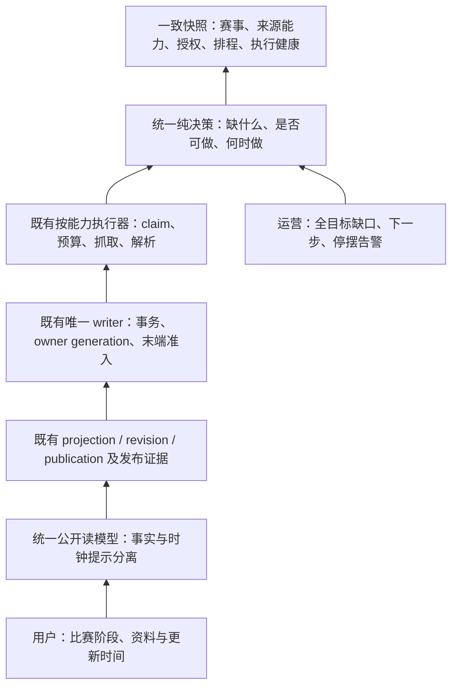

# 统一决策与渐进迁移设计

状态：设计完成，未实施。源码基线与当前运行候选为 95edc4c2；第一批部署和自然周期证据见[执行记录](../race-coverage-recovery-20261002/rollout.md)。

## 从用户看到的比赛向上追踪

图中的箭头是用户问题的追溯方向；实际处理从快照向决策、执行、证据和页面推进。决策不承担抓取或写入，公开读模型不重新猜测来源权限。

## 1. 单一决策合同

拟新增 `race_event_decision.py`：`decide_event(snapshot, *, now, policy) -> EventDecision`。输入是冻结 DTO，不接受 ORM lazy 对象、数据库连接、网络客户端或隐式当前时间。由单独 loader 在短只读事务中取一致快照，网络请求在事务外执行。

输入至少包括：canonical 身份；日期精度/时区/UTC 时刻与 schedule_generation；有依据的状态事实及来源引用；当前结果 revision/phase/完整度/公开判定；按能力的可用 source binding、窗口、授权/撤销；现有 owner/enrollment/source-set/claim generations；人工锁；checkpoint 失败退避、预算可用性；最后调度、开始、完成、有效资料更新和心跳。

输出合同：

| 字段 | 语义 |
|---|---|
| decision_version / input_fingerprint / evaluated_at | 规则版本、输入绑定、显式 now |
| fact_phase / fact_evidence_refs | 证据支持的阶段；证据不足为 unknown，不借 status 的时间推断填充 |
| clock_hint / result_state / missing_capabilities | 时间提示、结果成熟度与缺失资料分别表达 |
| actions[] | 能力、合法选源、动作类型、not_before、deadline、reason、预期 generations |
| blockers[] | 权限、身份、来源窗口、配额、人工暂停、执行停摆等，可同时存在 |
| next_action / next_due_at | 最早合法动作的派生摘要；没有合法动作则为空并给处理原因 |
| next_review_at / next_review_reason | 无来源或暂停时的内部复核计划，与 provider 抓取排程分开 |
| execution_state | unobserved / planned / queued / running / succeeded / failed / stale；基于收据而非推断，没有收据为 unobserved |

action 类型限定为 `wait`、`discover_identity`、`refresh_schedule`、`refresh_roster`、`fetch_result`、`check_correction`、`reconcile_publication`、`operator_review`。找不到获准来源时只能形成内部复核动作，不产生真实网络请求。`succeeded` 仅指该动作完成，不能替代“资料已齐”。

优先级：明确撤销/取消和人工锁 → 身份或 owner 冲突 → 已有版本公开受阻 → 缺赛程 → 赛前资料 → 赛后结果 → 更正/归档。按能力可并行，整体摘要不能遮蔽其它 blocker。延期无新日期时保留复核，不成为永久无声终态。

未知赛时、无合法来源和延期待定默认每 12 小时内部复核；临近已知赛日使用既有 D−1/D0 频率。复核只检查已有配置/证据和责任是否变化，不能反复越权抓取。T+30 是精确赛时下的结果 SLO；date-only 使用当地赛日结束后仍无结果的独立阈值，不伪造 T。人工暂停保留原因与复核日，暂停不抹去已有公开资料或历史证据。

## 2. 时间与事实的裁决

保留 `RaceEventStatus` 现有枚举及 `RaceEventFieldAuthority`、append-only `FieldChange`/`LifecycleTransition`。不再用 `time_reached_race_datetime`、`time_t_plus_30`、`local_next_day_midnight` 新增真实状态变更；它们映射成 clock_hint 和结果时效检查。实际 apply 路径也必须接入新决策，不能只改上层 `decide_data_sync_lifecycle` 而仍委托旧时间写入规则。

事实来源：有资格的明确发车/结束/取消/延期信号，或符合既有完整性与来源权限的结果 revision。正式与参考结果在现有各自证据链下均可证明比赛已结束，但公开标签不同。部分结果可提示已出现赛果，不能单凭任意一行判定完整结束。

旧数据分层读取：完整合法历史结果可直接导出已结束；有可信 transition/field authority 的保留事实；仅旧时间规则写入的 status 作为兼容字段，不当成事实。只读盘点先给出三类数量；不批量重写旧 transition 或所有 status。

改期事务使用现有 schedule_generation，并使依赖旧快照的计划/claim 失效；不同 generation 的响应可留 observation 审计但不得投影。取消/延期与迟到结果冲突时进入明确冲突复核，未经授权更正不能自动解除取消。更正追加 revision，既有结果保持 last-known-good，绝不重新进入 running。

时区使用赛事实际国家/马场 IANA zone；地区仅选择允许的 zone 集合。美国、澳洲和中东不能各写死一个时区。known instant 展示北京时间；date-only 使用明确当地日期，日历筛选分开处理；无时区/夏令时歧义先阻断精确赛时写入。九地区展示不代表九地区已获准自动抓取。

## 3. 跟踪责任与能力登记

第一阶段先复用 coverage canonical selector，增加显式选入 draft 的只读 manifest 入口；不新增与 event.status 竞争的跟踪状态机。已确认/取消对象仍在全目标对账中，但不要求永久高频拉取。未登记目标的下一步允许为“核验身份/来源”，不创建空 source_identity。

`parse_jra_observation` 等 adapter 输出拆为身份核验结果及独立能力解析结果：身份成立、赛时可用、名单部分、马号未公布可以同时存在。没有完整马号时不进入现有完整 racecard writer；有强身份和合法 identity/schedule 能力时仍允许走对应登记/资料路径。若现有 policy 只授 result 能力，则只能留候选并解释缺能力，不能把 parser 的新能力当成授权。

保留 `attach_multisource_observation`、`rebind_multisource_enrollment`、strong identity keys、canonical link、selected/alternate binding。规范的地区能力表包含 provider、region/venue、能力、parser 版本、窗口、合法 zone、proof 摘要、有效期与启用状态。表的唯一权限来源仍是现有受审 route registry；展示表从 registry 和运行态生成，不另外手工维护第二套许可。

## 4. 排程、可靠投递与执行收据

`calculate_next_poll_at`、`calculate_multisource_next_poll` 的现有频率是初始 policy 输入；统一 decision 负责选出 eligible capability。provider checkpoint 的 `next_poll_at` 继续是该能力的持久计划，tracking.next_poll_at 只作聚合；不能再另写一个不一致的赛事级时间。coverage 的“查询时刻+5分钟”改标为估计，直到有本轮真实持久计划/收据。

2B 影子阶段不改 schema/排程；冻结快照和差异写入限额 runtime artifact，不触发抓取、业务写入或邮件。2D 才按迁移包增加最小的派发收据/outbox，覆盖“数据库 claim 已提交、broker 发布失败”和“消息发出但发送确认未落库”的裂缝：

- `RaceDecisionDispatch` 保存 event、capability、decision_version/input_fingerprint、现有 claim/generation 绑定、not_before/expires_at、task_id、投递/开始/结束时刻、结果码。
- 唯一键绑定 event+能力+现有 claim 身份；与合法 claim 的生成同事务写入，发送只在 commit 后。这里只记调度事实，不授予 owner、不替代 provider checkpoint 或现有租约。
- 未发送记录由对账重试；重复 broker 投递仍走现有 claim CAS。已过期/换代的派发记录终止，不把旧 token 续期重放。缺身份时仅记复核结果，不伪造 provider claim。
- worker 开始/完成更新收据前要验证 task_id、claim 和 generation；接收旧消息不更新新计划的状态。lease 超时沿原 claim 机制恢复，不新增第二套抓取锁。
- 持久化只保留必要摘要/错误码，不保存凭据或完整来源响应；详细来源继续使用现有 artifact。收据保留 30 天，审计涉及的被引用记录保留，分批清理并设容量上限。

2D 路由规划：短控制任务用独立 `race_control`，来源 I/O 留 `race_sync_v2`，新闻留 `celery`。coverage 对账/汇总放控制 worker，并限制批次及 SMTP 超时。相同规则同时覆盖 Beat options 和直接 dispatch，现有 advance/select_due/旧 SLO 入口逐个迁移，不能只移动一个任务就宣称全链隔离。新增 service 前扩充部署 inventory、停止/排空/恢复、镜像一致性和资源合同；2C 之前不直接添加生产服务。

心跳必须有 Celery 以外的检测器：主机现有只读 ops-watch 增加有界检查，由独立 systemd timer 读取最后成功时间和队列年龄；超 10 分钟（连续两个 5 分钟周期）显示 stale 并沿已配置告警通道通知。该探针不调用 monitor.run，不消费队列，不接管业务写入。投递失败保留本地可读证据；告警基础设施自身不可用不承诺邮件送达。新增定时器/外发行为按后续发布范围明确列入。

## 5. 公开授权与策略升级

v2 `validate_multisource_publication` 已区分发布时授权与当前抓取许可，继续复用，并回归当前显式撤销和 public flag。主要兼容缺口在 v1 `_resolve_data_sync_publication_from_loaded_rows` 复用当前 lifecycle admission。

2A 按 11 场固定 inventory 逐一核原 publication、revision、observation、来源身份、当时 route/有效期、受审 policy/registry、owner 及当前撤销。可复核原证明的构建不可变历史公开依据，保留原对象引用并附迁移操作日志；不可复核的保留 publication_blocked 和精确缺证原因。绝不把当前新 policy 反填成当时证明，也不直接换 owner=historical 隐藏问题。

兼容证据选择追加 `RacePublicationAuthorityProof`，不改写原 publication：一条证明绑定一个 publication/generation，包含 schema_version、原 event/revision/observation/source 标识、published_at、原 route/terms/proof 摘要与不可变 artifact 引用、核验算法版本、迁移 manifest SHA 和完整 payload SHA。publication 外键 PROTECT，(publication, generation) 唯一；payload 仅追加、数据库层禁止更新/删除，核验失败不创建记录。更正证明以新 generation 和 supersedes 引用追加，validator 只读最新 generation；新证明无效时拒绝，不回退旧证明或旧 admission 绕过。撤销沿当前来源/绑定撤销、赛事公开/人工锁控制生效，不通过篡改证明完成。读 validator 校验外键对象及摘要一致；旧记录无证明时继续原受限路径，不自动视为通过。此表属于后续追加迁移，需要新的精确 schema 发布/恢复合同。

新增兼容公开 validator 只读取已核验依据与当前撤销/公开控制，不要求当前 fetch permit 尚未到期。列表与详情走同一批量读合同；业务完赛状态、完整度、归属与证据摘要仍校验。此路径不新建赛果、不发请求，不改变原官方/参考属性。

未来 policy 续期流程包含：旧/新 route 差异 → 受影响活跃 enrollment/binding inventory → 新 proof 及当前权限核验 → generation/CAS 绑定 manifest → 切换 → 自然任务验收。整份 policy SHA 保留审计；执行适用性按实际 route/能力判断，同时保留全局撤销。不能直接覆盖旧 digest、自动延期授权或忽略条款变化。

## 6. 文件与职责映射

| 既有文件/函数 | 处理方式 |
|---|---|
| `race_public_coverage.build_public_race_coverage` | 复用全目标 selector；输出消费统一 decision 与真实收据 |
| `race_data_sync_enrollment.build_race_data_enrollment_census` / `discover_multisource_events` | 复用身份、发现和覆盖输入；不再独立定义终止责任 |
| `race_data_source_adapters.parse_jra_observation` / `run_multisource_claim` | 按能力拆解析；执行仍守来源授权 |
| `race_data_sync_lifecycle.decide_data_sync_lifecycle` / `race_event_lifecycle.decide_race_lifecycle` | cohort 内委托统一决策；旧入口保留兼容、停止重复时钟转态 |
| `race_data_sync_lifecycle.apply_data_sync_lifecycle_decision` / shared apply | 继续唯一状态写入，并末端重验统一决策/证据 |
| `race_data_sync_control.claim_due_enrollments` / `_claim_multisource_due` / `_validate_multisource_claim` / `finish_multisource_claim` | 保留租约、generation、预算和原子完成；追加可靠派发收据 |
| `race_data_sync_admission` / `race_events._resolve_data_sync_publication_from_loaded_rows` | 分清当前 admission 与版本 publication；统一详情/批量读 |
| `race_data_sync_results.apply_data_sync_result_observation` | 保留唯一结果 writer、完整性检查、revision/publication |
| `race_public_time`、日历/详情查询与模板 | 消费同一事实/时钟/精度投影，修正 date-only 集合语义 |
| `tasks.py`、`settings.py`、Compose/发布工具 | 薄任务入口、路由/容量、受保护新增服务合同 |

## 7. 性能和迁移约束

loader 批量读取目标、证据摘要、绑定与收据，避免每场调用 validator 的 N+1 查询；全历史分母低频对账，近期/未闭环增量优先。规则纯计算可复用同快照，不能缓存撤销而无限延迟生效。公开读仍在每次响应检查必要当前公开控制，撤销缓存必须主动失效或零缓存。

新表/索引迁移追加，既有 owner/revision/approval 和审计记录不删除。先兼容读取、后小 cohort 双读比较、再单写切换；新旧入口同一场不能同时授予执行权。暂停新 cohort 可保留已发布结果；回退旧决策前重新核 generation 与事实语义，不把旧 T+30 写入器重新用于已迁移对象。
