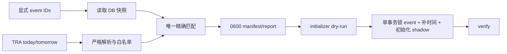

# 准实时赛前 racecard/off time 同步设计

## 现状复用

现有链路已经具备：

- `RaceEvent.race_datetime/local_date/local_start_time`；
- `RaceEventProjectionControl`、`RaceEventLiveTracking`；
- source/participant identity、observation、revision、publication policy；
- 严格 schema v1 `initialize_race_live_events`；
- The Racing API Free 的 secret、registry、TLS/SSRF transport、1 RPS host budget；
- results runner、独立 `race_live` queue/worker 和 shadow/public read gate。

现有 initializer 会一次性建立 racecard revision 和 participant，但 fresh event 必须预先
拥有 aware `race_datetime`。本变更新增 prepare 层，并让 initializer schema v2 在同一
事务内补时间；不新增数据库表或迁移。

## 组件

### 1. `race_live_fixtures.py`

新增 `parse_the_racing_api_live_racecards_payload()`：

- 接受官方 Free `racecards` object；
- 复用严格 JSON、500 场、每场 100 runners 上限；
- 只归一化规格允许的客观字段；
- 接受空集合，以便 prepare 形成 `no_match` 报告；
- 不改变现有 offline fixture 和 live results parser。

### 2. `race_live_racecard_sync.py`

职责分为无 ORM 网络层和短 ORM 快照层：

1. 读取并验证 registry/terms/automation permission。
2. 读取仓库外 `0600` secret。
3. 在短事务中 `select_for_update/get_or_create` HostBudget；只允许固定 host 与
   `min_interval_ms=1050`。这是一项控制面写入，不修改赛事业务事实。
4. 依次通过现有共享 reservation/outcome CAS 请求 today、tomorrow。reservation
   尚未到期时只等待至 `next_allowed_at` 并重试一次，单次等待不超过 2 秒；超过即
   `host_budget_wait_exceeded`，禁止循环等待或无预算发请求。
5. 每个请求完成后记录 host outcome；请求之间不持有数据库事务。
6. 解析后只保留白名单字段和响应 SHA。
7. 在一个短数据库读取阶段加载显式 event IDs、aliases、series names、major event，
   计算 deterministic match report。
8. 生成 manifest/report/request metadata；除 HostBudget 外不写业务表。

网络函数接受注入 transport/clock，测试不访问真实网络。

HostBudget 的 `next_allowed_at/consecutive_failures/circuit_open_until/last_error_code/lock_version`
是动态控制状态；initializer v2 只验证 host 和最小间隔等不可变配置并允许它们继续变化。
reservation/outcome 继续使用现有 lock version，迟到 outcome 不能覆盖新 reservation。

### 3. `prepare_race_live_racecards` 管理命令

建议接口：

```text
python manage.py prepare_race_live_racecards \
  --event-id 924 \
  --region-code gb \
  --run-id uk-shadow-20260718 \
  --secret-env-file /run/secrets/the-racing-api-free.env \
  --registry-file /app/runtime/policies/race_live/source_registry_the_racing_api_free.json \
  --expected-registry-sha256 <sha> \
  --approved-commit <oid> \
  --coverage-proof-digest <sha> \
  --terms-evidence-sha256 <sha> \
  --policy-valid-until <aware datetime> \
  --official-verification-route bha_manual_verification \
  --official-verification-route-version bha-manual-v1 \
  --official-verification-evidence-sha256 <sha> \
  --official-verification-valid-until <aware datetime> \
  --confirm-real-network
```

安全约束：

- root 只从 `RACE_LIVE_RACECARD_ARTIFACT_ROOT` 读取，调用方不能指定任意 output path。
- root 必须是绝对路径，逐级 resolve 后与配置路径完全一致；任一 symlink/越界均拒绝。
- run-id 必须是安全 basename；最终目录已存在时拒绝。
- 在同父 0700 临时目录 exclusive-create 0600 文件；写入/fsync
  requests、report 后，无 blocker 才最后写绑定两者 SHA 的 manifest；fsync 目录后原子
  rename 为最终 run-id。失败注入会清理临时目录。
- initializer 的输入是完成 run 目录中的 `manifest.json`；loader 必须打开同目录
  `requests.jsonl/report.json` 并重算 SHA。禁止只挂载孤立 manifest、跟随 sibling
  symlink 或接受目录外 companion。
- stdout 只返回路径、SHA、计数和 blocker code，不打印 race/runner 实体或凭据。

### 4. Initializer schema v2

schema v2 在 v1 event 基础上增加：

- `expected_race_datetime_before`
- `expected_local_start_time_before`
- `expected_status`
- `expected_local_date`
- `expected_timezone_name`
- `local_date`
- `source_off_dt`
- `source_response_sha256`

participant 增加：

- `barrier`
- `jockey_name`
- `jockey_id`

schema v2 顶层另增加：

- `registry_valid_until`
- `requests_sha256`
- `report_sha256`
- `official_verification_evidence_sha256`

精确类型：

- `expected_race_datetime_before` 为 JSON `null` 或 aware ISO-8601 datetime；
- `expected_local_start_time_before` 为 JSON `null` 或 `HH:MM[:SS[.ffffff]]`；
- `expected_status=scheduled`；
- `expected_local_date/local_date` 为 ISO date 且相等；
- `expected_timezone_name=Europe/London`。

fresh apply：

1. 锁定全部 event。
2. 在锁内先分类 fresh/replay：
   - 无 control/live 行才可 fresh；
   - 只有 control.owner_manifest_sha256 与当前 manifest SHA 相等才可 replay；
   - 其他 partial/different manifest 一律失败。
3. fresh 校验 event 基线、时间旧值、`updated_at`、expected
   status/local date/timezone、人工锁和既有状态；即使 `QuerySet.update()` 绕过
   updated_at，逐字段 CAS 也会阻断。
4. 校验 `source_off_dt` aware，把 instant 转入 `ZoneInfo("Europe/London")` 后得到
   local date/time；不得直接使用响应 offset wall-clock。
5. 令：
   - `race_datetime = source_off_dt` 表示的同一 instant；
   - `local_start_time = instant.astimezone(Europe/London)` 的 wall-clock time；
   - `local_date` 必须已与来源一致，不由本变更创建或改写；
   - `timezone_name` 必须已为 `Europe/London` 且保持不变。
6. 创建现有 shadow 初始化行和 racecard revision。
7. 保存 control pointer、OperationLog 后提交事务。

v2 racecard canonical payload包含 external ID、source off time 和全部白名单 participant
字段。`RaceEventRevisionItem` 保存 number/barrier/jockey；`jockey_id` 只放 bounded
field provenance。

### 5. Replay 与 Verify

- fresh apply 使用 `expected_event_updated_at`、expected-before 时间、status、local date、
  timezone 做 CAS。
- 成功后 `updated_at` 必然变化；同一 manifest replay 改为通过
  `owner_manifest_sha256`、source identity、目标时间、racecard content hash 和全部
  初始化行精确核验，不再要求 pre-apply `updated_at` 相等。
- 不同 manifest 不得借 replay 分支绕过 CAS。
- verify 只接受目标时间和所有初始化行精确匹配。
- v2 dry-run/apply/verify 对已被合法 reservation/outcome 更新的 HostBudget 只检查
  `host/min_interval_ms`，不要求动态字段归零；v1 保持旧契约。

## 匹配算法

### 归一化

`normalize_identity_text(value)`：

1. 必须是非空字符串。
2. Unicode NFKC。
3. `casefold()`。
4. 所有非字母数字字符折叠为单空格。
5. 连续空白折叠并 trim。

这只消除大小写、Unicode 表示和标点差异，不做 substring、token 删除、拼写修复、
sponsor 剥离或编辑距离。

### 赛事名集合

按 event/year 加载：

- event original name；
- active event aliases；
- series canonical original name；
- active 且年度有效的 series names；
- major event name、normalized name 和 JSON aliases。

中文名不参与 TRA 英文赛事身份自动匹配。

### 唯一性

对每个显式 event：

- 先按 `GB + local_date + normalized course` 缩小候选；
- 再求 normalized race name 与获准名称集合的交集；
- `len=1` 才可输出 manifest；
- `len=0` 输出 `racecard_not_found`；
- `len>1` 输出 `racecard_ambiguous`；
- 同一 external race ID 命中多个 event 时整批 blocker。

## Registry 与 transport 升级

tracked registry 在保留现有三条 endpoint 的顺序和 proof 请求预算的前提下，追加：

1. `racecards_sync_today`：
   `/v1/racecards/free?day=today&region_codes=gb&limit=500&skip=0`
2. `racecards_sync_tomorrow`：
   `/v1/racecards/free?day=tomorrow&region_codes=gb&limit=500&skip=0`

`race_live_source_proof._ENDPOINTS`、transport allowlist、registry exact contract、Dockerfile
复制目标、镜像内 SHA 测试和三份 Compose 的 expected digest 配置一起变更。proof 仍默认
只执行原前三个请求；sync 显式按新增 endpoint name 查找，不靠数组位置。旧 registry SHA、
未知参数、参数顺序漂移和非 GB 路由均拒绝。

`policy_valid_until <= registry_valid_until` 在 prepare 与 initializer 双侧校验；
registry 已过期或证据超过既有 staleness 门禁时请求前拒绝。官方复核 route 使用独立
evidence SHA/valid-until，不能从 TRA registry 推导。

## Tracking 初始化

- prepare 使用单一 `generated_at`。
- `generated_at < off_time`：
  - state=`racecard_ready`
  - next poll 由 `calculate_race_live_next_poll_at(off_time, generated_at, racecard_ready)`
    计算。
- `generated_at >= off_time`：
  - state=`awaiting_result`
  - next poll=`generated_at`，保证首次结果请求立即 due；此后复用现有有界算法。
- initializer 用相同函数/clock 重算并要求 manifest 精确相等。
- pre-off racecard-ready 任务到期后，runner 在有效 owner/claim CAS 下确认
  `now >= RaceEvent.race_datetime`，原子晋级 awaiting。
- 若有效 claim 到期但 `now < off_time`，runner 不发 HTTP、不晋级状态；它必须以同一
  owner/claim CAS 执行 `pre_off_wait` checkpoint，清 claim、保持 failure counter 不变，
  并把 `next_poll_at` 推进到
  `min(calculate_race_live_next_poll_at(off_time, now, racecard_ready) or off_time, off_time)`。
- 旧 claim 或 owner 漂移仍严格零 mutation/零请求；不得依靠 lease expiry 才恢复轮询。

## 数据与事务边界



- prepare 只写 HostBudget 控制面，不写赛事业务事实。
- HTTP 期间无数据库事务。
- apply 全 manifest 单事务，避免“时间已写但 participant 未初始化”。
- 不接触历史 runner 的表、文件、Redis key 或容器。

## 失败与降级

| 条件 | 行为 |
| --- | --- |
| 401/403/429/5xx/timeout/schema drift | 记录脱敏 blocker，无 manifest |
| registry/terms/secret 不合法 | 请求前 fail closed |
| event 不存在或 baseline 漂移 | 无 manifest/拒绝 apply |
| 赛事零命中或多命中 | report-only |
| runner 缺 ID/name/number 或重复 | 整场 blocker |
| off_dt naive、日期不符或时间冲突 | 整场 blocker |
| 外部 race/runner ID 已占用 | apply 全事务回滚 |
| initializer 后段失败 | 时间与 live 行全部回滚 |
| HostBudget 缺失 | 在短事务以精确配置 bootstrap |
| HostBudget circuit/rate limit | 不发请求，报告 next allowed |
| 迟到 host outcome | lock version 拒绝，不覆盖新 reservation |

## 性能与资源

- 每次 prepare 固定最多两个 HTTP 请求；响应各不超过 2 MiB。
- DB 查询按全部显式 event 一次批量预取，不逐 runner 查询。
- 文件总大小上限 2 MiB；超过即失败。
- 首期为人工触发 prepare，不加入 Beat，避免未经过 shadow 就形成常驻网络任务。

## 安全与版权

- Basic Auth 只在内存和 Authorization header 中存在。
- 凭据、secret 路径、raw payload 不进入输出、日志、异常、DB 或 artifact。
- manifest 只保存客观赛事事实；明确丢弃 ratings/form/odds/pedigree/comments。
- output 路径拒绝 symlink、目录穿越、覆盖和仓库/静态目录。

## 生产容器与 artifact 路径

- 三份 Compose 只给 `race_live_worker`：
  - `./runtime/secrets:/run/secrets:ro`
  - `./runtime/race_live_racecards:/run/race-live/racecards:rw`
- web、普通 worker、Beat 不挂 secret；web 也不永久挂 racecard artifact root。
- 生产宿主 root：
  `/opt/umanewsbot/runtime/race_live_racecards`，`root:root 0700`。
- prepare 使用：

```text
docker compose -f docker-compose.prod.lowcost.yml run --rm --no-deps \
  race_live_worker python manage.py prepare_race_live_racecards ...
```

- prepare 完成后，initializer 继续使用现有 web one-off，把选定的完整 run 目录精确
  bind 到 `/run/race-live/artifact:ro`，以
  `/run/race-live/artifact/manifest.json` 为入口并校验同目录两个 companion；web 无需、
  也不得读取 TRA secret，且不永久挂载 artifact root。
- 完成 artifact 至少保留到 shadow 验收结束；失败临时目录立即清理，完成目录只按明确
  retention 操作删除。

## 后续但不属于本变更

- 初始化后 racecard revision 与退赛/off-time 改期自动同步。
- 按日历自动生成 manifest 或自动 apply。
- 多地区 course/timezone 映射。
- 多 event endpoint cache 供结果 runner 复用。
- 官方来源复核和 incident 告警。
