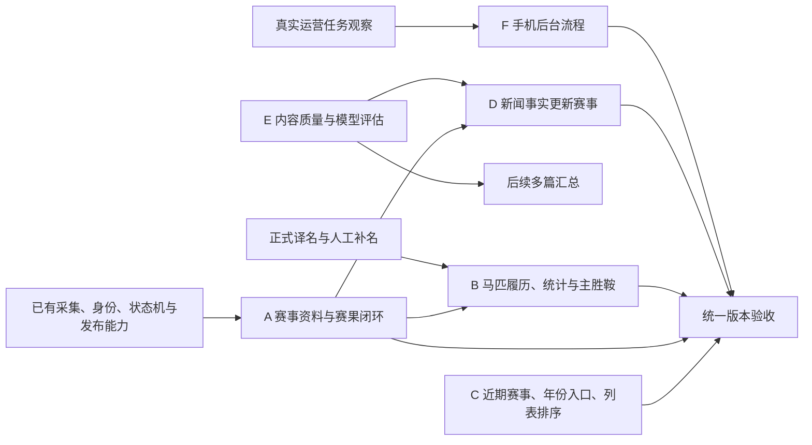
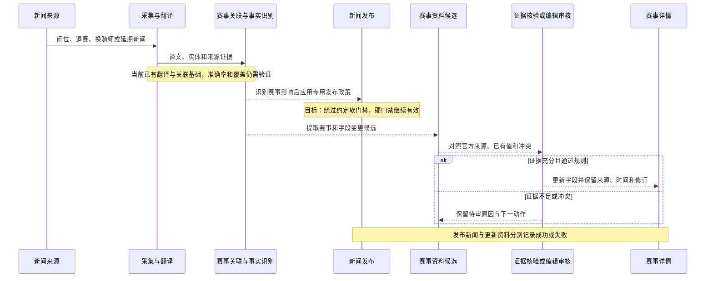

# Umanews 待修复事项线程与当前能力对照

本报告把第三份证据——[记录待修复事项与方案（长期）](codex://threads/019f8b2d-4e38-7fc1-8922-b913d4db9648)——与[当前能力基线](2026-10-02-current-capabilities.md)对照，供下一步选择版本范围和倒排排期使用。

**结论：旧清单包含已交付的功能、已经解决的具体案例、仍可复现的问题，以及只完成部分链路的能力。不能把线程最后的“23 项待做”原样转成下一版任务。当前最集中的缺口是赛事更新与结果完整性、马匹资料与统计一致性、新闻和结构化资料联动。**

## 1 证据边界

| 项目 | 本次处理 |
|---|---|
| 历史线程 | 完整读取 52 轮，原始消息时间为 2026-07-23 至 2026-08-10，北京时间 |
| 需求依据 | 优先采用用户原始表述及后续更正；历史助手的方案、优先级、字段名和状态总结另行辨别 |
| 最新历史汇总 | 线程末次汇总明确截至 2026-08-10；其中批次数字、生产停点和授权状态不代表 10 月现状 |
| 当前代码 | `fc1eed938beb8b431e0d4b37953f7599a40a72ce`；沿用前一轮基线，未修改应用代码 |
| 本轮浏览器复访 | 2026-10-02 19:02–19:03，北京时间；补查 5 个旧案例页面及美艺力量的 3 页履历 |
| 网站 | 沿用前一轮可访问的 `umafans.run`。历史线程提供的案例也是该域名；不据此认定 `umanews.run` 已恢复或两域名等价 |
| 未验证部分 | 没有登录后台或生产服务器，没有运行生产任务，没有重新抓官方赛事源，没有使用历史附件截图 |
| 输出性质 | 需求证据与现状对照；下文工作分组是规划建议，尚未冻结下一版本范围、上线日期或人力承诺 |

产品需求消息的执行副本保存在 [thread-requirements.json](2026-10-02-capability-evidence/thread-requirements.json)，按时间排列，带原始 turn ID。已移除历史截图临时路径。2026-10-03 接管时，执行副本排除两轮与产品需求无关的历史治理指令正文，保留 turn ID；原始 52 轮仍完整保存在来源工作树及原会话，当前副本保留 50 轮。新增公开页面证据保存在 [backlog-browser-observations.json](2026-10-02-capability-evidence/backlog-browser-observations.json)。前一轮网站证据继续保存在 [browser-observations.json](2026-10-02-capability-evidence/browser-observations.json)。

历史线程中的旧流程和授权文字仅用于理解当时进度。本次执行仍遵循当前根 `AGENTS.md`，未触发产品实现或生产操作。

## 2 用户已经明确的产品要求

以下约束可以直接带入下一步范围讨论，不必重新从零访谈：

1. 新闻在公开站统一展示；公开页面隐藏来源、主地区、原文语言与原文链接。马匹首页取消国家分类，但保留档案中的出生国家/地区。
2. 首页“近期赛事”覆盖今日起最近一周，最多 4 条；没有可靠时刻时不显示“时刻待定”。“一周”在后续文档中的实现口径是今天加后 6 天。
3. 日历默认围绕今天或最近的未来比赛日，展示前 5 个比赛日、锚点日、后 5 个比赛日；不是前后各 5 个自然日。
4. 赛事公开时刻统一为北京时间；赛前持续更新出马表、计划时间、骑师、闸位等，不因表已有数据就停更。
5. 影响赛事资料的新闻，例如闸位、退赛、延期，应有特殊发布处理；翻译失败、重复新闻等硬性门禁继续有效。用户同时希望新闻事实能更新赛事详情。
6. 赛后 T+30 分钟更新为已完赛；没有具体时刻时到次日更新。正式赛果是否确认是另一个问题，不能以赛事时间状态代替官方确认。
7. 出马表状态表达报名和赛前状态；赛果表达名次、竞走中止、失格等赛后状态。未正常完赛的马不能消失，应排在正常名次之后。
8. 主胜鞍只展示胜利中最高等级的比赛；有 G1 胜场时不混入 G2/G3 或未胜利赛。
9. 马匹履历至少补完赛时间、骑师，以及“本马获胜显示第二名马，否则显示第一名马”。完整档案默认靠前。
10. 中文名缺口清单覆盖 **2020 年起全部 G1 参赛马**；包含 Jpn1、香港本土一级赛，排除日本地方非 Jpn1 和其他国家 Local G1。由系统整理缺口，用户逐匹寻找译名。
11. 长线方向为单篇改写、多篇汇总和黄金测试集；手机后台能快速完成发布、审核、术语和赛事马匹维护；研究 DeepSeek/GPT 的使用与路由方式。

用户明确撤回了“赛事日历没有 G3”这一问题，不能再把它作为未修复缺陷。前一轮发现的“德国历史 G1 筛选为空”是另一项新的观察，二者不能混在一起。

## 3 逐项核对清单

为避免历史编号重复，本报告重新使用 B01–B34。表中“已有”只代表对应功能或机制已有证据，不代表所有地区、历史数据和后台操作均已验收。

### 3.1 新闻与首页

| 编号 | 用户原始诉求 | 当前证据 | 进入后续规划的内容 |
|---|---|---|---|
| B01 | 取消新闻地区 Tab，统一信息流 | **公开展示已实现**。首页无地区 Tab，旧地区参数会移除；后台归属、地区生产窗口仍在 | UI 项不再从零开发；是否还要取消按地区采集/配额，是另一个范围决定，不能由删 Tab 自动推导 |
| B02 | 新闻列表、详情隐藏来源相关信息 | **已实现**。公开模板与实访一致；后台保留来源证据 | 保留回归检查，不重复立项 |
| B03 | 正文混入非正文内容，案例新闻 9623 | **提取修复已有；旧案例本轮未复现已知污染**。9623 的正文检查中 7 个历史污染关键词均为 0 | 不沿用“9623 仍脏”；历史批次全部完成与所有来源长期质量，本轮没有证明，作为质量核验而非整套重建 |
| B04 | 后台选择头条，AI 页推荐一条 | **管理和推荐代码已有**，首页头条线上可见；后台登录后操作本轮未实测。推荐目前是规则评分 | 先验收已有入口；若以后要求 LLM 推荐，应单列新增目标，历史要求没有指定必须用 LLM |
| B05 | 今日赛事改为近期一周、最多 4 场、无时刻留空 | **仍不一致**。当前函数取今天和明天，空窗后回退更远的重点赛事；页面仍叫“今日赛事” | 需要改时间窗口、标题、缺失时刻显示、数量与空态；不能只改标题 |
| B10 | 赛事影响新闻绕过软门禁，保留硬门禁 | **未见完整交付证据**。已有文章评分、审核、发布和实体关联，尚不足以证明这类新闻获得指定豁免 | 定义赛事影响识别和适用的软门禁；以闸位、退赛、延期样本验收 |
| B11 | 将这些新闻中的事实更新至赛事详情 | **关联能力已有，事实更新闭环不足**。京都新闻写明闸位，赛事表格仍为空；新闻到赛事也非每条都有链接 | 拆成关联、事实抽取、来源冲突处理、候选审核、更新及追踪；不要将“有相关新闻”计为完成 |

代码：[首页赛事选择](../../server/stable/views.py)、[头条服务](../../server/stable/services/editorial_headlines.py)、[自动生产](../../server/stable/services/automation.py)、[正文历史治理](../../server/stable/services/news_body_history.py)。历史修复交付记录见 [正文提取发布报告](../changes/fix-news-body-extraction-boundaries/release_report.md)，它只代表报告当时的发布范围。

### 3.2 赛事数据与公开页面

| 编号 | 用户原始诉求 | 当前证据 | 进入后续规划的内容 |
|---|---|---|---|
| B06 | 年龄、距离、场地等基础字段归一化 | **已有规范化与展示层，覆盖不完整**。公开页面仍有待核实值，不同来源完整度不一 | 做字段和地区覆盖核验、缺口修复；无需重建全部规范化底座 |
| B07 | 日期能清楚看出月份 | **已有展示实现及历史交付记录**，前一轮日历可见日期分组 | 作为现有基线，保留跨月、跨年回归 |
| B08 | 赛前、赛中、赛后自动推进赛事状态 | **已实现并有后续恢复交付记录，覆盖尚有缺口**。存在生命周期控制、纳管、owner、覆盖检查 | 重点是全部公开赛事是否有 owner、下一动作和异常原因；“新增自动状态机”已不准确 |
| B09 | 赛前持续刷新；非空出马表也要更新退赛等变化 | **调度与刷新代码已有，原案例仍有状态不一致**。兰秀锦标有 10 行报名表、5 行赛果，报名表全为“已出走登记” | 按来源验证二次确认、退赛、换骑师、延期和字段更新；历史例子还需官方证据回查，不能仅凭名单缺席推断退赛 |
| B12 | 开跑后约 3–5 分钟取得延迟赛果 | **已有 T+3 开始及重试机制**，但依赖具体来源、路由、纳管和结果证据 | 从“有没有任务”改为验证实际取得、投影和延迟；不把配置间隔承诺为服务时效 |
| B13 | 定期从可信官方来源复核暂定赛果 | **已有观察、修订、发布与确认链**；不是所有公开比赛都有完整官方结果 | 验收 provisional → official → corrected、失败保留旧结果及超期可见；沿用现有多来源链，不机械恢复旧复核任务 |
| B14 | 未完赛马不能从赛果消失；自由岛应在末尾 | **旧案例仍可复现缺行**。2025 女皇杯 11 行出马表、10 行赛果，自由岛仅在出马表 | 明确列为待修；既要补历史数据，也要验证各结果来源保留非完赛者 |
| B15 | 出马表状态与赛果状态语义分离 | **对象已分表，语义仍未全面收敛**。Runner 和 Result 各自有 `running_status`，共用枚举；公开文案有“未完赛/取消资格”等映射 | 先定映射与不变量，再决定字段迁移；不能把“新增 entry_status/result_status 两字段”视作已批准的唯一实现 |
| B16 | 手机 G1/G2/G3 徽标不被挤窄 | **已有响应式修复记录和样式**；前一轮仅检查了代表页面的窄屏布局 | 作为现有能力；发布前补长名称和多等级实际样本回归，不重做整体页面 |
| B26 | 默认前 5 个比赛日 + 锚点 + 后 5 个比赛日 | **已实现**，历史线程后期也已移出待办；当前基线核对了真实比赛日窗口 | 不重复开发；保留无赛日、跨年、无未来赛事等回归 |
| B27 | 所有公开赛事时刻转北京时间 | **转换与标签已有**，兰秀显示 22:35（北京时间）；女皇杯仍缺可靠时刻 | 北京时间机制视为已有；继续补来源时刻、延期重算和新地区覆盖，不能用缺数据判成转换机制完全未做 |
| B28 | 删除赛事详情右上角年份切换 | **代码仍保留有条件的系列届次切换**：已审核系列且多个公开届次才显示；本轮旧样例未出现多项切换 | 与原要求存在产品差异。下一步决定彻底移除，还是接受目前条件化入口；不要误删日历页年份筛选 |
| B29 | 澳洲、中东、爱尔兰等新地区 | **九地区入口与数据已存在**，包含上述地区，另外有德国；不等于九地区自动链路齐全 | 公开地区扩展不再从零做；把新增地区的身份、取数、结果、生命周期覆盖纳入 B08–B13 |
| B34 | 日历没有 G3 | **用户在 07-27 明确撤回** | 从需求池删除；新发现的特定筛选异常独立登记 |

代码：[赛前刷新](../../server/stable/services/race_pre_race_refresh.py)、[生命周期](../../server/stable/services/race_event_lifecycle.py)、[多来源结果同步](../../server/stable/services/race_data_sync_results.py)、[修订与公开读取](../../server/stable/services/race_events.py)、[赛事模板](../../server/stable/templates/stable/public/race_detail.html)、[状态及名次展示](../../server/stable/services/race_information_display.py)。后续交付的时间边界和未决项见[当前状态文档](../current_state.md)及[既有路线图](../future_work_roadmap.md)。

### 3.3 马匹档案、名称与统计

| 编号 | 用户原始诉求 | 当前证据 | 进入后续规划的内容 |
|---|---|---|---|
| B17 | 马匹列表取消国家 Tab，保留出生地 | **已实现**。列表统一；美艺力量与 DINOZZO 详情仍有国家/地区 IRE | 不重复开发；出生地与参赛地区继续区分 |
| B18 | 主胜鞍、履历中文化并统一马场、距离、场地 | **底座已有，实际缺口明确**。美艺力量大量英文赛事名，DINOZZO 显示 `HKJC local result …`；部分等级为横杠 | 列为字段与译名补全，不以“有格式化函数”关闭；优先可核验正式名称和赛事关联 |
| B19 | 主胜鞍只保留最高等级的胜利 | **仍可复现**。美艺力量同列 G3、G1、G2；函数会把人工标记记录与自动最高等级胜场合并 | 修正人工标记与计算规则的优先关系、等级缺失与胜负判定，再处理历史错误标记 |
| B20 | 履历完整，美艺力量不能 45 战只见 17 战 | **具体分页案例已改善**：当前 3 页为 20 + 20 + 5，共 45 条，与页头 45 战相符 | 此案例的显示条数问题不再保留；全站来源总数、有效出赛、去重与缺页仍需验证，45 条不等于官方全生涯已独立核验 |
| B21 | 各国名次格式统一，例如 01 → 1 | **样例显示已统一**。DINOZZO 当前为 6、10、3 等数字，不见前导零；但另一马匹有履历名次与汇总前三名不一致 | 把展示归一化和统计一致性拆开。已修显示保留；前一轮观察到的统计矛盾列为独立待核查 |
| B22 | 香港参赛马补 HKJC 官方中文名，例 DINOZZO | **样例仍未补**。页面标题 DINOZZO，标“中文译名待补”；原始要求为“達羅素/达罗素” | 复用已有 HKJC 种子及名称体系，补身份绑定、繁简别名和公开显示；不假设此前种子导入等于该马已发布中文名 |
| B23 | 普通英文词误当马名，污染高价值告警 | **已有语境分类实现和发布记录**。历史 9595 案例及 common/uncertain/confirmed 路径已被专门处理 | 不从零重建；本轮未读后台告警，当前生产模式与 24 小时效果需重新核验，旧线程“已 enforce”不是当前运行态证据 |
| B24 | 2020+ G1 全部参赛马中文名缺口清单 | **明确需求，未取得完整交付清单证据**；路线图有相关待办但一处写成“胜马” | 恢复“全部参赛马”分母，按已确定赛事范围输出身份、译名状态、证据、缺口原因和人工处理入口 |
| B25 | 履历补完赛时间、骑师、1 着/2 着对手马 | **部分实现**。公开模板有计时位置，视图仅取关联且已确认赛果计时；当前未渲染骑师和对手马 | 不重做计时底座；补关联及缺字段，并检验本马获胜/未获胜两种规则 |
| B30 | 完整马匹档案默认排在前面 | **尚不符合**。当前默认按精选标记、中文名、原名、ID 排序，没有按完整度排序 | 定义可解释的完整度与稳定排序；是否搜索优先相关性属于设计建议，尚不是用户另行确认的硬规则 |

代码：[主胜鞍选择与资料完整度](../../server/stable/services/horse_profiles.py)、[履历写入与完整性](../../server/stable/services/horse_race_records.py)、[公开列表及计时投影](../../server/stable/views.py)、[马匹公开模板](../../server/stable/templates/stable/public/horse_detail.html)、[外部马匹语境门禁发布记录](../changes/fix-external-english-horse-context-gate/release_report.md)。

### 3.4 长线能力

| 编号 | 用户原始诉求 | 当前证据 | 尚需建设或明确 |
|---|---|---|---|
| B31 | AI 单篇改写、多篇汇总；建立学习用例和黄金测试集 | **单篇翻译/改写与一致性检查已有基础**，不能全部记为零；未见完整多篇聚合产品闭环 | 先评价现有单篇质量，建立可复现失败集与评估集，再定义多篇事实合并、来源追踪、冲突与更新策略 |
| B32 | 移动后台大幅精简操作，手机快速审核和维护 | **后台业务入口已有**；本轮只有登录页实访，未完成手机运营流程验收 | 以实际任务耗时、点击数、批量处理和误操作恢复为目标评估；不能只用媒体查询或“手机能打开”判定完成 |
| B33 | 后续可用 GPT，研究模型路由 | **OpenAI-compatible/SiliconFlow provider 和模型配置已有**；`TranslationRun` 记录 provider/model，支持基础切换 | 研究质量、成本、延迟与任务适配，再决定路由/降级。A/B、熔断、分语言策略是历史助手建议，并非全部已获用户确认的下一版范围 |

代码：[翻译供应商选择](../../server/stable/services/translation.py)、[模型及改写配置](../../server/app/settings.py)、[自动化决策](../../server/stable/services/automation.py)。这里讨论的是仓库已有能力，没有调用模型，也未确认生产当前使用哪一家或哪一版本。

## 4 旧案例复访结果

| 案例与公开链接 | 2026-10-02 本轮实际看到 | 判定与边界 |
|---|---|---|
| [2025 女皇杯](https://umafans.run/races/2025/hong_kong-hong-kong-queen-elizabeth-ii-cup-2025/) | 11 行出马表、10 行赛果；自由岛只在出马表，状态为已出走登记 | “赛果缺少这匹马”仍能复现。其正确赛后状态沿用原用户问题作为待核对目标，本轮未重新访问官方结果 |
| [美艺力量](https://umafans.run/horses/7669/) | 45 战；3 页实际共 45 行；主胜鞍前三项为 G3、G1、G2；大量赛事名仍是英文 | “仅 17 战”不复现；最高等级主胜鞍和中文化仍不满足。不能据此推断其他马完整 |
| [DINOZZO](https://umafans.run/horses/21607/) | 中文译名待补；40 战；数字名次无前导零；主胜鞍和履历采用 `HKJC local result` 占位名称 | 中文名与正式赛事名缺口仍在；名次显示案例已改善。页面标“完整马匹资料”不证明用户关心的各字段都完整 |
| [2026 兰秀锦标](https://umafans.run/races/2026/uk-bha-flat-2026-0730-078/) | 10 行出马表全为已出走登记；5 行赛果名次均待核实；同时有冠军摘要；赛前内容出现在赛后新闻分组 | 不能简单归结为“仍因为出马表非空停更”。公开结果、名单、状态、新闻分组存在一致性问题，需要追溯来源与版本；旧消息中的剧唱一姐未在当前名单中，不能原样复述为当前证据 |
| [新闻 9623](https://umafans.run/news/9623/) | 正文区域 39 段；当前、热门、CCA橡树、正面交锋、公平赔率、登录、免费注册这 7 项历史污染关键词命中均为 0 | 本样例未复现指定污染，不证明所有正文质量合格或全部历史批次完结 |

额外需要注意：兰秀锦标的“冠军已出现、赛果名次仍待核实”，与上一轮“已完赛但赛果待确认”不是同一种现象。前者涉及公开投影内部一致性；后者可能是合理表达结果尚未确认。后续验收不能把二者统一判为“状态没更新”。

## 5 从第三份证据恢复的范围差异

### 5.1 “G1 参赛马”被收窄为“胜马”

07-23 原消息明确说“所有参加过 G1 赛事的马”，并明确用户负责逐匹找译名。当前 [future_work_roadmap.md](../future_work_roadmap.md) 第 7.3 节一行却写“2020+ 顶级赛胜马中文名仍有缺口”。

规划必须采用全部参赛者作为分母，不能只取第一名。范围包含国际 G1/GI/Group 1/Grade 1、Jpn1、香港本土一级赛；其余排除项按用户原话。本文记录该偏差，尚未改写路线图或生成生产缺口清单。

### 5.2 “取消地区 Tab”与“取消地区运营逻辑”不是同一个已交付项

用户最初提到统一 TDN 综合流、减少地区判断；后续拆出的实施任务主要是公开 UI 简化，当前后台仍按地区归属和生产窗口工作。前台目标已满足。若下一版要把采集、配额或内容选择也全面去地区化，需要在版本范围中显式决定，不能以 UI 已完成而默认整个运营目标也完成。

### 5.3 缺失时刻留空的明确要求首先针对首页卡片

原始“不要展示时刻待定”出现在首页近期赛事需求中；“所有缺失赛事时刻统一留空”更多来自历史助手的扩展方案。当前详情页显示“北京时间待定”。下一步可统一设计，但不能把更广的全站空值政策冒充已经逐页确认的原始要求。

### 5.4 状态语义已明确，数据库字段方案尚未被唯一锁定

用户明确区分赛前与赛后。历史助手建议 `entry_status`/`result_status`，而当前 Runner/Result 已分成不同对象、各有状态。应先检查输入、更新、历史映射、排序和展示是否满足业务不变量，再评估是否需要迁移；避免为追求字段名称而额外扩大范围。

### 5.5 历史生产停点不能直接成为当前排期前置条件

| 08-10 汇总中的在途事项 | 本次处理 |
|---|---|
| 生命周期仍在 shadow，待重新绑定版本和授权 | 后续已有实现与恢复交付记录；使用当前覆盖缺口，不恢复旧版本停点 |
| 48 场 route_missing，候选为 0 | 只是当时一次运行快照；当前已有多来源发现与纳管，需新分母、新路由和新结果核验 |
| P0 候选 32 个档案、180 条新增、230 条更新，停在生产 apply 前 | 不能作为今天待执行批次；本轮未确认它们的后续生产账本，不安排重放 |
| Wikipedia 映射研究仍在其他线程 | 可作资料来源背景；未核实其当前交付，不把“研究线程未结束”等同于一个产品功能未做 |

## 6 给下一步版本讨论的工作分组

下面是建议拆分，不是已经确认的版本承诺，也没有给出缺少人力与发布日期依据的工期。

| 建议工作包 | 包含内容 | 能被用户验收的结果 |
|---|---|---|
| A 赛事资料与赛果闭环 | B08/B09/B12/B13/B14/B15；加上本轮兰秀与前轮过期赛事、重复届次、筛选异常 | 每场目标比赛的报名、退赛、实际出赛、赛果、官方确认和更正能追踪；历史女皇杯等样例恢复，异常不会静默卡住 |
| B 马匹档案可信度 | B18–B22/B24/B25；补前轮统计矛盾 | 履历条数有依据，前三名统计相符，主胜鞍符合最高等级规则，中文名和对手马能链接到稳定身份 |
| C 阅读入口收尾 | B05/B28/B30；已有时间和归一化能力的展示修补 | 一周赛事卡片、年份入口、完整度排序符合约定；小改动可独立验收 |
| D 新闻到赛事的事实更新 | B10/B11 | 一条闸位或退赛新闻从关联到候选、审核、公开更新形成可追溯闭环；新闻与资料更新分别记录结果 |
| E 内容质量与模型研究 | B03/B23/B31/B33 | 既有故障样例可回放；单篇质量有基准；再评估多篇汇总和模型选择 |
| F 手机运营效率 | B32 | 用真实审核、发布、术语和资料维护任务衡量步骤与耗时，能完成高频操作并恢复误操作 |

箭头表达主要数据依赖，不要求整包串行。C 中首页标题/窗口、B 中主胜鞍选择规则可以先独立实现与测试；数据补齐、中文名人工处理及模型评估也可在各自边界内并行。实际排期应以选定范围、可用人力和上线目标为准。

对于 D，用户期望的完整链路应当在后续设计中逐步验收；当前只完成其中部分环节：

虚线表示本次从用户诉求整理出的待完善步骤，并不声称已上线。具体哪些更新可自动通过、哪些需要编辑处理，仍属于后续业务规则设计。

## 7 进入排期前需要补齐的信息

三份证据已能支持范围讨论。下一步先选择上述工作包和目标样例，再确定目标发布日期、可投入人员及允许留到后续的长线项。对 A/B 的数据修复，要先区分“代码可完成”与“来源可取得、历史数据可恢复、人工译名可完成”；对 F，要先有登录后的真实移动操作样本。

不应把“新增九地区”“再建自动状态机”“支持 OpenAI 接口”作为完整的新建项目估算，也不应把现存框架当成对应用户体验已经闭环。版本完成标准应落在可见结果与明确分母上。
