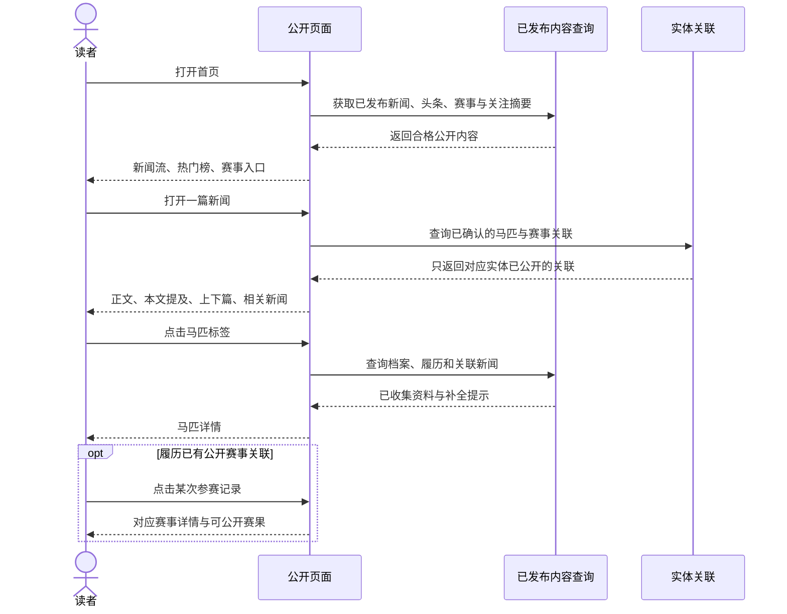
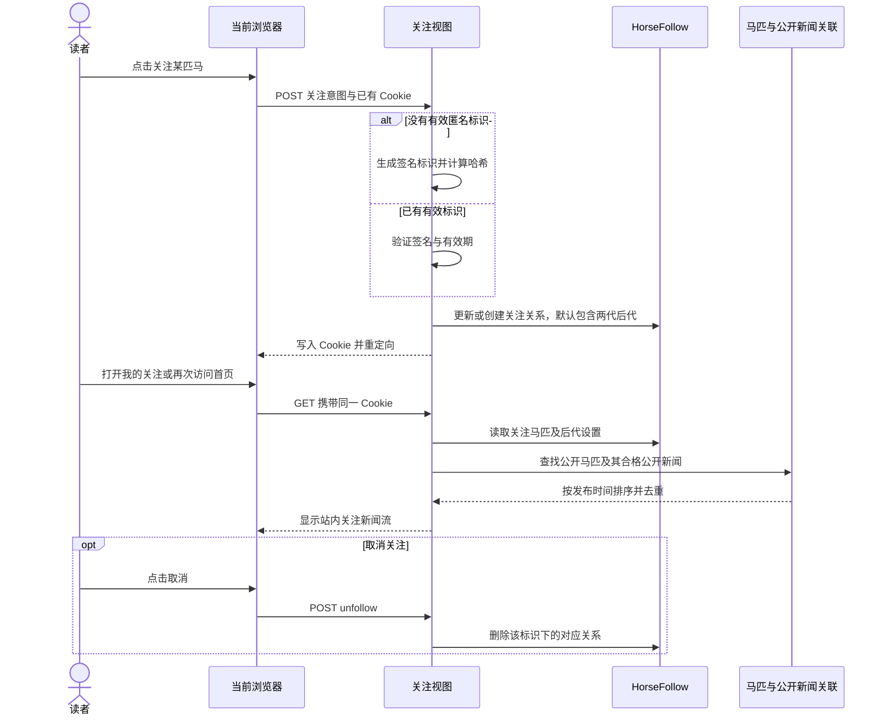
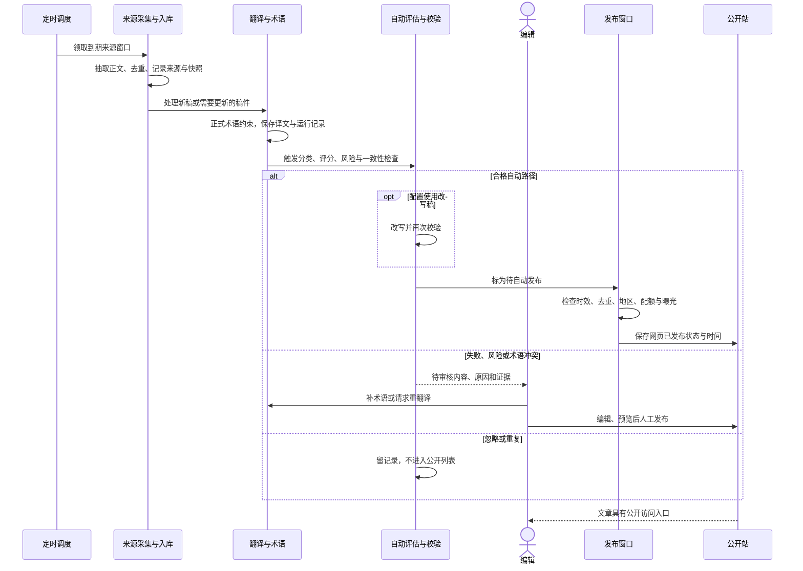
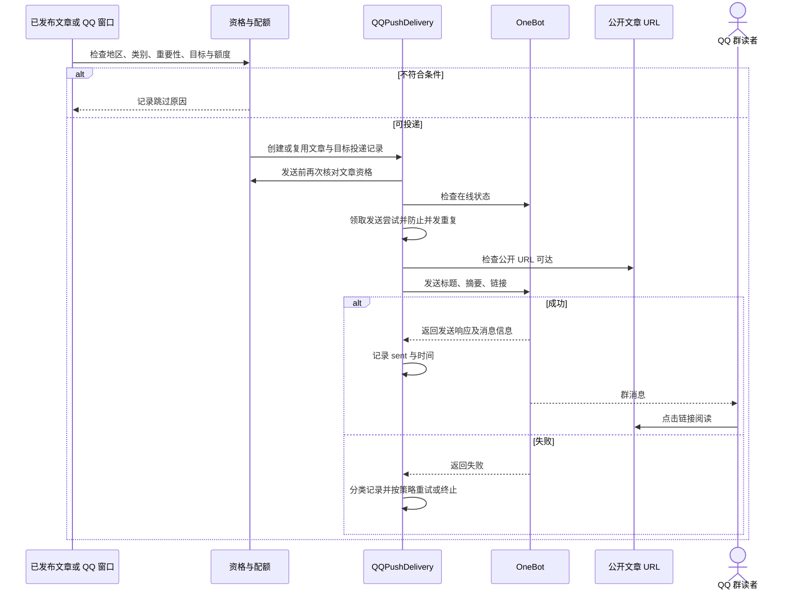
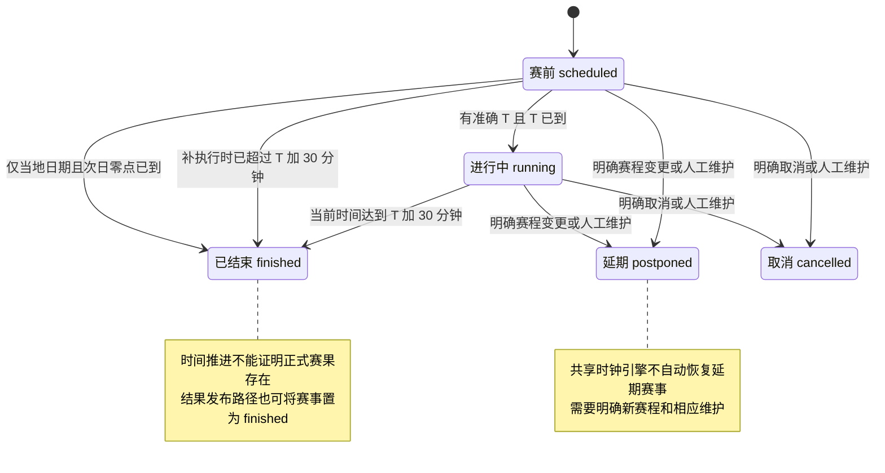
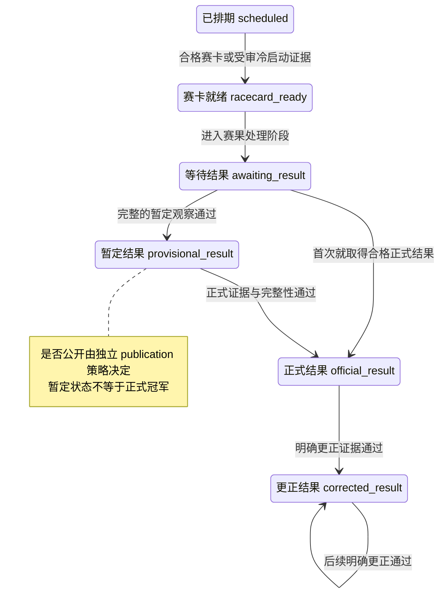
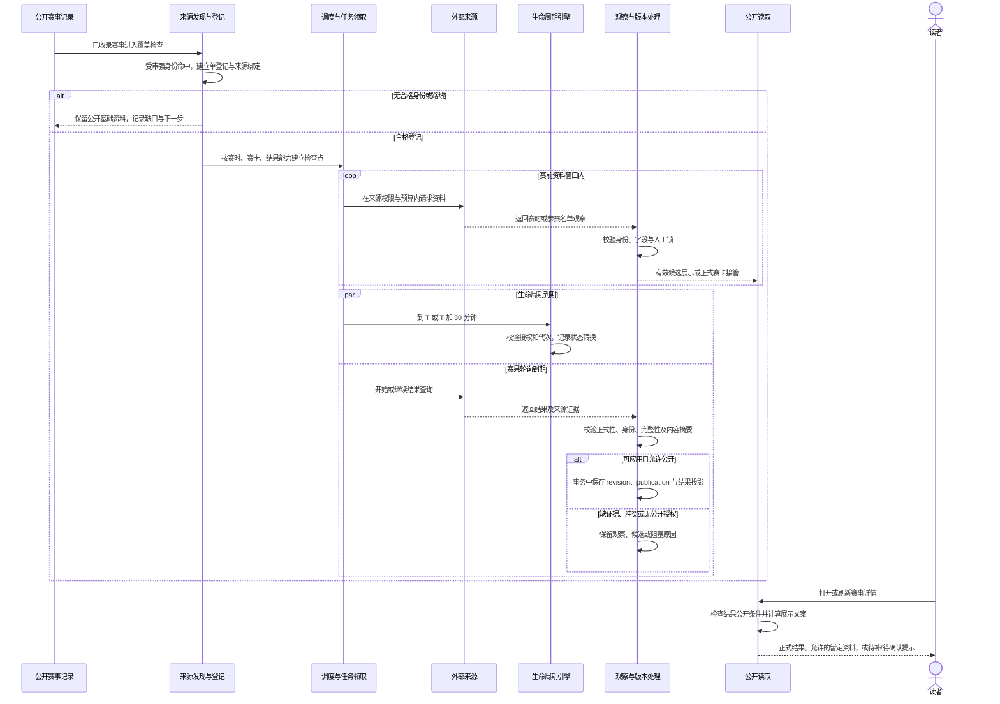
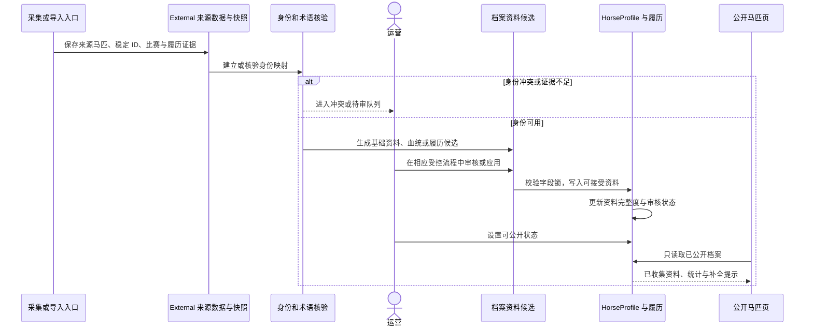

# Umanews 当前能力与业务流程基线

本文为下一版本能力规划和倒排排期提供现状基线，回答当前用户能做什么、后台如何支撑、复杂业务怎样流转，以及哪些能力只在代码中存在或仍受数据条件限制。本轮按要求仅使用代码库与浏览器实访；未读取指定的待修复事项线程，未制定下一版本范围与排期。

后续补充：第三份证据的完整读取与旧案例复访另见[待修复事项线程与当前能力对照](2026-10-02-backlog-evidence-reconciliation.md)。下表涉及非完赛状态的表述已按复访结果收紧；原始观察仍保留自己的时间边界。

当前产品已形成四组能力：中文新闻阅读、赛事日历与赛果、马匹档案与匿名关注、编辑及自动生产后台。底层具备多来源采集、翻译、审核、发布、QQ 分发、赛事版本证据和覆盖告警。**页面与技术链路已经存在，但资料完整性、跨模块关联、筛选一致性和自动更新覆盖尚不均匀。**

## 1 证据范围与使用方式

### 本轮基线

| 项目 | 本次确认 |
|---|---|
| 代码基线 | `fc1eed938beb8b431e0d4b37953f7599a40a72ce`，提交时间 2026-10-02 17:52:08 +08:00；开始时与本地 `origin/main` 一致 |
| 工作区 | 开始时干净、detached HEAD；为保存本报告创建 `codex/current-capability-baseline-20261002` |
| 线上实访 | 2026-10-02 18:45 起，北京时间；具体读取时间保存在浏览器观察文件 |
| 域名差异 | 请求中的 `https://umanews.run` 与 `https://www.umanews.run` 在本次浏览器中均为 `ERR_CONNECTION_CLOSED`；HTTP 入口为 `ERR_EMPTY_RESPONSE`。仓库记录的 `https://umafans.run` 可正常打开，本轮以该站作为公开页面观察样本，不能据此证明两个域名等价 |
| 线上版本 | 本轮没有登录服务器核验运行镜像，因此不宣称当前代码 SHA 已全部部署 |
| 操作边界 | 公开页面只读访问；没有登录后台、提交关注、触发采集、调用付费模型、发送 QQ/邮件或执行生产写入 |
| 门禁 | 本轮属于现状整理，不改变产品或生产边界，未触发根 `AGENTS.md` 的 G1/G2/G3；本地仅新增报告及公开页面观察证据 |

证据等级在各表中就地标注：

- **线上可见**：本轮浏览器看到入口、内容或指定只读筛选结果；不表示全量数据完整，也不表示后台自动链路通过验收。
- **代码具备**：已核对路由、视图、服务或模型；后台登录后的操作、生产开关和外部投递未实测。
- **记录已交付**：当前仓库状态文档记载上线或验收，本轮没有重新检验后台运行态。
- **设计中**：只有方案，不能纳入已交付能力。

浏览器结构化观察见 [browser-observations.json](2026-10-02-capability-evidence/browser-observations.json)。该文件只保留功能观察所需的公开文本、链接和控件信息，新闻正文不作为全文归档。

### 产品对象与角色

| 角色或对象 | 当前含义 |
|---|---|
| 匿名读者 | 阅读新闻、检索赛事与马匹、浏览历史资料；通过当前浏览器的匿名标识关注马匹 |
| 编辑或管理员 | 以 Django 账号登录后台；维护来源、术语、文章、赛事、马匹和首页头条 |
| QQ 群读者 | 通过配置的群推送接收摘要与公开文章链接；不是本站账号体系 |
| 新闻 `NewsArticle` | 原文、译文、编辑稿、来源与地区信息、自动化决策、网页发布状态的载体 |
| 赛事届次 `RaceEvent` | 某年某场比赛；与跨年的赛事系列 `RaceSeries` 区分 |
| 马匹 `HorseProfile` | 面向读者的公开马匹档案；与外部来源原始马匹、译名词条、身份候选分层保存 |
| 关联 | 新闻与赛事、新闻与马匹、马匹与比赛、父母与后代均有独立关联；只有合格关联参与公开展示 |

## 2 读者端现有功能

### 新闻阅读

| 编号 | 能力 | 当前行为 | 证据与边界 |
|---|---|---|---|
| N01 | 首页聚合 | 头条、最新新闻、热门榜、今日赛事、即将开赛、我的关注入口 | 线上可见；[首页](https://umafans.run/) |
| N02 | 新闻列表 | 中文标题、摘要、网页发布时间、关联马匹标签、分页 | 线上可见；代码每页 12 篇，头条文章会从当页普通列表排除，避免重复占位 |
| N03 | 新闻详情 | 标题、发布时间、导语、正文；有封面时展示封面 | 线上可见；公开读取要求文章已发布且具有网页发布时间 |
| N04 | 延续阅读 | 上一篇、下一篇、最多四篇同地区相关新闻 | 线上可见；当前相关新闻依据地区与发布时间挑选，不是已验证的语义推荐 |
| N05 | 新闻实体跳转 | “本文提及”中的马匹或赛事标签可进入对应档案 | 新闻到马匹已实访；新闻到赛事的模板与视图具备，但抽查的京都大赏典新闻只有马匹标签 |
| N06 | 首页头条 | 人工选择优先；缺少有效人工选择时使用算法回退 | 首页展示已见；人工管理与推荐采纳仅代码确认 |
| N07 | 热门榜 | 来源榜单快照与文章信号参与排序 | 页面可见；代码使用 ACCESS/ATTENTION 来源快照，不能称为本站真实阅读量排行榜 |
| N08 | 新闻地区信息 | 后台保存主要地区、相关地区、语言、来源类型 | 代码具备；当前公开首页没有地区频道切换，旧 `?region=` 会被移除并重定向 |

当前公开文章模板没有展示独立的原文来源链接、来源名称栏、评论、点赞或收藏入口。后台保存来源信息，不等于读者当前能在文章页查看来源。

代码入口：[public_news_feed 与详情视图](../../server/stable/views.py)、[新闻详情模板](../../server/stable/templates/stable/public/detail.html)、[首页头条服务](../../server/stable/services/editorial_headlines.py)。

### 赛事日历与详情

| 编号 | 能力 | 当前行为 | 证据与边界 |
|---|---|---|---|
| R01 | 日历浏览 | 日期分组、日期导航、本周焦点、加载更早或未来赛事 | 线上可见；默认窗口围绕近期有赛事的日期，不是完整月历网格 |
| R02 | 重点与全部 | 当前年度重点依据优先级或精选标记；历史年度重点依据 G1/G2 类标准化等级 | 代码具备；“全部”指已公开记录，不包含 draft、hidden 或已标记的 canonical 重复项 |
| R03 | 九地区筛选 | 日本、中国香港、英国、爱尔兰、法国、美国、澳大利亚、德国、中东 | 线上控件可见；德国未来赛事已筛选验证；九地区入口不代表九地区实时同步都已覆盖 |
| R04 | 等级与时间筛选 | G1/G2/G3；即将开赛、全部时间、已完赛 | 线上有入口；G 系列筛选代码包含对应 Jpn/J-G 等级；本轮发现德国历史 G1 筛选异常，见第 8 节 |
| R05 | 年份与名称检索 | 年份选择；中文名、原名、别名、赛事系列名检索 | 线上实测“凯旋门 + 2026”返回两条；年份选项存在不表示每个年份、地区均完整 |
| R06 | 基础信息 | 名称、年份、地区、马场、场地、等级、日期、开跑时间、距离、参赛条件、状态 | 线上可见；未知字段会显示待核实或北京时间待定 |
| R07 | 赛前名单 | 闸位、马号、马名、骑师、练马师、负重、赔率/热门排名、参赛状态、部分路径的更新时间 | 京都大赏典样本显示 18 行名单；闸位及赔率仍空，不能称所有字段齐全 |
| R08 | 候选赛前资料 | 支持 JRA 官方候选、人工核验候选和受控来源刷新；按资料类型标识，正式出马表可接管 | 代码具备；不是所有候选都会直接写入正式参赛表 |
| R09 | 赛果明细 | 排名、马号、马名、骑师、练马师、完赛时间、差距、赔率/排名；支持并列与部分非完赛状态显示 | 短途锦标样本有 16 行出马表及 16 行赛果，包含并列第 8；有些字段仍待核实。后续复访确认女皇杯仍缺自由岛赛果行，不能视为全量保留非完赛者 |
| R10 | 冠军摘要 | 已确认冠军卡、前列马匹、完赛时间等 | 短途锦标线上可见；暂定结果不应冒充正式冠军 |
| R11 | 历年冠军与届次 | 历年冠军列表、更多年份展开；已审核赛事系列下可切换已公开届次 | 冠军列表线上可见；系列切换依赖系列已审核且有多个已公开届次，非每场必有 |
| R12 | 赛事新闻 | 赛前、赛后、相关三组新闻；无关联时可隐藏相应模块 | 代码具备，当前抽查赛事未展示新闻分组；能力与关联数据齐全是两回事 |
| R13 | 稳定访问地址 | canonical 地址注册、旧路径重定向、重复赛事关联提示、赛事 sitemap 分片 | 代码具备；已有去重机制不代表历史重复全部已处理 |
| R14 | 时间与字段展示 | 有准确时刻时按北京时间展示；标准化等级、距离、负重、名次及术语译名 | 线上可见；只有当地日期时无法推出唯一北京时间，仍需保留不确定性 |

例子：[赛前京都大赏典](https://umafans.run/races/2026/jra-2026-1004-02/)、[赛后短途锦标](https://umafans.run/races/2026/jra-2026-0927-01/)、[德国未来赛事](https://umafans.run/races/?region=germany&when=upcoming&tab=all)。

代码入口：[公开路由](../../server/app/urls.py)、[赛事视图](../../server/stable/views.py)、[赛前候选展示](../../server/stable/services/race_pre_race.py)、[名单持续刷新](../../server/stable/services/race_pre_race_refresh.py)、[字段展示归一化](../../server/stable/services/race_information_display.py)。

### 马匹档案与关注

| 编号 | 能力 | 当前行为 | 证据与边界 |
|---|---|---|---|
| H01 | 马匹列表 | 名称、地区、资料完整度、出赛与前三名统计、关注按钮、分页 | 线上可见；代码每页 24 匹；统计基于现有履历记录，不等同完整真实生涯 |
| H02 | 马匹检索 | 按中文名、原文名、英文名、日文名或国家字段搜索 | “拯救者”检索实测成功；不是全站统一搜索 |
| H03 | 基础档案 | 中文与原文名称、性别、出生信息、国家、马主/练马师等已收集字段 | 代码具备、部分样本可见；空字段按模板隐藏或提示补全 |
| H04 | 血统与后代关系 | 父母、祖辈资料，已有公开父母档案可跳转；后代关系用于新闻聚合 | 父/母/母父在履历样本可见；视图准备了后代列表数据，但当前公开模板没有直接展示该列表 |
| H05 | 参赛履历 | 日期、赛事、马场、距离、等级、名次、非完赛状态；有正式关联时跳转赛事 | 实访两页履历成功，第二页可跳到英国国家障碍大赛；每页 20 条 |
| H06 | 履历排序与主要胜场 | 视图接受正序/倒序参数；主要胜场筛选与展示 | 排序为代码能力，当前样本没有可见排序按钮；主胜鞍文本可见，完整性未核验 |
| H07 | 新闻聚合 | 马匹本身及最多两代后代的已关联公开新闻；显示“来自”哪匹马 | 拯救者页面可回到相关京都大赏典新闻；后代新闻逻辑代码确认 |
| H08 | 匿名关注与取消 | 列表和详情提交关注，关注关系关联到浏览器签名 Cookie；支持取消 | 入口线上可见、持久化代码具备；本次未提交生产 POST |
| H09 | 我的关注 | 关注马匹列表、本人及后代新闻流；首页展示较短摘要 | 匿名空态实访；非空态未生产写入验证 |
| H10 | 同一浏览器记忆 | Cookie 最大期限一年；服务器保存匿名标识哈希与关注关系 | 代码具备；当前没有账号登录、跨设备同步、找回关注或关注迁移产品流程 |

关注当前是**站内聚合**。页面“收到最新新闻”的文案不能解释为已支持个人邮件、Web Push 或 QQ 私聊提醒；这些主动通知链路在所查公开功能中没有实现入口。

例子：[拯救者档案](https://umafans.run/horses/1026/)、[具有多页履历的马匹](https://umafans.run/horses/46412/)、[我的关注](https://umafans.run/horses/follows/)。

代码入口：[马匹公开视图](../../server/stable/views.py)、[horse_profiles 服务](../../server/stable/services/horse_profiles.py)。

### 移动端

公开站有响应式布局及手机底部导航：首页、赛事、马匹、关注。本轮在 390 × 844 视口核对短途锦标详情：页面宽度与滚动宽度同为 390，宽表格在自己的容器中横向滚动，顶部冠军卡和导航可见。这只证明该页面样本，不代表所有机型、页面和后台都通过移动端验收。

## 3 编辑与运营后台现有功能

`/admin/` 是定制内容后台入口，本轮匿名访问被重定向到登录页。另有可配置路径的 Django 管理站点。下表均为代码已确认能力，除登录页外，未进行登录后的线上操作。

| 编号 | 模块 | 已实现的操作或信息 |
|---|---|---|
| B01 | 登录与访问控制 | Django 登录/登出；多数业务页要求已登录且 `is_staff`；首页头条另检查对应模型权限 |
| B02 | 工作台 | 当日抓取新增、抓取失败、待编辑、待审核、当日发布数量；近期来源健康与发布记录 |
| B03 | 来源管理 | 新建、编辑、启停、删除来源、测试抓取；支持内置适配器、RSS、HTML 列表和文章页模板 |
| B04 | 来源健康 | 最近成功/失败、错误原因、冷却、停滞等运营信息；来源存在不代表当前能正常抓取 |
| B05 | 候选文章池 | 按来源、地区、流程等筛选；查看原文、译文、自动决策与候选情况 |
| B06 | 翻译处理 | 单篇/批量重翻译、翻译状态查询、失败分类与重试；可手动重新触发流程 |
| B07 | 编辑稿 | 修改中文标题、摘要、正文、来源说明、编辑备注、标签及地区；保存/自动保存、预览 |
| B08 | 人工审核 | 提交审核、驳回、发布、撤回；无封面发布有明确提示；人工编辑字段留有保护信息 |
| B09 | 图片资产 | 原图本地化、选择封面、上传封面；存储层可使用本地或 OSS |
| B10 | 首页头条管理 | 查看当前人工选择与版本、设置/取消、获取推荐、接受推荐；推荐生成本身不直接改变首页 |
| B11 | 已发布内容 | 已发布列表、继续编辑、撤回及操作日志 |
| B12 | 正式术语库 | 马名、赛事、骑师、练马师、马主、牧场、马场、机构、固定译法；新增、编辑、启停、批量导入与多语言别名 |
| B13 | 术语候选审核 | 查看发现上下文、证据与冲突；接受、合并进已有词条、拒绝、忽略、批量审核 |
| B14 | 文章内快速术语 | 编辑时新增术语，再应用到当前稿件或重翻译，减少页面切换 |
| B15 | 赛事维护 | 列表筛选、新建/编辑、候选资料应用、可见性/质量/优先级管理、关联新闻扫描、人工挂接/确认/移除 |
| B16 | 马匹维护 | 档案编辑、展示状态与完整度、候选资料应用、履历增删改、文章关联扫描与人工处置 |
| B17 | 分地区生产看板 | 抓取、发布、QQ 窗口的状态、候选与零产出原因、配额账本、失败与待归属审核项；预览与受控重跑 |
| B18 | 赛事覆盖看板 | 全部公开 canonical 赛事的覆盖分类、阻塞原因、下一步、最近尝试及下一次检查信息；位于 Django 管理站点 |
| B19 | 证据与日志 | 任务、抓取、翻译、自动化、操作、QQ 投递、通知、赛事 revision/publication、身份及生命周期转换等记录 |
| B20 | 管理 API | `/api/` 提供文章列表/详情/翻译状态/重翻译/更新/推送、任务日志、术语 CRUD；是登录后台接口，不是已开放的外部开发者平台 |

“AI 编辑推荐”是当前后台名称；本次读取的头条推荐实现使用文章信号与确定性排序，不应直接等同于额外调用大模型完成选题或改写标题。

代码入口：[后台路由](../../server/stable/urls.py)、[后台/API 视图](../../server/stable/views.py)、[API 路由](../../server/stable/api_urls.py)、[Django 管理配置](../../server/stable/admin.py)。

## 4 自动生产和分发能力

### 新闻从来源进入公开站

| 编号 | 阶段 | 代码已经具备 | 当前限制 |
|---|---|---|---|
| A01 | 来源采集 | 日本及国际新闻适配器；最新、访问榜、注目榜、官方新闻；正文抽取、图片和榜单快照 | 适配器清单不等于全部已启用或持续可用 |
| A02 | 入库与去重 | 文章 upsert、来源快照、来源模式升档、发布时间及内容完整性信息 | 同一事件的不同文章需要后续曝光管理，不能只靠 URL 去重解决 |
| A03 | 地区归属 | 主地区、相关地区、归属规则版本与待审核项 | 新闻生产窗口明确配置五地区：日、港、英、法、美；与赛事日历九地区不同 |
| A04 | 中文翻译 | 可配置翻译 provider、术语解析与占位保护、标题/摘要/正文、运行记录 | 本轮没有调用模型验证译文质量或检查生产 provider |
| A05 | 质量判断 | 内容类别、分数、风险、重复与硬规则；决定自动、人工或忽略 | 自动判定可被字段缺失、术语冲突等阻断 |
| A06 | 内容成稿 | 可采用基础译文，或进入改写后再校验；校验通过成为待发布 | 不是所有文章都必经 AI 改写；路径取决于配置 |
| A07 | 自动发布 | 按地区窗口选稿、实时稿/积压稿、年龄限制、去重、分数阈值、全站配额、同赛事曝光控制 | 代码与开关共同决定是否执行；网页可见文章不能证明全部由自动链路产生 |
| A08 | 人工兜底 | 失败或中高风险进入人工审核；编辑可补术语、修改、预览、发布或撤回 | 当前未证明多角色分工、多人协同审校或严格四眼审批产品流程 |
| A09 | 失败恢复 | 翻译错误分类、重试时间、租约/过期运行回收、人工重试、异常通知 | 重试有状态与次数控制，不保证外部来源或模型最终成功 |

### QQ 分发和运营通知

| 编号 | 能力 | 当前实现 |
|---|---|---|
| Q01 | 目标管理 | 配置 QQ 群目标、启停、地区、推送范围、重要性策略与消息模板 |
| Q02 | 自动候选 | 从已公开文章筛选；要求地区/类别/质量合格；可按高价值或全部公开范围选择 |
| Q03 | 独立配额 | 地区窗口、单群每小时、全站每小时额度；支持大赛窗口与日常窗口 |
| Q04 | 防重复投递 | 每篇文章与目标有投递记录，领取发送任务、处理发送中状态与重试 |
| Q05 | 发送前检查 | 复查文章资格、OneBot 在线状态和公开文章链接可达性 |
| Q06 | 消息结果 | 保存响应、消息 ID、发送时间、失败类型；失败可按策略重试 |
| Q07 | 人工推送 | 后台/API 有人工推送入口，复用群发送服务 |
| Q08 | 运营告警 | 抓取/翻译/发布异常、来源停滞、候选积压、重要稿待审、身份冲突和赛事覆盖缺口；保存通知记录与去重信息 |

这里的 QQ 和邮件均为**代码能力**，本轮未外发验证。网页发布成功与群投递成功是独立结果，投递成功记录也不等于读者已看到。

代码入口：[tasks](../../server/stable/tasks.py)、[ingestion](../../server/stable/services/ingestion.py)、[translation](../../server/stable/services/translation.py)、[automation](../../server/stable/services/automation.py)、[publishing_windows](../../server/stable/services/publishing_windows.py)、[qq_auto_push](../../server/stable/services/qq_auto_push.py)、[qq_windows](../../server/stable/services/qq_windows.py)。

## 5 赛事与马匹数据支撑能力

| 编号 | 能力 | 已实现内容 | 不能据此推导的结论 |
|---|---|---|---|
| D01 | 历史赛历库存 | 赛事系列、系列别名、年度 target、应有记录与解析状态、批次及导入回执 | 不代表所有 target 都有完整公开赛果 |
| D02 | 多地区历史导入 | 来源适配、日期发现、届次物化、名单/结果解析、完整性检查与受控导入 | 九地区可读不代表全部年份无缺口 |
| D03 | 周期赛历变化 | 定时生成赛历 diff 候选的代码；apply 走独立受控命令 | 默认关闭；不是已证明长期自动更新的全站赛历 |
| D04 | 多来源赛事登记 | 用受审强身份命中现有公开赛事；一个赛事一个 enrollment/写入 owner，多个来源 binding | 不会仅因名字相似自动合并赛事，也不意味着所有新来源都准入 |
| D05 | 按能力取数 | 开跑时间、出马表、赛果三类能力分别有路线与检查点；来源粘滞和受控故障切换 | 某来源能给赛时，不等于能给正式赛果 |
| D06 | 赛前持续刷新 | 赛前 D−4 起主动寻找资料；名单、赔率、退赛等受字段来源与时效约束 | 不能保证来源在 D−4 已公布资料；失败时可能继续展示最近有效名单及延迟信息 |
| D07 | 生命周期推进 | 按时间推进状态，记录转换原因、调度代次与租约；支持关闭/影子/执行模式 | 时间达到不能证明比赛实际举办，也不能证明正式结果已到达 |
| D08 | 赛果版本链 | 原始观察、参与者身份、完整性、revision、来源证据、publication、公开读取控制 | 抓到结果不等于可公开；暂定结果不等于正式确认 |
| D09 | 更正与幂等 | 同内容不重复产生业务变更；显式更正证据、冲突和人工锁保护 | 内容变动本身不是合法改判依据 |
| D10 | 覆盖对账 | 以全部公开 canonical 赛事为分母，区分未登记、未知时间逾期、owner 冲突、历史公开阻断、有效登记等；给出下一步 | 覆盖告警只解释缺口，不自动解决来源权限或资料缺失 |
| D11 | 马匹外部数据 | External 马匹、别名、比赛、赛果、履历等来源层；快照、身份候选与导入记录 | External 入库不等于已建立正式马匹身份或公开档案 |
| D12 | 马匹身份与补全 | 稳定外部 ID、别名与译名、来源证据、身份冲突；基础资料、血统、履历候选及受控应用 | 名称或译文相同不能自动证明同一匹马；空壳可公开但需标记补全中 |
| D13 | 人工字段保护 | 赛事和马匹都有人工锁/字段保护，自动候选避免覆盖人工维护事实 | 有人工锁可能阻断自动刷新，需要运营解释与处理 |
| D14 | 审计与并发保护 | 单写入者、代次校验、领取租约、数据库事务、不可变证据、配额、操作日志 | 这些是可靠性基础，不是业务覆盖或服务健康的替代证明 |

当前代码仍存在旧生命周期登记、v1 数据同步登记和 v2 多来源登记等兼容路径。共享生命周期时区合同仍显式限制原五地区。因此必须分别评估“九地区日历已收录”和“各地区生命周期与结果自动更新可用”，不能合并成一个完成项。

全公开赛事覆盖与缺口摘要属于近期已实现能力；`current_state.md` 记录 PR229/PR230 已上线并完成自然周期验证。记录中 13:45 的 59 项缺口是当时快照，本轮没有查库刷新，不能当作当前实时数量。第二阶段“统一决策、拆分事实与时钟、可靠派发、独立心跳”仍是设计，未作为已有能力计入。

代码入口：[赛事登记](../../server/stable/services/race_data_sync_enrollment.py)、[数据同步控制](../../server/stable/services/race_data_sync_control.py)、[赛果写入](../../server/stable/services/race_data_sync_results.py)、[公开覆盖](../../server/stable/services/race_public_coverage.py)、[马匹 External 导入](../../server/stable/services/external_horse_data.py)。历史记录见 [当前状态](../current_state.md) 与 [统一决策设计](../changes/race-event-unified-decision/spec.md)。

## 6 用户和编辑的多步骤流程

图中实线表示调用或动作，虚线表示返回。涉及写入的流程依据代码重建，本轮没有在生产执行。

### 读者从新闻进入马匹和赛事

对应执行顺序：`public_news_feed` → `public_article_detail` → `public_horse_detail` → `public_race_detail`，均在 `views.py`。本轮已验证新闻到拯救者档案、档案回新闻，以及另一匹马的履历到赛事链接；抽查的赛事名单行仍为纯文本，尚未形成“每匹参赛马均可点击”的入口。

### 匿名关注与后代新闻聚合

对应：`public_horse_follow` → `signed_follow_token/token_hash_from_cookie` → `follow_horse/unfollow_horse` → `followed_horse_ids/followed_articles`。只有 Cookie 的当前浏览器能够找回该匿名关注关系；清除 Cookie 或换设备后，现有产品没有账号恢复流程。

### 新闻采集到网页发布

对应：`crawl_production_sources_window_task` / `crawl_news_source_task` → `ingestion` → `translate_article_task` → `process_article_automation_task` → `publish_region_window_task`；人工分支由 `article_editor` 完成。失败重试走 `translation_recovery.py`。图是主路径，非每篇文章必须依次经过所有可选环节。

### 网页发布后的 QQ 投递

对应：`qq_region_window_task` / `enqueue_qq_auto_push_for_article` → `select_qq_window_deliveries` → `process_qq_push_delivery` → `BotPusher`。网页撤回与群消息生命周期不同；当前代码中没有据此可确认的“撤回网页即撤回历史群消息”产品承诺。

## 7 赛事状态机与自动更新流程

### 六个必须分开的状态维度

| 维度 | 主要字段或模型 | 状态/含义 | 例子 |
|---|---|---|---|
| 赛事是否公开 | `RaceEvent.visibility_status` | draft / published / hidden | 已公开日历记录可以还没有出马表 |
| 比赛生命周期 | `RaceEvent.status` | scheduled / running / finished / postponed / cancelled | 到 T+30 可进入 finished，但没有赛果 |
| 是否承担同步任务 | `RaceDataSyncEnrollment.state` | proposed / enrolled / paused / retired | 出现在公开日历不等于已经 enrolled |
| 谁能写当前数据 | `RaceEventProjectionControl.write_owner` | unmanaged / historical / live / data_sync / manual_paused | 历史导入与自动同步不能同时随意改同一投影 |
| 结果处理进度 | `RaceEventLiveTracking.state` 与 revision phase | scheduled → racecard_ready → awaiting_result → provisional/official/corrected | 已有暂定结果，正式确认仍未完成 |
| 结果可否对读者展示 | publication、确认字段与公开读取判断 | 需要对应证据、身份、授权、确认语义和公开条件 | 已保存正式 revision 仍可能因公开依据不合格而不显示 |

资料质量、同步错误、下次检查时间又是独立信息。规划时至少区分“比赛进展”“资料进展”“同步健康”，不能要求一个状态枚举承载全部含义。

### 比赛生命周期

下面描述当前共享生命周期引擎的时间规则；所有自动转换都还要通过范围、来源授权、模式、owner、代次、租约和人工锁检查。

延期/取消箭头表示业务维护，不表示时间引擎会主动判断天气或举办事实。共享引擎对 postponed 不自动推进，对 cancelled/finished 不再按时钟推进。date-only 规则只在该赛事通过实际自动执行门槛时生效；另外仍存在检查准确 `race_datetime` 的 data-sync 预判函数，不能用纯函数探针替代整条实际写入路径。

对应：`race_event_lifecycle.py:decide_race_lifecycle/apply_race_lifecycle_decision`；`race_data_sync_lifecycle.py:apply_data_sync_lifecycle_decision` 最终调用共享转换引擎。

### 赛果处理状态机

这些是 `RACE_LIVE_ALLOWED_STATE_TRANSITIONS` 中定义的结果进度，不是 `RaceEvent.status`。只有结果能力的来源可有受审冷启动路径，不能省略身份和参赛集合验证。相同内容重复取得时按幂等路径处理；官方来源、明确正式标记、马匹身份、完整参赛集合、人工锁和发布授权均可能阻断进一步转换。

### 从日历收录到公开赛果

执行位置依次为：`discover_multisource_events/attach_multisource_observation` → `race_data_sync_control` 的领取与检查点 → provider/赛前刷新 → `apply_race_lifecycle_decision` 或 `apply_data_sync_result_observation` → `race_events.py` 的 revision/publication 处理 → `resolve_race_live_public_read` → `public_race_detail`。

### 当前调度节奏

以下来自代码策略，不代表本轮测得的生产时延保证。T 指准确开跑时刻；D 指举办地赛日。

| 阶段 | 策略 |
|---|---|
| D−4 至 D−2 | 赛前时间/名单通常每 3 小时检查 |
| D−1 | 每 1 小时 |
| D 当天 | 每 10 分钟；正式开跑后赛前链逐步截止 |
| 初次赛果窗口 | 准确赛时 T+3 分钟起；随后 T+5、10、15、20、25、30 等检查点 |
| 仍未取得结果 | 逐步退避为 15 分钟、30 分钟、3 小时、6 小时或每日；实际还受来源路线、窗口、预算和授权限制 |
| 已确认后的更正关注 | 开跑后前两天每 6 小时，随后到第七天每日一次；策略函数之外仍有资格检查 |
| 全公开赛事覆盖检查 | 代码以 5 分钟作为覆盖检查间隔；与外部取数频率不同 |

代码入口：[race_data_sync_policy.py](../../server/stable/services/race_data_sync_policy.py)、[settings 中的调度构建](../../server/app/settings.py)、[race_public_coverage.py](../../server/stable/services/race_public_coverage.py)。不能把 T+30 的生命周期规则写成“所有比赛 T+30 都保证拿到官方赛果”。

### 用户最终看到的状态文案

| 条件 | 当前展示 |
|---|---|
| `finished` 且读路径取得合格已确认冠军 | 已完赛，可显示冠军 |
| `finished` 但没有合格已确认冠军 | 赛果待确认 |
| scheduled/running 已超过展示层赛期阈值 | 赛期已过，资料待补 |
| running 且未被过期提示覆盖 | 进行中 |
| postponed / cancelled | 延期 / 取消 |
| 未来已知日期 | 今天、明天或若干天后；准确时刻已知则展示北京时间 |
| 日期或时刻不足 | 日期待定或北京时间待定 |

因此，同一数据库状态可能因时间与资料条件显示不同文案；日历卡片和详情必须同时考虑公开结果是否真的可读。

### 马匹补全到公开档案

这是来源数据到产品档案的通用分层关系；具体导入器有独立受控 apply 路径，并非全部经过同一个后台按钮。对应 `external_horse_data.py`、身份补全服务、`horse_profiles.py:save_data_candidate/apply_data_candidate/transition_review_status`。External staging、身份确认、档案发布、完整生涯是不同交付节点。

## 8 本次观察到的能力边界和体验缺口

以下仅来自本轮代码与页面，不是指定待修复线程的合并清单，也不是已经批准的下一版需求。

| 观察 | 本轮证据 | 对现有能力的解释 |
|---|---|---|
| 请求域名未能打开 | umanews.run / www.umanews.run 连接被关闭；umafans.run 可访问 | 需要澄清产品域名；本轮不能归因于 DNS、证书或站点故障 |
| 同场赛事有两个公开入口 | “凯旋门 + 2026”出现两个名称对应同日同场地的条目；一个有 22:05 但距离待核实，另一个有 2400 米但时刻待定 | 展示资料分散；现有身份/去重能力尚未消除该公开重复样本 |
| 过去赛事仍待补 | 默认日历中埃迪 D、信雅达、圣雅尼塔短途冠军、日本电视杯等显示赛期已过资料待补 | 公开日历已收录，但自动登记或赛果链路不能据此判为完成 |
| 等级筛选与卡片标签不一致 | 德国 2025 全部列表存在 G1 卡片；加入 `grade=g1` 后空列表，不需要 `when=finished` 即可复现 | 当前查询按 `normalized_grade`；可确认筛选现象，但本轮未查生产数据确定根因 |
| 马匹统计与履历不一致 | A Wave Of The Sea 页面顶部 65 战、0 冠、0 亚、0 季；同页履历出现名次 1/2/3 | 统计能力已存在，但不能直接当作可信生涯汇总，需单独对账 |
| 新闻已有成绩描述，档案仍空 | 拯救者相关新闻有既往获胜描述，档案仍为 0 战和暂无履历 | 新闻实体识别已打通，不代表对应资料补全同步完成 |
| 赛前字段不齐 | 京都大赏典有 18 行、马号和负重，但闸位/赔率为空；同日新闻已有排位文字 | 两条链更新或解析结果不一致；本轮不把新闻直接写入正式赛卡 |
| 翻译与字段归一化不完整 | 多处马名、骑师、马场仍为外文；负重、距离、差距等部分字段待核实 | 已具备术语与归一化框架，仍需要按实体和字段覆盖评估 |
| 实体浏览链路不连续 | 新闻可跳马匹；抽查赛事名单和结果中的马名仍为文本，京都大赏典详情无对应新闻区 | 各页面都存在，关联覆盖和双向跳转仍不足 |
| 新闻来源未在正文页展示 | 当前详情模板与两篇实访文章没有独立原文链接/来源栏 | 后台证据保存与读者来源可见性不同 |
| 关注依赖单浏览器 | 签名 Cookie 与匿名哈希关系；未发现公开账户流程 | 已有个性化聚合基础，尚非账号化订阅体系 |
| 自动化范围分裂 | 新闻窗口五地区、赛历九地区、共享生命周期合同五地区 | 新地区“收录、赛前、赛时、赛后”必须分项验收 |

本轮还未证明：全站赛事完整率、全部来源健康、正式赛果时延分布、QQ 实际收达、关注非空态端到端、后台权限矩阵、跨设备使用、真实用户行为数据、恢复演练和容量指标。

## 9 用于后续版本规划的能力分组

后续读取待修复线程时，建议沿用下列分组，将每项标为新增能力、修复、补数据或运营保障，避免把已经有页面但缺资料的项目重新估成从零开发。

| 分组 | 当前可复用基础 | 仍需进一步定义或核验 |
|---|---|---|
| 新闻产品 | 聚合、详情、头条、热门、翻译、编辑发布 | 来源可见性、内容质量、地区体验、阅读与反馈需求 |
| 赛事产品 | 九地区日历、筛选、赛卡、结果、历年冠军 | 唯一赛事入口、字段/筛选一致性、准确时间、完整覆盖和时延目标 |
| 马匹产品 | 档案、血统、履历、新闻关联 | 身份映射覆盖、统计口径、完整生涯与双向关联 |
| 用户留存 | 匿名关注、后代新闻聚合、移动端入口 | 是否需要账号、跨设备、赛事关注、主动提醒 |
| 编辑效率 | 候选池、术语审核、图片、人工发布、头条管理 | 实际后台操作耗时、多人分工、移动端编辑体验 |
| 自动生产 | 来源窗口、翻译恢复、发布与 QQ 配额 | 持续可用范围、质量标准、人工兜底负担 |
| 数据可靠性 | 身份、单写入者、版本、公开依据、覆盖告警 | 统一决策设计落地、历史公开依据、任务派发与独立健康监测 |

没有在所查公开路由与主页面发现：普通用户注册登录、评论/点赞、新闻收藏、个人主动通知、赛事关注、全站统一搜索、赔率交易或下注流程。它们应作为“若需要则新增”的讨论项，不能写成既有能力。也未将仓库中的未来设计、旧研究脚本或一次性采集成功视为已上线产品功能。

排期阶段仍需要下一版本目标日期、可投入人力、必达能力及验收标准。本轮先完成基线，不猜测这些约束。

## 10 代码导航与核验记录

| 流程 | 主要函数或对象 | 文件 |
|---|---|---|
| 对外入口 | public-news-feed / public-race-calendar / public-horse-* | [app/urls.py](../../server/app/urls.py) |
| 首页与新闻 | `public_news_feed`、`public_article_detail`、`_build_hot_articles` | [views.py](../../server/stable/views.py) |
| 日历与详情 | `_race_calendar_queryset`、`public_race_calendar`、`public_race_detail`、`_public_race_status_label` | [views.py](../../server/stable/views.py) |
| 马匹与关注 | `public_horse_index/detail/follow/follows` | [views.py](../../server/stable/views.py) |
| 关注聚合 | `follow_horse`、`followed_horse_ids`、`followed_articles` | [horse_profiles.py](../../server/stable/services/horse_profiles.py) |
| 编辑发布 | `article_editor`、`candidate_*`、`term_candidate_*` | [views.py](../../server/stable/views.py) |
| 新闻自动化 | `process_article_automation_task`、`publish_region_window_task`、`qq_region_window_task` | [tasks.py](../../server/stable/tasks.py) |
| 自动审核 | `score_article_for_automation`、`mark_publish_ready`、`publish_article_automatically` | [automation.py](../../server/stable/services/automation.py) |
| 头条 | `resolve_homepage_headline`、`set_manual_headline`、`generate_headline_recommendation` | [editorial_headlines.py](../../server/stable/services/editorial_headlines.py) |
| 群发送 | `should_push_news_to_qq`、`process_qq_push_delivery` | [qq_auto_push.py](../../server/stable/services/qq_auto_push.py) |
| 赛事登记 | `attach_multisource_observation`、`discover_multisource_events` | [race_data_sync_enrollment.py](../../server/stable/services/race_data_sync_enrollment.py) |
| 生命周期 | `decide_race_lifecycle`、`apply_race_lifecycle_decision` | [race_event_lifecycle.py](../../server/stable/services/race_event_lifecycle.py) |
| 结果应用 | `apply_data_sync_result_observation` | [race_data_sync_results.py](../../server/stable/services/race_data_sync_results.py) |
| 结果证据与公开 | `decide_race_result_revision_action`、`apply_race_result_observation_revision`、`resolve_race_live_public_read` | [race_events.py](../../server/stable/services/race_events.py) |
| 覆盖与告警 | `build_public_race_coverage`、`reconcile_public_race_coverage`、`deliver_coverage_digest` | [race_public_coverage.py](../../server/stable/services/race_public_coverage.py) |
| 状态定义 | `WorkflowStatus`、`RaceEventStatus`、`RaceEventLiveState`、`HorseProfileStatus` | [models.py](../../server/stable/models.py) |

本轮验证方式为代码路由/函数追踪、浏览器 DOM 读取、有限页面筛选、马匹履历分页及一个手机视口检查。仅新增文档，无业务代码变更，因此没有运行 Django 测试或连接生产数据库。文档交付前检查本地链接、证据文件结构、Mermaid 代码块与 `git diff --check`；未执行独立 subagent review。
