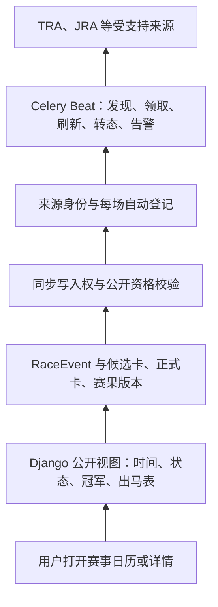

# 2026-10-02 赛事日历代码与线上只读审查

## 结论与证据范围

赛事日历已经具备赛前刷新、按时间转态、赛果确认与公开展示的链路，JRA 有自然闭环实例；目前主要缺口是自动纳管与持续运行的覆盖不足。九地区日历可见，不代表九地区都会自动补时刻、出马表和赛果。

- 检查时间：北京时间 2026-10-02 03:48 起。数据库主快照为 03:51:43；后续准入核验独立记录时间。
- 本地：从刚 fetch 的 `origin/main@070eaeda` 建独立工作区，原 `horse_data` 脏工作区未修改。
- 生产：`root@47.239.167.86`，web 实际 revision `310588704a5dd2cef477300eff626987491411cb`，镜像 `sha256:c9d1f2e3bc4fbe460456317dba8ef7eb4c1492716670512f1a4d822b40db0569`，release `/opt/umanews-release-31058870-dateonly-fix-20260930/umanewsbot`。该 revision 与本地主线的 `server/`、`runtime/policies/` 无差异。
- 实际浏览首页、日历、每日王冠、短途锦标、中央公园锦标、凯旋门大赛及其名称搜索结果；另用 SSH 读取容器、有效配置和生产数据库。
- 数据查询显式使用 PostgreSQL `SET TRANSACTION READ ONLY` 和 15 秒语句超时；没有运行发现/补采/修复任务，没有 provider 外呼、生产写入、重启或部署。函数探针仅执行纯决策函数。
- 统计按**已公开且未标记为 active canonical duplicate 的 RaceEvent 记录**，使用当地 `local_date` 切窗口。尚未治理的重复仍计入，因此不是去重后的实际比赛全集；未用上游官方全集重新核对每一场日期和赛果。
- 机器证据：[审查快照](2026-10-02-race-calendar-audit-evidence.json)。不是全量回归或未来比赛的自然闭环验收。

## 从用户页面反查业务链路

| 阶段 | 实际代码行为 | 边界与源码 |
|---|---|---|
| 建立日历 | 官方赛历/历史库存先形成年度赛事，再经物化、导入、公开门禁展示。公开视图筛掉 draft 和已建立 canonical link 的重复 | `views.py:3150`；`materialize_dated_race_targets`。存在日历行不等于存在 `RaceDataSyncEnrollment` |
| 赛前发现 | 每小时 7/17/27/37/47/57 分执行发现。v2 多来源与旧 v1 链路并行；旧链路在 17 分槽做纳管 census。有可信来源身份、有效策略和唯一写入 owner，才能建立登记/控制记录 | `tasks.py:501`；`race_data_sync_enrollment.py:1940`；不是打开全局开关就接管所有赛事 |
| 赛前资料 | 按举办地日期 D−4～D−2 每 3 小时、D−1 每小时、D0 每 10 分钟检查；精确赛时 T+5 后停止赛前刷新。JRA 可以先展示无马号的参赛名单；已绑定参考卡可持续刷新，正式卡可接管 | `race_data_sync_policy.py:111`、`race_pre_race.py`、`race_pre_race_refresh.py`。TRA 身份发现只请求当地 today/tomorrow，D−4 的频率规则不保证海外 D−4 就有可用资料 |
| 到点/赛中 | 每分钟扫描已纳管且准入有效的赛事；有精确时间时 T 到点转 `running`，T+30 转 `finished`，迟纳管可直接转完赛 | `race_data_sync_lifecycle.py:29`、`race_event_lifecycle.py:134`。这是**时间推断状态**，不是赛事现场发车/结束信号。无精确时间的 data-sync 路径只延后 12 小时，不凭日期猜完赛；延期/取消停止普通推进 |
| 赛果采集 | T+3 开始取结果，后续 T+5/10/15/20/25/30；仍无结果时逐渐退避。正式结果校验名单、身份、完整性和来源权限后，形成版本与发布记录，更新确认时间和公开结果 | `race_data_sync_policy.py:111`、`race_data_sync_results.py:287`、`race_data_source_adapters.py:808`。确认后前两天每 6 小时复查，随后每日至 7 天；v2 超过当地 T+7 停止结果轮询 |
| 公开展示 | `finished` 但没有可公开正式冠军，显示“赛果待确认”；过时的 scheduled/running 显示“赛期已过，资料待补”。“已完赛”筛选还要求确认结果及公开门禁通过 | `views.py:3023/3042/3764`。数据库状态、正式赛果和公开状态是三件事 |
| 页面更新 | 页面请求时由 Django 重新生成；日历/详情模板没有赛况轮询。已打开的页面需要刷新才能看到后端新状态 | 页面内脚本主要为日期轴定位；“自动更新”当前主要发生在后台 |

旧生命周期纯函数还有 date-only 当地次日零点转态规则，但当前 data-sync 协调器明确挡住无精确赛时的自动转态，不能把旧函数规则当作全站现行行为。

## 现场观察与量化结果

生产同步、调度、网络、赛时/赛卡/赛果写入、公开、生命周期、JRA 赛前刷新及 v2 发现开关均开启；生命周期为 `enforce`。web/worker/beat/race_sync_v2_worker 容器都在运行。旧 `race_live` 调度和监控关闭；新链路使用 `race_sync_v2`。队列一次快照为 celery=172、race_sync_v2=0、race_live=7543，不能由队列长度单独推断任务成功或调度宕机。本次 worker stdout 最近 20 分钟读取为空，未取得逐任务执行结果；新鲜 `last_checked_at` 与数据库准入结果作为事实依据。

| 当地赛日窗口 | 公开记录 | 状态/资料情况 |
|---|---:|---|
| 9 月 18 日—10 月 1 日 | 58 | 22 条仍 scheduled；36 条 finished，其中 5 条零赛果。合计 27 条零赛果 |
| 10 月 2 日—10 月 6 日 | 49 | 47 条缺 `race_datetime`；另有一条旧北京本地时间可供页面显示，因此 46 条无公开精确时刻。49 条均无正式登记/正式 runner 行，但 JRA 两场已有候选参赛名单；该集合包含凯旋门两条重复记录 |

后一个窗口的比赛尚未全部进入来源开放窗口，不能把 49 条未登记全判成既成故障。它说明“已发布”和“即将可自动交付”之间缺少清晰的覆盖状态。

### 已正常工作的例子

- [短途锦标 2026](https://umafans.run/races/2026/jra-2026-0927-01/)：16 出马/16 confirmed 赛果，页面有冠军纯粹魔法与赛果，证明 JRA 链路可闭环。
- [每日王冠 2026](https://umafans.run/races/2026/jra-2026-1004-01/)：14:45 北京时间、17 匹候选名单，页面标明“马号待公布”，更新于 10 月 2 日 01:07。不能因正式 `runners=0` 就说页面没有名单。

### P0：旧版登记在策略轮换后失去继续同步资格

- 全库 23 条登记：5 条 JRA v2 当前准入通过；18 条 v1 全部在只读 `validate_data_sync_lifecycle_admission(lock=False)` 中返回 `enrollment_policy_drift`。
- 其中 828/830/970/772/975/976/833 七场仍无正式赛果并有 open incident；其余已有结果的历史赛事不能一概称为公开失败。
- 975（中央公园锦标）、976（卓维利园锦标）、833（迈松拉菲特跨栏锦标）最后尝试在 9 月 26 日，`next_poll_at` 也停在当日；来源身份 `valid_until=2026-09-27T00:00Z` 已过期。因此当前首个阻断是 policy drift，换绑之后还必须处理身份有效性，不能只更新摘要。
- [中央公园锦标页面](https://umafans.run/races/2026/uk-bha-flat-2026-0926-118/)仍“赛果待确认”，7 匹出马表保留为“已出走登记”，更新提示停在 9 月 25 日。
- 直接根因：`race_data_sync_admission.py:128` 比较 enrollment 与当前 standing policy digest；不一致即停止。过期身份另由 `race_data_sync_control.py:344` 拒绝。

建议先用既有受审换绑/恢复路径，把七场未闭环赛事逐项恢复到当前来源合同，再补结果；不要解除权限检查。验收须见新的实际尝试、正式 revision、赛果公开及 incident 关闭。以后策略轮换的发布验收应包括存量未闭环登记，不仅检查新的 policy 文件可加载。

### P0：多来源覆盖仍主要停在 JRA，海外/NAR 不能自然补入

- 当前 v2 policy 只有 `jra/japan_jra` 一条路线，覆盖十个中央马场，有效期到 `2026-10-26T18:00Z`。
- 193 日本电视盃、194 海洋杯、19604 庆典杯、19605 国庆杯：均已过当地赛日，scheduled、无精确时间、无登记、无赛果。NAR 的 TRA 检查结果为 `response_empty`；香港为 `race_name_not_found`。同样的美国空响应缺口出现在多场已过期赛事。
- 旧 TRA 发现只接受当地 today/tomorrow，负 offset 排除；其候选集又限定 scheduled。未在窗口内取得身份的赛事，不能期待这个入口赛后自然补入。
- 德国、澳大利亚、中东不在生产 enabled regions；离线历史导入 parser 的存在不能代表实时路线已启用。
- **额外代码缺口**：`race_event_lifecycle.py:36/87` 的地区时区校验仍只接受原五地区。实际运行镜像的纯函数探针对 ireland/germany/australia/middle_east 全部返回 unsupported region；爱尔兰已进入 TRA 路线，但下一层共享转态函数仍有阻断。此次未观察这些地区一场已登记赛事自然失败，不把探针写成已经发生的生产事故。

建议按近期赛程先补法国/英国/美国、HKJC/NAR 的独立身份发现和赛后补入，再推进新地区自动化。所有地区须验证“发现→登记→赛前→T/T+30→正式结果”，并补齐共享生命周期的地区/时区合同；费用/来源授权扩展另走相应边界，不能只把开关列表加长。

### 10 月 4 日前必须验证的风险：JRA 有名单但仍未登记

108 每日王冠、109 京都大赏典有赛时和候选名单，却还没有来源身份、登记、生命周期控制。两场最新 v2 outcome 都是 `jra_roster_partial`。`race_data_source_adapters.py:379` 要求每行 `td.num` 是数字，马号未公布时把整个 observation 拒绝。

这不证明赛后一定失败：完整马号发布后可能自然登记。但目前“身份准入与资料能力分离”的设计，在这个 adapter 上仍依赖完整名单。应在官方完整出马表发布后验证自然登记；若要支持更早纳管，应让已核验强身份可独立进入 identity-only 阶段，并继续保留正式名单/结果完整性门禁。不能把候选名单出现当作该场生命周期已经接管。

### P0：覆盖告警没有覆盖全部公开赛事，也没有通知闭环

- 七条 open incident 的 `alert_sent_at` 都为空。
- `monitor_data_sync_result_slo()` 仅扫描已登记、有精确赛时、尚无确认结果的赛事；漏登记、无赛时赛事不在这个分母里。
- 新 coverage census 在当前 policy 下为 unsupported_region=180、confirmed=2、enrollment_missing=12；180 是该函数本次自身窗口的记录数，不是全站故障总数。
- `stage_multisource_coverage_incidents()` 明确跳过 unsupported_region，且只留后台记录、不调度通知。于是海外/NAR 这些最缺资料的记录仍能静默老化。

建议建立覆盖全部公开 canonical 赛事的监控分母，把“不支持自动化”“缺身份”“缺时间”“登记被阻断”“结果超时”明确分类；至少在 D−1/T+5/T+30 或无时间的当地 D+1 产生可见待办，并接入受控去重通知。验收应覆盖“根本没有登记”和“策略轮换失效”，不能只测试正常登记后的超时。

### P1：公开重复、日期语义和资料显示仍不一致

- [搜索凯旋门](https://umafans.run/races/?tab=all&year=2026&q=%E5%87%AF%E6%97%8B%E9%97%A8)同时出现 event 4/784，两条也进入本周焦点。同为 10 月 4 日巴黎隆尚 G1：旧条目显示 22:05、距离待核实，新条目显示 2400 米、时间待定。两者均未建立 active canonical link。
- 旧条目存 `timezone_name=Asia/Shanghai` 和本地 22:05，但 `race_datetime=NULL`。公开时间兼容层能显示它，并不意味着生命周期拥有精确赛时。
- 9 月 30 日修复让 date-only 赛事按**当地日期**进入公开列表；`_public_race_status_label()` 却把该日期直接与北京时间今天比较并显示“今天/明天”。美国赛事在北京时间列表中因而混用当地赛日与北京日期。缺时间时不能断言实际北京时间，应标“当地赛日，开赛时间待公布”。
- `when=finished` 实际意思更接近“已有确认赛果”；已过期但资料缺失的赛事不在该筛选中，也不在 upcoming 中。需要明确的“赛期已过/资料待补”入口，避免用户误以为缺场。
- 已完赛赛卡仍可显示“已出走登记”、JRA 部分负重“待核实”，详情页无主动刷新。这些是展示层的后续修复，优先级低于恢复自动更新链路。

建议使用既有 canonical link、旧 URL 保留/跳转机制治理重复；按来源证据对齐时间和距离，不直接丢弃一条的资料。统一日期标签和过期入口。验收从日历、搜索、本周焦点、两条旧链接到详情应指向同一场赛事。

### P1：赛历本身缺少已启用的持续刷新闭环

生产 `RACE_CALENDAR_REFRESH_BEAT_ENABLED=false`。已有 `race_calendar_refresh_dry_run_task()` 每日 03:42 的挂载逻辑，但只对配置的 incoming 文件和 existing snapshot 生成 new/changed/cancelled 差异，apply 仍走门禁；还需要维护新鲜来源输入。因此单纯开启 Beat 开关也不等于自动发现全球新增、改期或取消。

建议把“定期取得官方赛历→生成候选差异→通知审核→应用→公开验收”接起来。低风险新增/无冲突变化是否自动应用是后续产品决策；先确保差异不会无人处理。延期/取消必须保留明确来源，不按时钟臆造。

## 建议迭代次序与验收

| 顺序 | 交付目标 | 最小验收 |
|---|---|---|
| 1：立即 | 修复七场未闭环的旧登记，消除策略轮换/来源到期断链 | 新尝试、新正式赛果、公开页面、告警关闭；不只是 flags=true |
| 2：本周末前 | 108/109 完整名单后的自然登记；法国重点赛事单一身份；海外/NAR 漏管与补入方案 | 每场给出来源、登记状态、下次检查及失败原因；10/4 实际闭环再验收 |
| 3：同一修复周期 | 全部公开赛事覆盖监控和通知；共享生命周期支持地区对齐 | 未登记/无时间/不支持/过期策略均进入分母；告警可见且去重 |
| 4：随后 | 凯旋门等 canonical 去重、时间语义、过期入口 | 一场一个公开主入口；当地日期与北京时间清楚区分 |
| 5：随后 | 启用赛历持续发现与审核处理链路，分地区扩展数据能力 | 新增、改期、取消各一例完整证据；新地区有真实赛前赛后验收 |

本轮只交付诊断、证据与建议，未修复上述问题，未推送/合并/部署。原马匹采集暂停状态未改变。已有 9 月旧文档中的“待上线/未修复”不代表现在仍然成立，本报告以本次运行态为准。
